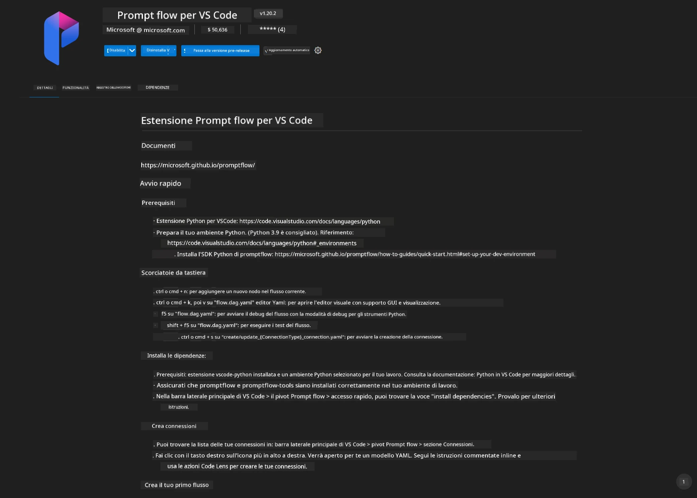
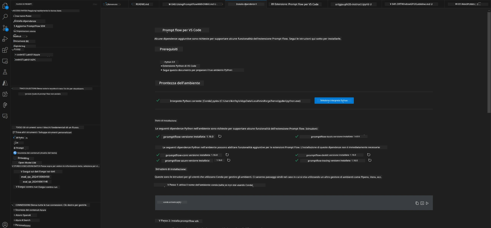
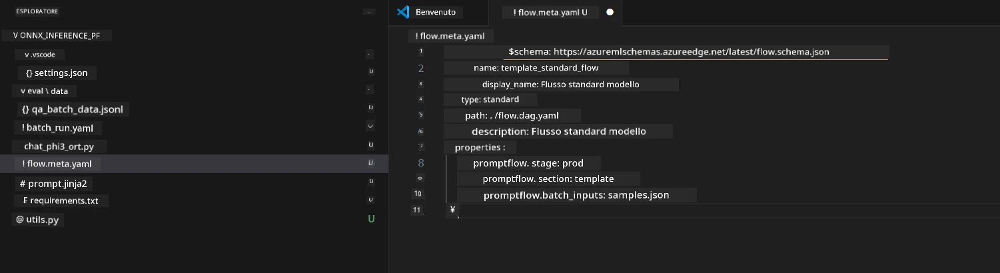
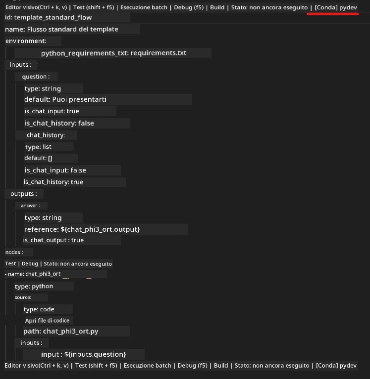
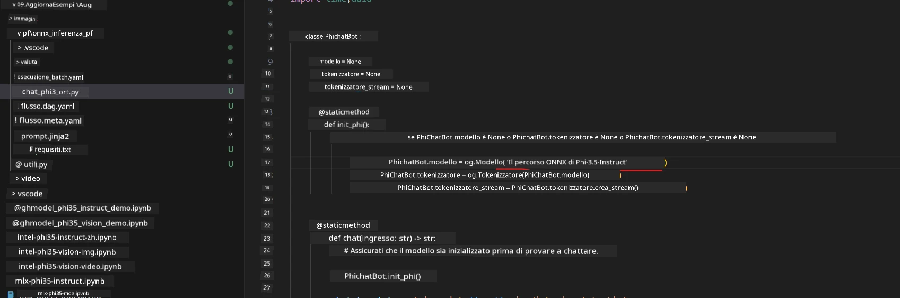
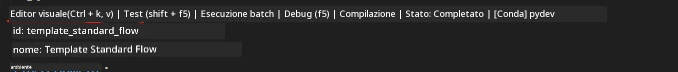
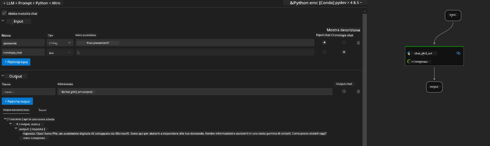
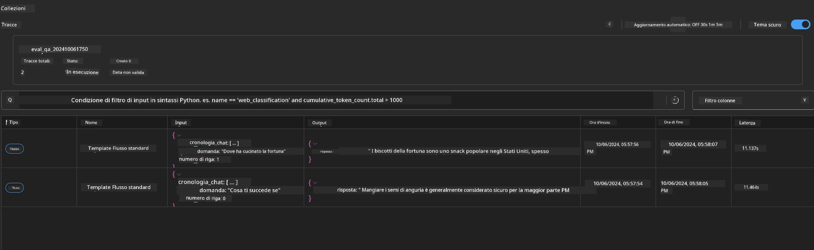

# Utilizzo della GPU Windows per creare una soluzione Prompt flow con Phi-3.5-Instruct ONNX 

Il documento seguente è un esempio di come utilizzare PromptFlow con ONNX (Open Neural Network Exchange) per sviluppare applicazioni AI basate sui modelli Phi-3.

PromptFlow è una suite di strumenti di sviluppo progettata per semplificare il ciclo di sviluppo end-to-end di applicazioni AI basate su LLM (Large Language Model), dalla ideazione e prototipazione al testing e valutazione.

Integrando PromptFlow con ONNX, gli sviluppatori possono:

- Ottimizzare le prestazioni del modello: sfruttare ONNX per un'inferenza e un deployment efficienti del modello.
- Semplificare lo sviluppo: usare PromptFlow per gestire il flusso di lavoro e automatizzare i compiti ripetitivi.
- Migliorare la collaborazione: facilitare una migliore collaborazione tra i membri del team fornendo un ambiente di sviluppo unificato.

**Prompt flow** è una suite di strumenti di sviluppo progettata per semplificare il ciclo di sviluppo end-to-end di applicazioni AI basate su LLM, dalla ideazione, prototipazione, testing, valutazione fino al deployment in produzione e monitoraggio. Rende molto più semplice l'ingegneria dei prompt e ti consente di costruire app LLM con qualità di produzione.

Prompt flow può connettersi a OpenAI, Azure OpenAI Service, e modelli personalizzabili (Huggingface, LLM/SLM locale). Speriamo di distribuire il modello ONNX quantizzato di Phi-3.5 alle applicazioni locali. Prompt flow può aiutarci a pianificare meglio il nostro business e completare soluzioni locali basate su Phi-3.5. In questo esempio, combineremo ONNX Runtime GenAI Library per completare la soluzione Prompt flow basata su Windows GPU.

## **Installazione**

### **ONNX Runtime GenAI per Windows GPU**

Leggi questa guida per impostare ONNX Runtime GenAI per Windows GPU [clicca qui](./ORTWindowGPUGuideline.md)

### **Configura Prompt flow in VSCode**

1. Installa l'estensione Prompt flow per VS Code



2. Dopo aver installato l'estensione Prompt flow per VS Code, clicca sull'estensione e scegli **Installation dependencies** segui questa guida per installare Prompt flow SDK nel tuo ambiente



3. Scarica il [Sample Code](../../../../../../code/09.UpdateSamples/Aug/pf/onnx_inference_pf) e apri questo esempio con VS Code



4. Apri **flow.dag.yaml** per scegliere il tuo ambiente Python



   Apri **chat_phi3_ort.py** per modificare la posizione del modello ONNX Phi-3.5-instruct



5. Esegui il tuo prompt flow per il test

Apri **flow.dag.yaml** e clicca sull'editor visuale



dopo aver cliccato qui, esegui per testare



1. Puoi eseguire batch nel terminale per controllare più risultati


```bash

pf run create --file batch_run.yaml --stream --name 'Your eval qa name'    

```

Puoi controllare i risultati nel tuo browser predefinito




---

<!-- CO-OP TRANSLATOR DISCLAIMER START -->
**Disclaimer**:
Questo documento è stato tradotto utilizzando il servizio di traduzione AI [Co-op Translator](https://github.com/Azure/co-op-translator). Sebbene ci impegniamo per garantire la precisione, si prega di notare che le traduzioni automatizzate possono contenere errori o imprecisioni. Il documento originale nella sua lingua nativa deve essere considerato la fonte autorevole. Per informazioni critiche, si raccomanda una traduzione professionale effettuata da un essere umano. Non siamo responsabili per eventuali malintesi o interpretazioni errate derivanti dall’uso di questa traduzione.
<!-- CO-OP TRANSLATOR DISCLAIMER END -->