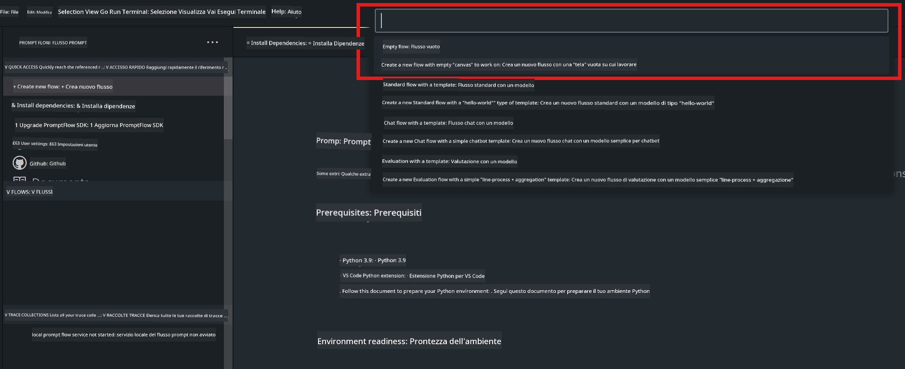
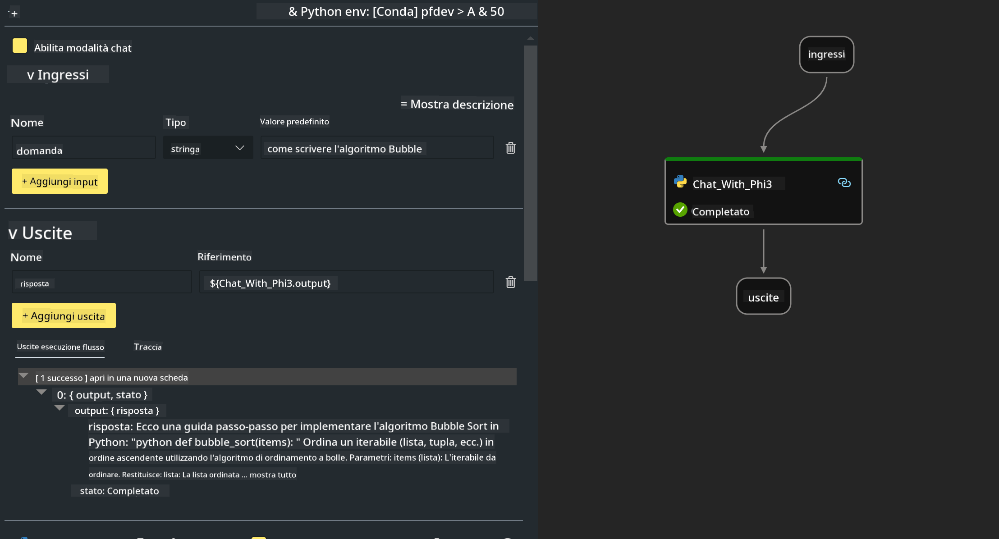

<!--
CO_OP_TRANSLATOR_METADATA:
{
  "original_hash": "bc29f7fe7fc16bed6932733eac8c81b8",
  "translation_date": "2025-05-09T19:22:59+00:00",
  "source_file": "md/02.Application/02.Code/Phi3/VSCodeExt/HOL/AIPC/02.PromptflowWithNPU.md",
  "language_code": "it"
}
-->
# **Lab 2 - Esegui Prompt flow con Phi-3-mini in AIPC**

## **Cos'è Prompt flow**

Prompt flow è una suite di strumenti di sviluppo progettata per semplificare l’intero ciclo di sviluppo di applicazioni AI basate su LLM, dalla ideazione, prototipazione, test, valutazione fino al deployment in produzione e monitoraggio. Rende molto più semplice l’ingegneria dei prompt e ti permette di creare app LLM con qualità da produzione.

Con prompt flow potrai:

- Creare flussi che collegano LLM, prompt, codice Python e altri strumenti in un workflow eseguibile.

- Debuggare e iterare i tuoi flussi, in particolare l’interazione con gli LLM, con facilità.

- Valutare i tuoi flussi, calcolare metriche di qualità e prestazioni su dataset più ampi.

- Integrare test e valutazioni nel tuo sistema CI/CD per garantire la qualità del flusso.

- Distribuire i tuoi flussi sulla piattaforma di serving che preferisci o integrarli facilmente nel codice della tua app.

- (Opzionale ma altamente consigliato) Collaborare con il tuo team sfruttando la versione cloud di Prompt flow in Azure AI.

## **Cos'è AIPC**

Un AI PC ha una CPU, una GPU e una NPU, ciascuno con specifiche capacità di accelerazione AI. Una NPU, o neural processing unit, è un acceleratore specializzato che gestisce i compiti di intelligenza artificiale (AI) e machine learning (ML) direttamente sul tuo PC, senza inviare dati al cloud per l’elaborazione. GPU e CPU possono anch’essi gestire questi carichi, ma la NPU è particolarmente efficiente per calcoli AI a basso consumo. L’AI PC rappresenta un cambiamento fondamentale nel modo in cui funzionano i nostri computer. Non è una soluzione per un problema inesistente, ma promette un enorme miglioramento per l’uso quotidiano del PC.

Come funziona? Rispetto all’AI generativa e ai grandi modelli di linguaggio (LLM) addestrati su enormi quantità di dati pubblici, l’AI che gira sul tuo PC è più accessibile praticamente a ogni livello. Il concetto è più semplice da comprendere e, poiché è addestrato sui tuoi dati senza bisogno di accedere al cloud, i vantaggi sono immediatamente più interessanti per un pubblico più ampio.

Nel breve termine, il mondo AI PC coinvolge assistenti personali e modelli AI più piccoli che girano direttamente sul tuo PC, usando i tuoi dati per offrire miglioramenti AI personali, privati e più sicuri per attività che già fai ogni giorno – prendere appunti durante le riunioni, organizzare una lega di fantasy football, automatizzare miglioramenti per foto e video, o pianificare l’itinerario perfetto per una riunione di famiglia basandosi sugli orari di arrivo e partenza di tutti.

## **Costruire flussi di generazione di codice su AIPC**

***Note*** ：Se non hai ancora completato l’installazione dell’ambiente, visita [Lab 0 - Installations](./01.Installations.md)

1. Apri l’estensione Prompt flow in Visual Studio Code e crea un progetto flow vuoto



2. Aggiungi parametri Inputs e Outputs e aggiungi il codice Python come nuovo flow



Puoi fare riferimento a questa struttura (flow.dag.yaml) per costruire il tuo flow

```yaml

inputs:
  question:
    type: string
    default: how to write Bubble Algorithm
outputs:
  answer:
    type: string
    reference: ${Chat_With_Phi3.output}
nodes:
- name: Chat_With_Phi3
  type: python
  source:
    type: code
    path: Chat_With_Phi3.py
  inputs:
    question: ${inputs.question}


```

3. Aggiungi il codice in ***Chat_With_Phi3.py***

```python


from promptflow.core import tool

# import torch
from transformers import AutoTokenizer, pipeline,TextStreamer
import intel_npu_acceleration_library as npu_lib

import warnings

import asyncio
import platform

class Phi3CodeAgent:
    
    model = None
    tokenizer = None
    text_streamer = None
    
    model_id = "microsoft/Phi-3-mini-4k-instruct"

    @staticmethod
    def init_phi3():
        
        if Phi3CodeAgent.model is None or Phi3CodeAgent.tokenizer is None or Phi3CodeAgent.text_streamer is None:
            Phi3CodeAgent.model = npu_lib.NPUModelForCausalLM.from_pretrained(
                                    Phi3CodeAgent.model_id,
                                    torch_dtype="auto",
                                    dtype=npu_lib.int4,
                                    trust_remote_code=True
                                )
            Phi3CodeAgent.tokenizer = AutoTokenizer.from_pretrained(Phi3CodeAgent.model_id)
            Phi3CodeAgent.text_streamer = TextStreamer(Phi3CodeAgent.tokenizer, skip_prompt=True)

    

    @staticmethod
    def chat_with_phi3(prompt):
        
        Phi3CodeAgent.init_phi3()

        messages = "<|system|>You are a AI Python coding assistant. Please help me to generate code in Python.The answer only genertated Python code, but any comments and instructions do not need to be generated<|end|><|user|>" + prompt +"<|end|><|assistant|>"


        generation_args = {
            "max_new_tokens": 1024,
            "return_full_text": False,
            "temperature": 0.3,
            "do_sample": False,
            "streamer": Phi3CodeAgent.text_streamer,
        }

        pipe = pipeline(
            "text-generation",
            model=Phi3CodeAgent.model,
            tokenizer=Phi3CodeAgent.tokenizer,
            # **generation_args
        )

        result = ''

        with warnings.catch_warnings():
            warnings.simplefilter("ignore")
            response = pipe(messages, **generation_args)
            result =response[0]['generated_text']
            return result


@tool
def my_python_tool(question: str) -> str:
    if platform.system() == 'Windows':
        asyncio.set_event_loop_policy(asyncio.WindowsSelectorEventLoopPolicy())
    return Phi3CodeAgent.chat_with_phi3(question)


```

4. Puoi testare il flow da Debug o Run per verificare se la generazione del codice funziona correttamente


5. Esegui il flow come API di sviluppo nel terminale

```

pf flow serve --source ./ --port 8080 --host localhost   

```

Puoi testarlo in Postman / Thunder Client

### **Note**

1. La prima esecuzione richiede molto tempo. Si consiglia di scaricare il modello phi-3 tramite Hugging face CLI.

2. Considerando la potenza di calcolo limitata della Intel NPU, si raccomanda di usare Phi-3-mini-4k-instruct.

3. Utilizziamo l’accelerazione Intel NPU per la quantizzazione in INT4, ma se riesegui il servizio, devi eliminare le cartelle cache e nc_workshop.

## **Risorse**

1. Impara Promptflow [https://microsoft.github.io/promptflow/](https://microsoft.github.io/promptflow/)

2. Impara Intel NPU Acceleration [https://github.com/intel/intel-npu-acceleration-library](https://github.com/intel/intel-npu-acceleration-library)

3. Codice di esempio, scarica [Local NPU Agent Sample Code](../../../../../../../../../code/07.Lab/01/AIPC)

**Disclaimer**:  
Questo documento è stato tradotto utilizzando il servizio di traduzione automatica AI [Co-op Translator](https://github.com/Azure/co-op-translator). Pur impegnandoci per garantire accuratezza, si prega di notare che le traduzioni automatiche possono contenere errori o imprecisioni. Il documento originale nella sua lingua nativa deve essere considerato la fonte autorevole. Per informazioni critiche, si raccomanda una traduzione professionale effettuata da un umano. Non ci assumiamo alcuna responsabilità per eventuali malintesi o interpretazioni errate derivanti dall’uso di questa traduzione.