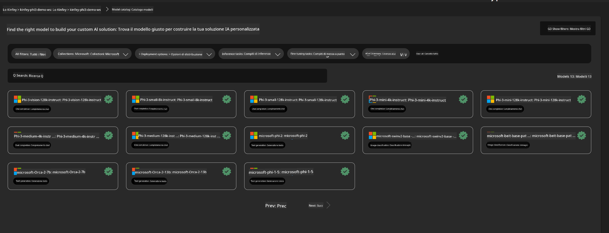
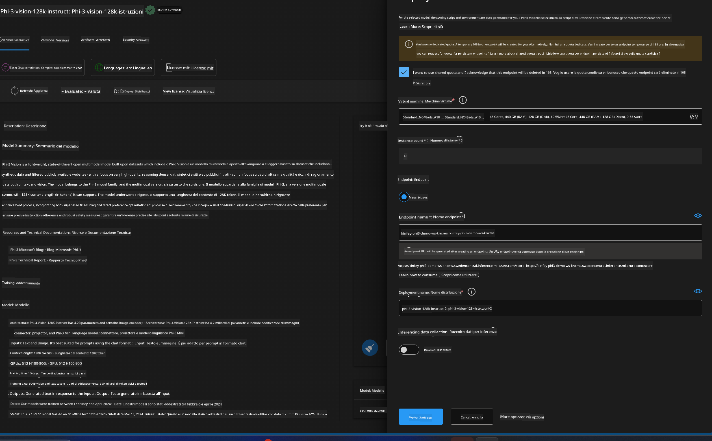
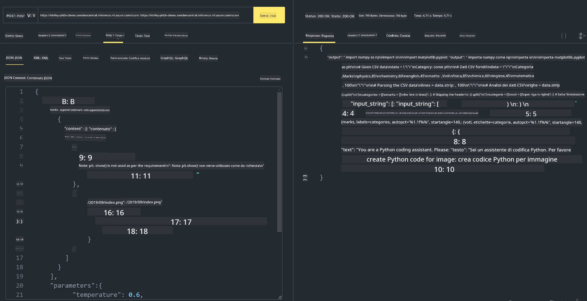

<!--
CO_OP_TRANSLATOR_METADATA:
{
  "original_hash": "20cb4e6ac1686248e8be913ccf6c2bc2",
  "translation_date": "2025-05-09T19:27:53+00:00",
  "source_file": "md/02.Application/02.Code/Phi3/VSCodeExt/HOL/AIPC/03.DeployPhi3VisionOnAzure.md",
  "language_code": "it"
}
-->
# **Laboratorio 3 - Desplegar Phi-3-vision en Azure Machine Learning Service**

Usamos NPU para completar el despliegue de producción del código local, y luego queremos introducir la capacidad de incorporar PHI-3-VISION a través de este para lograr que las imágenes generen código.

En esta introducción, podemos construir rápidamente un servicio Modelo como Servicio Phi-3 Vision en Azure Machine Learning Service.

***Note***: Phi-3 Vision requiere potencia de cómputo para generar contenido a mayor velocidad. Necesitamos la potencia de cómputo en la nube para ayudarnos a lograr esto.

### **1. Crear Azure Machine Learning Service**

Necesitamos crear un Azure Machine Learning Service en el Portal de Azure. Si quieres aprender cómo, visita este enlace [https://learn.microsoft.com/azure/machine-learning/quickstart-create-resources?view=azureml-api-2](https://learn.microsoft.com/azure/machine-learning/quickstart-create-resources?view=azureml-api-2)

### **2. Elegir Phi-3 Vision en Azure Machine Learning Service**



### **3. Desplegar Phi-3-Vision en Azure**



### **4. Probar el Endpoint en Postman**



***Note***

1. Los parámetros que se deben enviar deben incluir Authorization, azureml-model-deployment y Content-Type. Necesitas revisar la información del despliegue para obtenerlos.

2. Para enviar parámetros, Phi-3-Vision necesita recibir un enlace de imagen. Por favor, consulta el método de GPT-4-Vision para enviar parámetros, como

```json

{
  "input_data":{
    "input_string":[
      {
        "role":"user",
        "content":[ 
          {
            "type": "text",
            "text": "You are a Python coding assistant.Please create Python code for image "
          },
          {
              "type": "image_url",
              "image_url": {
                "url": "https://ajaytech.co/wp-content/uploads/2019/09/index.png"
              }
          }
        ]
      }
    ],
    "parameters":{
          "temperature": 0.6,
          "top_p": 0.9,
          "do_sample": false,
          "max_new_tokens": 2048
    }
  }
}

```

3. Llama a **/score** usando el método Post

**¡Felicidades!** Has completado el despliegue rápido de PHI-3-VISION y probado cómo usar imágenes para generar código. A continuación, podemos construir aplicaciones combinando NPUs y la nube.

**Disclaimer**:  
Questo documento è stato tradotto utilizzando il servizio di traduzione automatica AI [Co-op Translator](https://github.com/Azure/co-op-translator). Pur impegnandoci per l’accuratezza, si prega di notare che le traduzioni automatiche possono contenere errori o imprecisioni. Il documento originale nella sua lingua nativa deve essere considerato la fonte autorevole. Per informazioni critiche, si raccomanda una traduzione professionale umana. Non siamo responsabili per eventuali malintesi o interpretazioni errate derivanti dall’uso di questa traduzione.