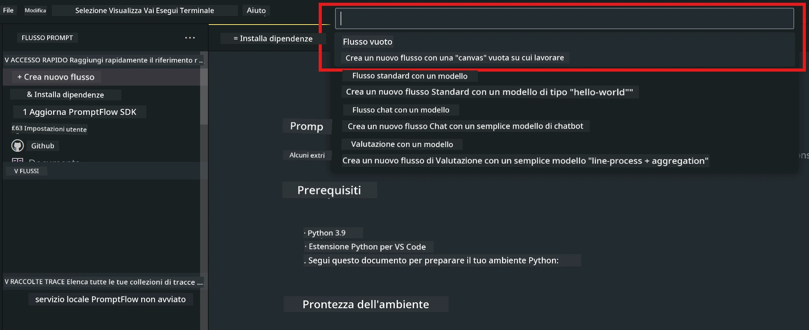
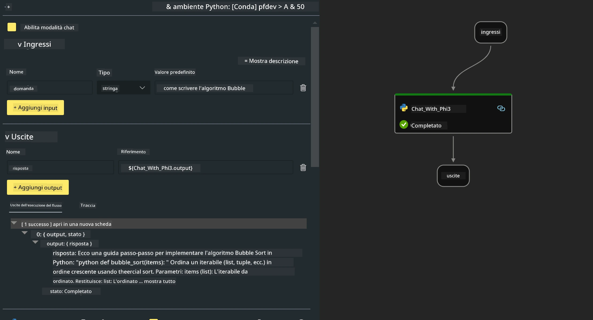

# **Lab 2 - Eseguire Prompt flow con Phi-3-mini in AIPC**

## **Cos'è Prompt flow**

Prompt flow è una suite di strumenti di sviluppo progettata per semplificare l’intero ciclo di sviluppo di applicazioni AI basate su LLM, dalla fase di ideazione, prototipazione, test, valutazione fino al deployment in produzione e monitoraggio. Rende l’ingegneria dei prompt molto più semplice e ti permette di costruire applicazioni LLM con qualità da produzione.

Con prompt flow potrai:

- Creare flussi che collegano LLM, prompt, codice Python e altri strumenti in un workflow eseguibile.

- Debuggare e iterare i tuoi flussi, in particolare l’interazione con gli LLM, con facilità.

- Valutare i tuoi flussi, calcolare metriche di qualità e performance su dataset più ampi.

- Integrare test e valutazioni nel tuo sistema CI/CD per garantire la qualità del flusso.

- Distribuire i tuoi flussi sulla piattaforma di serving che preferisci o integrarli facilmente nel codice della tua app.

- (Opzionale ma altamente consigliato) Collaborare con il tuo team sfruttando la versione cloud di Prompt flow in Azure AI.

## **Costruire flussi di generazione di codice su Apple Silicon**

***Note*** ：Se non hai ancora completato l’installazione dell’ambiente, visita [Lab 0 -Installations](./01.Installations.md)

1. Apri l’estensione Prompt flow in Visual Studio Code e crea un progetto flow vuoto



2. Aggiungi parametri di Input e Output e aggiungi codice Python come nuovo flow



Puoi fare riferimento a questa struttura (flow.dag.yaml) per costruire il tuo flow

```yaml

inputs:
  prompt:
    type: string
    default: Write python code for Fibonacci serie. Please use markdown as output
outputs:
  result:
    type: string
    reference: ${gen_code_by_phi3.output}
nodes:
- name: gen_code_by_phi3
  type: python
  source:
    type: code
    path: gen_code_by_phi3.py
  inputs:
    prompt: ${inputs.prompt}


```

3. Quantificare phi-3-mini

Vogliamo eseguire meglio SLM su dispositivi locali. Generalmente, quantifichiamo il modello (INT4, FP16, FP32)

```bash

python -m mlx_lm.convert --hf-path microsoft/Phi-3-mini-4k-instruct

```

**Note:** la cartella di default è mlx_model

4. Aggiungi il codice in ***Chat_With_Phi3.py***

```python


from promptflow import tool

from mlx_lm import load, generate


# The inputs section will change based on the arguments of the tool function, after you save the code
# Adding type to arguments and return value will help the system show the types properly
# Please update the function name/signature per need
@tool
def my_python_tool(prompt: str) -> str:

    model_id = './mlx_model_phi3_mini'

    model, tokenizer = load(model_id)

    # <|user|>\nWrite python code for Fibonacci serie. Please use markdown as output<|end|>\n<|assistant|>

    response = generate(model, tokenizer, prompt="<|user|>\n" + prompt  + "<|end|>\n<|assistant|>", max_tokens=2048, verbose=True)

    return response


```

4. Puoi testare il flow da Debug o Run per verificare se la generazione del codice funziona correttamente


5. Esegui il flow come API di sviluppo nel terminale

```

pf flow serve --source ./ --port 8080 --host localhost   

```

Puoi testarlo in Postman / Thunder Client

### **Note**

1. La prima esecuzione richiede molto tempo. Si consiglia di scaricare il modello phi-3 tramite Hugging face CLI.

2. Considerando la potenza di calcolo limitata della Intel NPU, si consiglia di usare Phi-3-mini-4k-instruct

3. Usiamo l’accelerazione Intel NPU per quantizzare la conversione INT4, ma se riavvii il servizio, devi cancellare le cartelle cache e nc_workshop.

## **Risorse**

1. Impara Promptflow [https://microsoft.github.io/promptflow/](https://microsoft.github.io/promptflow/)

2. Impara Intel NPU Acceleration [https://github.com/intel/intel-npu-acceleration-library](https://github.com/intel/intel-npu-acceleration-library)

3. Codice di esempio, scarica [Local NPU Agent Sample Code](../../../../../../../../../code/07.Lab/01/AIPC/local-npu-agent)

**Disclaimer**:  
Questo documento è stato tradotto utilizzando il servizio di traduzione automatica [Co-op Translator](https://github.com/Azure/co-op-translator). Pur impegnandoci per garantire accuratezza, si prega di notare che le traduzioni automatiche possono contenere errori o imprecisioni. Il documento originale nella sua lingua nativa deve essere considerato la fonte autorevole. Per informazioni critiche, si raccomanda una traduzione professionale effettuata da un umano. Non ci assumiamo alcuna responsabilità per eventuali malintesi o interpretazioni errate derivanti dall’uso di questa traduzione.