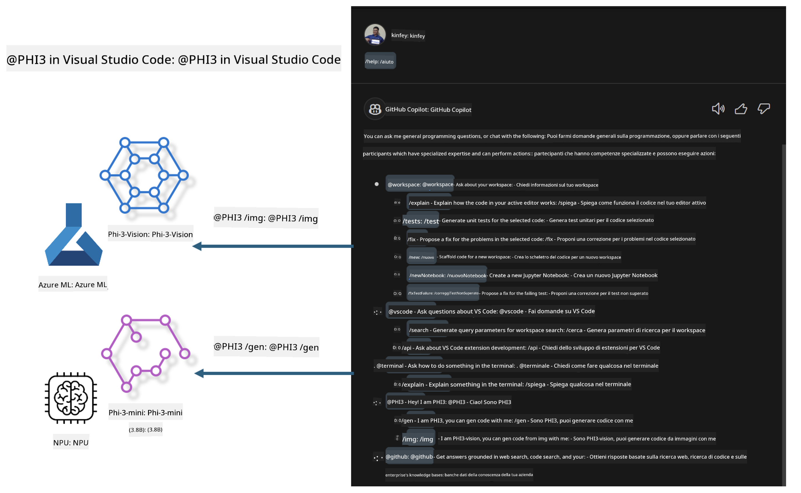

<!--
CO_OP_TRANSLATOR_METADATA:
{
  "original_hash": "00b7a699de8ac405fa821f4c0f7fc0ab",
  "translation_date": "2025-05-09T19:12:23+00:00",
  "source_file": "md/02.Application/02.Code/Phi3/VSCodeExt/README.md",
  "language_code": "it"
}
-->
# **Costruisci il tuo Visual Studio Code GitHub Copilot Chat con la famiglia Microsoft Phi-3**

Hai mai utilizzato l'agente workspace in GitHub Copilot Chat? Vuoi creare un agente di codice personalizzato per il tuo team? Questo laboratorio pratico mira a combinare modelli open source per costruire un agente aziendale di livello enterprise.

## **Fondamenti**

### **Perché scegliere Microsoft Phi-3**

Phi-3 è una famiglia di modelli che include phi-3-mini, phi-3-small e phi-3-medium, basati su diversi parametri di addestramento per generazione di testo, completamento di dialoghi e generazione di codice. Esiste anche phi-3-vision basato su Vision. È adatto per aziende o team diversi che vogliono creare soluzioni di AI generativa offline.

Consigliata la lettura di questo link [https://github.com/microsoft/PhiCookBook/blob/main/md/01.Introduction/01/01.PhiFamily.md](https://github.com/microsoft/PhiCookBook/blob/main/md/01.Introduction/01/01.PhiFamily.md)

### **Microsoft GitHub Copilot Chat**

L’estensione GitHub Copilot Chat offre un’interfaccia di chat che ti permette di interagire con GitHub Copilot e ricevere risposte a domande legate al codice direttamente all’interno di VS Code, senza dover consultare documentazione o cercare nei forum online.

Copilot Chat può utilizzare evidenziazione della sintassi, indentazione e altre formattazioni per rendere più chiara la risposta generata. A seconda del tipo di domanda, il risultato può includere link a contesti usati da Copilot per generare la risposta, come file di codice sorgente o documentazione, oppure pulsanti per accedere a funzionalità di VS Code.

- Copilot Chat si integra nel tuo flusso di lavoro da sviluppatore e ti assiste dove serve:

- Avvia una conversazione inline direttamente dall’editor o dal terminale per ricevere aiuto mentre programmi

- Usa la vista Chat per avere un assistente AI sempre a disposizione

- Lancia Quick Chat per fare una domanda rapida e tornare subito al lavoro

Puoi usare GitHub Copilot Chat in diversi scenari, come:

- Rispondere a domande su come risolvere al meglio un problema di programmazione

- Spiegare codice scritto da altri e suggerire miglioramenti

- Proporre correzioni al codice

- Generare casi di test unitari

- Generare documentazione del codice

Consigliata la lettura di questo link [https://code.visualstudio.com/docs/copilot/copilot-chat](https://code.visualstudio.com/docs/copilot/copilot-chat?WT.mc_id=aiml-137032-kinfeylo)

### **Microsoft GitHub Copilot Chat @workspace**

Fare riferimento a **@workspace** in Copilot Chat ti consente di fare domande sull’intero codice del tuo progetto. In base alla domanda, Copilot recupera in modo intelligente file e simboli rilevanti, che poi cita nella risposta come link ed esempi di codice.

Per rispondere, **@workspace** esplora le stesse fonti che uno sviluppatore usa navigando un progetto in VS Code:

- Tutti i file nel workspace, tranne quelli ignorati da un file .gitignore

- Struttura delle directory con cartelle e file nidificati

- L’indice di ricerca codice di GitHub, se il workspace è un repository GitHub indicizzato

- Simboli e definizioni nel workspace

- Testo selezionato o visibile nell’editor attivo

Nota: .gitignore viene ignorato se hai un file aperto o testo selezionato all’interno di un file ignorato.

Consigliata la lettura di questo link [[https://code.visualstudio.com/docs/copilot/copilot-chat](https://code.visualstudio.com/docs/copilot/workspace-context?WT.mc_id=aiml-137032-kinfeylo)]

## **Scopri di più su questo laboratorio**

GitHub Copilot ha migliorato notevolmente l’efficienza di programmazione nelle aziende, e ogni azienda desidera personalizzare le funzioni di GitHub Copilot. Molte aziende hanno sviluppato estensioni personalizzate simili a GitHub Copilot basate sui propri scenari di business e modelli open source. Per le aziende, le estensioni personalizzate sono più semplici da gestire, ma questo può influire sull’esperienza utente. Dopotutto, GitHub Copilot offre funzionalità più avanzate per scenari generali e professionalità. Se si può mantenere un’esperienza coerente, è meglio personalizzare un’estensione aziendale. GitHub Copilot Chat fornisce API per estendere l’esperienza di chat nelle aziende. Mantenere un’esperienza coerente con funzioni personalizzate garantisce una migliore esperienza utente.

Questo laboratorio utilizza principalmente il modello Phi-3 combinato con NPU locale e Azure in modalità ibrida per costruire un agente personalizzato in GitHub Copilot Chat ***@PHI3*** che assiste gli sviluppatori aziendali nella generazione di codice***(@PHI3 /gen)*** e nella generazione di codice basato su immagini ***(@PHI3 /img)***.

### ***Nota:***

Questo laboratorio è attualmente implementato su AIPC con CPU Intel e Apple Silicon. Continueremo ad aggiornare la versione Qualcomm per NPU.

## **Laboratorio**

| Nome | Descrizione | AIPC | Apple |
| ------------ | ----------- | -------- |-------- |
| Lab0 - Installazioni(✅) | Configurazione e installazione degli ambienti e degli strumenti necessari | [Go](./HOL/AIPC/01.Installations.md) |[Go](./HOL/Apple/01.Installations.md) |
| Lab1 - Esegui Prompt flow con Phi-3-mini (✅) | Combinazione con AIPC / Apple Silicon, uso di NPU locale per creare generazione di codice tramite Phi-3-mini | [Go](./HOL/AIPC/02.PromptflowWithNPU.md) |  [Go](./HOL/Apple/02.PromptflowWithMLX.md) |
| Lab2 - Distribuisci Phi-3-vision su Azure Machine Learning Service(✅) | Generazione di codice distribuendo il Model Catalog di Azure Machine Learning Service - immagine Phi-3-vision | [Go](./HOL/AIPC/03.DeployPhi3VisionOnAzure.md) |[Go](./HOL/Apple/03.DeployPhi3VisionOnAzure.md) |
| Lab3 - Crea un agente @phi-3 in GitHub Copilot Chat(✅)  | Crea un agente Phi-3 personalizzato in GitHub Copilot Chat per completare generazione di codice, codice di generazione grafica, RAG, ecc. | [Go](./HOL/AIPC/04.CreatePhi3AgentInVSCode.md) | [Go](./HOL/Apple/04.CreatePhi3AgentInVSCode.md) |
| Codice di esempio (✅)  | Scarica codice di esempio | [Go](../../../../../../../code/07.Lab/01/AIPC) | [Go](../../../../../../../code/07.Lab/01/Apple) |

## **Risorse**

1. Phi-3 Cookbook [https://github.com/microsoft/Phi-3CookBook](https://github.com/microsoft/Phi-3CookBook)

2. Scopri di più su GitHub Copilot [https://learn.microsoft.com/training/paths/copilot/](https://learn.microsoft.com/training/paths/copilot/?WT.mc_id=aiml-137032-kinfeylo)

3. Scopri di più su GitHub Copilot Chat [https://learn.microsoft.com/training/paths/accelerate-app-development-using-github-copilot/](https://learn.microsoft.com/training/paths/accelerate-app-development-using-github-copilot/?WT.mc_id=aiml-137032-kinfeylo)

4. Scopri di più sulle API di GitHub Copilot Chat [https://code.visualstudio.com/api/extension-guides/chat](https://code.visualstudio.com/api/extension-guides/chat?WT.mc_id=aiml-137032-kinfeylo)

5. Scopri di più su Azure AI Foundry [https://learn.microsoft.com/training/paths/create-custom-copilots-ai-studio/](https://learn.microsoft.com/training/paths/create-custom-copilots-ai-studio/?WT.mc_id=aiml-137032-kinfeylo)

6. Scopri di più sul Model Catalog di Azure AI Foundry [https://learn.microsoft.com/azure/ai-studio/how-to/model-catalog-overview](https://learn.microsoft.com/azure/ai-studio/how-to/model-catalog-overview)

**Disclaimer**:  
Questo documento è stato tradotto utilizzando il servizio di traduzione automatica AI [Co-op Translator](https://github.com/Azure/co-op-translator). Pur impegnandoci per garantire l’accuratezza, si prega di notare che le traduzioni automatiche possono contenere errori o inesattezze. Il documento originale nella sua lingua nativa deve essere considerato la fonte autorevole. Per informazioni critiche, si raccomanda la traduzione professionale effettuata da un essere umano. Non siamo responsabili per eventuali fraintendimenti o interpretazioni errate derivanti dall’uso di questa traduzione.