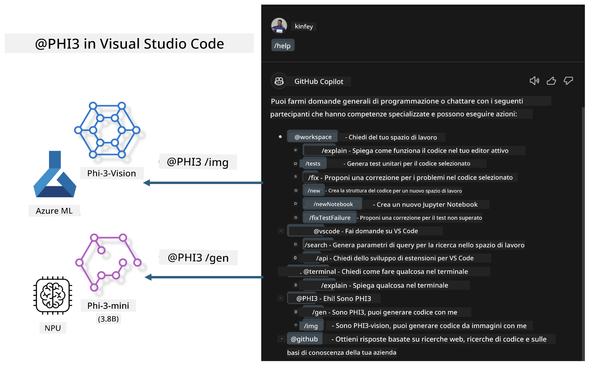

# **Crea il tuo Visual Studio Code GitHub Copilot Chat con la famiglia Microsoft Phi-3**

Hai mai utilizzato l'agente workspace in GitHub Copilot Chat? Vuoi creare un agente di codice personalizzato per il tuo team? Questo laboratorio pratico mira a combinare un modello open source per costruire un agente aziendale di codice a livello enterprise.

## **Fondamenti**

### **Perché scegliere Microsoft Phi-3**

Phi-3 è una serie di modelli che include phi-3-mini, phi-3-small e phi-3-medium, basati su diversi parametri di addestramento per generazione di testo, completamento di dialoghi e generazione di codice. Esiste anche phi-3-vision basato su Vision. È adatto per aziende o team diversi che vogliono creare soluzioni di AI generativa offline.

Si consiglia di leggere questo link [https://github.com/microsoft/PhiCookBook/blob/main/md/01.Introduction/01/01.PhiFamily.md](https://github.com/microsoft/PhiCookBook/blob/main/md/01.Introduction/01/01.PhiFamily.md)

### **Microsoft GitHub Copilot Chat**

L’estensione GitHub Copilot Chat ti offre un’interfaccia di chat che ti permette di interagire con GitHub Copilot e ricevere risposte a domande di programmazione direttamente all’interno di VS Code, senza dover consultare documentazione o cercare nei forum online.

Copilot Chat può utilizzare evidenziazione della sintassi, indentazione e altre funzionalità di formattazione per rendere più chiara la risposta generata. A seconda del tipo di domanda, il risultato può contenere link al contesto usato da Copilot per generare la risposta, come file di codice sorgente o documentazione, oppure pulsanti per accedere a funzionalità di VS Code.

- Copilot Chat si integra nel tuo flusso di sviluppo e ti assiste dove serve:

- Avvia una conversazione in chat inline direttamente dall’editor o dal terminale per ricevere aiuto mentre scrivi codice

- Usa la vista Chat per avere un assistente AI sempre a portata di mano

- Avvia Quick Chat per fare una domanda veloce e tornare subito al lavoro

Puoi usare GitHub Copilot Chat in vari scenari, come:

- Rispondere a domande di programmazione su come risolvere al meglio un problema

- Spiegare il codice scritto da altri e suggerire miglioramenti

- Proporre correzioni al codice

- Generare casi di test unitari

- Generare documentazione del codice

Si consiglia di leggere questo link [https://code.visualstudio.com/docs/copilot/copilot-chat](https://code.visualstudio.com/docs/copilot/copilot-chat?WT.mc_id=aiml-137032-kinfeylo)

### **Microsoft GitHub Copilot Chat @workspace**

Fare riferimento a **@workspace** in Copilot Chat ti permette di fare domande sull’intero codice del tuo progetto. In base alla domanda, Copilot recupera in modo intelligente i file e i simboli rilevanti, che poi cita nella risposta come link ed esempi di codice.

Per rispondere, **@workspace** cerca nelle stesse fonti che un sviluppatore userebbe navigando un codice in VS Code:

- Tutti i file nel workspace, tranne quelli ignorati da un file .gitignore

- La struttura delle cartelle con nomi di cartelle e file annidati

- L’indice di ricerca codice di GitHub, se il workspace è un repository GitHub indicizzato da code search

- Simboli e definizioni presenti nel workspace

- Testo selezionato o visibile nell’editor attivo

Nota: il file .gitignore viene ignorato se hai aperto un file o selezionato testo all’interno di un file ignorato.

Si consiglia di leggere questo link [[https://code.visualstudio.com/docs/copilot/copilot-chat](https://code.visualstudio.com/docs/copilot/workspace-context?WT.mc_id=aiml-137032-kinfeylo)]

## **Scopri di più su questo laboratorio**

GitHub Copilot ha migliorato notevolmente l’efficienza di programmazione nelle aziende, e ogni azienda desidera personalizzare le funzioni di GitHub Copilot in base alle proprie esigenze. Molte aziende hanno creato estensioni personalizzate simili a GitHub Copilot basate sui propri scenari di business e modelli open source. Per le aziende, le estensioni personalizzate sono più facili da controllare, ma questo può influire sull’esperienza utente. Dopotutto, GitHub Copilot ha funzionalità più avanzate per gestire scenari generali e professionali. Se si riesce a mantenere un’esperienza coerente, è meglio personalizzare un’estensione aziendale. GitHub Copilot Chat fornisce API rilevanti per permettere alle aziende di espandere l’esperienza di chat. Mantenere un’esperienza coerente e avere funzioni personalizzate è un’esperienza utente migliore.

Questo laboratorio utilizza principalmente il modello Phi-3 combinato con NPU locale e Azure in modalità ibrida per costruire un agente personalizzato in GitHub Copilot Chat ***@PHI3*** per assistere gli sviluppatori aziendali nella generazione di codice***(@PHI3 /gen)*** e nella generazione di codice basata su immagini ***(@PHI3 /img)***.

### ***Nota:***

Questo laboratorio è attualmente implementato su AIPC con CPU Intel e Apple Silicon. Continueremo ad aggiornare la versione Qualcomm di NPU.

## **Laboratorio**

| Nome | Descrizione | AIPC | Apple |
| ------------ | ----------- | -------- |-------- |
| Lab0 - Installazioni(✅) | Configurare e installare gli ambienti e gli strumenti necessari | [Vai](./HOL/AIPC/01.Installations.md) |[Vai](./HOL/Apple/01.Installations.md) |
| Lab1 - Esegui Prompt flow con Phi-3-mini (✅) | Combinato con AIPC / Apple Silicon, utilizza NPU locale per creare generazione di codice tramite Phi-3-mini | [Vai](./HOL/AIPC/02.PromptflowWithNPU.md) |  [Vai](./HOL/Apple/02.PromptflowWithMLX.md) |
| Lab2 - Distribuisci Phi-3-vision su Azure Machine Learning Service(✅) | Genera codice distribuendo il Model Catalog di Azure Machine Learning Service - immagine Phi-3-vision | [Vai](./HOL/AIPC/03.DeployPhi3VisionOnAzure.md) |[Vai](./HOL/Apple/03.DeployPhi3VisionOnAzure.md) |
| Lab3 - Crea un agente @phi-3 in GitHub Copilot Chat(✅)  | Crea un agente Phi-3 personalizzato in GitHub Copilot Chat per completare generazione di codice, codice per grafici, RAG, ecc. | [Vai](./HOL/AIPC/04.CreatePhi3AgentInVSCode.md) | [Vai](./HOL/Apple/04.CreatePhi3AgentInVSCode.md) |
| Codice di esempio (✅)  | Scarica codice di esempio | [Vai](../../../../../../../code/07.Lab/01/AIPC) | [Vai](../../../../../../../code/07.Lab/01/Apple) |

## **Risorse**

1. Phi-3 Cookbook [https://github.com/microsoft/Phi-3CookBook](https://github.com/microsoft/Phi-3CookBook)

2. Scopri di più su GitHub Copilot [https://learn.microsoft.com/training/paths/copilot/](https://learn.microsoft.com/training/paths/copilot/?WT.mc_id=aiml-137032-kinfeylo)

3. Scopri di più su GitHub Copilot Chat [https://learn.microsoft.com/training/paths/accelerate-app-development-using-github-copilot/](https://learn.microsoft.com/training/paths/accelerate-app-development-using-github-copilot/?WT.mc_id=aiml-137032-kinfeylo)

4. Scopri di più sulle API di GitHub Copilot Chat [https://code.visualstudio.com/api/extension-guides/chat](https://code.visualstudio.com/api/extension-guides/chat?WT.mc_id=aiml-137032-kinfeylo)

5. Scopri di più su Azure AI Foundry [https://learn.microsoft.com/training/paths/create-custom-copilots-ai-studio/](https://learn.microsoft.com/training/paths/create-custom-copilots-ai-studio/?WT.mc_id=aiml-137032-kinfeylo)

6. Scopri di più sul Model Catalog di Azure AI Foundry [https://learn.microsoft.com/azure/ai-studio/how-to/model-catalog-overview](https://learn.microsoft.com/azure/ai-studio/how-to/model-catalog-overview)

**Disclaimer**:  
Questo documento è stato tradotto utilizzando il servizio di traduzione automatica [Co-op Translator](https://github.com/Azure/co-op-translator). Pur impegnandoci per garantire l’accuratezza, si prega di notare che le traduzioni automatiche possono contenere errori o imprecisioni. Il documento originale nella sua lingua nativa deve essere considerato la fonte autorevole. Per informazioni critiche, si raccomanda una traduzione professionale effettuata da un umano. Non ci assumiamo alcuna responsabilità per eventuali malintesi o interpretazioni errate derivanti dall’uso di questa traduzione.