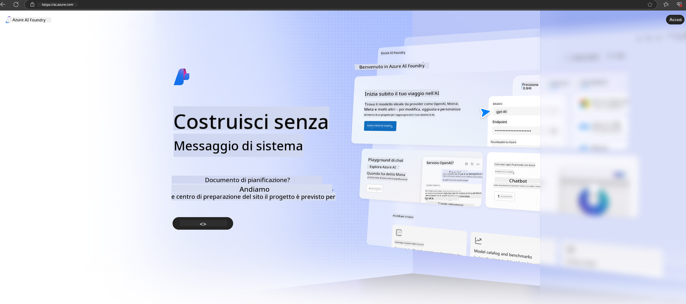

<!--
CO_OP_TRANSLATOR_METADATA:
{
  "original_hash": "3a1e48b628022485aac989c9f733e792",
  "translation_date": "2025-05-09T20:11:05+00:00",
  "source_file": "md/02.QuickStart/AzureAIFoundry_QuickStart.md",
  "language_code": "it"
}
-->
# **Utilizzo di Phi-3 in Azure AI Foundry**

Con lo sviluppo dell’Intelligenza Artificiale Generativa, puntiamo a utilizzare una piattaforma unificata per gestire diversi LLM e SLM, l’integrazione dei dati aziendali, le operazioni di fine-tuning/RAG e la valutazione di diverse attività aziendali dopo l’integrazione di LLM e SLM, ecc., in modo che le applicazioni di intelligenza artificiale generativa possano essere implementate in modo più intelligente. [Azure AI Foundry](https://ai.azure.com) è una piattaforma aziendale per applicazioni di intelligenza artificiale generativa.

Con Azure AI Foundry, puoi valutare le risposte dei modelli di linguaggio di grandi dimensioni (LLM) e orchestrare i componenti delle applicazioni prompt con prompt flow per migliorare le prestazioni. La piattaforma facilita la scalabilità per trasformare proof of concept in produzioni complete con facilità. Il monitoraggio continuo e il perfezionamento supportano il successo a lungo termine.

Possiamo distribuire rapidamente il modello Phi-3 su Azure AI Foundry con pochi semplici passaggi, per poi utilizzare Azure AI Foundry per completare Playground/Chat, fine-tuning, valutazioni e altre attività correlate a Phi-3.

## **1. Preparazione**

Se hai già installato l’[Azure Developer CLI](https://learn.microsoft.com/azure/developer/azure-developer-cli/overview?WT.mc_id=aiml-138114-kinfeylo) sulla tua macchina, usare questo template è semplice come eseguire questo comando in una nuova directory.

## Creazione manuale

Creare un progetto e un hub in Microsoft Azure AI Foundry è un ottimo modo per organizzare e gestire il tuo lavoro di AI. Ecco una guida passo passo per iniziare:

### Creare un progetto in Azure AI Foundry

1. **Vai su Azure AI Foundry**: Accedi al portale Azure AI Foundry.
2. **Crea un progetto**:
   - Se sei già in un progetto, seleziona "Azure AI Foundry" in alto a sinistra per tornare alla pagina Home.
   - Seleziona "+ Create project".
   - Inserisci un nome per il progetto.
   - Se hai un hub, sarà selezionato di default. Se hai accesso a più hub, puoi scegliere un altro dal menu a tendina. Se vuoi creare un nuovo hub, seleziona "Create new hub" e inserisci un nome.
   - Seleziona "Create".

### Creare un hub in Azure AI Foundry

1. **Vai su Azure AI Foundry**: Accedi con il tuo account Azure.
2. **Crea un hub**:
   - Seleziona il Centro di gestione dal menu a sinistra.
   - Seleziona "All resources", poi la freccia verso il basso accanto a "+ New project" e scegli "+ New hub".
   - Nella finestra "Create a new hub", inserisci un nome per il tuo hub (es. contoso-hub) e modifica gli altri campi come preferisci.
   - Seleziona "Next", rivedi le informazioni e poi "Create".

Per istruzioni più dettagliate, puoi consultare la documentazione ufficiale [Microsoft](https://learn.microsoft.com/azure/ai-studio/how-to/create-projects).

Dopo la creazione avvenuta con successo, puoi accedere allo studio creato tramite [ai.azure.com](https://ai.azure.com/)

È possibile avere più progetti su un singolo AI Foundry. Crea un progetto in AI Foundry come preparazione.

Crea Azure AI Foundry [QuickStarts](https://learn.microsoft.com/azure/ai-studio/quickstarts/get-started-code)

## **2. Distribuire un modello Phi in Azure AI Foundry**

Clicca sull’opzione Explore del progetto per entrare nel Model Catalog e seleziona Phi-3

Seleziona Phi-3-mini-4k-instruct

Clicca su 'Deploy' per distribuire il modello Phi-3-mini-4k-instruct

> [!NOTE]
>
> Puoi scegliere la potenza di calcolo durante la distribuzione

## **3. Playground Chat Phi in Azure AI Foundry**

Vai alla pagina di deployment, seleziona Playground e chatta con Phi-3 di Azure AI Foundry

## **4. Distribuire il modello da Azure AI Foundry**

Per distribuire un modello dal Catalogo Modelli di Azure, puoi seguire questi passaggi:

- Accedi ad Azure AI Foundry.
- Scegli il modello che vuoi distribuire dal catalogo modelli di Azure AI Foundry.
- Nella pagina Dettagli del modello, seleziona Deploy e poi scegli Serverless API con Azure AI Content Safety.
- Seleziona il progetto in cui vuoi distribuire i modelli. Per usare l’offerta Serverless API, il tuo workspace deve appartenere alla regione East US 2 o Sweden Central. Puoi personalizzare il nome del Deployment.
- Nel wizard di deployment, seleziona Pricing and terms per conoscere prezzi e condizioni d’uso.
- Seleziona Deploy. Attendi che il deployment sia pronto e verrai reindirizzato alla pagina Deployments.
- Seleziona Open in playground per iniziare a interagire con il modello.
- Puoi tornare alla pagina Deployments, selezionare il deployment e annotare l’URL Target dell’endpoint e la Secret Key, che puoi usare per chiamare il deployment e generare completions.
- Puoi sempre trovare i dettagli dell’endpoint, URL e chiavi di accesso navigando nella scheda Build e selezionando Deployments nella sezione Components.

> [!NOTE]
> Tieni presente che il tuo account deve avere i permessi di ruolo Azure AI Developer sul Resource Group per eseguire questi passaggi.

## **5. Utilizzare Phi API in Azure AI Foundry**

Puoi accedere a https://{Your project name}.region.inference.ml.azure.com/swagger.json tramite Postman con metodo GET e combinarlo con la Key per esplorare le interfacce fornite

Puoi ottenere molto facilmente i parametri di richiesta e quelli di risposta.

**Disclaimer**:  
Questo documento è stato tradotto utilizzando il servizio di traduzione automatica AI [Co-op Translator](https://github.com/Azure/co-op-translator). Pur impegnandoci per l’accuratezza, si prega di considerare che le traduzioni automatiche possono contenere errori o inesattezze. Il documento originale nella sua lingua nativa deve essere considerato la fonte autorevole. Per informazioni critiche, si raccomanda la traduzione professionale effettuata da un umano. Non ci assumiamo alcuna responsabilità per eventuali malintesi o interpretazioni errate derivanti dall’uso di questa traduzione.