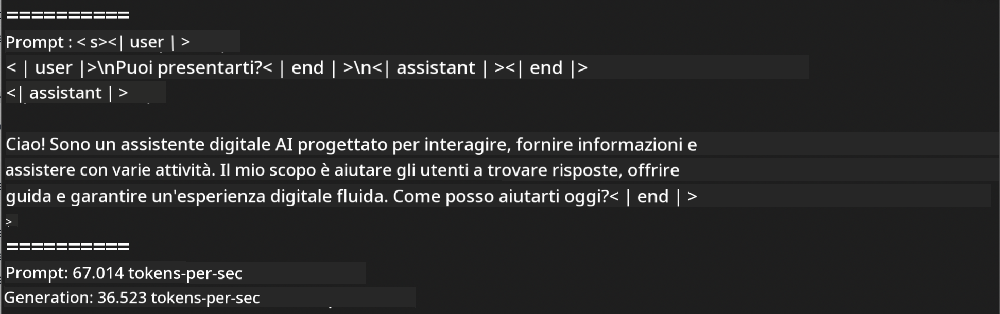
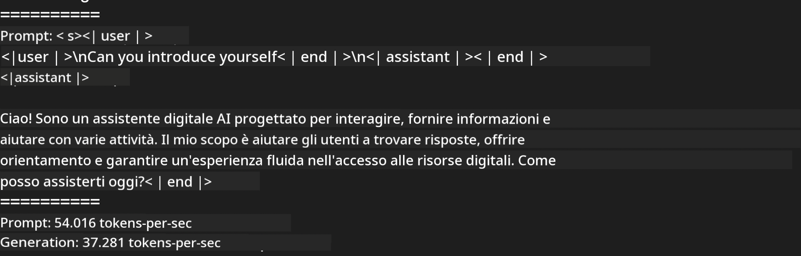
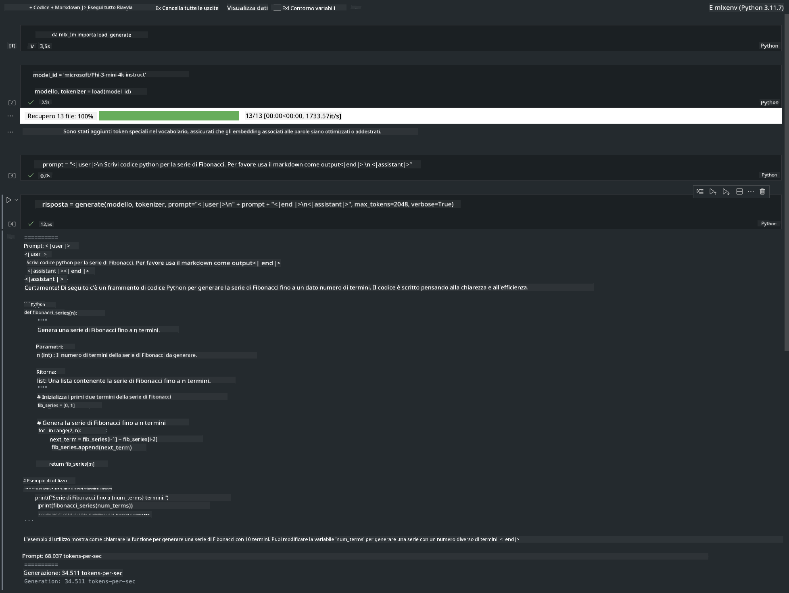

<!--
CO_OP_TRANSLATOR_METADATA:
{
  "original_hash": "dcb656f3d206fc4968e236deec5d4384",
  "translation_date": "2025-05-09T22:31:22+00:00",
  "source_file": "md/03.FineTuning/03.Inference/MLX_Inference.md",
  "language_code": "it"
}
-->
# **Inferenza Phi-3 con Apple MLX Framework**

## **Cos'è MLX Framework**

MLX è un framework array per la ricerca nel machine learning su Apple silicon, sviluppato dal team di ricerca Apple machine learning.

MLX è progettato da ricercatori di machine learning per ricercatori di machine learning. Il framework è pensato per essere facile da usare, ma comunque efficiente per addestrare e distribuire modelli. La struttura del framework è anche concettualmente semplice. L'obiettivo è facilitare l'estensione e il miglioramento di MLX da parte dei ricercatori, per esplorare rapidamente nuove idee.

I LLM possono essere accelerati sui dispositivi Apple Silicon tramite MLX, e i modelli possono essere eseguiti localmente in modo molto comodo.

## **Come usare MLX per inferire Phi-3-mini**

### **1. Configura il tuo ambiente MLX**

1. Python 3.11.x  
2. Installa la libreria MLX

```bash

pip install mlx-lm

```

### **2. Eseguire Phi-3-mini nel Terminale con MLX**

```bash

python -m mlx_lm.generate --model microsoft/Phi-3-mini-4k-instruct --max-token 2048 --prompt  "<|user|>\nCan you introduce yourself<|end|>\n<|assistant|>"

```

Il risultato (il mio ambiente è Apple M1 Max, 64GB) è



### **3. Quantizzare Phi-3-mini con MLX nel Terminale**

```bash

python -m mlx_lm.convert --hf-path microsoft/Phi-3-mini-4k-instruct

```

***Nota:*** Il modello può essere quantizzato tramite mlx_lm.convert, e la quantizzazione predefinita è INT4. In questo esempio Phi-3-mini viene quantizzato in INT4.

Il modello può essere quantizzato tramite mlx_lm.convert, e la quantizzazione predefinita è INT4. In questo esempio si quantizza Phi-3-mini in INT4. Dopo la quantizzazione, verrà salvato nella directory predefinita ./mlx_model

Possiamo testare il modello quantizzato con MLX direttamente dal terminale

```bash

python -m mlx_lm.generate --model ./mlx_model/ --max-token 2048 --prompt  "<|user|>\nCan you introduce yourself<|end|>\n<|assistant|>"

```

Il risultato è



### **4. Eseguire Phi-3-mini con MLX in Jupyter Notebook**



***Nota:*** Leggi questo esempio [clicca qui](../../../../../code/03.Inference/MLX/MLX_DEMO.ipynb)

## **Risorse**

1. Scopri Apple MLX Framework [https://ml-explore.github.io](https://ml-explore.github.io/mlx/build/html/index.html)

2. Repository GitHub Apple MLX [https://github.com/ml-explore](https://github.com/ml-explore)

**Disclaimer**:  
Questo documento è stato tradotto utilizzando il servizio di traduzione automatica [Co-op Translator](https://github.com/Azure/co-op-translator). Pur impegnandoci per garantire accuratezza, si prega di notare che le traduzioni automatiche possono contenere errori o imprecisioni. Il documento originale nella sua lingua madre deve essere considerato la fonte autorevole. Per informazioni critiche, si raccomanda una traduzione professionale umana. Non siamo responsabili per eventuali malintesi o interpretazioni errate derivanti dall’uso di questa traduzione.