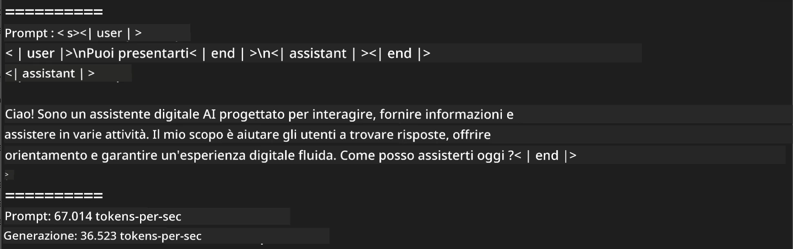
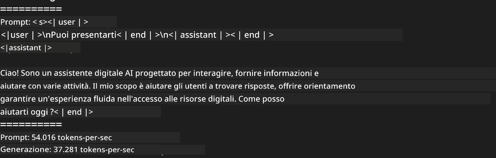
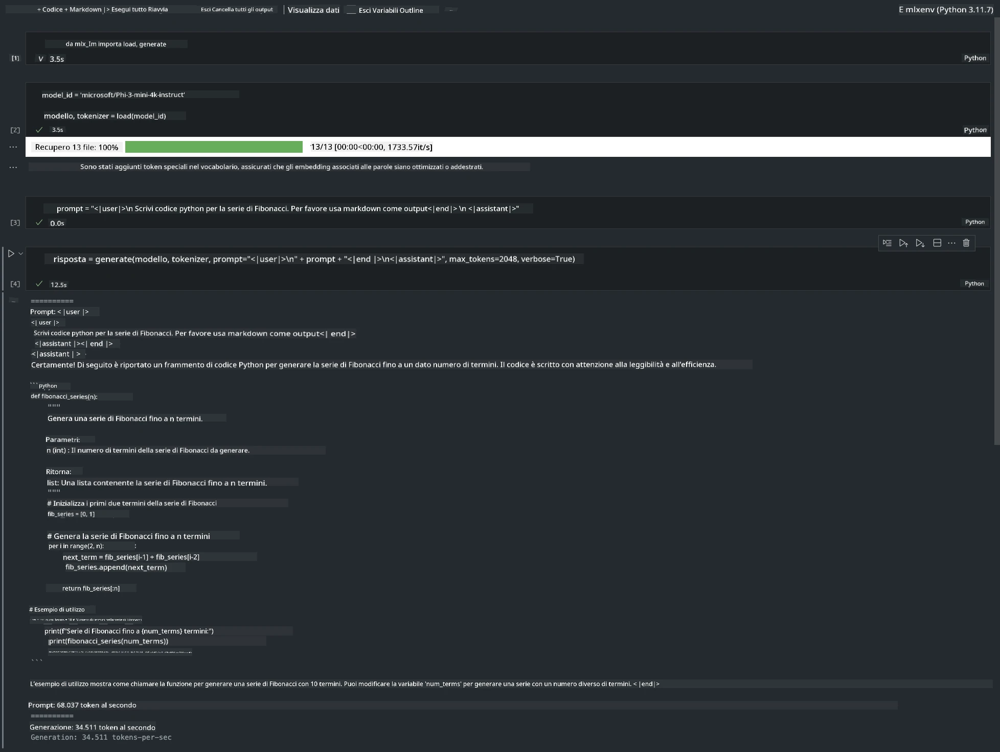

<!--
CO_OP_TRANSLATOR_METADATA:
{
  "original_hash": "dcb656f3d206fc4968e236deec5d4384",
  "translation_date": "2025-07-17T10:06:11+00:00",
  "source_file": "md/03.FineTuning/03.Inference/MLX_Inference.md",
  "language_code": "it"
}
-->
# **Inferenza Phi-3 con Apple MLX Framework**

## **Cos'è MLX Framework**

MLX è un framework array per la ricerca nel machine learning su Apple silicon, sviluppato dal team di ricerca Apple machine learning.

MLX è progettato da ricercatori di machine learning per ricercatori di machine learning. Il framework è pensato per essere facile da usare, ma allo stesso tempo efficiente per l’addestramento e il deployment dei modelli. Anche il design del framework è concettualmente semplice. L’obiettivo è rendere facile per i ricercatori estendere e migliorare MLX, permettendo di esplorare rapidamente nuove idee.

I LLM possono essere accelerati sui dispositivi Apple Silicon tramite MLX, e i modelli possono essere eseguiti localmente in modo molto comodo.

## **Usare MLX per inferire Phi-3-mini**

### **1. Configura il tuo ambiente MLX**

1. Python 3.11.x  
2. Installa la libreria MLX

```bash

pip install mlx-lm

```

### **2. Eseguire Phi-3-mini nel Terminale con MLX**

```bash

python -m mlx_lm.generate --model microsoft/Phi-3-mini-4k-instruct --max-token 2048 --prompt  "<|user|>\nCan you introduce yourself<|end|>\n<|assistant|>"

```

Il risultato (il mio ambiente è Apple M1 Max, 64GB) è



### **3. Quantizzare Phi-3-mini con MLX nel Terminale**

```bash

python -m mlx_lm.convert --hf-path microsoft/Phi-3-mini-4k-instruct

```

***Nota:*** Il modello può essere quantizzato tramite mlx_lm.convert, e la quantizzazione di default è INT4. Questo esempio quantizza Phi-3-mini in INT4.

Il modello può essere quantizzato tramite mlx_lm.convert, e la quantizzazione predefinita è INT4. In questo esempio si quantizza Phi-3-mini in INT4. Dopo la quantizzazione, il modello sarà salvato nella directory predefinita ./mlx_model

Possiamo testare il modello quantizzato con MLX direttamente dal terminale

```bash

python -m mlx_lm.generate --model ./mlx_model/ --max-token 2048 --prompt  "<|user|>\nCan you introduce yourself<|end|>\n<|assistant|>"

```

Il risultato è



### **4. Eseguire Phi-3-mini con MLX in Jupyter Notebook**



***Nota:*** Per favore leggi questo esempio [clicca qui](../../../../../code/03.Inference/MLX/MLX_DEMO.ipynb)

## **Risorse**

1. Scopri Apple MLX Framework [https://ml-explore.github.io](https://ml-explore.github.io/mlx/build/html/index.html)

2. Repository GitHub Apple MLX [https://github.com/ml-explore](https://github.com/ml-explore)

**Disclaimer**:  
Questo documento è stato tradotto utilizzando il servizio di traduzione automatica [Co-op Translator](https://github.com/Azure/co-op-translator). Pur impegnandoci per garantire l’accuratezza, si prega di notare che le traduzioni automatiche possono contenere errori o imprecisioni. Il documento originale nella sua lingua nativa deve essere considerato la fonte autorevole. Per informazioni critiche, si raccomanda una traduzione professionale effettuata da un umano. Non ci assumiamo alcuna responsabilità per eventuali malintesi o interpretazioni errate derivanti dall’uso di questa traduzione.