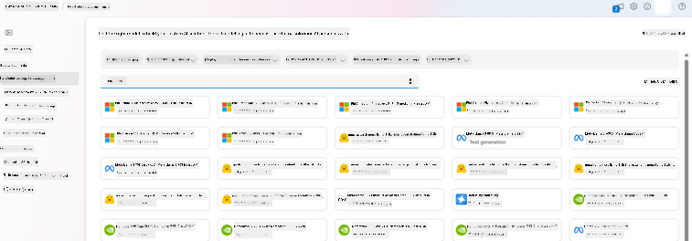
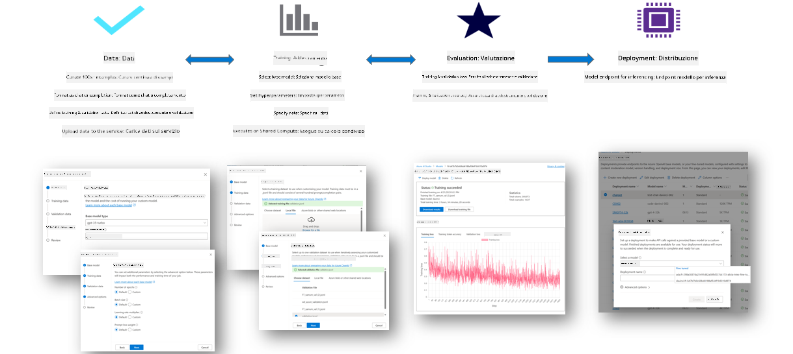
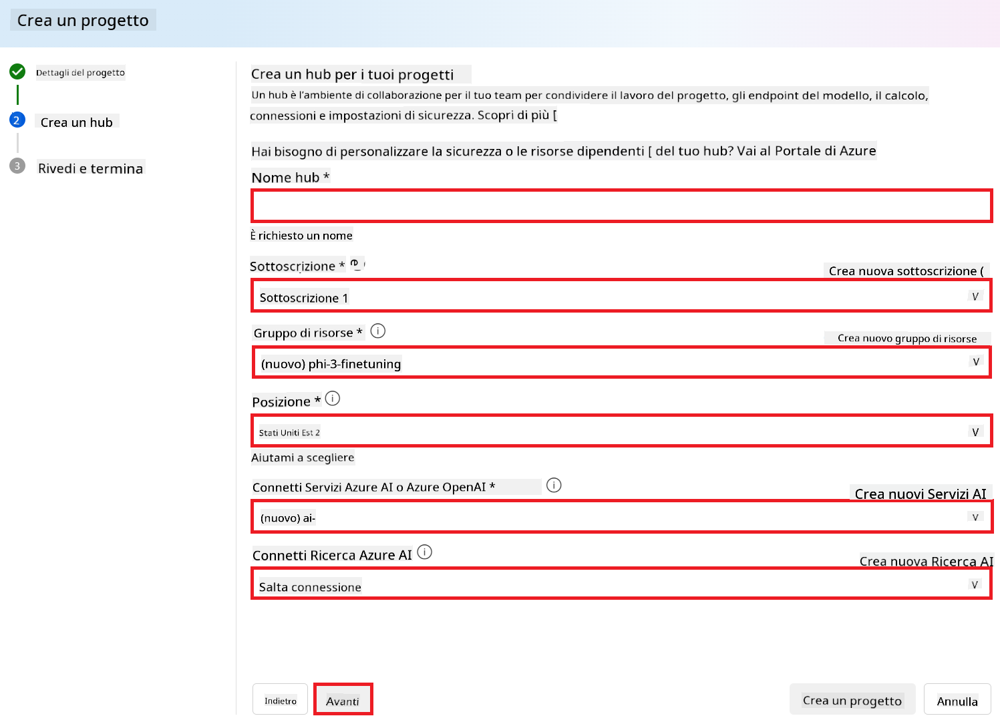
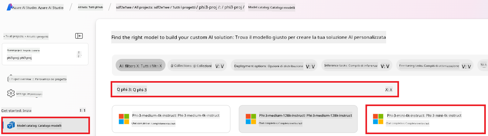
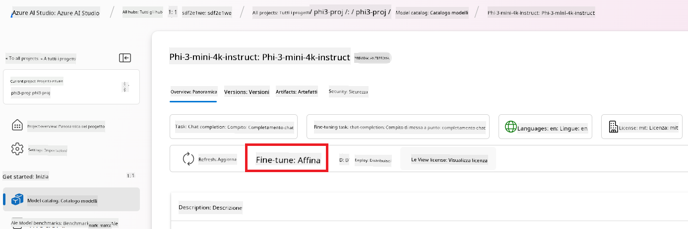
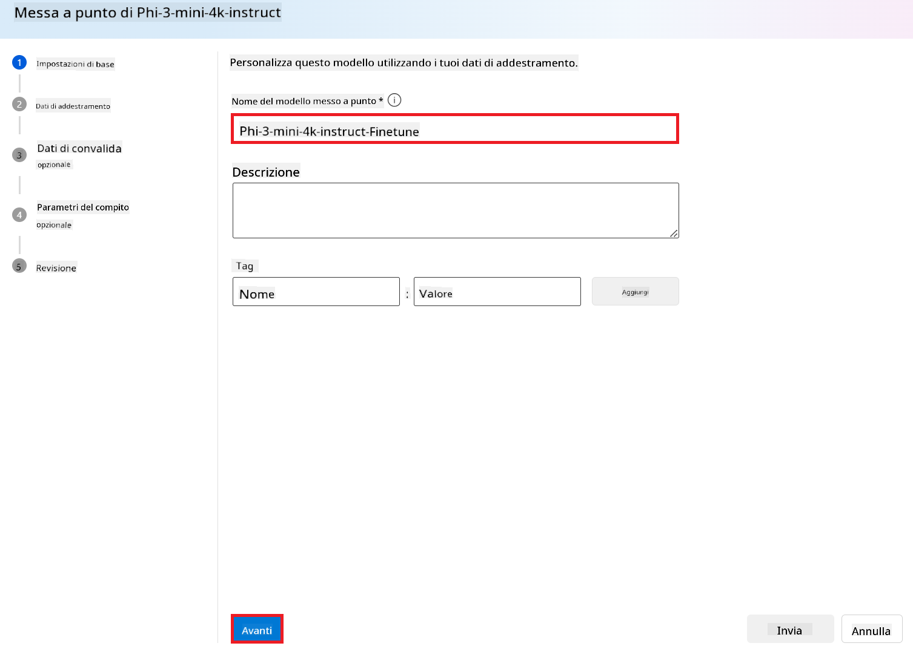
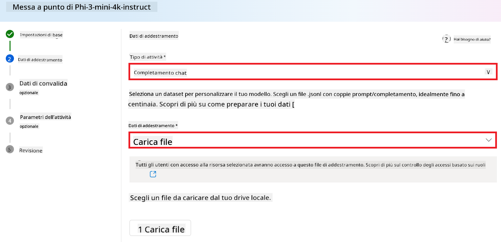
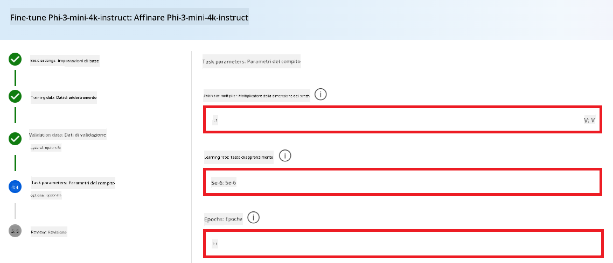
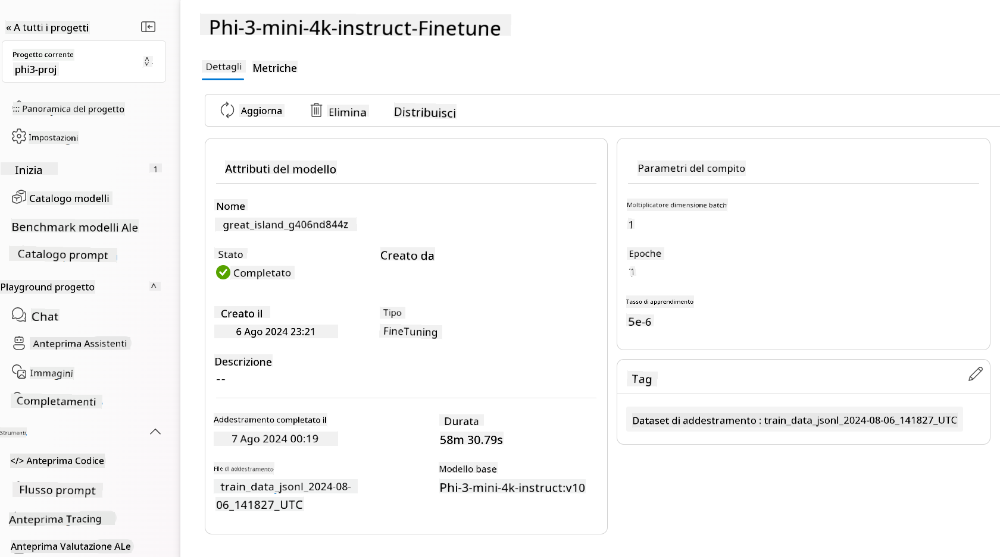

<!--
CO_OP_TRANSLATOR_METADATA:
{
  "original_hash": "c1559c5af6caccf6f623fd43a6b3a9a3",
  "translation_date": "2025-05-09T20:30:06+00:00",
  "source_file": "md/03.FineTuning/FineTuning_AIFoundry.md",
  "language_code": "it"
}
-->
# Fine-tuning Phi-3 con Azure AI Foundry

Exploremos cómo ajustar el modelo de lenguaje Phi-3 Mini de Microsoft utilizando Azure AI Foundry. El fine-tuning te permite adaptar Phi-3 Mini a tareas específicas, haciéndolo aún más potente y consciente del contexto.

## Consideraciones

- **Capacidades:** ¿Qué modelos se pueden ajustar? ¿Qué puede hacer el modelo base tras el fine-tuning?
- **Costo:** ¿Cuál es el modelo de precios para el fine-tuning?
- **Personalización:** ¿Cuánto puedo modificar el modelo base y de qué maneras?
- **Conveniencia:** ¿Cómo se realiza el fine-tuning? ¿Necesito escribir código personalizado? ¿Debo aportar mi propia capacidad de cómputo?
- **Seguridad:** Los modelos ajustados pueden presentar riesgos de seguridad. ¿Existen mecanismos para evitar daños no intencionados?



## Preparación para el fine-tuning

### Requisitos previos

> [!NOTE]
> Para los modelos de la familia Phi-3, la oferta de fine-tuning bajo el modelo pay-as-you-go solo está disponible para hubs creados en la región **East US 2**.

- Una suscripción de Azure. Si no tienes una, crea una [cuenta Azure de pago](https://azure.microsoft.com/pricing/purchase-options/pay-as-you-go) para comenzar.

- Un [proyecto AI Foundry](https://ai.azure.com?WT.mc_id=aiml-138114-kinfeylo).
- El control de acceso basado en roles de Azure (Azure RBAC) se usa para otorgar permisos en Azure AI Foundry. Para realizar los pasos de este artículo, tu cuenta debe tener asignado el __rol de Azure AI Developer__ en el grupo de recursos.

### Registro del proveedor de suscripción

Verifica que la suscripción esté registrada con el proveedor de recursos `Microsoft.Network`.

1. Inicia sesión en el [portal de Azure](https://portal.azure.com).
1. Selecciona **Subscriptions** en el menú lateral.
1. Selecciona la suscripción que quieres usar.
1. Selecciona **AI project settings** > **Resource providers** en el menú lateral.
1. Confirma que **Microsoft.Network** esté en la lista de proveedores de recursos. Si no, agrégalo.

### Preparación de datos

Prepara tus datos de entrenamiento y validación para ajustar tu modelo. Estos conjuntos deben contener ejemplos de entrada y salida que reflejen cómo quieres que el modelo funcione.

Asegúrate de que todos tus ejemplos de entrenamiento sigan el formato esperado para inferencia. Para un fine-tuning efectivo, utiliza un conjunto de datos equilibrado y diverso.

Esto implica mantener un balance de datos, incluir distintos escenarios y refinar periódicamente los datos de entrenamiento para alinearlos con expectativas reales, lo que conduce a respuestas más precisas y equilibradas.

Diferentes tipos de modelos requieren formatos distintos para los datos de entrenamiento.

### Chat Completion

Los datos de entrenamiento y validación que uses **deben** estar en formato JSON Lines (JSONL). Para `Phi-3-mini-128k-instruct`, el conjunto de datos para fine-tuning debe seguir el formato conversacional usado por la API de Chat completions.

### Ejemplo de formato de archivo

```json
    {"messages": [{"role": "system", "content": "You are an Xbox customer support agent whose primary goal is to help users with issues they are experiencing with their Xbox devices. You are friendly and concise. You only provide factual answers to queries, and do not provide answers that are not related to Xbox."}, {"role": "user", "content": "Is Xbox better than PlayStation?"}, {"role": "assistant", "content": "I apologize, but I cannot provide personal opinions. My primary job is to assist you with any issues related to your Xbox device. Do you have any Xbox-related issues that need addressing?"}]}
    {"messages": [{"role": "system", "content": "You are an Xbox customer support agent whose primary goal is to help users with issues they are experiencing with their Xbox devices. You are friendly and concise. You only provide factual answers to queries, and do not provide answers that are not related to Xbox."}, {"role": "user", "content": "Can I play PC games on my Xbox?"}, {"role": "assistant", "content": "While Xbox consoles don't natively support PC games, they can play an array of Xbox games, many of which are also available on PC. Can I assist you with finding games compatible with your Xbox device?"}]}
    {"messages": [{"role": "system", "content": "You are an Xbox customer support agent whose primary goal is to help users with issues they are experiencing with their Xbox devices. You are friendly and concise. You only provide factual answers to queries, and do not provide answers that are not related to Xbox."}, {"role": "user", "content": "I'm having trouble connecting my Xbox to the Wi-Fi."}, {"role": "assistant", "content": "No worries, let's go through the network settings on your Xbox. Can you please tell me what happens when you try to connect it to the Wi-Fi?"}]}
```

El tipo de archivo soportado es JSON Lines. Los archivos se suben al datastore predeterminado y quedan disponibles en tu proyecto.

## Fine-tuning de Phi-3 con Azure AI Foundry

Azure AI Foundry te permite personalizar modelos de lenguaje grandes con tus propios conjuntos de datos mediante un proceso conocido como fine-tuning. Este proceso aporta un gran valor al permitir la personalización y optimización para tareas y aplicaciones específicas. Esto se traduce en mejor rendimiento, eficiencia en costos, menor latencia y resultados adaptados.



### Crear un nuevo proyecto

1. Inicia sesión en [Azure AI Foundry](https://ai.azure.com).

1. Selecciona **+New project** para crear un proyecto nuevo en Azure AI Foundry.

    

1. Realiza las siguientes tareas:

    - Nombre del **Hub** del proyecto. Debe ser un valor único.
    - Selecciona el **Hub** a utilizar (crea uno nuevo si es necesario).

    

1. Para crear un nuevo hub, realiza lo siguiente:

    - Ingresa el **Nombre del Hub**. Debe ser único.
    - Selecciona tu **Suscripción** de Azure.
    - Selecciona el **Grupo de recursos** (crea uno nuevo si es necesario).
    - Selecciona la **Ubicación** que deseas usar.
    - Selecciona **Connect Azure AI Services** (crea uno nuevo si es necesario).
    - En **Connect Azure AI Search**, selecciona **Skip connecting**.

    

1. Selecciona **Next**.
1. Selecciona **Create a project**.

### Preparación de datos

Antes de hacer fine-tuning, reúne o crea un conjunto de datos relevante para tu tarea, como instrucciones de chat, pares de preguntas y respuestas, u otro texto pertinente. Limpia y preprocesa estos datos eliminando ruido, manejando valores faltantes y tokenizando el texto.

### Fine-tune de modelos Phi-3 en Azure AI Foundry

> [!NOTE]
> El fine-tuning de modelos Phi-3 actualmente solo está soportado en proyectos ubicados en East US 2.

1. Selecciona **Model catalog** en la pestaña lateral izquierda.

1. Escribe *phi-3* en la **barra de búsqueda** y selecciona el modelo phi-3 que desees usar.

    

1. Selecciona **Fine-tune**.

    

1. Ingresa el **Nombre del modelo fine-tuned**.

    

1. Selecciona **Next**.

1. Realiza lo siguiente:

    - Selecciona el **tipo de tarea** como **Chat completion**.
    - Selecciona los **datos de entrenamiento** que quieres usar. Puedes subirlos a través de Azure AI Foundry o desde tu entorno local.

    

1. Selecciona **Next**.

1. Sube los **datos de validación** que usarás o selecciona **Automatic split of training data**.

    

1. Selecciona **Next**.

1. Realiza lo siguiente:

    - Selecciona el **multiplicador de tamaño de batch** que deseas usar.
    - Selecciona la **tasa de aprendizaje** que quieres usar.
    - Selecciona la cantidad de **epochs** que deseas usar.

    

1. Selecciona **Submit** para iniciar el proceso de fine-tuning.

    

1. Una vez que el modelo esté fine-tuned, el estado aparecerá como **Completed**, como se muestra en la imagen. Ahora puedes desplegar el modelo y usarlo en tu aplicación, en el playground o en prompt flow. Para más información, consulta [Cómo desplegar la familia de modelos Phi-3 con Azure AI Foundry](https://learn.microsoft.com/azure/ai-studio/how-to/deploy-models-phi-3?tabs=phi-3-5&pivots=programming-language-python).

    

> [!NOTE]
> Para información más detallada sobre fine-tuning de Phi-3, visita [Fine-tune Phi-3 models in Azure AI Foundry](https://learn.microsoft.com/azure/ai-studio/how-to/fine-tune-phi-3?tabs=phi-3-mini).

## Limpieza de tus modelos fine-tuned

Puedes eliminar un modelo fine-tuned desde la lista de modelos fine-tuned en [Azure AI Foundry](https://ai.azure.com) o desde la página de detalles del modelo. Selecciona el modelo fine-tuned que quieres borrar en la página de Fine-tuning y luego haz clic en el botón Delete para eliminarlo.

> [!NOTE]
> No puedes eliminar un modelo personalizado si tiene un despliegue activo. Primero debes eliminar el despliegue antes de borrar el modelo personalizado.

## Costos y cuotas

### Consideraciones sobre costos y cuotas para modelos Phi-3 fine-tuned como servicio

Los modelos Phi fine-tuned como servicio son ofrecidos por Microsoft e integrados con Azure AI Foundry. Puedes consultar los precios al [desplegar](https://learn.microsoft.com/azure/ai-studio/how-to/deploy-models-phi-3?tabs=phi-3-5&pivots=programming-language-python) o ajustar los modelos en la pestaña de Precios y términos del asistente de despliegue.

## Filtrado de contenido

Los modelos desplegados como servicio bajo el modelo pay-as-you-go están protegidos por Azure AI Content Safety. Al desplegarlos en endpoints en tiempo real, puedes optar por desactivar esta función. Con Azure AI Content Safety activado, tanto el prompt como la respuesta pasan por un conjunto de modelos de clasificación que detectan y previenen la generación de contenido dañino. El sistema de filtrado detecta y actúa sobre categorías específicas de contenido potencialmente dañino en entradas y salidas. Aprende más sobre [Azure AI Content Safety](https://learn.microsoft.com/azure/ai-studio/concepts/content-filtering).

**Configuración del fine-tuning**

Hiparámetros: Define hiparámetros como tasa de aprendizaje, tamaño de batch y número de epochs.

**Función de pérdida**

Elige la función de pérdida adecuada para tu tarea (por ejemplo, cross-entropy).

**Optimizador**

Selecciona un optimizador (por ejemplo, Adam) para las actualizaciones durante el entrenamiento.

**Proceso de fine-tuning**

- Cargar modelo preentrenado: Carga el checkpoint de Phi-3 Mini.
- Añadir capas personalizadas: Agrega capas específicas para la tarea (por ejemplo, cabeza de clasificación para instrucciones de chat).

**Entrenar el modelo**

Ajusta el modelo con tu conjunto de datos preparado. Supervisa el progreso y ajusta los hiparámetros según sea necesario.

**Evaluación y validación**

Conjunto de validación: Divide tus datos en conjuntos de entrenamiento y validación.

**Evaluar desempeño**

Utiliza métricas como accuracy, F1-score o perplexity para evaluar el rendimiento.

## Guardar el modelo fine-tuned

**Checkpoint**

Guarda el checkpoint del modelo fine-tuned para uso futuro.

## Despliegue

- Despliega como servicio web: Despliega tu modelo fine-tuned como servicio web en Azure AI Foundry.
- Prueba el endpoint: Envía consultas de prueba al endpoint desplegado para verificar su funcionamiento.

## Iterar y mejorar

Itera: Si el rendimiento no es satisfactorio, ajusta hiparámetros, agrega más datos o aumenta los epochs.

## Monitorear y refinar

Monitorea continuamente el comportamiento del modelo y realiza ajustes según sea necesario.

## Personalizar y extender

Tareas personalizadas: Phi-3 Mini puede ajustarse para tareas más allá de instrucciones de chat. ¡Explora otros casos de uso!
Experimenta: Prueba diferentes arquitecturas, combinaciones de capas y técnicas para mejorar el rendimiento.

> [!NOTE]
> El fine-tuning es un proceso iterativo. ¡Experimenta, aprende y adapta tu modelo para lograr los mejores resultados en tu tarea específica!

**Disclaimer**:  
Questo documento è stato tradotto utilizzando il servizio di traduzione automatica AI [Co-op Translator](https://github.com/Azure/co-op-translator). Pur impegnandoci per garantire l’accuratezza, si prega di notare che le traduzioni automatiche possono contenere errori o inesattezze. Il documento originale nella sua lingua nativa deve essere considerato la fonte autorevole. Per informazioni critiche, si raccomanda la traduzione professionale umana. Non ci assumiamo alcuna responsabilità per eventuali malintesi o interpretazioni errate derivanti dall’uso di questa traduzione.