<!--
CO_OP_TRANSLATOR_METADATA:
{
  "original_hash": "c1559c5af6caccf6f623fd43a6b3a9a3",
  "translation_date": "2025-07-17T06:03:54+00:00",
  "source_file": "md/03.FineTuning/FineTuning_AIFoundry.md",
  "language_code": "it"
}
-->
# Fine-tuning di Phi-3 con Azure AI Foundry

Esploriamo come effettuare il fine-tuning del modello linguistico Phi-3 Mini di Microsoft utilizzando Azure AI Foundry. Il fine-tuning consente di adattare Phi-3 Mini a compiti specifici, rendendolo ancora più potente e consapevole del contesto.

## Considerazioni

- **Capacità:** Quali modelli possono essere sottoposti a fine-tuning? Cosa può fare il modello base dopo il fine-tuning?
- **Costo:** Qual è il modello di prezzo per il fine-tuning?
- **Personalizzazione:** Quanto posso modificare il modello base – e in che modo?
- **Comodità:** Come avviene concretamente il fine-tuning – devo scrivere codice personalizzato? Devo fornire la mia potenza di calcolo?
- **Sicurezza:** I modelli fine-tuned possono presentare rischi di sicurezza – ci sono delle protezioni per evitare danni involontari?

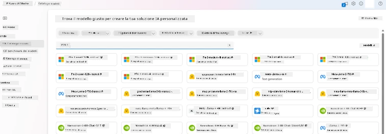

## Preparazione al fine-tuning

### Prerequisiti

> [!NOTE]
> Per i modelli della famiglia Phi-3, l’offerta di fine-tuning pay-as-you-go è disponibile solo con hub creati nelle regioni **East US 2**.

- Un abbonamento Azure. Se non ne hai uno, crea un [account Azure a pagamento](https://azure.microsoft.com/pricing/purchase-options/pay-as-you-go) per iniziare.

- Un [progetto AI Foundry](https://ai.azure.com?WT.mc_id=aiml-138114-kinfeylo).
- I controlli di accesso basati sui ruoli di Azure (Azure RBAC) sono utilizzati per concedere l’accesso alle operazioni in Azure AI Foundry. Per eseguire i passaggi di questo articolo, il tuo account utente deve avere il __ruolo Azure AI Developer__ sul gruppo di risorse.

### Registrazione del provider di sottoscrizione

Verifica che la sottoscrizione sia registrata al provider di risorse `Microsoft.Network`.

1. Accedi al [portale Azure](https://portal.azure.com).
1. Seleziona **Sottoscrizioni** dal menu a sinistra.
1. Seleziona la sottoscrizione che vuoi usare.
1. Seleziona **Impostazioni progetto AI** > **Provider di risorse** dal menu a sinistra.
1. Conferma che **Microsoft.Network** sia presente nella lista dei provider di risorse. In caso contrario, aggiungilo.

### Preparazione dei dati

Prepara i dati di addestramento e di validazione per il fine-tuning del modello. I tuoi set di dati di addestramento e validazione devono contenere esempi di input e output che rappresentano come desideri che il modello si comporti.

Assicurati che tutti gli esempi di addestramento seguano il formato previsto per l’inferenza. Per un fine-tuning efficace, garantisci un dataset bilanciato e vario.

Questo implica mantenere un equilibrio nei dati, includere diversi scenari e affinare periodicamente i dati di addestramento per allinearsi alle aspettative del mondo reale, portando a risposte del modello più accurate ed equilibrate.

Tipi diversi di modelli richiedono formati differenti per i dati di addestramento.

### Chat Completion

I dati di addestramento e validazione che usi **devono** essere formattati come un documento JSON Lines (JSONL). Per `Phi-3-mini-128k-instruct` il dataset per il fine-tuning deve essere formattato nel formato conversazionale usato dall’API Chat completions.

### Esempio di formato file

```json
    {"messages": [{"role": "system", "content": "You are an Xbox customer support agent whose primary goal is to help users with issues they are experiencing with their Xbox devices. You are friendly and concise. You only provide factual answers to queries, and do not provide answers that are not related to Xbox."}, {"role": "user", "content": "Is Xbox better than PlayStation?"}, {"role": "assistant", "content": "I apologize, but I cannot provide personal opinions. My primary job is to assist you with any issues related to your Xbox device. Do you have any Xbox-related issues that need addressing?"}]}
    {"messages": [{"role": "system", "content": "You are an Xbox customer support agent whose primary goal is to help users with issues they are experiencing with their Xbox devices. You are friendly and concise. You only provide factual answers to queries, and do not provide answers that are not related to Xbox."}, {"role": "user", "content": "Can I play PC games on my Xbox?"}, {"role": "assistant", "content": "While Xbox consoles don't natively support PC games, they can play an array of Xbox games, many of which are also available on PC. Can I assist you with finding games compatible with your Xbox device?"}]}
    {"messages": [{"role": "system", "content": "You are an Xbox customer support agent whose primary goal is to help users with issues they are experiencing with their Xbox devices. You are friendly and concise. You only provide factual answers to queries, and do not provide answers that are not related to Xbox."}, {"role": "user", "content": "I'm having trouble connecting my Xbox to the Wi-Fi."}, {"role": "assistant", "content": "No worries, let's go through the network settings on your Xbox. Can you please tell me what happens when you try to connect it to the Wi-Fi?"}]}
```

Il tipo di file supportato è JSON Lines. I file vengono caricati nel datastore predefinito e resi disponibili nel tuo progetto.

## Fine-tuning di Phi-3 con Azure AI Foundry

Azure AI Foundry ti permette di personalizzare i modelli linguistici di grandi dimensioni sui tuoi dataset personali tramite un processo chiamato fine-tuning. Il fine-tuning offre un valore significativo permettendo la personalizzazione e l’ottimizzazione per compiti e applicazioni specifiche. Questo porta a prestazioni migliorate, efficienza nei costi, riduzione della latenza e output su misura.

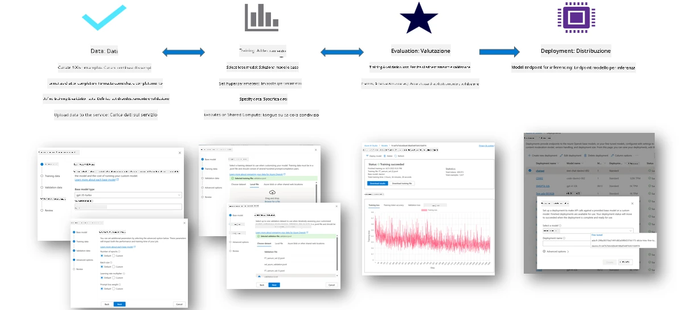

### Creare un nuovo progetto

1. Accedi a [Azure AI Foundry](https://ai.azure.com).

1. Seleziona **+New project** per creare un nuovo progetto in Azure AI Foundry.

    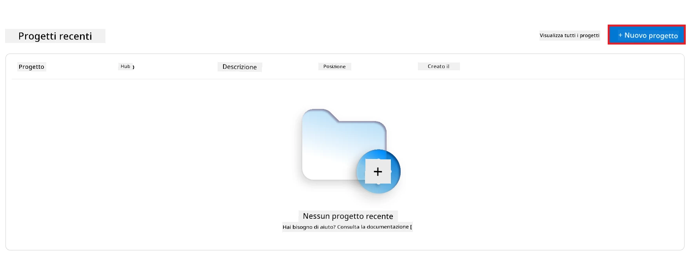

1. Esegui le seguenti operazioni:

    - Nome **Hub** del progetto. Deve essere un valore univoco.
    - Seleziona l’**Hub** da usare (creane uno nuovo se necessario).

    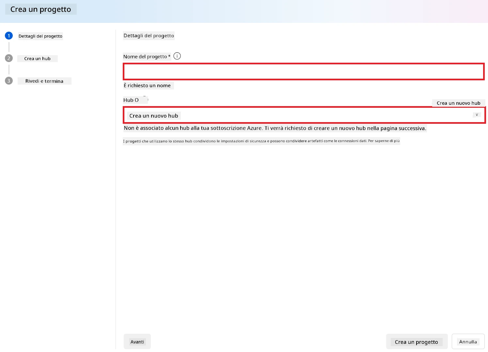

1. Esegui le seguenti operazioni per creare un nuovo hub:

    - Inserisci il **Nome Hub**. Deve essere un valore univoco.
    - Seleziona la tua **Sottoscrizione** Azure.
    - Seleziona il **Gruppo di risorse** da usare (creane uno nuovo se necessario).
    - Seleziona la **Posizione** che desideri utilizzare.
    - Seleziona i **Servizi Azure AI da connettere** (creane uno nuovo se necessario).
    - Seleziona **Connetti Azure AI Search** su **Salta connessione**.

    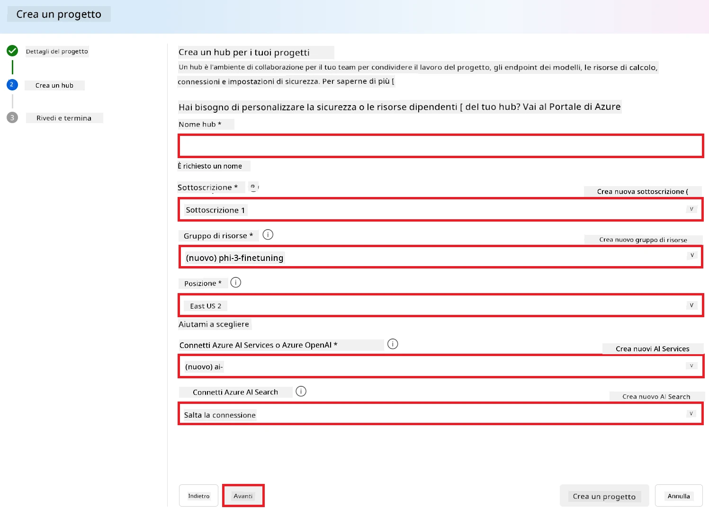

1. Seleziona **Avanti**.
1. Seleziona **Crea un progetto**.

### Preparazione dei dati

Prima del fine-tuning, raccogli o crea un dataset rilevante per il tuo compito, come istruzioni di chat, coppie domanda-risposta o altri dati testuali pertinenti. Pulisci e pre-elabora questi dati rimuovendo rumore, gestendo valori mancanti e tokenizzando il testo.

### Fine-tuning dei modelli Phi-3 in Azure AI Foundry

> [!NOTE]
> Il fine-tuning dei modelli Phi-3 è attualmente supportato solo in progetti localizzati in East US 2.

1. Seleziona **Catalogo modelli** dalla scheda laterale sinistra.

1. Digita *phi-3* nella **barra di ricerca** e seleziona il modello phi-3 che desideri utilizzare.

    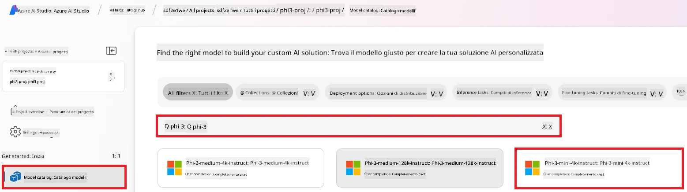

1. Seleziona **Fine-tune**.

    

1. Inserisci il **Nome del modello fine-tuned**.

    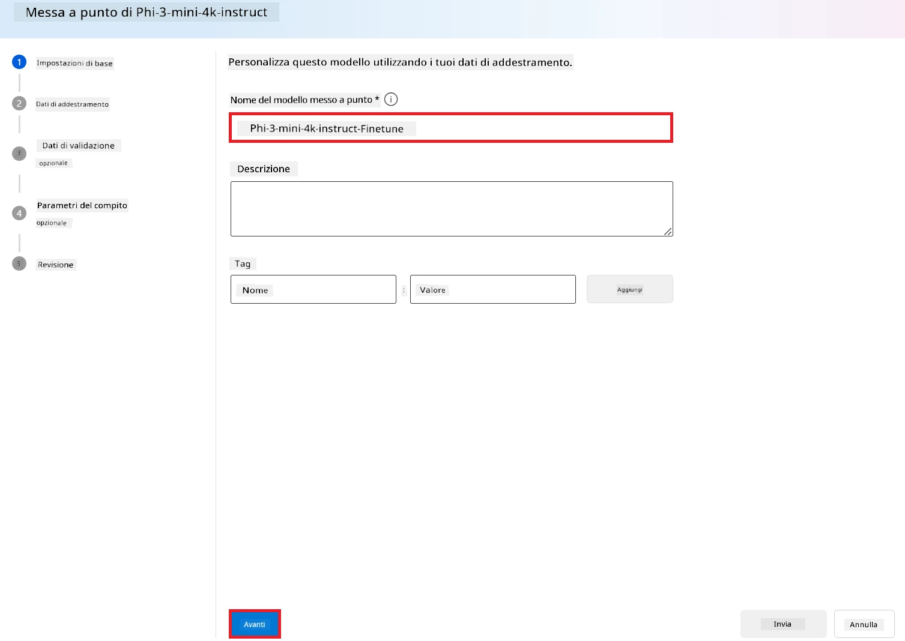

1. Seleziona **Avanti**.

1. Esegui le seguenti operazioni:

    - Seleziona il **tipo di attività** su **Chat completion**.
    - Seleziona i **dati di addestramento** che vuoi usare. Puoi caricarli tramite i dati di Azure AI Foundry o dal tuo ambiente locale.

    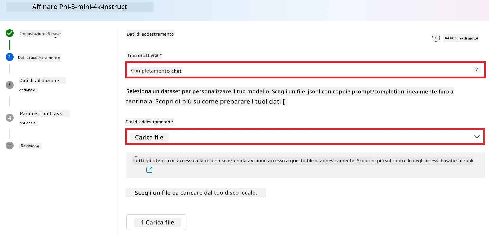

1. Seleziona **Avanti**.

1. Carica i **dati di validazione** che vuoi usare oppure seleziona **Divisione automatica dei dati di addestramento**.

    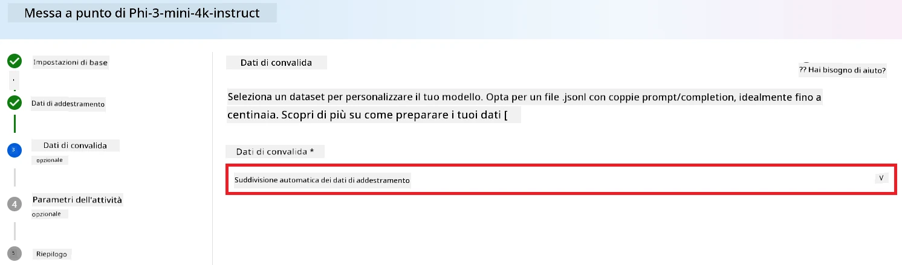

1. Seleziona **Avanti**.

1. Esegui le seguenti operazioni:

    - Seleziona il **moltiplicatore della dimensione batch** che vuoi usare.
    - Seleziona il **tasso di apprendimento** che vuoi usare.
    - Seleziona il numero di **epoche** che vuoi usare.

    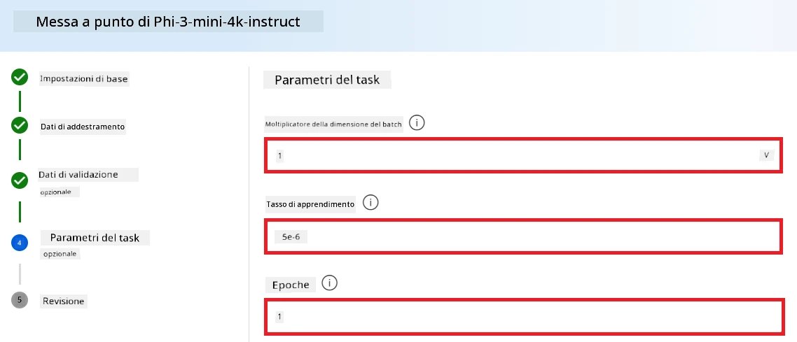

1. Seleziona **Invia** per avviare il processo di fine-tuning.

    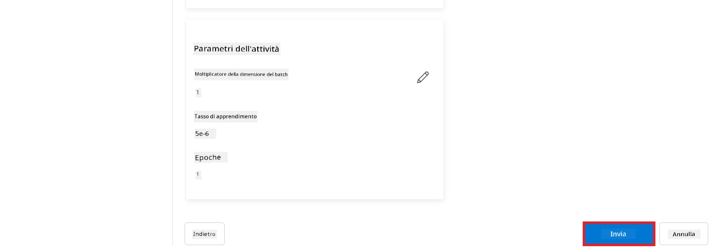

1. Una volta che il modello è stato fine-tuned, lo stato sarà visualizzato come **Completato**, come mostrato nell’immagine qui sotto. Ora puoi distribuire il modello e usarlo nella tua applicazione, nel playground o in prompt flow. Per maggiori informazioni, consulta [Come distribuire la famiglia di modelli linguistici piccoli Phi-3 con Azure AI Foundry](https://learn.microsoft.com/azure/ai-studio/how-to/deploy-models-phi-3?tabs=phi-3-5&pivots=programming-language-python).

    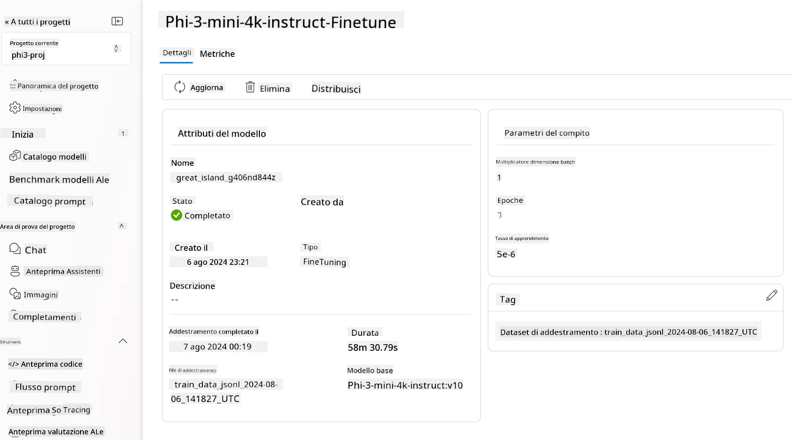

> [!NOTE]
> Per informazioni più dettagliate sul fine-tuning di Phi-3, visita [Fine-tune Phi-3 models in Azure AI Foundry](https://learn.microsoft.com/azure/ai-studio/how-to/fine-tune-phi-3?tabs=phi-3-mini).

## Pulizia dei modelli fine-tuned

Puoi eliminare un modello fine-tuned dalla lista dei modelli di fine-tuning in [Azure AI Foundry](https://ai.azure.com) o dalla pagina dei dettagli del modello. Seleziona il modello fine-tuned da eliminare nella pagina Fine-tuning, quindi seleziona il pulsante Elimina per rimuoverlo.

> [!NOTE]
> Non puoi eliminare un modello personalizzato se ha una distribuzione esistente. Devi prima eliminare la distribuzione del modello prima di poter eliminare il modello personalizzato.

## Costi e quote

### Considerazioni su costi e quote per i modelli Phi-3 fine-tuned come servizio

I modelli Phi fine-tuned come servizio sono offerti da Microsoft e integrati con Azure AI Foundry per l’uso. Puoi trovare i prezzi durante la [distribuzione](https://learn.microsoft.com/azure/ai-studio/how-to/deploy-models-phi-3?tabs=phi-3-5&pivots=programming-language-python) o il fine-tuning dei modelli nella scheda Prezzi e termini della procedura guidata di distribuzione.

## Filtraggio dei contenuti

I modelli distribuiti come servizio con pay-as-you-go sono protetti da Azure AI Content Safety. Quando distribuiti su endpoint in tempo reale, puoi scegliere di disabilitare questa funzionalità. Con Azure AI Content Safety abilitato, sia il prompt che la risposta passano attraverso un insieme di modelli di classificazione progettati per rilevare e prevenire l’output di contenuti dannosi. Il sistema di filtraggio dei contenuti rileva e agisce su categorie specifiche di contenuti potenzialmente dannosi sia nei prompt di input che nelle risposte generate. Scopri di più su [Azure AI Content Safety](https://learn.microsoft.com/azure/ai-studio/concepts/content-filtering).

**Configurazione del Fine-Tuning**

Iperparametri: Definisci iperparametri come tasso di apprendimento, dimensione batch e numero di epoche di addestramento.

**Funzione di perdita**

Scegli una funzione di perdita appropriata per il tuo compito (es. cross-entropy).

**Ottimizzatore**

Seleziona un ottimizzatore (es. Adam) per l’aggiornamento dei gradienti durante l’addestramento.

**Processo di Fine-Tuning**

- Carica modello pre-addestrato: carica il checkpoint di Phi-3 Mini.
- Aggiungi layer personalizzati: aggiungi layer specifici per il compito (es. testa di classificazione per istruzioni di chat).

**Addestra il modello**  
Fine-tuning del modello usando il dataset preparato. Monitora il progresso dell’addestramento e regola gli iperparametri se necessario.

**Valutazione e validazione**

Set di validazione: dividi i dati in set di addestramento e validazione.

**Valuta le prestazioni**

Usa metriche come accuratezza, F1-score o perplexity per valutare le prestazioni del modello.

## Salva il modello fine-tuned

**Checkpoint**  
Salva il checkpoint del modello fine-tuned per usi futuri.

## Distribuzione

- Distribuisci come servizio web: distribuisci il modello fine-tuned come servizio web in Azure AI Foundry.
- Testa l’endpoint: invia query di prova all’endpoint distribuito per verificarne il funzionamento.

## Itera e migliora

Itera: se le prestazioni non sono soddisfacenti, ripeti il processo modificando iperparametri, aggiungendo dati o effettuando fine-tuning per ulteriori epoche.

## Monitora e affina

Monitora continuamente il comportamento del modello e affinalo secondo necessità.

## Personalizza ed estendi

Compiti personalizzati: Phi-3 Mini può essere fine-tuned per vari compiti oltre alle istruzioni di chat. Esplora altri casi d’uso!  
Sperimenta: prova diverse architetture, combinazioni di layer e tecniche per migliorare le prestazioni.

> [!NOTE]
> Il fine-tuning è un processo iterativo. Sperimenta, impara e adatta il tuo modello per ottenere i migliori risultati per il tuo compito specifico!

**Disclaimer**:  
Questo documento è stato tradotto utilizzando il servizio di traduzione automatica [Co-op Translator](https://github.com/Azure/co-op-translator). Pur impegnandoci per garantire accuratezza, si prega di notare che le traduzioni automatiche possono contenere errori o imprecisioni. Il documento originale nella sua lingua nativa deve essere considerato la fonte autorevole. Per informazioni critiche, si raccomanda una traduzione professionale effettuata da un umano. Non ci assumiamo alcuna responsabilità per eventuali malintesi o interpretazioni errate derivanti dall’uso di questa traduzione.