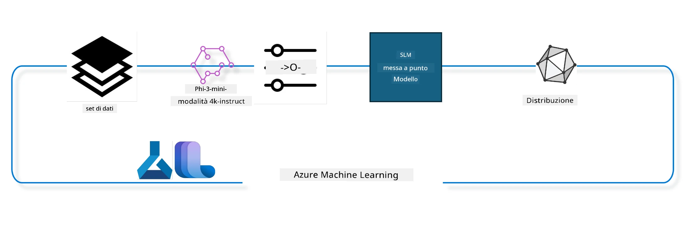

## Come utilizzare i componenti di chat-completion dal registro di sistema Azure ML per il fine tuning di un modello

In questo esempio eseguiremo il fine tuning del modello Phi-3-mini-4k-instruct per completare una conversazione tra 2 persone utilizzando il dataset ultrachat_200k.



L'esempio ti mostrerà come effettuare il fine tuning utilizzando l'Azure ML SDK e Python e quindi distribuire il modello fine tuned in un endpoint online per inferenze in tempo reale.

### Dati di addestramento

Utilizzeremo il dataset ultrachat_200k. Questa è una versione fortemente filtrata del dataset UltraChat ed è stata utilizzata per addestrare Zephyr-7B-β, un modello chat all'avanguardia da 7 miliardi di parametri.

### Modello

Utilizzeremo il modello Phi-3-mini-4k-instruct per mostrare come l'utente possa effettuare il fine tuning di un modello per il task di chat-completion. Se hai aperto questo notebook da una specifica scheda modello, ricorda di sostituire il nome specifico del modello.

### Task

- Scegliere un modello da fine tunare.
- Scegliere ed esplorare i dati di addestramento.
- Configurare il job di fine tuning.
- Eseguire il job di fine tuning.
- Rivedere le metriche di addestramento e valutazione.
- Registrare il modello fine tuned.
- Distribuire il modello fine tuned per inferenze in tempo reale.
- Pulire le risorse.

## 1. Configurare i prerequisiti

- Installare le dipendenze
- Connettersi a AzureML Workspace. Scopri di più su come configurare l'autenticazione SDK. Sostituisci <WORKSPACE_NAME>, <RESOURCE_GROUP> e <SUBSCRIPTION_ID> di seguito.
- Connettersi al registro di sistema azureml
- Impostare un nome opzionale per l'esperimento
- Controllare o creare il compute.

> [!NOTE]
> È richiesto un singolo nodo GPU che può avere multiple schede GPU. Ad esempio, in un nodo Standard_NC24rs_v3 ci sono 4 GPU NVIDIA V100 mentre in Standard_NC12s_v3 ci sono 2 GPU NVIDIA V100. Consulta la documentazione per queste informazioni. Il numero di schede GPU per nodo è impostato nel parametro gpus_per_node di seguito. Impostare questo valore correttamente garantirà l'utilizzo di tutte le GPU nel nodo. Le SKU compute GPU consigliate si trovano qui e qui.

### Librerie Python

Installa le dipendenze eseguendo la cella sottostante. Questo non è un passaggio opzionale se si esegue in un nuovo ambiente.

```bash
pip install azure-ai-ml
pip install azure-identity
pip install datasets==2.9.0
pip install mlflow
pip install azureml-mlflow
```

### Interazione con Azure ML

1. Questo script Python è usato per interagire con il servizio Azure Machine Learning (Azure ML). Ecco una descrizione di cosa fa:

    - Importa i moduli necessari dai pacchetti azure.ai.ml, azure.identity e azure.ai.ml.entities. Importa anche il modulo time.

    - Tenta di autenticarsi usando DefaultAzureCredential(), che offre un'esperienza di autenticazione semplificata per iniziare rapidamente a sviluppare applicazioni eseguite nel cloud Azure. In caso di fallimento, ricade su InteractiveBrowserCredential(), che fornisce una richiesta di login interattiva.

    - Quindi tenta di creare un'istanza MLClient usando il metodo from_config, che legge la configurazione dal file di configurazione predefinito (config.json). In caso di fallimento, crea un'istanza MLClient fornendo manualmente subscription_id, resource_group_name e workspace_name.

    - Crea un'altra istanza MLClient, questa volta per il registro Azure ML chiamato "azureml". Questo registro è dove vengono memorizzati modelli, pipeline di fine tuning e ambienti.

    - Imposta experiment_name su "chat_completion_Phi-3-mini-4k-instruct".

    - Genera un timestamp univoco convertendo il tempo corrente (in secondi dall'epoch, come numero in virgola mobile) in intero e poi in stringa. Questo timestamp può essere usato per creare nomi e versioni uniche.

    ```python
    # Importa i moduli necessari da Azure ML e Azure Identity
    from azure.ai.ml import MLClient
    from azure.identity import (
        DefaultAzureCredential,
        InteractiveBrowserCredential,
    )
    from azure.ai.ml.entities import AmlCompute
    import time  # Importa il modulo time
    
    # Prova ad autenticarti usando DefaultAzureCredential
    try:
        credential = DefaultAzureCredential()
        credential.get_token("https://management.azure.com/.default")
    except Exception as ex:  # Se DefaultAzureCredential fallisce, usa InteractiveBrowserCredential
        credential = InteractiveBrowserCredential()
    
    # Prova a creare un'istanza di MLClient usando il file di configurazione predefinito
    try:
        workspace_ml_client = MLClient.from_config(credential=credential)
    except:  # Se ciò fallisce, crea un'istanza di MLClient fornendo manualmente i dettagli
        workspace_ml_client = MLClient(
            credential,
            subscription_id="<SUBSCRIPTION_ID>",
            resource_group_name="<RESOURCE_GROUP>",
            workspace_name="<WORKSPACE_NAME>",
        )
    
    # Crea un'altra istanza di MLClient per il registro Azure ML chiamato "azureml"
    # Questo registro è dove vengono memorizzati modelli, pipeline di fine-tuning e ambienti
    registry_ml_client = MLClient(credential, registry_name="azureml")
    
    # Imposta il nome dell'esperimento
    experiment_name = "chat_completion_Phi-3-mini-4k-instruct"
    
    # Genera un timestamp unico che può essere usato per nomi e versioni che devono essere unici
    timestamp = str(int(time.time()))
    ```

## 2. Scegli un modello di base da fine tunare

1. Phi-3-mini-4k-instruct è un modello leggero all'avanguardia con 3,8 miliardi di parametri, costruito su dataset usati per Phi-2. Il modello appartiene alla famiglia di modelli Phi-3, e la versione Mini è disponibile in due varianti 4K e 128K, che rappresentano la lunghezza del contesto (in token) che può supportare; dobbiamo fine tunare il modello per il nostro scopo specifico per poterlo utilizzare. Puoi sfogliare questi modelli nel Catalogo Modelli in AzureML Studio, filtrando per il task di chat-completion. In questo esempio usiamo il modello Phi-3-mini-4k-instruct. Se hai aperto questo notebook per un modello differente, sostituisci di conseguenza il nome del modello e la versione.

> [!NOTE]
> la proprietà id del modello. Questa verrà passata come input al job di fine tuning. È disponibile anche come campo Asset ID nella pagina dettagli modello nel Catalogo Modelli di AzureML Studio.

2. Questo script Python interagisce con il servizio Azure Machine Learning (Azure ML). Ecco cosa fa:

    - Imposta model_name a "Phi-3-mini-4k-instruct".

    - Usa il metodo get della proprietà models dell'oggetto registry_ml_client per recuperare l'ultima versione del modello con il nome specificato dal registro Azure ML. Il metodo get viene chiamato con due argomenti: il nome del modello e un'etichetta che specifica che deve essere recuperata l'ultima versione del modello.

    - Stampa un messaggio sulla console indicando nome, versione e id del modello che sarà utilizzato per il fine tuning. Il metodo format della stringa è usato per inserire nome, versione e id del modello nel messaggio. Questi dati sono accessibili come proprietà dell'oggetto foundation_model.

    ```python
    # Imposta il nome del modello
    model_name = "Phi-3-mini-4k-instruct"
    
    # Ottieni l'ultima versione del modello dal registro Azure ML
    foundation_model = registry_ml_client.models.get(model_name, label="latest")
    
    # Stampa il nome, la versione e l'id del modello
    # Queste informazioni sono utili per il tracciamento e il debug
    print(
        "\n\nUsing model name: {0}, version: {1}, id: {2} for fine tuning".format(
            foundation_model.name, foundation_model.version, foundation_model.id
        )
    )
    ```

## 3. Crea un compute da usare con il job

Il job di fine tuning funziona SOLAMENTE con compute GPU. La dimensione del compute dipende da quanto è grande il modello e nella maggior parte dei casi diventa complicato identificare il compute giusto per il job. In questa cella guidiamo l'utente nella selezione del compute giusto per il job.

> [!NOTE]
> I compute elencati di seguito operano con la configurazione più ottimizzata. Qualsiasi modifica alla configurazione potrebbe causare errori di tipo Cuda Out Of Memory. In tali casi, prova a passare a un compute di dimensione superiore.

> [!NOTE]
> Quando selezioni compute_cluster_size di seguito, assicurati che il compute sia disponibile nel tuo gruppo di risorse. Se un compute particolare non è disponibile puoi fare richiesta per ottenere accesso alle risorse compute.

### Verifica del Modello per il Supporto al Fine Tuning

1. Questo script Python interagisce con un modello Azure Machine Learning (Azure ML). Ecco cosa fa:

    - Importa il modulo ast, che fornisce funzioni per processare alberi della grammatica sintattica astratta Python.

    - Verifica se l'oggetto foundation_model (che rappresenta un modello in Azure ML) ha un tag chiamato finetune_compute_allow_list. I tag in Azure ML sono coppie chiave-valore che puoi creare e usare per filtrare e ordinare i modelli.

    - Se il tag finetune_compute_allow_list è presente, usa la funzione ast.literal_eval per analizzare in modo sicuro il valore del tag (una stringa) in una lista Python. Questa lista viene assegnata alla variabile computes_allow_list. Viene stampato un messaggio che indica di creare un compute dalla lista.

    - Se il tag finetune_compute_allow_list non è presente, imposta computes_allow_list a None e stampa un messaggio che indica che il tag non è presente tra i tag del modello.

    - In sintesi, questo script verifica un tag specifico nei metadati del modello, converte il valore del tag in una lista se esiste, e fornisce feedback all'utente di conseguenza.

    ```python
    # Importa il modulo ast, che fornisce funzioni per elaborare alberi della grammatica della sintassi astratta di Python
    import ast
    
    # Controlla se il tag 'finetune_compute_allow_list' è presente nei tag del modello
    if "finetune_compute_allow_list" in foundation_model.tags:
        # Se il tag è presente, usa ast.literal_eval per analizzare in modo sicuro il valore del tag (una stringa) in una lista Python
        computes_allow_list = ast.literal_eval(
            foundation_model.tags["finetune_compute_allow_list"]
        )  # converti la stringa in una lista Python
        # Stampa un messaggio che indica che un compute dovrebbe essere creato dalla lista
        print(f"Please create a compute from the above list - {computes_allow_list}")
    else:
        # Se il tag non è presente, imposta computes_allow_list su None
        computes_allow_list = None
        # Stampa un messaggio che indica che il tag 'finetune_compute_allow_list' non fa parte dei tag del modello
        print("`finetune_compute_allow_list` is not part of model tags")
    ```

### Controllo Compute Instance

1. Questo script Python interagisce con il servizio Azure Machine Learning (Azure ML) ed esegue diversi controlli su un'istanza compute. Ecco cosa fa:

    - Prova a recuperare l'istanza compute con il nome memorizzato in compute_cluster dall'Azure ML workspace. Se lo stato di provisioning dell'istanza compute è "failed", genera un ValueError.

    - Controlla se computes_allow_list non è None. Se non è None, converte tutte le dimensioni compute nella lista in minuscolo e verifica se la dimensione dell'istanza compute corrente è nella lista. Se non lo è, genera un ValueError.

    - Se computes_allow_list è None, controlla se la dimensione dell'istanza compute è in una lista di dimensioni VM GPU non supportate. Se lo è, genera un ValueError.

    - Recupera la lista di tutte le dimensioni compute disponibili nel workspace. Poi itera su questa lista e per ogni dimensione compute controlla se il nome corrisponde alla dimensione dell'istanza corrente. Se sì, recupera il numero di GPU per quella dimensione compute e imposta gpu_count_found a True.

    - Se gpu_count_found è True, stampa il numero di GPU nell'istanza compute. Se è False, genera un ValueError.

    - In sintesi, questo script esegue diversi controlli su un'istanza compute in un workspace Azure ML, incluso verificare lo stato di provisioning, la dimensione rispetto a una allow list o deny list, e il numero di GPU presenti.
    
    ```python
    # Stampa il messaggio dell'eccezione
    print(e)
    # Solleva un ValueError se la dimensione di calcolo non è disponibile nel workspace
    raise ValueError(
        f"WARNING! Compute size {compute_cluster_size} not available in workspace"
    )
    
    # Recupera l'istanza di calcolo dal workspace Azure ML
    compute = workspace_ml_client.compute.get(compute_cluster)
    # Controlla se lo stato di provisioning dell'istanza di calcolo è "failed"
    if compute.provisioning_state.lower() == "failed":
        # Solleva un ValueError se lo stato di provisioning è "failed"
        raise ValueError(
            f"Provisioning failed, Compute '{compute_cluster}' is in failed state. "
            f"please try creating a different compute"
        )
    
    # Controlla se computes_allow_list non è None
    if computes_allow_list is not None:
        # Converte tutte le dimensioni di calcolo in computes_allow_list in minuscolo
        computes_allow_list_lower_case = [x.lower() for x in computes_allow_list]
        # Controlla se la dimensione dell'istanza di calcolo è in computes_allow_list_lower_case
        if compute.size.lower() not in computes_allow_list_lower_case:
            # Solleva un ValueError se la dimensione dell'istanza di calcolo non è in computes_allow_list_lower_case
            raise ValueError(
                f"VM size {compute.size} is not in the allow-listed computes for finetuning"
            )
    else:
        # Definisci una lista di dimensioni VM GPU non supportate
        unsupported_gpu_vm_list = [
            "standard_nc6",
            "standard_nc12",
            "standard_nc24",
            "standard_nc24r",
        ]
        # Controlla se la dimensione dell'istanza di calcolo è in unsupported_gpu_vm_list
        if compute.size.lower() in unsupported_gpu_vm_list:
            # Solleva un ValueError se la dimensione dell'istanza di calcolo è in unsupported_gpu_vm_list
            raise ValueError(
                f"VM size {compute.size} is currently not supported for finetuning"
            )
    
    # Inizializza un flag per verificare se il numero di GPU nell'istanza di calcolo è stato trovato
    gpu_count_found = False
    # Recupera una lista di tutte le dimensioni di calcolo disponibili nel workspace
    workspace_compute_sku_list = workspace_ml_client.compute.list_sizes()
    available_sku_sizes = []
    # Itera sulla lista delle dimensioni di calcolo disponibili
    for compute_sku in workspace_compute_sku_list:
        available_sku_sizes.append(compute_sku.name)
        # Controlla se il nome della dimensione di calcolo corrisponde alla dimensione dell'istanza di calcolo
        if compute_sku.name.lower() == compute.size.lower():
            # Se sì, recupera il numero di GPU per quella dimensione di calcolo e imposta gpu_count_found su True
            gpus_per_node = compute_sku.gpus
            gpu_count_found = True
    # Se gpu_count_found è True, stampa il numero di GPU nell'istanza di calcolo
    if gpu_count_found:
        print(f"Number of GPU's in compute {compute.size}: {gpus_per_node}")
    else:
        # Se gpu_count_found è False, solleva un ValueError
        raise ValueError(
            f"Number of GPU's in compute {compute.size} not found. Available skus are: {available_sku_sizes}."
            f"This should not happen. Please check the selected compute cluster: {compute_cluster} and try again."
        )
    ```

## 4. Scegli il dataset per il fine tuning del modello

1. Usiamo il dataset ultrachat_200k. Il dataset ha quattro split, adatti per il Supervised fine-tuning (sft).
Generation ranking (gen). Il numero di esempi per split è mostrato come segue:

    ```bash
    train_sft test_sft  train_gen  test_gen
    207865  23110  256032  28304
    ```

1. Le celle successive mostrano la preparazione base dei dati per il fine tuning:

### Visualizzare alcune righe di dati

Vogliamo che questo esempio venga eseguito rapidamente, quindi salviamo i file train_sft, test_sft contenenti il 5% delle righe già filtrate. Ciò significa che il modello fine tuned avrà una precisione inferiore, quindi non dovrebbe essere usato in applicazioni reali.
Lo script download-dataset.py viene usato per scaricare il dataset ultrachat_200k e trasformare il dataset in un formato consumabile dal componente pipeline di fine tuning. Poiché il dataset è grande, qui abbiamo solo una parte del dataset.

1. Eseguendo lo script sottostante si scarica solo il 5% dei dati. Questo valore può essere aumentato modificando il parametro dataset_split_pc alla percentuale desiderata.

> [!NOTE]
> Alcuni modelli linguistici hanno diversi codici linguistici e quindi i nomi delle colonne nel dataset dovrebbero riflettere tali codici.

1. Ecco un esempio di come dovrebbero apparire i dati
Il dataset di chat-completion è memorizzato in formato parquet con ogni voce che segue lo schema seguente:

    - Questo è un documento JSON (JavaScript Object Notation), che è un formato popolare per lo scambio di dati. Non è codice eseguibile, ma un modo per memorizzare e trasportare dati. Ecco una descrizione della sua struttura:

    - "prompt": Questa chiave contiene una stringa che rappresenta un compito o una domanda rivolta a un assistente AI.

    - "messages": Questa chiave contiene un array di oggetti. Ogni oggetto rappresenta un messaggio in una conversazione tra un utente e un assistente AI. Ogni oggetto messaggio ha due chiavi:

    - "content": Questa chiave contiene una stringa che rappresenta il contenuto del messaggio.
    - "role": Questa chiave contiene una stringa che rappresenta il ruolo dell'entità che ha inviato il messaggio. Può essere "user" o "assistant".
    - "prompt_id": Questa chiave contiene una stringa che rappresenta un identificatore univoco per il prompt.

1. In questo documento JSON specifico, è rappresentata una conversazione in cui un utente chiede a un assistente AI di creare un protagonista per una storia distopica. L'assistente risponde e quindi l'utente chiede più dettagli. L'assistente accetta di fornire ulteriori dettagli. L'intera conversazione è associata a un prompt id specifico.

    ```python
    {
        // The task or question posed to an AI assistant
        "prompt": "Create a fully-developed protagonist who is challenged to survive within a dystopian society under the rule of a tyrant. ...",
        
        // An array of objects, each representing a message in a conversation between a user and an AI assistant
        "messages":[
            {
                // The content of the user's message
                "content": "Create a fully-developed protagonist who is challenged to survive within a dystopian society under the rule of a tyrant. ...",
                // The role of the entity that sent the message
                "role": "user"
            },
            {
                // The content of the assistant's message
                "content": "Name: Ava\n\n Ava was just 16 years old when the world as she knew it came crashing down. The government had collapsed, leaving behind a chaotic and lawless society. ...",
                // The role of the entity that sent the message
                "role": "assistant"
            },
            {
                // The content of the user's message
                "content": "Wow, Ava's story is so intense and inspiring! Can you provide me with more details.  ...",
                // The role of the entity that sent the message
                "role": "user"
            }, 
            {
                // The content of the assistant's message
                "content": "Certainly! ....",
                // The role of the entity that sent the message
                "role": "assistant"
            }
        ],
        
        // A unique identifier for the prompt
        "prompt_id": "d938b65dfe31f05f80eb8572964c6673eddbd68eff3db6bd234d7f1e3b86c2af"
    }
    ```

### Scaricare i Dati

1. Questo script Python è usato per scaricare un dataset tramite un helper script chiamato download-dataset.py. Ecco cosa fa:

    - Importa il modulo os, che fornisce un modo portabile di usare funzionalità dipendenti dal sistema operativo.

    - Usa la funzione os.system per eseguire lo script download-dataset.py nella shell con argomenti da linea di comando specifici. Gli argomenti specificano il dataset da scaricare (HuggingFaceH4/ultrachat_200k), la directory in cui scaricarlo (ultrachat_200k_dataset) e la percentuale di split del dataset (5). La funzione os.system restituisce lo stato di uscita del comando; questo stato è memorizzato nella variabile exit_status.

    - Controlla se exit_status non è 0. Nei sistemi operativi Unix-like uno stato di uscita 0 indica generalmente successo, mentre qualsiasi altro numero indica un errore. Se exit_status non è 0, genera un'eccezione con un messaggio che indica un errore nel download del dataset.

    - In sintesi, questo script esegue un comando per scaricare un dataset usando un helper script e genera un'eccezione se il comando fallisce.
    
    ```python
    # Importa il modulo os, che fornisce un modo per utilizzare funzionalità dipendenti dal sistema operativo
    import os
    
    # Usa la funzione os.system per eseguire lo script download-dataset.py nella shell con specifici argomenti da riga di comando
    # Gli argomenti specificano il dataset da scaricare (HuggingFaceH4/ultrachat_200k), la directory in cui scaricarlo (ultrachat_200k_dataset) e la percentuale del dataset da suddividere (5)
    # La funzione os.system restituisce lo stato di uscita del comando eseguito; questo stato viene memorizzato nella variabile exit_status
    exit_status = os.system(
        "python ./download-dataset.py --dataset HuggingFaceH4/ultrachat_200k --download_dir ultrachat_200k_dataset --dataset_split_pc 5"
    )
    
    # Controlla se exit_status non è 0
    # Nei sistemi operativi di tipo Unix, uno stato di uscita 0 indica solitamente che un comando è riuscito, mentre qualsiasi altro numero indica un errore
    # Se exit_status non è 0, solleva un'eccezione con un messaggio che indica che si è verificato un errore durante il download del dataset
    if exit_status != 0:
        raise Exception("Error downloading dataset")
    ```

### Caricamento dei Dati in un DataFrame

1. Questo script Python carica un file JSON Lines in un DataFrame pandas e mostra le prime 5 righe. Ecco cosa fa:

    - Importa la libreria pandas, una potente libreria per la manipolazione e l'analisi dei dati.

    - Imposta la larghezza massima delle colonne nelle opzioni di visualizzazione pandas a 0. Ciò significa che il testo completo di ogni colonna sarà visualizzato senza troncamenti quando il DataFrame viene stampato.
    - Usa la funzione pd.read_json per caricare il file train_sft.jsonl dalla directory ultrachat_200k_dataset in un DataFrame. L'argomento lines=True indica che il file è in formato JSON Lines, in cui ogni riga è un oggetto JSON separato.

    - Usa il metodo head per mostrare le prime 5 righe del DataFrame. Se il DataFrame contiene meno di 5 righe, ne mostrerà tutte.

    - In sintesi, questo script carica un file JSON Lines in un DataFrame e visualizza le prime 5 righe con il testo completo delle colonne.
    
    ```python
    # Importa la libreria pandas, che è una potente libreria per la manipolazione e l'analisi dei dati
    import pandas as pd
    
    # Imposta la larghezza massima delle colonne nelle opzioni di visualizzazione di pandas a 0
    # Questo significa che il testo completo di ogni colonna sarà visualizzato senza troncamenti quando il DataFrame viene stampato
    pd.set_option("display.max_colwidth", 0)
    
    # Usa la funzione pd.read_json per caricare il file train_sft.jsonl dalla directory ultrachat_200k_dataset in un DataFrame
    # L'argomento lines=True indica che il file è in formato JSON Lines, dove ogni riga è un oggetto JSON separato
    df = pd.read_json("./ultrachat_200k_dataset/train_sft.jsonl", lines=True)
    
    # Usa il metodo head per visualizzare le prime 5 righe del DataFrame
    # Se il DataFrame ha meno di 5 righe, verranno visualizzate tutte
    df.head()
    ```

## 5. Invia il lavoro di fine tuning utilizzando il modello e i dati come input

Crea il lavoro che usa il componente pipeline chat-completion. Scopri di più su tutti i parametri supportati per il fine tuning.

### Definisci i parametri per il fine tuning

1. I parametri per il fine tuning possono essere raggruppati in 2 categorie - parametri di addestramento, parametri di ottimizzazione

1. I parametri di addestramento definiscono gli aspetti dell'addestramento come -

    - L'ottimizzatore, il scheduler da usare
    - La metrica da ottimizzare per il fine tuning
    - Numero di passaggi di addestramento, dimensione del batch e così via
    - I parametri di ottimizzazione aiutano a ottimizzare la memoria GPU e a usare efficacemente le risorse di calcolo.

1. Di seguito alcuni dei parametri che appartengono a questa categoria. I parametri di ottimizzazione differiscono per ogni modello e sono confezionati con il modello per gestire queste variazioni.

    - Abilita deepspeed e LoRA
    - Abilita l'addestramento a precisione mista
    - Abilita l'addestramento multi-nodo

> [!NOTE]
> Il fine tuning supervisionato potrebbe causare perdita di allineamento o dimenticanza catastrofica. Consigliamo di verificare questo problema ed eseguire una fase di allineamento dopo il fine tuning.

### Parametri di Fine Tuning

1. Questo script Python imposta i parametri per il fine tuning di un modello di machine learning. Ecco una panoramica di ciò che fa:

    - Imposta i parametri di addestramento predefiniti come il numero di epoche di addestramento, dimensioni dei batch per addestramento e valutazione, tasso di apprendimento, e tipo di scheduler per il tasso di apprendimento.

    - Imposta i parametri di ottimizzazione predefiniti come se applicare Layer-wise Relevance Propagation (LoRa) e DeepSpeed, e lo stadio di DeepSpeed.

    - Combina i parametri di addestramento e ottimizzazione in un unico dizionario chiamato finetune_parameters.

    - Verifica se foundation_model ha parametri predefiniti specifici per il modello. Se sì, stampa un messaggio di avviso e aggiorna il dizionario finetune_parameters con tali parametri specifici per il modello. La funzione ast.literal_eval è usata per convertire i parametri specifici da stringa a dizionario Python.

    - Stampa il set finale di parametri di fine tuning che saranno usati per l'esecuzione.

    - In sintesi, questo script imposta e visualizza i parametri per il fine tuning di un modello di machine learning, con la possibilità di sovrascrivere i parametri predefiniti con quelli specifici del modello.

    ```python
    # Imposta i parametri di addestramento predefiniti come il numero di epoche di addestramento, le dimensioni dei batch per addestramento e valutazione, il tasso di apprendimento e il tipo di schedulatore del tasso di apprendimento
    training_parameters = dict(
        num_train_epochs=3,
        per_device_train_batch_size=1,
        per_device_eval_batch_size=1,
        learning_rate=5e-6,
        lr_scheduler_type="cosine",
    )
    
    # Imposta i parametri di ottimizzazione predefiniti come se applicare Layer-wise Relevance Propagation (LoRa) e DeepSpeed, e la fase di DeepSpeed
    optimization_parameters = dict(
        apply_lora="true",
        apply_deepspeed="true",
        deepspeed_stage=2,
    )
    
    # Combina i parametri di addestramento e ottimizzazione in un unico dizionario chiamato finetune_parameters
    finetune_parameters = {**training_parameters, **optimization_parameters}
    
    # Controlla se il foundation_model ha parametri predefiniti specifici per il modello
    # Se li ha, stampa un messaggio di avviso e aggiorna il dizionario finetune_parameters con questi valori predefiniti specifici del modello
    # La funzione ast.literal_eval viene usata per convertire i valori predefiniti specifici del modello da stringa a dizionario Python
    if "model_specific_defaults" in foundation_model.tags:
        print("Warning! Model specific defaults exist. The defaults could be overridden.")
        finetune_parameters.update(
            ast.literal_eval(  # converti la stringa in dizionario Python
                foundation_model.tags["model_specific_defaults"]
            )
        )
    
    # Stampa il set finale di parametri di fine-tuning che saranno usati per l'esecuzione
    print(
        f"The following finetune parameters are going to be set for the run: {finetune_parameters}"
    )
    ```

### Pipeline di Addestramento

1. Questo script Python definisce una funzione per generare un nome visualizzato per una pipeline di addestramento di machine learning, e poi chiama questa funzione per generare e stampare il nome visualizzato. Ecco cosa fa:

1. Definisce la funzione get_pipeline_display_name. Questa funzione genera un nome visualizzato basato su vari parametri relativi alla pipeline di addestramento.

1. All'interno della funzione, calcola la dimensione totale del batch moltiplicando la dimensione del batch per dispositivo, il numero di passi di accumulo del gradiente, il numero di GPU per nodo e il numero di nodi usati per il fine tuning.

1. Recupera vari altri parametri come il tipo di scheduler del tasso di apprendimento, se DeepSpeed è applicato, lo stadio di DeepSpeed, se Layer-wise Relevance Propagation (LoRa) è applicato, il limite sul numero di checkpoint del modello da mantenere, e la lunghezza massima della sequenza.

1. Costruisce una stringa che include tutti questi parametri, separati da trattini. Se DeepSpeed o LoRa sono applicati, la stringa include "ds" seguito dallo stadio di DeepSpeed, o "lora", rispettivamente. Altrimenti, include "nods" o "nolora".

1. La funzione restituisce questa stringa, che serve come nome visualizzato per la pipeline di addestramento.

1. Dopo la definizione della funzione, questa viene chiamata per generare il nome visualizzato, che viene poi stampato.

1. In sintesi, questo script genera un nome visualizzato per una pipeline di addestramento di machine learning basato su vari parametri, e poi stampa questo nome.

    ```python
    # Definisci una funzione per generare un nome visualizzato per la pipeline di addestramento
    def get_pipeline_display_name():
        # Calcola la dimensione totale del batch moltiplicando la dimensione del batch per dispositivo, il numero di passaggi di accumulo del gradiente, il numero di GPU per nodo e il numero di nodi usati per il fine-tuning
        batch_size = (
            int(finetune_parameters.get("per_device_train_batch_size", 1))
            * int(finetune_parameters.get("gradient_accumulation_steps", 1))
            * int(gpus_per_node)
            * int(finetune_parameters.get("num_nodes_finetune", 1))
        )
        # Recupera il tipo di scheduler del tasso di apprendimento
        scheduler = finetune_parameters.get("lr_scheduler_type", "linear")
        # Recupera se DeepSpeed è applicato
        deepspeed = finetune_parameters.get("apply_deepspeed", "false")
        # Recupera la fase di DeepSpeed
        ds_stage = finetune_parameters.get("deepspeed_stage", "2")
        # Se DeepSpeed è applicato, includi "ds" seguito dalla fase di DeepSpeed nel nome visualizzato; altrimenti, includi "nods"
        if deepspeed == "true":
            ds_string = f"ds{ds_stage}"
        else:
            ds_string = "nods"
        # Recupera se Layer-wise Relevance Propagation (LoRa) è applicato
        lora = finetune_parameters.get("apply_lora", "false")
        # Se LoRa è applicato, includi "lora" nel nome visualizzato; altrimenti, includi "nolora"
        if lora == "true":
            lora_string = "lora"
        else:
            lora_string = "nolora"
        # Recupera il limite sul numero di checkpoint del modello da mantenere
        save_limit = finetune_parameters.get("save_total_limit", -1)
        # Recupera la lunghezza massima della sequenza
        seq_len = finetune_parameters.get("max_seq_length", -1)
        # Costruisci il nome visualizzato concatenando tutti questi parametri, separati da trattini
        return (
            model_name
            + "-"
            + "ultrachat"
            + "-"
            + f"bs{batch_size}"
            + "-"
            + f"{scheduler}"
            + "-"
            + ds_string
            + "-"
            + lora_string
            + f"-save_limit{save_limit}"
            + f"-seqlen{seq_len}"
        )
    
    # Chiama la funzione per generare il nome visualizzato
    pipeline_display_name = get_pipeline_display_name()
    # Stampa il nome visualizzato
    print(f"Display name used for the run: {pipeline_display_name}")
    ```

### Configurazione della Pipeline

Questo script Python definisce e configura una pipeline di machine learning usando l'SDK Azure Machine Learning. Ecco cosa fa:

1. Importa i moduli necessari dall'SDK Azure AI ML.

1. Recupera un componente di pipeline chiamato "chat_completion_pipeline" dal registro.

1. Definisce un job di pipeline usando il decoratore `@pipeline` e la funzione `create_pipeline`. Il nome della pipeline è impostato su `pipeline_display_name`.

1. All'interno della funzione `create_pipeline`, inizializza il componente di pipeline recuperato con vari parametri, inclusi il percorso del modello, i cluster di calcolo per le diverse fasi, le suddivisioni del dataset per addestramento e test, il numero di GPU da usare per il fine tuning, e altri parametri di fine tuning.

1. Mappa l'output del lavoro di fine tuning all'output del job di pipeline. Questo è fatto in modo che il modello fine-tuned possa essere facilmente registrato, requisito per distribuire il modello su un endpoint online o batch.

1. Crea un'istanza della pipeline chiamando la funzione `create_pipeline`.

1. Imposta l'opzione `force_rerun` della pipeline su `True`, il che significa che non verranno usati risultati memorizzati nella cache da lavori precedenti.

1. Imposta l'opzione `continue_on_step_failure` della pipeline su `False`, il che significa che la pipeline si fermerà se un qualsiasi passaggio fallisce.

1. In sintesi, questo script definisce e configura una pipeline di machine learning per un task di completamento chat usando l'SDK Azure Machine Learning.

    ```python
    # Importa i moduli necessari dal SDK Azure AI ML
    from azure.ai.ml.dsl import pipeline
    from azure.ai.ml import Input
    
    # Recupera il componente della pipeline chiamato "chat_completion_pipeline" dal registro
    pipeline_component_func = registry_ml_client.components.get(
        name="chat_completion_pipeline", label="latest"
    )
    
    # Definisce il job della pipeline usando il decoratore @pipeline e la funzione create_pipeline
    # Il nome della pipeline è impostato su pipeline_display_name
    @pipeline(name=pipeline_display_name)
    def create_pipeline():
        # Inizializza il componente della pipeline recuperato con vari parametri
        # Questi includono il percorso del modello, i cluster di calcolo per diverse fasi, le suddivisioni del dataset per addestramento e test, il numero di GPU da usare per il fine-tuning e altri parametri di fine-tuning
        chat_completion_pipeline = pipeline_component_func(
            mlflow_model_path=foundation_model.id,
            compute_model_import=compute_cluster,
            compute_preprocess=compute_cluster,
            compute_finetune=compute_cluster,
            compute_model_evaluation=compute_cluster,
            # Mappa le suddivisioni del dataset ai parametri
            train_file_path=Input(
                type="uri_file", path="./ultrachat_200k_dataset/train_sft.jsonl"
            ),
            test_file_path=Input(
                type="uri_file", path="./ultrachat_200k_dataset/test_sft.jsonl"
            ),
            # Impostazioni di addestramento
            number_of_gpu_to_use_finetuning=gpus_per_node,  # Impostato al numero di GPU disponibili nel computing
            **finetune_parameters
        )
        return {
            # Mappa l'output del job di fine tuning all'output del job della pipeline
            # Questo viene fatto per poter registrare facilmente il modello fine-tuned
            # Registrare il modello è necessario per distribuire il modello a un endpoint online o batch
            "trained_model": chat_completion_pipeline.outputs.mlflow_model_folder
        }
    
    # Crea un'istanza della pipeline chiamando la funzione create_pipeline
    pipeline_object = create_pipeline()
    
    # Non usare risultati memorizzati nella cache da job precedenti
    pipeline_object.settings.force_rerun = True
    
    # Imposta continua in caso di errore nel passaggio su False
    # Questo significa che la pipeline si fermerà se un qualsiasi passaggio fallisce
    pipeline_object.settings.continue_on_step_failure = False
    ```

### Invia il Job

1. Questo script Python invia un job di pipeline di machine learning a uno spazio di lavoro Azure Machine Learning e poi attende che il job sia completato. Ecco cosa fa:

    - Chiama il metodo create_or_update dell'oggetto jobs nel workspace_ml_client per inviare il job di pipeline. La pipeline da eseguire è specificata da pipeline_object, e l'esperimento sotto cui il job viene eseguito è specificato da experiment_name.

    - Poi chiama il metodo stream dell'oggetto jobs nel workspace_ml_client per attendere il completamento del job di pipeline. Il job da attendere è specificato dall'attributo name dell'oggetto pipeline_job.

    - In sintesi, questo script invia un job di pipeline di machine learning a uno spazio di lavoro Azure Machine Learning, e poi attende il completamento del job.

    ```python
    # Invia il lavoro della pipeline allo spazio di lavoro di Azure Machine Learning
    # La pipeline da eseguire è specificata da pipeline_object
    # L'esperimento sotto cui viene eseguito il lavoro è specificato da experiment_name
    pipeline_job = workspace_ml_client.jobs.create_or_update(
        pipeline_object, experiment_name=experiment_name
    )
    
    # Attendere il completamento del lavoro della pipeline
    # Il lavoro da attendere è specificato dall'attributo name dell'oggetto pipeline_job
    workspace_ml_client.jobs.stream(pipeline_job.name)
    ```

## 6. Registra il modello fine tuned con lo spazio di lavoro

Registreremo il modello dall'output del lavoro di fine tuning. Questo traccerà la lineage tra il modello fine tuned e il lavoro di fine tuning. Il lavoro di fine tuning, inoltre, traccia la lineage verso il modello base, i dati e il codice di addestramento.

### Registrazione del Modello ML

1. Questo script Python registra un modello di machine learning che è stato addestrato in una pipeline Azure Machine Learning. Ecco cosa fa:

    - Importa i moduli necessari dall'SDK Azure AI ML.

    - Verifica se l'output trained_model è disponibile dal job di pipeline chiamando il metodo get dell'oggetto jobs nel workspace_ml_client e accedendo al suo attributo outputs.

    - Costruisce un percorso verso il modello addestrato formattando una stringa con il nome del job di pipeline e il nome dell'output ("trained_model").

    - Definisce un nome per il modello fine tuned aggiungendo "-ultrachat-200k" al nome originale del modello e sostituendo eventuali slash con trattini.

    - Si prepara a registrare il modello creando un oggetto Model con vari parametri, incluso il percorso al modello, il tipo di modello (modello MLflow), il nome e la versione del modello, e una descrizione del modello.

    - Registra il modello chiamando il metodo create_or_update dell'oggetto models nel workspace_ml_client con l'oggetto Model come argomento.

    - Stampa il modello registrato.

1. In sintesi, questo script registra un modello di machine learning addestrato in una pipeline Azure Machine Learning.
    
    ```python
    # Importa i moduli necessari dal SDK Azure AI ML
    from azure.ai.ml.entities import Model
    from azure.ai.ml.constants import AssetTypes
    
    # Verifica se l'output `trained_model` è disponibile dal job della pipeline
    print("pipeline job outputs: ", workspace_ml_client.jobs.get(pipeline_job.name).outputs)
    
    # Costruisci un percorso al modello addestrato formattando una stringa con il nome del job della pipeline e il nome dell'output ("trained_model")
    model_path_from_job = "azureml://jobs/{0}/outputs/{1}".format(
        pipeline_job.name, "trained_model"
    )
    
    # Definisci un nome per il modello fine-tuned aggiungendo "-ultrachat-200k" al nome originale del modello e sostituendo eventuali slash con trattini
    finetuned_model_name = model_name + "-ultrachat-200k"
    finetuned_model_name = finetuned_model_name.replace("/", "-")
    
    print("path to register model: ", model_path_from_job)
    
    # Preparati a registrare il modello creando un oggetto Model con vari parametri
    # Questi includono il percorso al modello, il tipo di modello (modello MLflow), il nome e la versione del modello, e una descrizione del modello
    prepare_to_register_model = Model(
        path=model_path_from_job,
        type=AssetTypes.MLFLOW_MODEL,
        name=finetuned_model_name,
        version=timestamp,  # Usa il timestamp come versione per evitare conflitti di versione
        description=model_name + " fine tuned model for ultrachat 200k chat-completion",
    )
    
    print("prepare to register model: \n", prepare_to_register_model)
    
    # Registra il modello chiamando il metodo create_or_update dell'oggetto models nel workspace_ml_client con l'oggetto Model come argomento
    registered_model = workspace_ml_client.models.create_or_update(
        prepare_to_register_model
    )
    
    # Stampa il modello registrato
    print("registered model: \n", registered_model)
    ```

## 7. Distribuisci il modello fine tuned a un endpoint online

Gli endpoint online forniscono un'API REST duratura che può essere utilizzata per integrare applicazioni che necessitano di usare il modello.

### Gestione Endpoint

1. Questo script Python sta creando un endpoint online gestito in Azure Machine Learning per un modello registrato. Ecco cosa fa:

    - Importa i moduli necessari dall'SDK Azure AI ML.

    - Definisce un nome univoco per l'endpoint online aggiungendo un timestamp alla stringa "ultrachat-completion-".

    - Si prepara a creare l'endpoint online creando un oggetto ManagedOnlineEndpoint con vari parametri, incluso il nome dell'endpoint, una descrizione dell'endpoint, e la modalità di autenticazione ("key").

    - Crea l'endpoint online chiamando il metodo begin_create_or_update del workspace_ml_client con l'oggetto ManagedOnlineEndpoint come argomento. Poi attende il completamento dell'operazione chiamando il metodo wait.

1. In sintesi, questo script crea un endpoint online gestito in Azure Machine Learning per un modello registrato.

    ```python
    # Importa i moduli necessari dal SDK Azure AI ML
    from azure.ai.ml.entities import (
        ManagedOnlineEndpoint,
        ManagedOnlineDeployment,
        ProbeSettings,
        OnlineRequestSettings,
    )
    
    # Definisci un nome univoco per l'endpoint online aggiungendo un timestamp alla stringa "ultrachat-completion-"
    online_endpoint_name = "ultrachat-completion-" + timestamp
    
    # Preparati a creare l'endpoint online creando un oggetto ManagedOnlineEndpoint con vari parametri
    # Questi includono il nome dell'endpoint, una descrizione dell'endpoint e la modalità di autenticazione ("key")
    endpoint = ManagedOnlineEndpoint(
        name=online_endpoint_name,
        description="Online endpoint for "
        + registered_model.name
        + ", fine tuned model for ultrachat-200k-chat-completion",
        auth_mode="key",
    )
    
    # Crea l'endpoint online chiamando il metodo begin_create_or_update del workspace_ml_client con l'oggetto ManagedOnlineEndpoint come argomento
    # Poi attendi il completamento dell'operazione di creazione chiamando il metodo wait
    workspace_ml_client.begin_create_or_update(endpoint).wait()
    ```

> [!NOTE]
> Qui trovi la lista delle SKU supportate per la distribuzione - [Managed online endpoints SKU list](https://learn.microsoft.com/azure/machine-learning/reference-managed-online-endpoints-vm-sku-list)

### Distribuzione del Modello ML

1. Questo script Python sta distribuendo un modello di machine learning registrato a un endpoint online gestito in Azure Machine Learning. Ecco cosa fa:

    - Importa il modulo ast, che fornisce funzioni per processare alberi della sintassi astratta Python.

    - Imposta il tipo di istanza per la distribuzione a "Standard_NC6s_v3".

    - Controlla se il tag inference_compute_allow_list è presente nel foundation model. Se sì, converte il valore del tag da stringa a lista Python e lo assegna a inference_computes_allow_list. Altrimenti, imposta inference_computes_allow_list a None.

    - Verifica se il tipo di istanza specificato è nella allow list. Se non lo è, stampa un messaggio che chiede all'utente di selezionare un tipo di istanza dalla allow list.

    - Si prepara a creare la distribuzione creando un oggetto ManagedOnlineDeployment con vari parametri, incluso il nome della distribuzione, il nome dell'endpoint, l'ID del modello, il tipo e il numero di istanze, le impostazioni delle sonda di vivacità e le impostazioni delle richieste.

    - Crea la distribuzione chiamando il metodo begin_create_or_update del workspace_ml_client con l'oggetto ManagedOnlineDeployment come argomento. Poi attende il completamento dell'operazione chiamando il metodo wait.

    - Imposta il traffico dell'endpoint per dirigere il 100% del traffico alla distribuzione "demo".

    - Aggiorna l'endpoint chiamando il metodo begin_create_or_update del workspace_ml_client con l'oggetto endpoint come argomento. Poi attende il completamento dell'aggiornamento chiamando il metodo result.

1. In sintesi, questo script distribuisce un modello di machine learning registrato a un endpoint online gestito in Azure Machine Learning.

    ```python
    # Importa il modulo ast, che fornisce funzioni per elaborare alberi della grammatica sintattica astratta di Python
    import ast
    
    # Imposta il tipo di istanza per il deployment
    instance_type = "Standard_NC6s_v3"
    
    # Controlla se il tag `inference_compute_allow_list` è presente nel modello di base
    if "inference_compute_allow_list" in foundation_model.tags:
        # Se lo è, converte il valore del tag da una stringa a una lista Python e lo assegna a `inference_computes_allow_list`
        inference_computes_allow_list = ast.literal_eval(
            foundation_model.tags["inference_compute_allow_list"]
        )
        print(f"Please create a compute from the above list - {computes_allow_list}")
    else:
        # Se non lo è, imposta `inference_computes_allow_list` su `None`
        inference_computes_allow_list = None
        print("`inference_compute_allow_list` is not part of model tags")
    
    # Controlla se il tipo di istanza specificato è nella lista di permessi
    if (
        inference_computes_allow_list is not None
        and instance_type not in inference_computes_allow_list
    ):
        print(
            f"`instance_type` is not in the allow listed compute. Please select a value from {inference_computes_allow_list}"
        )
    
    # Prepara la creazione del deployment creando un oggetto `ManagedOnlineDeployment` con vari parametri
    demo_deployment = ManagedOnlineDeployment(
        name="demo",
        endpoint_name=online_endpoint_name,
        model=registered_model.id,
        instance_type=instance_type,
        instance_count=1,
        liveness_probe=ProbeSettings(initial_delay=600),
        request_settings=OnlineRequestSettings(request_timeout_ms=90000),
    )
    
    # Crea il deployment chiamando il metodo `begin_create_or_update` del `workspace_ml_client` con l'oggetto `ManagedOnlineDeployment` come argomento
    # Poi attende che l'operazione di creazione sia completata chiamando il metodo `wait`
    workspace_ml_client.online_deployments.begin_create_or_update(demo_deployment).wait()
    
    # Imposta il traffico dell'endpoint per indirizzare il 100% del traffico al deployment "demo"
    endpoint.traffic = {"demo": 100}
    
    # Aggiorna l'endpoint chiamando il metodo `begin_create_or_update` del `workspace_ml_client` con l'oggetto `endpoint` come argomento
    # Poi attende che l'operazione di aggiornamento sia completata chiamando il metodo `result`
    workspace_ml_client.begin_create_or_update(endpoint).result()
    ```

## 8. Testa l'endpoint con dati di esempio

Prenderemo alcuni dati di esempio dal dataset di test e li invieremo all'endpoint online per inferenza. Mostreremo quindi le etichette previste insieme alle etichette reali.

### Lettura dei risultati

1. Questo script Python legge un file JSON Lines in un DataFrame pandas, preleva un campione casuale e resetta l'indice. Ecco cosa fa:

    - Legge il file ./ultrachat_200k_dataset/test_gen.jsonl in un DataFrame pandas. La funzione read_json è usata con l'argomento lines=True perché il file è in formato JSON Lines, in cui ogni riga è un oggetto JSON separato.

    - Preleva un campione casuale di 1 riga dal DataFrame. La funzione sample è usata con l'argomento n=1 per specificare il numero di righe casuali da selezionare.

    - Resetta l'indice del DataFrame. La funzione reset_index è usata con l'argomento drop=True per eliminare l'indice originale e sostituirlo con un nuovo indice di valori interi predefiniti.

    - Mostra le prime 2 righe del DataFrame usando la funzione head con argomento 2. Tuttavia, dato che il DataFrame contiene solo una riga dopo il campionamento, mostrerà solo quella riga.

1. In sintesi, questo script legge un file JSON Lines in un DataFrame pandas, preleva un campione casuale di una riga, resetta l'indice e mostra la prima riga.
    
    ```python
    # Importa la libreria pandas
    import pandas as pd
    
    # Leggi il file JSON Lines './ultrachat_200k_dataset/test_gen.jsonl' in un DataFrame pandas
    # L'argomento 'lines=True' indica che il file è in formato JSON Lines, dove ogni riga è un oggetto JSON separato
    test_df = pd.read_json("./ultrachat_200k_dataset/test_gen.jsonl", lines=True)
    
    # Prendi un campione casuale di 1 riga dal DataFrame
    # L'argomento 'n=1' specifica il numero di righe casuali da selezionare
    test_df = test_df.sample(n=1)
    
    # Resetta l'indice del DataFrame
    # L'argomento 'drop=True' indica che l'indice originale dovrebbe essere eliminato e sostituito con un nuovo indice di valori interi predefiniti
    # L'argomento 'inplace=True' indica che il DataFrame dovrebbe essere modificato in loco (senza creare un nuovo oggetto)
    test_df.reset_index(drop=True, inplace=True)
    
    # Mostra le prime 2 righe del DataFrame
    # Tuttavia, dato che il DataFrame contiene solo una riga dopo il campionamento, verrà mostrata solo quella riga
    test_df.head(2)
    ```

### Crea oggetto JSON

1. Questo script Python sta creando un oggetto JSON con parametri specifici e lo salva in un file. Ecco cosa fa:

    - Importa il modulo json, che fornisce funzioni per lavorare con dati JSON.
    - Crea un dizionario parameters con chiavi e valori che rappresentano i parametri per un modello di machine learning. Le chiavi sono "temperature", "top_p", "do_sample" e "max_new_tokens", e i loro valori corrispondenti sono rispettivamente 0.6, 0.9, True e 200.

    - Crea un altro dizionario test_json con due chiavi: "input_data" e "params". Il valore di "input_data" è un altro dizionario con le chiavi "input_string" e "parameters". Il valore di "input_string" è una lista che contiene il primo messaggio del DataFrame test_df. Il valore di "parameters" è il dizionario parameters creato in precedenza. Il valore di "params" è un dizionario vuoto.

    - Apre un file chiamato sample_score.json
    
    ```python
    # Importa il modulo json, che fornisce funzioni per lavorare con dati JSON
    import json
    
    # Crea un dizionario `parameters` con chiavi e valori che rappresentano i parametri per un modello di machine learning
    # Le chiavi sono "temperature", "top_p", "do_sample" e "max_new_tokens", e i loro valori corrispondenti sono rispettivamente 0.6, 0.9, True e 200
    parameters = {
        "temperature": 0.6,
        "top_p": 0.9,
        "do_sample": True,
        "max_new_tokens": 200,
    }
    
    # Crea un altro dizionario `test_json` con due chiavi: "input_data" e "params"
    # Il valore di "input_data" è un altro dizionario con le chiavi "input_string" e "parameters"
    # Il valore di "input_string" è una lista contenente il primo messaggio del DataFrame `test_df`
    # Il valore di "parameters" è il dizionario `parameters` creato in precedenza
    # Il valore di "params" è un dizionario vuoto
    test_json = {
        "input_data": {
            "input_string": [test_df["messages"][0]],
            "parameters": parameters,
        },
        "params": {},
    }
    
    # Apri un file chiamato `sample_score.json` nella directory `./ultrachat_200k_dataset` in modalità scrittura
    with open("./ultrachat_200k_dataset/sample_score.json", "w") as f:
        # Scrivi il dizionario `test_json` sul file in formato JSON usando la funzione `json.dump`
        json.dump(test_json, f)
    ```

### Invocazione dell’endpoint

1. Questo script Python invoca un endpoint online in Azure Machine Learning per valutare un file JSON. Ecco una descrizione di ciò che fa:

    - Chiama il metodo invoke della proprietà online_endpoints dell’oggetto workspace_ml_client. Questo metodo è usato per inviare una richiesta a un endpoint online e ottenere una risposta.

    - Specifica il nome dell’endpoint e del deployment tramite gli argomenti endpoint_name e deployment_name. In questo caso, il nome dell’endpoint è memorizzato nella variabile online_endpoint_name e il nome del deployment è "demo".

    - Specifica il percorso del file JSON da valutare tramite l’argomento request_file. In questo caso, il file è ./ultrachat_200k_dataset/sample_score.json.

    - Memorizza la risposta dall’endpoint nella variabile response.

    - Stampa la risposta grezza.

1. In sintesi, questo script invoca un endpoint online in Azure Machine Learning per valutare un file JSON e stampa la risposta.

    ```python
    # Invoca l'endpoint online in Azure Machine Learning per valutare il file `sample_score.json`
    # Il metodo `invoke` della proprietà `online_endpoints` dell'oggetto `workspace_ml_client` viene utilizzato per inviare una richiesta a un endpoint online e ottenere una risposta
    # L'argomento `endpoint_name` specifica il nome dell'endpoint, che è memorizzato nella variabile `online_endpoint_name`
    # L'argomento `deployment_name` specifica il nome della distribuzione, che è "demo"
    # L'argomento `request_file` specifica il percorso del file JSON da valutare, che è `./ultrachat_200k_dataset/sample_score.json`
    response = workspace_ml_client.online_endpoints.invoke(
        endpoint_name=online_endpoint_name,
        deployment_name="demo",
        request_file="./ultrachat_200k_dataset/sample_score.json",
    )
    
    # Stampa la risposta grezza dall'endpoint
    print("raw response: \n", response, "\n")
    ```

## 9. Cancellare l’endpoint online

1. Non dimenticare di cancellare l’endpoint online, altrimenti lascerai attivo il conteggio dei costi per il calcolo usato dall’endpoint. Questa linea di codice Python cancella un endpoint online in Azure Machine Learning. Ecco una descrizione di ciò che fa:

    - Chiama il metodo begin_delete della proprietà online_endpoints dell’oggetto workspace_ml_client. Questo metodo viene usato per iniziare la cancellazione di un endpoint online.

    - Specifica il nome dell’endpoint da cancellare tramite l’argomento name. In questo caso, il nome dell’endpoint è memorizzato nella variabile online_endpoint_name.

    - Chiama il metodo wait per attendere che l’operazione di cancellazione sia completata. Questa è un’operazione bloccante, il che significa che impedirà allo script di continuare finché la cancellazione non sarà terminata.

    - In sintesi, questa linea di codice avvia la cancellazione di un endpoint online in Azure Machine Learning e attende che l’operazione sia completata.

    ```python
    # Elimina l'endpoint online in Azure Machine Learning
    # Il metodo `begin_delete` della proprietà `online_endpoints` dell'oggetto `workspace_ml_client` viene utilizzato per avviare l'eliminazione di un endpoint online
    # L'argomento `name` specifica il nome dell'endpoint da eliminare, che è memorizzato nella variabile `online_endpoint_name`
    # Il metodo `wait` viene chiamato per attendere il completamento dell'operazione di eliminazione. Questa è un'operazione bloccante, il che significa che impedirà allo script di continuare fino al termine dell'eliminazione
    workspace_ml_client.online_endpoints.begin_delete(name=online_endpoint_name).wait()
    ```

---

<!-- CO-OP TRANSLATOR DISCLAIMER START -->
**Avvertenza**:  
Questo documento è stato tradotto utilizzando il servizio di traduzione AI [Co-op Translator](https://github.com/Azure/co-op-translator). Pur impegnandoci per garantire l’accuratezza, si prega di notare che le traduzioni automatiche possono contenere errori o imprecisioni. Il documento originale nella sua lingua madre deve essere considerato la fonte autorevole. Per informazioni critiche, si raccomanda una traduzione professionale eseguita da un traduttore umano. Non siamo responsabili per eventuali incomprensioni o interpretazioni errate derivanti dall’uso di questa traduzione.
<!-- CO-OP TRANSLATOR DISCLAIMER END -->