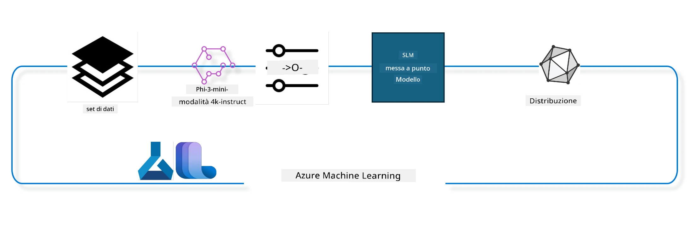

## Come utilizzare i componenti di completamento chat dal registro di sistema Azure ML per affinare un modello

In questo esempio eseguiremo il fine tuning del modello Phi-3-mini-4k-instruct per completare una conversazione tra 2 persone utilizzando il dataset ultrachat_200k.



L'esempio mostrerà come effettuare il fine tuning utilizzando l'SDK Azure ML e Python e poi distribuire il modello fine-tuned su un endpoint online per inferenza in tempo reale.

### Dati di addestramento

Useremo il dataset ultrachat_200k. Si tratta di una versione fortemente filtrata del dataset UltraChat ed è stato usato per addestrare Zephyr-7B-β, un modello di chat all'avanguardia da 7 miliardi di parametri.

### Modello

Useremo il modello Phi-3-mini-4k-instruct per mostrare come un utente può affinare un modello per il task di completamento chat. Se hai aperto questo notebook da una specifica scheda modello, ricordati di sostituire il nome specifico del modello.

### Attività

- Scegliere un modello da affinare.
- Scegliere ed esplorare i dati di addestramento.
- Configurare il job di fine tuning.
- Eseguire il job di fine tuning.
- Rivedere le metriche di addestramento e valutazione.
- Registrare il modello fine-tuned.
- Distribuire il modello fine-tuned per inferenza in tempo reale.
- Pulire le risorse.

## 1. Configurare i requisiti preliminari

- Installare le dipendenze
- Connettersi al Workspace AzureML. Scopri di più su come configurare l'autenticazione SDK. Sostituire <WORKSPACE_NAME>, <RESOURCE_GROUP> e <SUBSCRIPTION_ID> qui sotto.
- Connettersi al registro di sistema azureml
- Impostare un nome esperimento opzionale
- Controllare o creare il compute.

> [!NOTE]
> I requisiti prevedono un singolo nodo GPU che può avere più schede GPU. Per esempio, in un nodo Standard_NC24rs_v3 ci sono 4 GPU NVIDIA V100 mentre in Standard_NC12s_v3 ce ne sono 2 NVIDIA V100. Fare riferimento alla documentazione per queste informazioni. Il numero di schede GPU per nodo è impostato nel parametro gpus_per_node qui sotto. Impostare correttamente questo valore garantirà l'utilizzo di tutte le GPU nel nodo. Le SKU compute GPU consigliate si trovano qui e qui.

### Librerie Python

Installa le dipendenze eseguendo la cella sottostante. Questo non è un passaggio opzionale se si esegue in un ambiente nuovo.

```bash
pip install azure-ai-ml
pip install azure-identity
pip install datasets==2.9.0
pip install mlflow
pip install azureml-mlflow
```

### Interazione con Azure ML

1. Questo script Python viene usato per interagire con il servizio Azure Machine Learning (Azure ML). Ecco cosa fa:

    - Importa i moduli necessari dai package azure.ai.ml, azure.identity e azure.ai.ml.entities. Importa anche il modulo time.

    - Tenta di autenticarsi usando DefaultAzureCredential(), che offre un'esperienza di autenticazione semplificata per iniziare rapidamente a sviluppare applicazioni eseguite nel cloud Azure. Se fallisce, utilizza InteractiveBrowserCredential(), che mostra un prompt di login interattivo.

    - Prova quindi a creare un'istanza MLClient usando il metodo from_config che legge la configurazione dal file di configurazione predefinito (config.json). Se fallisce, crea un'istanza MLClient fornendo manualmente subscription_id, resource_group_name e workspace_name.

    - Crea un'altra istanza MLClient, questa volta per il registro Azure ML denominato "azureml". Questo registro è dove modelli, pipeline di fine tuning e ambienti sono archiviati.

    - Imposta experiment_name a "chat_completion_Phi-3-mini-4k-instruct".

    - Genera un timestamp unico convertendo il tempo corrente (in secondi dall'epoca, come numero floating point) in un intero e poi in stringa. Questo timestamp può essere usato per creare nomi e versioni uniche.

    ```python
    # Importa i moduli necessari da Azure ML e Azure Identity
    from azure.ai.ml import MLClient
    from azure.identity import (
        DefaultAzureCredential,
        InteractiveBrowserCredential,
    )
    from azure.ai.ml.entities import AmlCompute
    import time  # Importa il modulo time
    
    # Prova ad autenticarti usando DefaultAzureCredential
    try:
        credential = DefaultAzureCredential()
        credential.get_token("https://management.azure.com/.default")
    except Exception as ex:  # Se DefaultAzureCredential fallisce, usa InteractiveBrowserCredential
        credential = InteractiveBrowserCredential()
    
    # Prova a creare un'istanza MLClient usando il file di configurazione predefinito
    try:
        workspace_ml_client = MLClient.from_config(credential=credential)
    except:  # Se fallisce, crea un'istanza MLClient fornendo manualmente i dettagli
        workspace_ml_client = MLClient(
            credential,
            subscription_id="<SUBSCRIPTION_ID>",
            resource_group_name="<RESOURCE_GROUP>",
            workspace_name="<WORKSPACE_NAME>",
        )
    
    # Crea un'altra istanza MLClient per il registro Azure ML chiamato "azureml"
    # Questo registro è dove vengono memorizzati modelli, pipeline di fine-tuning e ambienti
    registry_ml_client = MLClient(credential, registry_name="azureml")
    
    # Imposta il nome dell'esperimento
    experiment_name = "chat_completion_Phi-3-mini-4k-instruct"
    
    # Genera un timestamp univoco che può essere usato per nomi e versioni che devono essere unici
    timestamp = str(int(time.time()))
    ```

## 2. Scegliere un modello foundation da affinare

1. Phi-3-mini-4k-instruct è un modello leggero, all'avanguardia, con 3.8 miliardi di parametri costruito su dataset usati per Phi-2. Il modello appartiene alla famiglia modello Phi-3, e la versione Mini è disponibile in due varianti: 4K e 128K, che rappresentano la lunghezza del contesto (in token) che può supportare. Dobbiamo affinare il modello per il nostro scopo specifico per poterlo utilizzare. Puoi sfogliare questi modelli nel Catalogo Modelli di AzureML Studio, filtrando per il task di completamento chat. In questo esempio usiamo il modello Phi-3-mini-4k-instruct. Se hai aperto questo notebook per un modello diverso, sostituisci il nome e la versione del modello di conseguenza.

> [!NOTE]
> la proprietà id del modello. Questa sarà passata come input al job di fine tuning. È disponibile anche come campo Asset ID nella pagina dei dettagli del modello nel Catalogo Modelli di AzureML Studio.

2. Questo script Python interagisce con il servizio Azure Machine Learning (Azure ML). Ecco cosa fa:

    - Imposta model_name su "Phi-3-mini-4k-instruct".

    - Usa il metodo get della proprietà models dell'oggetto registry_ml_client per recuperare l'ultima versione del modello con il nome specificato dal registro Azure ML. Il metodo get è chiamato con due argomenti: il nome del modello e una label che specifica che si vuole recuperare l'ultima versione del modello.

    - Stampa un messaggio sulla console che indica il nome, la versione e l'id del modello che sarà usato per il fine tuning. Il metodo format della stringa viene usato per inserire nome, versione e id del modello nel messaggio. Nome, versione e id del modello sono accessi come proprietà dell'oggetto foundation_model.

    ```python
    # Imposta il nome del modello
    model_name = "Phi-3-mini-4k-instruct"
    
    # Ottieni l'ultima versione del modello dal registro di Azure ML
    foundation_model = registry_ml_client.models.get(model_name, label="latest")
    
    # Stampa il nome del modello, la versione e l'id
    # Queste informazioni sono utili per il tracciamento e il debug
    print(
        "\n\nUsing model name: {0}, version: {1}, id: {2} for fine tuning".format(
            foundation_model.name, foundation_model.version, foundation_model.id
        )
    )
    ```

## 3. Creare un compute da usare con il job

Il job di fine tuning funziona SOLO con compute GPU. La dimensione del compute dipende da quanto è grande il modello e in molti casi diventa difficile individuare il compute giusto per il lavoro. In questa cella guidiamo l'utente a selezionare il compute corretto per il job.

> [!NOTE]
> I compute elencati di seguito funzionano con la configurazione più ottimizzata. Qualsiasi modifica alla configurazione potrebbe portare a errori Cuda Out Of Memory. In tali casi, provare ad aggiornare il compute a una dimensione superiore.

> [!NOTE]
> Durante la selezione di compute_cluster_size qui sotto, assicurati che il compute sia disponibile nel tuo resource group. Se un particolare compute non è disponibile puoi fare richiesta per ottenere accesso alle risorse compute.

### Verifica del supporto al fine tuning del modello

1. Questo script Python interagisce con un modello Azure Machine Learning (Azure ML). Ecco cosa fa:

    - Importa il modulo ast, che fornisce funzioni per elaborare alberi della sintassi astratta di Python.

    - Controlla se l'oggetto foundation_model (che rappresenta un modello in Azure ML) ha un tag chiamato finetune_compute_allow_list. I tag in Azure ML sono coppie chiave-valore che puoi creare e usare per filtrare e ordinare modelli.

    - Se il tag finetune_compute_allow_list è presente, usa la funzione ast.literal_eval per interpretare in modo sicuro il valore del tag (una stringa) in una lista Python. Questa lista viene assegnata alla variabile computes_allow_list. Successivamente stampa un messaggio che indica di creare un compute dalla lista.

    - Se il tag finetune_compute_allow_list non è presente, imposta computes_allow_list a None e stampa un messaggio che indica che il tag finetune_compute_allow_list non fa parte dei tag del modello.

    - In sintesi, questo script controlla un tag specifico nei metadata del modello, converte il valore del tag in una lista se esiste e fornisce un feedback all'utente di conseguenza.

    ```python
    # Importa il modulo ast, che fornisce funzioni per elaborare gli alberi della grammatica astratta di Python
    import ast
    
    # Controlla se il tag 'finetune_compute_allow_list' è presente nei tag del modello
    if "finetune_compute_allow_list" in foundation_model.tags:
        # Se il tag è presente, usa ast.literal_eval per analizzare in modo sicuro il valore del tag (una stringa) in una lista Python
        computes_allow_list = ast.literal_eval(
            foundation_model.tags["finetune_compute_allow_list"]
        )  # converte la stringa in una lista Python
        # Stampa un messaggio che indica che un compute dovrebbe essere creato dalla lista
        print(f"Please create a compute from the above list - {computes_allow_list}")
    else:
        # Se il tag non è presente, imposta computes_allow_list su None
        computes_allow_list = None
        # Stampa un messaggio che indica che il tag 'finetune_compute_allow_list' non fa parte dei tag del modello
        print("`finetune_compute_allow_list` is not part of model tags")
    ```

### Verifica dell'istanza Compute

1. Questo script Python interagisce con il servizio Azure Machine Learning (Azure ML) e esegue diversi controlli su un'istanza compute. Ecco cosa fa:

    - Tenta di recuperare l'istanza compute con il nome memorizzato in compute_cluster dal workspace Azure ML. Se lo stato di provisioning dell'istanza compute è "failed", genera un ValueError.

    - Controlla se computes_allow_list non è None. Se non lo è, converte tutte le dimensioni compute nella lista in minuscolo e verifica se la dimensione dell'istanza compute corrente è nella lista. Se non lo è, genera un ValueError.

    - Se computes_allow_list è None, controlla se la dimensione dell'istanza compute si trova in una lista di dimensioni VM GPU non supportate. Se è così, genera un ValueError.

    - Recupera una lista di tutte le dimensioni compute disponibili nel workspace. Poi itera su questa lista e, per ogni dimensione compute, controlla se il suo nome corrisponde alla dimensione dell'istanza corrente. Se sì, recupera il numero di GPU per quella dimensione e imposta gpu_count_found a True.

    - Se gpu_count_found è True, stampa il numero di GPU nell'istanza compute. Se è False, genera un ValueError.

    - In sintesi, questo script esegue diversi controlli su un'istanza compute in un workspace Azure ML, controllando lo stato di provisioning, la dimensione rispetto a una allow list o deny list e il numero di GPU disponibili.

    ```python
    # Stampa il messaggio di eccezione
    print(e)
    # Solleva un ValueError se la dimensione di calcolo non è disponibile nell'area di lavoro
    raise ValueError(
        f"WARNING! Compute size {compute_cluster_size} not available in workspace"
    )
    
    # Recupera l'istanza di calcolo dall'area di lavoro Azure ML
    compute = workspace_ml_client.compute.get(compute_cluster)
    # Controlla se lo stato di provisioning dell'istanza di calcolo è "fallito"
    if compute.provisioning_state.lower() == "failed":
        # Solleva un ValueError se lo stato di provisioning è "fallito"
        raise ValueError(
            f"Provisioning failed, Compute '{compute_cluster}' is in failed state. "
            f"please try creating a different compute"
        )
    
    # Controlla se computes_allow_list non è None
    if computes_allow_list is not None:
        # Converte tutte le dimensioni di calcolo in computes_allow_list in minuscolo
        computes_allow_list_lower_case = [x.lower() for x in computes_allow_list]
        # Controlla se la dimensione dell'istanza di calcolo è in computes_allow_list_lower_case
        if compute.size.lower() not in computes_allow_list_lower_case:
            # Solleva un ValueError se la dimensione dell'istanza di calcolo non è in computes_allow_list_lower_case
            raise ValueError(
                f"VM size {compute.size} is not in the allow-listed computes for finetuning"
            )
    else:
        # Definisci una lista di dimensioni di VM GPU non supportate
        unsupported_gpu_vm_list = [
            "standard_nc6",
            "standard_nc12",
            "standard_nc24",
            "standard_nc24r",
        ]
        # Controlla se la dimensione dell'istanza di calcolo è in unsupported_gpu_vm_list
        if compute.size.lower() in unsupported_gpu_vm_list:
            # Solleva un ValueError se la dimensione dell'istanza di calcolo è in unsupported_gpu_vm_list
            raise ValueError(
                f"VM size {compute.size} is currently not supported for finetuning"
            )
    
    # Inizializza un flag per controllare se il numero di GPU nell'istanza di calcolo è stato trovato
    gpu_count_found = False
    # Recupera una lista di tutte le dimensioni di calcolo disponibili nell'area di lavoro
    workspace_compute_sku_list = workspace_ml_client.compute.list_sizes()
    available_sku_sizes = []
    # Itera sulla lista delle dimensioni di calcolo disponibili
    for compute_sku in workspace_compute_sku_list:
        available_sku_sizes.append(compute_sku.name)
        # Controlla se il nome della dimensione di calcolo corrisponde alla dimensione dell'istanza di calcolo
        if compute_sku.name.lower() == compute.size.lower():
            # Se corrisponde, recupera il numero di GPU per quella dimensione di calcolo e imposta gpu_count_found su True
            gpus_per_node = compute_sku.gpus
            gpu_count_found = True
    # Se gpu_count_found è True, stampa il numero di GPU nell'istanza di calcolo
    if gpu_count_found:
        print(f"Number of GPU's in compute {compute.size}: {gpus_per_node}")
    else:
        # Se gpu_count_found è False, solleva un ValueError
        raise ValueError(
            f"Number of GPU's in compute {compute.size} not found. Available skus are: {available_sku_sizes}."
            f"This should not happen. Please check the selected compute cluster: {compute_cluster} and try again."
        )
    ```

## 4. Scegliere il dataset per il fine tuning del modello

1. Useremo il dataset ultrachat_200k. Il dataset è diviso in quattro split, adatti per il fine tuning supervisionato (sft). Ranking di generazione (gen). Il numero di esempi per split è mostrato come segue:

    ```bash
    train_sft test_sft  train_gen  test_gen
    207865  23110  256032  28304
    ```

1. Le prossime celle mostrano la preparazione dati di base per il fine tuning:

### Visualizzare alcune righe di dati

Vogliamo che questo campione venga eseguito rapidamente, quindi salviamo i file train_sft, test_sft contenenti il 5% delle righe già filtrate. Ciò significa che il modello fine-tuned avrà precisione inferiore, quindi non dovrebbe essere usato in contesti reali.
Il file download-dataset.py viene usato per scaricare il dataset ultrachat_200k e trasformare il dataset in un formato consumabile dal componente pipeline di fine tuning. Inoltre, poiché il dataset è molto grande, qui abbiamo solo una parte del dataset.

1. Eseguendo lo script sottostante vengono scaricati solo il 5% dei dati. Questa percentuale può essere aumentata modificando il parametro dataset_split_pc nel valore desiderato.

> [!NOTE]
> Alcuni modelli linguistici hanno codici linguistiche differenti e quindi i nomi delle colonne nel dataset dovrebbero riflettere lo stesso.

1. Ecco un esempio di come dovrebbero essere i dati
Il dataset di completamento chat è memorizzato in formato parquet con ogni voce che usa il seguente schema:

    - Questo è un documento JSON (JavaScript Object Notation), un formato popolare di scambio dati. Non è codice eseguibile, ma un modo per memorizzare e trasportare dati. Ecco una rassegna della sua struttura:

    - "prompt": Questa chiave contiene un valore stringa che rappresenta un compito o domanda posta a un assistente AI.

    - "messages": Questa chiave contiene un array di oggetti. Ogni oggetto rappresenta un messaggio in una conversazione tra un utente e un assistente AI. Ogni oggetto messaggio ha due chiavi:

    - "content": Questa chiave contiene una stringa che rappresenta il contenuto del messaggio.
    - "role": Questa chiave contiene una stringa che rappresenta il ruolo dell'entità che ha inviato il messaggio. Può essere "user" o "assistant".
    - "prompt_id": Questa chiave contiene una stringa che rappresenta un identificativo unico per il prompt.

1. In questo specifico documento JSON, viene rappresentata una conversazione dove un utente chiede a un assistente AI di creare un protagonista per una storia distopica. L'assistente risponde, e l'utente poi chiede maggiori dettagli. L'assistente accetta di fornire maggiori dettagli. L'intera conversazione è associata a un id prompt specifico.

    ```python
    {
        // The task or question posed to an AI assistant
        "prompt": "Create a fully-developed protagonist who is challenged to survive within a dystopian society under the rule of a tyrant. ...",
        
        // An array of objects, each representing a message in a conversation between a user and an AI assistant
        "messages":[
            {
                // The content of the user's message
                "content": "Create a fully-developed protagonist who is challenged to survive within a dystopian society under the rule of a tyrant. ...",
                // The role of the entity that sent the message
                "role": "user"
            },
            {
                // The content of the assistant's message
                "content": "Name: Ava\n\n Ava was just 16 years old when the world as she knew it came crashing down. The government had collapsed, leaving behind a chaotic and lawless society. ...",
                // The role of the entity that sent the message
                "role": "assistant"
            },
            {
                // The content of the user's message
                "content": "Wow, Ava's story is so intense and inspiring! Can you provide me with more details.  ...",
                // The role of the entity that sent the message
                "role": "user"
            }, 
            {
                // The content of the assistant's message
                "content": "Certainly! ....",
                // The role of the entity that sent the message
                "role": "assistant"
            }
        ],
        
        // A unique identifier for the prompt
        "prompt_id": "d938b65dfe31f05f80eb8572964c6673eddbd68eff3db6bd234d7f1e3b86c2af"
    }
    ```

### Scaricare i dati

1. Questo script Python viene usato per scaricare un dataset usando uno script helper chiamato download-dataset.py. Ecco cosa fa:

    - Importa il modulo os, che fornisce un modo portabile per usare funzionalità dipendenti dal sistema operativo.

    - Usa la funzione os.system per eseguire lo script download-dataset.py nella shell con argomenti specifici da linea di comando. Gli argomenti specificano il dataset da scaricare (HuggingFaceH4/ultrachat_200k), la directory dove scaricarlo (ultrachat_200k_dataset) e la percentuale dello split del dataset (5). La funzione os.system restituisce lo stato di uscita del comando eseguito; questo valore è salvato in exit_status.

    - Controlla se exit_status è diverso da 0. Nei sistemi operativi Unix-like uno stato di uscita 0 indica successo, mentre altri numeri indicano errori. Se exit_status è diverso da 0, genera un'eccezione con un messaggio che indica che c'è stato un errore nel download del dataset.

    - In sintesi, questo script esegue un comando per scaricare un dataset usando uno script helper e genera un'eccezione se il comando fallisce.

    ```python
    # Importa il modulo os, che fornisce un modo per utilizzare funzionalità dipendenti dal sistema operativo
    import os
    
    # Usa la funzione os.system per eseguire lo script download-dataset.py nella shell con argomenti specifici da linea di comando
    # Gli argomenti specificano il dataset da scaricare (HuggingFaceH4/ultrachat_200k), la directory in cui scaricarlo (ultrachat_200k_dataset), e la percentuale del dataset da suddividere (5)
    # La funzione os.system restituisce lo stato di uscita del comando che ha eseguito; questo stato è memorizzato nella variabile exit_status
    exit_status = os.system(
        "python ./download-dataset.py --dataset HuggingFaceH4/ultrachat_200k --download_dir ultrachat_200k_dataset --dataset_split_pc 5"
    )
    
    # Controlla se exit_status non è 0
    # Nei sistemi operativi di tipo Unix, uno stato di uscita pari a 0 solitamente indica che un comando è riuscito, mentre qualsiasi altro numero indica un errore
    # Se exit_status non è 0, genera un'eccezione con un messaggio che indica che c'è stato un errore nel download del dataset
    if exit_status != 0:
        raise Exception("Error downloading dataset")
    ```

### Caricare i dati in un DataFrame
1. Questo script Python carica un file JSON Lines in un DataFrame di pandas e visualizza le prime 5 righe. Ecco una spiegazione di ciò che fa:

    - Importa la libreria pandas, che è una potente libreria per la manipolazione e l'analisi dei dati.

    - Imposta la larghezza massima della colonna per le opzioni di visualizzazione di pandas a 0. Ciò significa che il testo completo di ogni colonna verrà visualizzato senza troncamenti quando il DataFrame viene stampato.

    - Usa la funzione pd.read_json per caricare il file train_sft.jsonl dalla directory ultrachat_200k_dataset in un DataFrame. L'argomento lines=True indica che il file è in formato JSON Lines, dove ogni riga è un oggetto JSON separato.

    - Usa il metodo head per visualizzare le prime 5 righe del DataFrame. Se il DataFrame ha meno di 5 righe, ne visualizzerà tutte.

    - In sintesi, questo script carica un file JSON Lines in un DataFrame e visualizza le prime 5 righe con il testo completo delle colonne.
    
    ```python
    # Importa la libreria pandas, che è una potente libreria per la manipolazione e l'analisi dei dati
    import pandas as pd
    
    # Imposta la larghezza massima della colonna per le opzioni di visualizzazione di pandas a 0
    # Questo significa che il testo completo di ogni colonna sarà visualizzato senza troncamento quando il DataFrame viene stampato
    pd.set_option("display.max_colwidth", 0)
    
    # Usa la funzione pd.read_json per caricare il file train_sft.jsonl dalla directory ultrachat_200k_dataset in un DataFrame
    # L'argomento lines=True indica che il file è in formato JSON Lines, dove ogni riga è un oggetto JSON separato
    df = pd.read_json("./ultrachat_200k_dataset/train_sft.jsonl", lines=True)
    
    # Usa il metodo head per visualizzare le prime 5 righe del DataFrame
    # Se il DataFrame ha meno di 5 righe, verranno visualizzate tutte
    df.head()
    ```

## 5. Invia il lavoro di fine tuning utilizzando il modello e i dati come input

Crea il lavoro che utilizza il componente pipeline chat-completion. Scopri di più su tutti i parametri supportati per il fine tuning.

### Definisci i parametri di fine tuning

1. I parametri di fine tuning possono essere raggruppati in 2 categorie - parametri di addestramento, parametri di ottimizzazione

1. I parametri di addestramento definiscono gli aspetti dell'addestramento come -

    - L'ottimizzatore, lo scheduler da usare
    - La metrica da ottimizzare nel fine tuning
    - Numero di step di addestramento e dimensione del batch e così via
    - I parametri di ottimizzazione aiutano a ottimizzare la memoria GPU e utilizzare efficacemente le risorse di calcolo.

1. Di seguito alcuni dei parametri che appartengono a questa categoria. I parametri di ottimizzazione differiscono per ogni modello e sono confezionati con il modello per gestire queste variazioni.

    - Abilitare deepspeed e LoRA
    - Abilitare l'addestramento a precisione mista
    - Abilitare l'addestramento multi-nodo

> [!NOTE]
> Il fine tuning supervisionato può causare la perdita di allineamento o un catastrofico oblio. Si consiglia di verificare questo problema e di eseguire una fase di allineamento dopo il fine tuning.

### Parametri di Fine Tuning

1. Questo script Python sta impostando i parametri per il fine tuning di un modello di machine learning. Ecco una spiegazione di ciò che fa:

    - Imposta i parametri di addestramento predefiniti come il numero di epoche di addestramento, dimensioni dei batch per addestramento e valutazione, tasso di apprendimento e tipo di scheduler del tasso di apprendimento.

    - Imposta i parametri di ottimizzazione predefiniti come se applicare Layer-wise Relevance Propagation (LoRa) e DeepSpeed, e lo stadio DeepSpeed.

    - Combina i parametri di addestramento e ottimizzazione in un singolo dizionario chiamato finetune_parameters.

    - Controlla se foundation_model dispone di parametri predefiniti specifici del modello. Se sì, stampa un messaggio di avviso e aggiorna il dizionario finetune_parameters con questi valori predefiniti specifici del modello. La funzione ast.literal_eval viene utilizzata per convertire i valori predefiniti specifici del modello da stringa a dizionario Python.

    - Stampa l'insieme finale di parametri di fine tuning che verranno utilizzati per l'esecuzione.

    - In sintesi, questo script sta impostando e visualizzando i parametri per il fine tuning di un modello di machine learning, con la possibilità di sovrascrivere i parametri predefiniti con quelli specifici del modello.

    ```python
    # Imposta i parametri di addestramento predefiniti come il numero di epoche di addestramento, le dimensioni dei batch per addestramento e valutazione, il tasso di apprendimento e il tipo di scheduler del tasso di apprendimento
    training_parameters = dict(
        num_train_epochs=3,
        per_device_train_batch_size=1,
        per_device_eval_batch_size=1,
        learning_rate=5e-6,
        lr_scheduler_type="cosine",
    )
    
    # Imposta i parametri di ottimizzazione predefiniti come se applicare Layer-wise Relevance Propagation (LoRa) e DeepSpeed, e lo stadio di DeepSpeed
    optimization_parameters = dict(
        apply_lora="true",
        apply_deepspeed="true",
        deepspeed_stage=2,
    )
    
    # Combina i parametri di addestramento e ottimizzazione in un unico dizionario chiamato finetune_parameters
    finetune_parameters = {**training_parameters, **optimization_parameters}
    
    # Verifica se il foundation_model ha parametri predefiniti specifici del modello
    # Se li ha, stampa un messaggio di avviso e aggiorna il dizionario finetune_parameters con questi valori predefiniti specifici del modello
    # La funzione ast.literal_eval viene utilizzata per convertire i valori predefiniti specifici del modello da una stringa a un dizionario Python
    if "model_specific_defaults" in foundation_model.tags:
        print("Warning! Model specific defaults exist. The defaults could be overridden.")
        finetune_parameters.update(
            ast.literal_eval(  # converte la stringa in dizionario python
                foundation_model.tags["model_specific_defaults"]
            )
        )
    
    # Stampa il set finale di parametri di fine-tuning che saranno utilizzati per l'esecuzione
    print(
        f"The following finetune parameters are going to be set for the run: {finetune_parameters}"
    )
    ```

### Pipeline di Addestramento

1. Questo script Python definisce una funzione per generare un nome di visualizzazione per una pipeline di addestramento di machine learning, e poi richiama questa funzione per generare e stampare il nome di visualizzazione. Ecco una spiegazione di ciò che fa:

1. Viene definita la funzione get_pipeline_display_name. Questa funzione genera un nome di visualizzazione basato su vari parametri relativi alla pipeline di addestramento.

1. All'interno della funzione, calcola la dimensione totale del batch moltiplicando la dimensione del batch per dispositivo, il numero di step di accumulo del gradiente, il numero di GPU per nodo, e il numero di nodi usati per il fine tuning.

1. Recupera vari altri parametri quali il tipo di scheduler del tasso di apprendimento, se DeepSpeed è applicato, lo stadio DeepSpeed, se Layer-wise Relevance Propagation (LoRa) è applicato, il limite sul numero di checkpoint del modello da conservare, e la lunghezza massima della sequenza.

1. Costruisce una stringa che include tutti questi parametri, separati da trattini. Se è applicato DeepSpeed o LoRa, la stringa include "ds" seguita dallo stadio DeepSpeed, oppure "lora", rispettivamente. Altrimenti include "nods" o "nolora", rispettivamente.

1. La funzione restituisce questa stringa, che serve come nome di visualizzazione per la pipeline di addestramento.

1. Dopo che la funzione è stata definita, viene chiamata per generare il nome di visualizzazione, che viene poi stampato.

1. In sintesi, questo script genera un nome di visualizzazione per una pipeline di addestramento di machine learning basato su vari parametri, e poi stampa questo nome di visualizzazione.

    ```python
    # Definire una funzione per generare un nome visualizzato per la pipeline di addestramento
    def get_pipeline_display_name():
        # Calcolare la dimensione totale del batch moltiplicando la dimensione del batch per dispositivo, il numero di passaggi di accumulo del gradiente, il numero di GPU per nodo e il numero di nodi utilizzati per il fine-tuning
        batch_size = (
            int(finetune_parameters.get("per_device_train_batch_size", 1))
            * int(finetune_parameters.get("gradient_accumulation_steps", 1))
            * int(gpus_per_node)
            * int(finetune_parameters.get("num_nodes_finetune", 1))
        )
        # Recuperare il tipo di scheduler del learning rate
        scheduler = finetune_parameters.get("lr_scheduler_type", "linear")
        # Recuperare se DeepSpeed è applicato
        deepspeed = finetune_parameters.get("apply_deepspeed", "false")
        # Recuperare la fase di DeepSpeed
        ds_stage = finetune_parameters.get("deepspeed_stage", "2")
        # Se DeepSpeed è applicato, includere "ds" seguito dalla fase di DeepSpeed nel nome visualizzato; se no, includere "nods"
        if deepspeed == "true":
            ds_string = f"ds{ds_stage}"
        else:
            ds_string = "nods"
        # Recuperare se è applicato Layer-wise Relevance Propagation (LoRa)
        lora = finetune_parameters.get("apply_lora", "false")
        # Se LoRa è applicato, includere "lora" nel nome visualizzato; se no, includere "nolora"
        if lora == "true":
            lora_string = "lora"
        else:
            lora_string = "nolora"
        # Recuperare il limite sul numero di checkpoint del modello da mantenere
        save_limit = finetune_parameters.get("save_total_limit", -1)
        # Recuperare la lunghezza massima della sequenza
        seq_len = finetune_parameters.get("max_seq_length", -1)
        # Costruire il nome visualizzato concatenando tutti questi parametri, separati da trattini
        return (
            model_name
            + "-"
            + "ultrachat"
            + "-"
            + f"bs{batch_size}"
            + "-"
            + f"{scheduler}"
            + "-"
            + ds_string
            + "-"
            + lora_string
            + f"-save_limit{save_limit}"
            + f"-seqlen{seq_len}"
        )
    
    # Chiamare la funzione per generare il nome visualizzato
    pipeline_display_name = get_pipeline_display_name()
    # Stampare il nome visualizzato
    print(f"Display name used for the run: {pipeline_display_name}")
    ```

### Configurazione della Pipeline

Questo script Python definisce e configura una pipeline di machine learning usando l'SDK Azure Machine Learning. Ecco una spiegazione di ciò che fa:

1. Importa i moduli necessari dall'SDK Azure AI ML.

1. Recupera un componente pipeline chiamato "chat_completion_pipeline" dal registro.

1. Definisce un job pipeline usando il decoratore `@pipeline` e la funzione `create_pipeline`. Il nome della pipeline è impostato su `pipeline_display_name`.

1. All'interno della funzione `create_pipeline`, inizializza il componente pipeline ottenuto con vari parametri, inclusi il percorso del modello, i cluster di calcolo per le diverse fasi, le suddivisioni del dataset per l'addestramento e il test, il numero di GPU da usare per il fine tuning e altri parametri di fine tuning.

1. Mappa l'output del lavoro di fine tuning all'output del lavoro pipeline. Questo per poter registrare facilmente il modello fine tune, requisito per distribuire il modello su un endpoint online o batch.

1. Crea un'istanza della pipeline chiamando la funzione `create_pipeline`.

1. Imposta l'opzione `force_rerun` della pipeline su `True`, il che significa che non verranno usati risultati memorizzati in cache da lavori precedenti.

1. Imposta l'opzione `continue_on_step_failure` della pipeline su `False`, il che significa che la pipeline si fermerà se qualche step fallisce.

1. In sintesi, questo script definisce e configura una pipeline di machine learning per un compito di completamento chat usando l'SDK Azure Machine Learning.

    ```python
    # Importa i moduli necessari dal SDK Azure AI ML
    from azure.ai.ml.dsl import pipeline
    from azure.ai.ml import Input
    
    # Recupera il componente pipeline chiamato "chat_completion_pipeline" dal registro
    pipeline_component_func = registry_ml_client.components.get(
        name="chat_completion_pipeline", label="latest"
    )
    
    # Definisci il job della pipeline usando il decoratore @pipeline e la funzione create_pipeline
    # Il nome della pipeline è impostato su pipeline_display_name
    @pipeline(name=pipeline_display_name)
    def create_pipeline():
        # Inizializza il componente pipeline recuperato con vari parametri
        # Questi includono il percorso del modello, i cluster di calcolo per diverse fasi, le suddivisioni del dataset per training e test, il numero di GPU da utilizzare per il fine-tuning e altri parametri di fine-tuning
        chat_completion_pipeline = pipeline_component_func(
            mlflow_model_path=foundation_model.id,
            compute_model_import=compute_cluster,
            compute_preprocess=compute_cluster,
            compute_finetune=compute_cluster,
            compute_model_evaluation=compute_cluster,
            # Mappa le suddivisioni del dataset ai parametri
            train_file_path=Input(
                type="uri_file", path="./ultrachat_200k_dataset/train_sft.jsonl"
            ),
            test_file_path=Input(
                type="uri_file", path="./ultrachat_200k_dataset/test_sft.jsonl"
            ),
            # Impostazioni di training
            number_of_gpu_to_use_finetuning=gpus_per_node,  # Impostato sul numero di GPU disponibili nel calcolo
            **finetune_parameters
        )
        return {
            # Mappa l'output del lavoro di fine tuning all'output del job della pipeline
            # Questo è fatto per permettere di registrare facilmente il modello fine-tuned
            # La registrazione del modello è necessaria per distribuire il modello su un endpoint online o batch
            "trained_model": chat_completion_pipeline.outputs.mlflow_model_folder
        }
    
    # Crea un'istanza della pipeline chiamando la funzione create_pipeline
    pipeline_object = create_pipeline()
    
    # Non usare risultati memorizzati in cache da lavori precedenti
    pipeline_object.settings.force_rerun = True
    
    # Imposta continua su fallimento del passo su False
    # Questo significa che la pipeline si fermerà se un qualsiasi passo fallisce
    pipeline_object.settings.continue_on_step_failure = False
    ```

### Invia il Lavoro

1. Questo script Python invia un lavoro pipeline di machine learning a un workspace Azure Machine Learning e poi attende che il lavoro sia completato. Ecco una spiegazione di ciò che fa:

    - Chiama il metodo create_or_update dell'oggetto jobs nel workspace_ml_client per inviare il lavoro pipeline. La pipeline da eseguire è specificata da pipeline_object, e l'esperimento sotto cui viene eseguito il lavoro è specificato da experiment_name.

    - Poi chiama il metodo stream dell'oggetto jobs nel workspace_ml_client per attendere che il lavoro pipeline sia completato. Il lavoro da attendere è specificato dall'attributo name dell'oggetto pipeline_job.

    - In sintesi, questo script invia un lavoro pipeline di machine learning a un workspace Azure Machine Learning e poi attende che il lavoro sia completato.

    ```python
    # Invia il job della pipeline al workspace di Azure Machine Learning
    # La pipeline da eseguire è specificata da pipeline_object
    # L'esperimento sotto cui viene eseguito il job è specificato da experiment_name
    pipeline_job = workspace_ml_client.jobs.create_or_update(
        pipeline_object, experiment_name=experiment_name
    )
    
    # Attendi il completamento del job della pipeline
    # Il job da attendere è specificato dall'attributo nome dell'oggetto pipeline_job
    workspace_ml_client.jobs.stream(pipeline_job.name)
    ```

## 6. Registra il modello fine tune nel workspace

Registreremo il modello dall'output del lavoro di fine tuning. Questo traccerà la parentela tra il modello fine tune e il lavoro di fine tuning. Il lavoro di fine tuning, a sua volta, traccia la parentela con il modello di base, i dati e il codice di addestramento.

### Registrazione del Modello ML

1. Questo script Python registra un modello di machine learning addestrato in una pipeline Azure Machine Learning. Ecco una spiegazione di ciò che fa:

    - Importa i moduli necessari dall'SDK Azure AI ML.

    - Controlla se l'output trained_model è disponibile dal lavoro pipeline chiamando il metodo get dell'oggetto jobs in workspace_ml_client e accedendo al suo attributo outputs.

    - Costruisce un percorso al modello addestrato formattando una stringa con il nome del lavoro pipeline e il nome dell'output ("trained_model").

    - Definisce un nome per il modello fine tune aggiungendo "-ultrachat-200k" al nome originale del modello e sostituendo eventuali slash con trattini.

    - Si prepara a registrare il modello creando un oggetto Model con vari parametri, tra cui il percorso del modello, il tipo di modello (modello MLflow), il nome e la versione del modello e una descrizione del modello.

    - Registra il modello chiamando il metodo create_or_update dell'oggetto models nel workspace_ml_client con l'oggetto Model come argomento.

    - Stampa il modello registrato.

1. In sintesi, questo script registra un modello di machine learning addestrato in una pipeline Azure Machine Learning.
    
    ```python
    # Importa i moduli necessari dal SDK Azure AI ML
    from azure.ai.ml.entities import Model
    from azure.ai.ml.constants import AssetTypes
    
    # Controlla se l'output `trained_model` è disponibile dal job della pipeline
    print("pipeline job outputs: ", workspace_ml_client.jobs.get(pipeline_job.name).outputs)
    
    # Costruisci un percorso per il modello addestrato formattando una stringa con il nome del job della pipeline e il nome dell'output ("trained_model")
    model_path_from_job = "azureml://jobs/{0}/outputs/{1}".format(
        pipeline_job.name, "trained_model"
    )
    
    # Definisci un nome per il modello fine-tuned aggiungendo "-ultrachat-200k" al nome originale del modello e sostituendo eventuali slash con trattini
    finetuned_model_name = model_name + "-ultrachat-200k"
    finetuned_model_name = finetuned_model_name.replace("/", "-")
    
    print("path to register model: ", model_path_from_job)
    
    # Preparati a registrare il modello creando un oggetto Model con vari parametri
    # Questi includono il percorso al modello, il tipo del modello (modello MLflow), il nome e la versione del modello, e una descrizione del modello
    prepare_to_register_model = Model(
        path=model_path_from_job,
        type=AssetTypes.MLFLOW_MODEL,
        name=finetuned_model_name,
        version=timestamp,  # Usa la timestamp come versione per evitare conflitti di versione
        description=model_name + " fine tuned model for ultrachat 200k chat-completion",
    )
    
    print("prepare to register model: \n", prepare_to_register_model)
    
    # Registra il modello chiamando il metodo create_or_update dell'oggetto models in workspace_ml_client con l'oggetto Model come argomento
    registered_model = workspace_ml_client.models.create_or_update(
        prepare_to_register_model
    )
    
    # Stampa il modello registrato
    print("registered model: \n", registered_model)
    ```

## 7. Distribuisci il modello fine tune su un endpoint online

Gli endpoint online forniscono un'API REST duratura che può essere usata per integrare applicazioni che devono utilizzare il modello.

### Gestione Endpoint

1. Questo script Python crea un endpoint online gestito in Azure Machine Learning per un modello registrato. Ecco una spiegazione di ciò che fa:

    - Importa i moduli necessari dall'SDK Azure AI ML.

    - Definisce un nome unico per l'endpoint online aggiungendo un timestamp alla stringa "ultrachat-completion-".

    - Si prepara a creare l'endpoint online creando un oggetto ManagedOnlineEndpoint con vari parametri, inclusi il nome dell'endpoint, una descrizione dell'endpoint e la modalità di autenticazione ("key").

    - Crea l'endpoint online chiamando il metodo begin_create_or_update del workspace_ml_client con l'oggetto ManagedOnlineEndpoint come argomento. Poi attende che l'operazione di creazione sia completata chiamando il metodo wait.

1. In sintesi, questo script crea un endpoint online gestito in Azure Machine Learning per un modello registrato.

    ```python
    # Importa i moduli necessari dal SDK Azure AI ML
    from azure.ai.ml.entities import (
        ManagedOnlineEndpoint,
        ManagedOnlineDeployment,
        ProbeSettings,
        OnlineRequestSettings,
    )
    
    # Definisci un nome univoco per l'endpoint online aggiungendo un timestamp alla stringa "ultrachat-completion-"
    online_endpoint_name = "ultrachat-completion-" + timestamp
    
    # Preparati a creare l'endpoint online creando un oggetto ManagedOnlineEndpoint con vari parametri
    # Questi includono il nome dell'endpoint, una descrizione dell'endpoint e la modalità di autenticazione ("key")
    endpoint = ManagedOnlineEndpoint(
        name=online_endpoint_name,
        description="Online endpoint for "
        + registered_model.name
        + ", fine tuned model for ultrachat-200k-chat-completion",
        auth_mode="key",
    )
    
    # Crea l'endpoint online chiamando il metodo begin_create_or_update del workspace_ml_client con l'oggetto ManagedOnlineEndpoint come argomento
    # Poi attendi che l'operazione di creazione sia completata chiamando il metodo wait
    workspace_ml_client.begin_create_or_update(endpoint).wait()
    ```

> [!NOTE]
> Puoi trovare qui la lista delle SKU supportate per il deployment - [Managed online endpoints SKU list](https://learn.microsoft.com/azure/machine-learning/reference-managed-online-endpoints-vm-sku-list)

### Distribuzione del Modello ML

1. Questo script Python distribuisce un modello di machine learning registrato su un endpoint online gestito in Azure Machine Learning. Ecco una spiegazione di ciò che fa:

    - Importa il modulo ast, che fornisce funzioni per trattare gli alberi della grammatica sintattica astratta di Python.

    - Imposta il tipo di istanza per la distribuzione su "Standard_NC6s_v3".

    - Controlla se il tag inference_compute_allow_list è presente nel modello di base. Se lo è, converte il valore del tag da stringa a lista Python e lo assegna a inference_computes_allow_list. Se non lo è, imposta inference_computes_allow_list a None.

    - Controlla se il tipo di istanza specificato è nella lista consentita. Se non lo è, stampa un messaggio che chiede all'utente di selezionare un tipo di istanza dalla lista consentita.

    - Si prepara a creare la distribuzione creando un oggetto ManagedOnlineDeployment con vari parametri, tra cui il nome della distribuzione, il nome dell'endpoint, l'ID del modello, il tipo e il numero di istanze, le impostazioni per il liveness probe e le impostazioni per le richieste.

    - Crea la distribuzione chiamando il metodo begin_create_or_update del workspace_ml_client con l'oggetto ManagedOnlineDeployment come argomento. Poi attende che l'operazione di creazione sia completata chiamando il metodo wait.

    - Imposta il traffico dell'endpoint per indirizzare il 100% del traffico alla distribuzione "demo".

    - Aggiorna l'endpoint chiamando il metodo begin_create_or_update del workspace_ml_client con l'oggetto endpoint come argomento. Poi attende che l'operazione di aggiornamento sia completata chiamando il metodo result.

1. In sintesi, questo script distribuisce un modello di machine learning registrato su un endpoint online gestito in Azure Machine Learning.

    ```python
    # Importa il modulo ast, che fornisce funzioni per elaborare gli alberi della grammatica sintattica astratta di Python
    import ast
    
    # Imposta il tipo di istanza per il deployment
    instance_type = "Standard_NC6s_v3"
    
    # Verifica se il tag `inference_compute_allow_list` è presente nel modello di base
    if "inference_compute_allow_list" in foundation_model.tags:
        # Se presente, converte il valore del tag da stringa a lista Python e lo assegna a `inference_computes_allow_list`
        inference_computes_allow_list = ast.literal_eval(
            foundation_model.tags["inference_compute_allow_list"]
        )
        print(f"Please create a compute from the above list - {computes_allow_list}")
    else:
        # Se non è presente, imposta `inference_computes_allow_list` a `None`
        inference_computes_allow_list = None
        print("`inference_compute_allow_list` is not part of model tags")
    
    # Controlla se il tipo di istanza specificato è nella lista consentita
    if (
        inference_computes_allow_list is not None
        and instance_type not in inference_computes_allow_list
    ):
        print(
            f"`instance_type` is not in the allow listed compute. Please select a value from {inference_computes_allow_list}"
        )
    
    # Prepararsi a creare il deployment creando un oggetto `ManagedOnlineDeployment` con vari parametri
    demo_deployment = ManagedOnlineDeployment(
        name="demo",
        endpoint_name=online_endpoint_name,
        model=registered_model.id,
        instance_type=instance_type,
        instance_count=1,
        liveness_probe=ProbeSettings(initial_delay=600),
        request_settings=OnlineRequestSettings(request_timeout_ms=90000),
    )
    
    # Crea il deployment chiamando il metodo `begin_create_or_update` del `workspace_ml_client` con l'oggetto `ManagedOnlineDeployment` come argomento
    # Poi attendi che l'operazione di creazione sia completata chiamando il metodo `wait`
    workspace_ml_client.online_deployments.begin_create_or_update(demo_deployment).wait()
    
    # Imposta il traffico dell'endpoint per indirizzare il 100% del traffico al deployment "demo"
    endpoint.traffic = {"demo": 100}
    
    # Aggiorna l'endpoint chiamando il metodo `begin_create_or_update` del `workspace_ml_client` con l'oggetto `endpoint` come argomento
    # Poi attendi che l'operazione di aggiornamento sia completata chiamando il metodo `result`
    workspace_ml_client.begin_create_or_update(endpoint).result()
    ```

## 8. Test dell'endpoint con dati di esempio

Recupereremo alcuni dati di esempio dal dataset di test e li invieremo all'endpoint online per inferenza. Mostreremo poi le etichette previste insieme a quelle di verità a terra.

### Lettura dei risultati

1. Questo script Python legge un file JSON Lines in un DataFrame pandas, prende un campione casuale e resetta l'indice. Ecco una spiegazione di ciò che fa:

    - Legge il file ./ultrachat_200k_dataset/test_gen.jsonl in un DataFrame pandas. La funzione read_json viene usata con l'argomento lines=True perché il file è in formato JSON Lines, dove ogni riga è un oggetto JSON separato.

    - Prende un campione casuale di 1 riga dal DataFrame. La funzione sample viene usata con l'argomento n=1 per specificare il numero di righe casuali da selezionare.

    - Resetta l'indice del DataFrame. La funzione reset_index viene usata con l'argomento drop=True per eliminare l'indice originale e sostituirlo con un nuovo indice di valori interi predefiniti.

    - Visualizza le prime 2 righe del DataFrame usando la funzione head con l'argomento 2. Tuttavia, poiché il DataFrame contiene solo una riga dopo il campionamento, verrà mostrata solo quella riga.

1. In sintesi, questo script legge un file JSON Lines in un DataFrame pandas, prende un campione casuale di 1 riga, resetta l'indice e visualizza la prima riga.
    
    ```python
    # Importa la libreria pandas
    import pandas as pd
    
    # Leggi il file JSON Lines './ultrachat_200k_dataset/test_gen.jsonl' in un DataFrame pandas
    # L'argomento 'lines=True' indica che il file è in formato JSON Lines, dove ogni riga è un oggetto JSON separato
    test_df = pd.read_json("./ultrachat_200k_dataset/test_gen.jsonl", lines=True)
    
    # Prendi un campione casuale di 1 riga dal DataFrame
    # L'argomento 'n=1' specifica il numero di righe casuali da selezionare
    test_df = test_df.sample(n=1)
    
    # Resetta l'indice del DataFrame
    # L'argomento 'drop=True' indica che l'indice originale dovrebbe essere eliminato e sostituito con un nuovo indice di valori interi predefiniti
    # L'argomento 'inplace=True' indica che il DataFrame dovrebbe essere modificato in loco (senza creare un nuovo oggetto)
    test_df.reset_index(drop=True, inplace=True)
    
    # Mostra le prime 2 righe del DataFrame
    # Tuttavia, poiché il DataFrame contiene solo una riga dopo il campionamento, verrà visualizzata solo quella riga
    test_df.head(2)
    ```

### Crea oggetto JSON
1. Questo script Python crea un oggetto JSON con parametri specifici e lo salva in un file. Ecco una spiegazione di cosa fa:

    - Importa il modulo json, che fornisce funzioni per lavorare con dati JSON.

    - Crea un dizionario parameters con chiavi e valori che rappresentano parametri per un modello di machine learning. Le chiavi sono "temperature", "top_p", "do_sample" e "max_new_tokens", e i loro valori corrispondenti sono rispettivamente 0.6, 0.9, True e 200.

    - Crea un altro dizionario test_json con due chiavi: "input_data" e "params". Il valore di "input_data" è un altro dizionario con chiavi "input_string" e "parameters". Il valore di "input_string" è una lista contenente il primo messaggio dal DataFrame test_df. Il valore di "parameters" è il dizionario parameters creato in precedenza. Il valore di "params" è un dizionario vuoto.

    - Apre un file chiamato sample_score.json
    
    ```python
    # Importa il modulo json, che fornisce funzioni per lavorare con dati JSON
    import json
    
    # Crea un dizionario `parameters` con chiavi e valori che rappresentano parametri per un modello di machine learning
    # Le chiavi sono "temperature", "top_p", "do_sample" e "max_new_tokens", e i loro valori corrispondenti sono rispettivamente 0.6, 0.9, True e 200
    parameters = {
        "temperature": 0.6,
        "top_p": 0.9,
        "do_sample": True,
        "max_new_tokens": 200,
    }
    
    # Crea un altro dizionario `test_json` con due chiavi: "input_data" e "params"
    # Il valore di "input_data" è un altro dizionario con chiavi "input_string" e "parameters"
    # Il valore di "input_string" è una lista contenente il primo messaggio del DataFrame `test_df`
    # Il valore di "parameters" è il dizionario `parameters` creato in precedenza
    # Il valore di "params" è un dizionario vuoto
    test_json = {
        "input_data": {
            "input_string": [test_df["messages"][0]],
            "parameters": parameters,
        },
        "params": {},
    }
    
    # Apri un file chiamato `sample_score.json` nella directory `./ultrachat_200k_dataset` in modalità scrittura
    with open("./ultrachat_200k_dataset/sample_score.json", "w") as f:
        # Scrivi il dizionario `test_json` nel file in formato JSON usando la funzione `json.dump`
        json.dump(test_json, f)
    ```

### Invocazione dell'Endpoint

1. Questo script Python invoca un endpoint online in Azure Machine Learning per valutare un file JSON. Ecco una spiegazione di cosa fa:

    - Chiama il metodo invoke della proprietà online_endpoints dell'oggetto workspace_ml_client. Questo metodo viene utilizzato per inviare una richiesta a un endpoint online e ottenere una risposta.

    - Specifica il nome dell'endpoint e la distribuzione con gli argomenti endpoint_name e deployment_name. In questo caso, il nome dell'endpoint è memorizzato nella variabile online_endpoint_name e il nome della distribuzione è "demo".

    - Specifica il percorso del file JSON da valutare con l'argomento request_file. In questo caso, il file è ./ultrachat_200k_dataset/sample_score.json.

    - Memorizza la risposta dall'endpoint nella variabile response.

    - Stampa la risposta grezza.

1. In sintesi, questo script invoca un endpoint online in Azure Machine Learning per valutare un file JSON e stampa la risposta.

    ```python
    # Invocare l'endpoint online in Azure Machine Learning per valutare il file `sample_score.json`
    # Il metodo `invoke` della proprietà `online_endpoints` dell'oggetto `workspace_ml_client` viene usato per inviare una richiesta a un endpoint online e ottenere una risposta
    # L'argomento `endpoint_name` specifica il nome dell'endpoint, che è memorizzato nella variabile `online_endpoint_name`
    # L'argomento `deployment_name` specifica il nome del deployment, che è "demo"
    # L'argomento `request_file` specifica il percorso del file JSON da valutare, che è `./ultrachat_200k_dataset/sample_score.json`
    response = workspace_ml_client.online_endpoints.invoke(
        endpoint_name=online_endpoint_name,
        deployment_name="demo",
        request_file="./ultrachat_200k_dataset/sample_score.json",
    )
    
    # Stampare la risposta raw dall'endpoint
    print("raw response: \n", response, "\n")
    ```

## 9. Eliminare l'endpoint online

1. Non dimenticare di eliminare l'endpoint online, altrimenti lascerai il contatore di fatturazione attivo per il calcolo utilizzato dall'endpoint. Questa riga di codice Python elimina un endpoint online in Azure Machine Learning. Ecco una spiegazione di cosa fa:

    - Chiama il metodo begin_delete della proprietà online_endpoints dell'oggetto workspace_ml_client. Questo metodo viene utilizzato per iniziare la cancellazione di un endpoint online.

    - Specifica il nome dell'endpoint da eliminare con l'argomento name. In questo caso, il nome dell'endpoint è memorizzato nella variabile online_endpoint_name.

    - Chiama il metodo wait per attendere che l'operazione di cancellazione sia completata. Questa è un'operazione bloccante, il che significa che impedirà allo script di continuare finché la cancellazione non è terminata.

    - In sintesi, questa riga di codice avvia la cancellazione di un endpoint online in Azure Machine Learning e attende il completamento dell'operazione.

    ```python
    # Elimina l'endpoint online in Azure Machine Learning
    # Il metodo `begin_delete` della proprietà `online_endpoints` dell'oggetto `workspace_ml_client` viene utilizzato per iniziare la cancellazione di un endpoint online
    # L'argomento `name` specifica il nome dell'endpoint da eliminare, che è memorizzato nella variabile `online_endpoint_name`
    # Il metodo `wait` viene chiamato per attendere il completamento dell'operazione di cancellazione. Questa è un'operazione bloccante, il che significa che impedirà allo script di continuare fino al termine dell'eliminazione
    workspace_ml_client.online_endpoints.begin_delete(name=online_endpoint_name).wait()
    ```

---

<!-- CO-OP TRANSLATOR DISCLAIMER START -->
**Avvertenza**:  
Questo documento è stato tradotto utilizzando il servizio di traduzione automatica [Co-op Translator](https://github.com/Azure/co-op-translator). Pur impegnandoci per garantire l’accuratezza, si prega di tenere presente che le traduzioni automatizzate possono contenere errori o imprecisioni. Il documento originale nella sua lingua nativa deve essere considerato la fonte autorevole. Per informazioni critiche, si raccomanda una traduzione professionale eseguita da un umano. Non ci assumiamo alcuna responsabilità per eventuali malintesi o interpretazioni errate derivanti dall’uso di questa traduzione.
<!-- CO-OP TRANSLATOR DISCLAIMER END -->