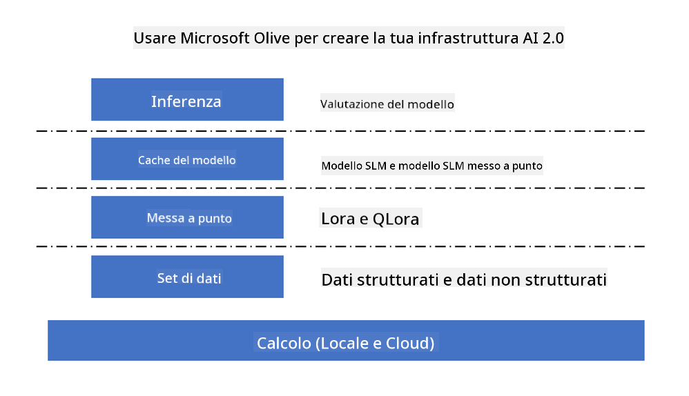
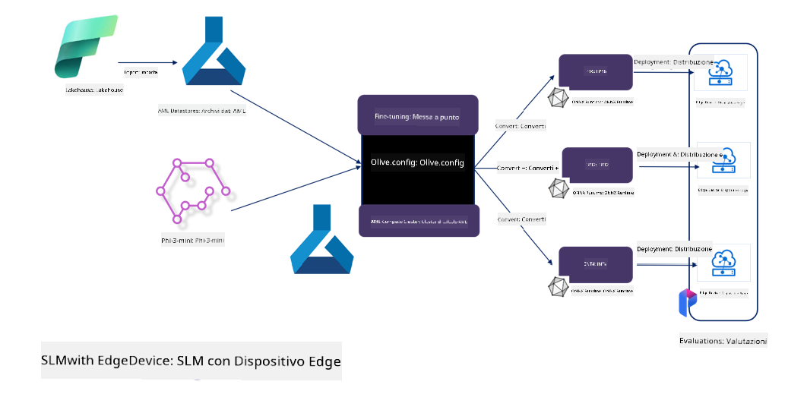

<!--
CO_OP_TRANSLATOR_METADATA:
{
  "original_hash": "5764be88ad2eb4f341e742eb8f14fab1",
  "translation_date": "2025-05-09T20:50:38+00:00",
  "source_file": "md/03.FineTuning/FineTuning_MicrosoftOlive.md",
  "language_code": "it"
}
-->
# **Affinamento di Phi-3 con Microsoft Olive**

[Olive](https://github.com/microsoft/OLive?WT.mc_id=aiml-138114-kinfeylo) è uno strumento di ottimizzazione dei modelli hardware-aware facile da usare, che integra tecniche all’avanguardia nel campo della compressione, ottimizzazione e compilazione dei modelli.

È progettato per semplificare il processo di ottimizzazione dei modelli di machine learning, assicurando un utilizzo efficiente delle architetture hardware specifiche.

Sia che tu lavori su applicazioni cloud o dispositivi edge, Olive ti permette di ottimizzare i tuoi modelli in modo semplice ed efficace.

## Caratteristiche principali:
- Olive aggrega e automatizza tecniche di ottimizzazione per target hardware specifici.
- Nessuna tecnica di ottimizzazione è universale, quindi Olive permette l’estendibilità consentendo agli esperti del settore di integrare le proprie innovazioni.

## Riduci lo sforzo ingegneristico:
- Gli sviluppatori spesso devono imparare e utilizzare diversi toolchain specifici per vendor hardware per preparare e ottimizzare i modelli addestrati per la distribuzione.
- Olive semplifica questa esperienza automatizzando le tecniche di ottimizzazione per l’hardware desiderato.

## Soluzione di ottimizzazione end-to-end pronta all’uso:

Componendo e regolando tecniche integrate, Olive offre una soluzione unificata per l’ottimizzazione end-to-end.
Tiene conto di vincoli come accuratezza e latenza durante l’ottimizzazione dei modelli.

## Utilizzo di Microsoft Olive per l’affinamento

Microsoft Olive è uno strumento open source di ottimizzazione dei modelli molto facile da usare, che copre sia l’affinamento che il riferimento nel campo dell’intelligenza artificiale generativa. Richiede solo una semplice configurazione e, combinato con l’uso di modelli linguistici open source di piccole dimensioni e relativi ambienti di runtime (AzureML / GPU locale, CPU, DirectML), consente di completare l’affinamento o il riferimento del modello tramite ottimizzazione automatica, trovando il modello migliore da distribuire sul cloud o su dispositivi edge. Permette alle aziende di costruire modelli verticali specifici per il proprio settore, sia on-premises che in cloud.



## Affinamento di Phi-3 con Microsoft Olive



## Esempio di codice e utilizzo di Phi-3 con Olive
In questo esempio userai Olive per:

- Affinare un adattatore LoRA per classificare frasi in Sad, Joy, Fear, Surprise.
- Unire i pesi dell’adattatore nel modello base.
- Ottimizzare e quantizzare il modello in int4.

[Sample Code](../../code/03.Finetuning/olive-ort-example/README.md)

### Configurazione di Microsoft Olive

L’installazione di Microsoft Olive è molto semplice e può essere effettuata per CPU, GPU, DirectML e Azure ML.

```bash
pip install olive-ai
```

Se vuoi eseguire un modello ONNX su CPU, puoi usare

```bash
pip install olive-ai[cpu]
```

Se vuoi eseguire un modello ONNX su GPU, puoi usare

```python
pip install olive-ai[gpu]
```

Se vuoi usare Azure ML, utilizza

```python
pip install git+https://github.com/microsoft/Olive#egg=olive-ai[azureml]
```

**Avviso**  
Requisiti OS: Ubuntu 20.04 / 22.04

### **Config.json di Microsoft Olive**

Dopo l’installazione, puoi configurare diverse impostazioni specifiche per il modello tramite il file Config, inclusi dati, calcolo, training, distribuzione e generazione del modello.

**1. Dati**

Microsoft Olive supporta l’addestramento su dati locali e cloud, configurabili nelle impostazioni.

*Impostazioni dati locali*

Puoi configurare semplicemente il dataset da utilizzare per l’affinamento, solitamente in formato json, adattandolo al template dati. Questo deve essere regolato in base ai requisiti del modello (ad esempio, adattarlo al formato richiesto da Microsoft Phi-3-mini. Se usi altri modelli, fai riferimento ai formati di affinamento richiesti da quei modelli).

```json

    "data_configs": [
        {
            "name": "dataset_default_train",
            "type": "HuggingfaceContainer",
            "load_dataset_config": {
                "params": {
                    "data_name": "json", 
                    "data_files":"dataset/dataset-classification.json",
                    "split": "train"
                }
            },
            "pre_process_data_config": {
                "params": {
                    "dataset_type": "corpus",
                    "text_cols": [
                            "phrase",
                            "tone"
                    ],
                    "text_template": "### Text: {phrase}\n### The tone is:\n{tone}",
                    "corpus_strategy": "join",
                    "source_max_len": 2048,
                    "pad_to_max_len": false,
                    "use_attention_mask": false
                }
            }
        }
    ],
```

**Impostazioni sorgente dati cloud**

Collegando il datastore di Azure AI Studio/Azure Machine Learning Service, puoi importare dati dal cloud. È possibile scegliere diverse sorgenti dati da Azure AI Studio/Azure Machine Learning Service tramite Microsoft Fabric e Azure Data come supporto per il fine-tuning.

```json

    "data_configs": [
        {
            "name": "dataset_default_train",
            "type": "HuggingfaceContainer",
            "load_dataset_config": {
                "params": {
                    "data_name": "json", 
                    "data_files": {
                        "type": "azureml_datastore",
                        "config": {
                            "azureml_client": {
                                "subscription_id": "Your Azure Subscrition ID",
                                "resource_group": "Your Azure Resource Group",
                                "workspace_name": "Your Azure ML Workspaces name"
                            },
                            "datastore_name": "workspaceblobstore",
                            "relative_path": "Your train_data.json Azure ML Location"
                        }
                    },
                    "split": "train"
                }
            },
            "pre_process_data_config": {
                "params": {
                    "dataset_type": "corpus",
                    "text_cols": [
                            "Question",
                            "Best Answer"
                    ],
                    "text_template": "<|user|>\n{Question}<|end|>\n<|assistant|>\n{Best Answer}\n<|end|>",
                    "corpus_strategy": "join",
                    "source_max_len": 2048,
                    "pad_to_max_len": false,
                    "use_attention_mask": false
                }
            }
        }
    ],
    
```

**2. Configurazione del calcolo**

Se vuoi lavorare in locale, puoi usare direttamente le risorse dati locali. Se vuoi usare risorse di Azure AI Studio / Azure Machine Learning Service, devi configurare i parametri Azure, il nome della potenza di calcolo, ecc.

```json

    "systems": {
        "aml": {
            "type": "AzureML",
            "config": {
                "accelerators": ["gpu"],
                "hf_token": true,
                "aml_compute": "Your Azure AI Studio / Azure Machine Learning Service Compute Name",
                "aml_docker_config": {
                    "base_image": "Your Azure AI Studio / Azure Machine Learning Service docker",
                    "conda_file_path": "conda.yaml"
                }
            }
        },
        "azure_arc": {
            "type": "AzureML",
            "config": {
                "accelerators": ["gpu"],
                "aml_compute": "Your Azure AI Studio / Azure Machine Learning Service Compute Name",
                "aml_docker_config": {
                    "base_image": "Your Azure AI Studio / Azure Machine Learning Service docker",
                    "conda_file_path": "conda.yaml"
                }
            }
        }
    },
```

***Avviso***

Poiché viene eseguito tramite container su Azure AI Studio/Azure Machine Learning Service, è necessario configurare l’ambiente richiesto, definito nel file conda.yaml.

```yaml

name: project_environment
channels:
  - defaults
dependencies:
  - python=3.8.13
  - pip=22.3.1
  - pip:
      - einops
      - accelerate
      - azure-keyvault-secrets
      - azure-identity
      - bitsandbytes
      - datasets
      - huggingface_hub
      - peft
      - scipy
      - sentencepiece
      - torch>=2.2.0
      - transformers
      - git+https://github.com/microsoft/Olive@jiapli/mlflow_loading_fix#egg=olive-ai[gpu]
      - --extra-index-url https://aiinfra.pkgs.visualstudio.com/PublicPackages/_packaging/ORT-Nightly/pypi/simple/ 
      - ort-nightly-gpu==1.18.0.dev20240307004
      - --extra-index-url https://aiinfra.pkgs.visualstudio.com/PublicPackages/_packaging/onnxruntime-genai/pypi/simple/
      - onnxruntime-genai-cuda

    

```

**3. Scegli il tuo SLM**

Puoi usare direttamente modelli da Hugging Face, oppure combinarli con il Model Catalog di Azure AI Studio / Azure Machine Learning per selezionare il modello da usare. Nell’esempio di codice seguente useremo Microsoft Phi-3-mini.

Se hai il modello in locale, puoi usare questo metodo

```json

    "input_model":{
        "type": "PyTorchModel",
        "config": {
            "hf_config": {
                "model_name": "model-cache/microsoft/phi-3-mini",
                "task": "text-generation",
                "model_loading_args": {
                    "trust_remote_code": true
                }
            }
        }
    },
```

Se vuoi usare un modello da Azure AI Studio / Azure Machine Learning Service, puoi usare questo metodo

```json

    "input_model":{
        "type": "PyTorchModel",
        "config": {
            "model_path": {
                "type": "azureml_registry_model",
                "config": {
                    "name": "microsoft/Phi-3-mini-4k-instruct",
                    "registry_name": "azureml-msr",
                    "version": "11"
                }
            },
             "model_file_format": "PyTorch.MLflow",
             "hf_config": {
                "model_name": "microsoft/Phi-3-mini-4k-instruct",
                "task": "text-generation",
                "from_pretrained_args": {
                    "trust_remote_code": true
                }
            }
        }
    },
```

**Avviso:**  
È necessario integrare con Azure AI Studio / Azure Machine Learning Service, quindi durante la configurazione del modello fai riferimento alla versione e ai nomi correlati.

Tutti i modelli su Azure devono essere impostati su PyTorch.MLflow.

Devi avere un account Hugging Face e associare la chiave al valore Key di Azure AI Studio / Azure Machine Learning.

**4. Algoritmo**

Microsoft Olive incapsula molto bene gli algoritmi di affinamento Lora e QLora. Devi solo configurare alcuni parametri rilevanti. Qui prendo QLora come esempio.

```json
        "lora": {
            "type": "LoRA",
            "config": {
                "target_modules": [
                    "o_proj",
                    "qkv_proj"
                ],
                "double_quant": true,
                "lora_r": 64,
                "lora_alpha": 64,
                "lora_dropout": 0.1,
                "train_data_config": "dataset_default_train",
                "eval_dataset_size": 0.3,
                "training_args": {
                    "seed": 0,
                    "data_seed": 42,
                    "per_device_train_batch_size": 1,
                    "per_device_eval_batch_size": 1,
                    "gradient_accumulation_steps": 4,
                    "gradient_checkpointing": false,
                    "learning_rate": 0.0001,
                    "num_train_epochs": 3,
                    "max_steps": 10,
                    "logging_steps": 10,
                    "evaluation_strategy": "steps",
                    "eval_steps": 187,
                    "group_by_length": true,
                    "adam_beta2": 0.999,
                    "max_grad_norm": 0.3
                }
            }
        },
```

Se vuoi la conversione in quantizzazione, il ramo principale di Microsoft Olive supporta già il metodo onnxruntime-genai. Puoi configurarlo in base alle tue esigenze:

1. unire i pesi dell’adattatore nel modello base  
2. convertire il modello in modello onnx con la precisione richiesta tramite ModelBuilder

ad esempio convertire in INT4 quantizzato

```json

        "merge_adapter_weights": {
            "type": "MergeAdapterWeights"
        },
        "builder": {
            "type": "ModelBuilder",
            "config": {
                "precision": "int4"
            }
        }
```

**Avviso**  
- Se usi QLoRA, al momento non è supportata la conversione di quantizzazione con ONNXRuntime-genai.  
- Si sottolinea che puoi configurare i passaggi sopra in base alle tue esigenze. Non è necessario configurare completamente tutti questi passaggi. A seconda delle tue necessità, puoi usare direttamente i passaggi dell’algoritmo senza affinamento. Alla fine devi configurare i motori rilevanti.

```json

    "engine": {
        "log_severity_level": 0,
        "host": "aml",
        "target": "aml",
        "search_strategy": false,
        "execution_providers": ["CUDAExecutionProvider"],
        "cache_dir": "../model-cache/models/phi3-finetuned/cache",
        "output_dir" : "../model-cache/models/phi3-finetuned"
    }
```

**5. Affinamento completato**

Da linea di comando, esegui nella directory di olive-config.json

```bash
olive run --config olive-config.json  
```

**Disclaimer**:  
Questo documento è stato tradotto utilizzando il servizio di traduzione automatica AI [Co-op Translator](https://github.com/Azure/co-op-translator). Pur impegnandoci per garantire l’accuratezza, si prega di notare che le traduzioni automatiche possono contenere errori o imprecisioni. Il documento originale nella sua lingua nativa deve essere considerato la fonte autorevole. Per informazioni critiche, si raccomanda una traduzione professionale effettuata da un umano. Non ci assumiamo alcuna responsabilità per eventuali incomprensioni o interpretazioni errate derivanti dall’uso di questa traduzione.