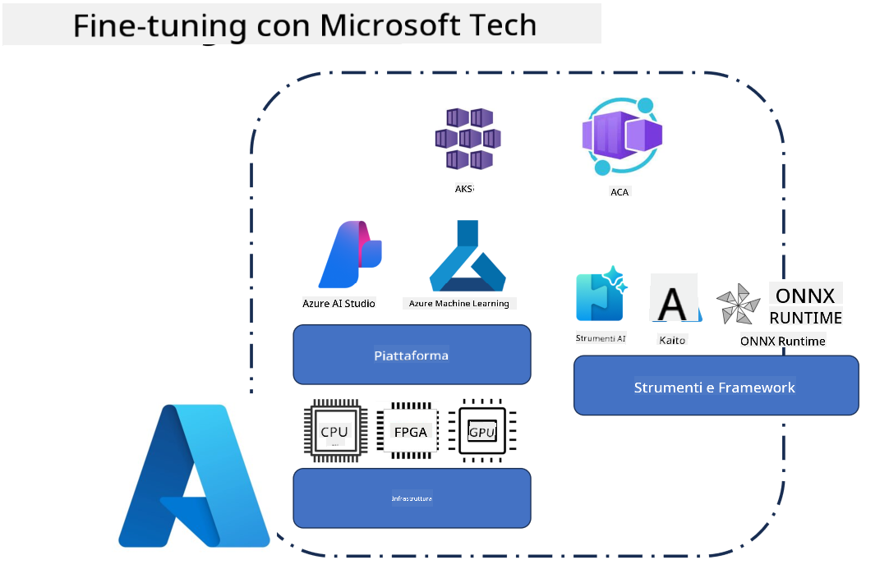
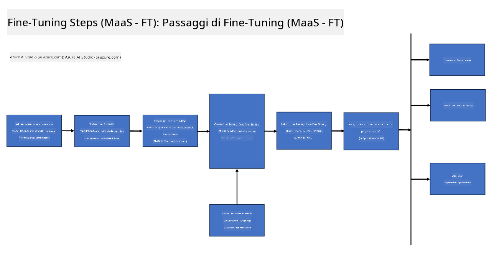
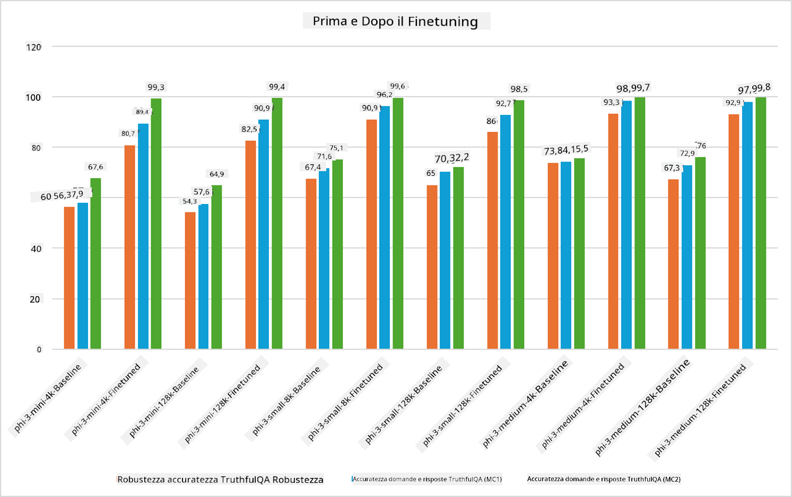

<!--
CO_OP_TRANSLATOR_METADATA:
{
  "original_hash": "cb5648935f63edc17e95ce38f23adc32",
  "translation_date": "2025-05-09T21:55:02+00:00",
  "source_file": "md/03.FineTuning/FineTuning_Scenarios.md",
  "language_code": "it"
}
-->
## Scenari di Fine Tuning

**Piattaforma** Include diverse tecnologie come Azure AI Foundry, Azure Machine Learning, AI Tools, Kaito e ONNX Runtime.

**Infrastruttura** Include CPU e FPGA, fondamentali per il processo di fine-tuning. Ti mostro le icone di ciascuna di queste tecnologie.

**Strumenti & Framework** Include ONNX Runtime e ONNX Runtime. Ti mostro le icone di ciascuna di queste tecnologie.  
[Inserisci le icone per ONNX Runtime e ONNX Runtime]

Il processo di fine-tuning con le tecnologie Microsoft coinvolge vari componenti e strumenti. Comprendendo e utilizzando queste tecnologie, possiamo ottimizzare efficacemente le nostre applicazioni e creare soluzioni migliori.

## Model as Service

Esegui il fine-tuning del modello utilizzando il fine-tuning ospitato, senza la necessità di creare e gestire risorse di calcolo.

Il fine-tuning serverless è disponibile per i modelli Phi-3-mini e Phi-3-medium, permettendo agli sviluppatori di personalizzare rapidamente e facilmente i modelli per scenari cloud e edge senza dover gestire il calcolo. Abbiamo inoltre annunciato che Phi-3-small è ora disponibile tramite la nostra offerta Models-as-a-Service, così gli sviluppatori possono iniziare rapidamente e facilmente con lo sviluppo AI senza doversi occupare dell’infrastruttura sottostante.

## Model as a Platform

Gli utenti gestiscono le proprie risorse di calcolo per effettuare il fine-tuning dei modelli.

[Fine Tuning Sample](https://github.com/Azure/azureml-examples/blob/main/sdk/python/foundation-models/system/finetune/chat-completion/chat-completion.ipynb)

## Scenari di Fine Tuning

| | | | | | | |
|-|-|-|-|-|-|-|
|Scenario|LoRA|QLoRA|PEFT|DeepSpeed|ZeRO|DORA|
|Adattare LLM pre-addestrati a compiti o domini specifici|Sì|Sì|Sì|Sì|Sì|Sì|
|Fine-tuning per task NLP come classificazione testi, riconoscimento entità nominate e traduzione automatica|Sì|Sì|Sì|Sì|Sì|Sì|
|Fine-tuning per task di QA|Sì|Sì|Sì|Sì|Sì|Sì|
|Fine-tuning per generare risposte simili a quelle umane nei chatbot|Sì|Sì|Sì|Sì|Sì|Sì|
|Fine-tuning per generare musica, arte o altre forme di creatività|Sì|Sì|Sì|Sì|Sì|Sì|
|Ridurre costi computazionali e finanziari|Sì|Sì|No|Sì|Sì|No|
|Ridurre l’uso di memoria|No|Sì|No|Sì|Sì|Sì|
|Usare meno parametri per un fine-tuning efficiente|No|Sì|Sì|No|No|Sì|
|Forma di data parallelism efficiente in memoria che consente di accedere alla memoria aggregata di tutte le GPU disponibili|No|No|No|Sì|Sì|Sì|

## Esempi di Prestazioni nel Fine Tuning

**Disclaimer**:  
Questo documento è stato tradotto utilizzando il servizio di traduzione AI [Co-op Translator](https://github.com/Azure/co-op-translator). Pur impegnandoci per garantire accuratezza, si prega di notare che le traduzioni automatiche possono contenere errori o inesattezze. Il documento originale nella sua lingua nativa deve essere considerato la fonte autorevole. Per informazioni critiche, si raccomanda una traduzione professionale effettuata da un umano. Non siamo responsabili per eventuali malintesi o interpretazioni errate derivanti dall’uso di questa traduzione.