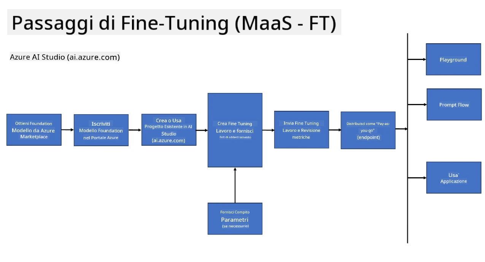
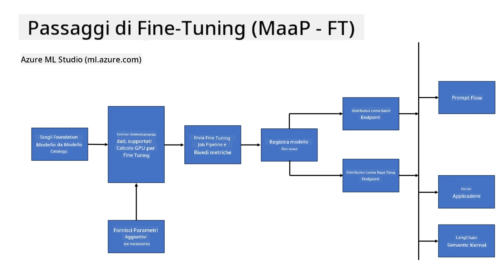
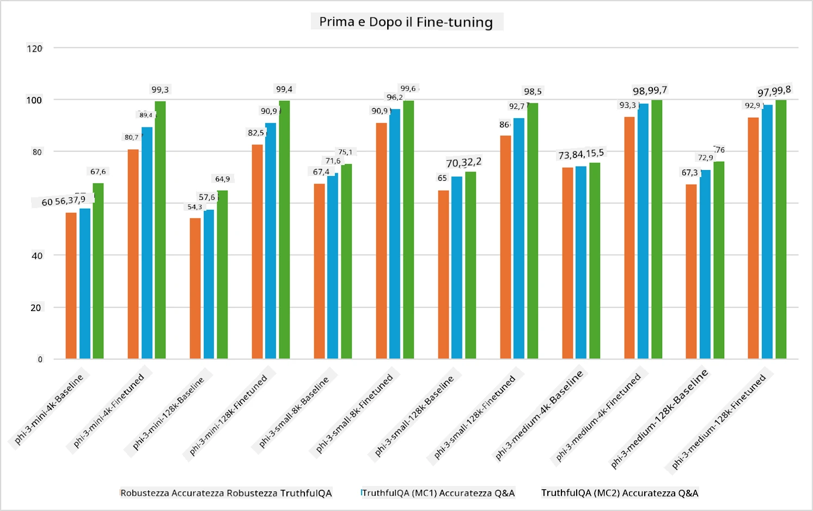

## Scenari di Fine Tuning

**Piattaforma** Include diverse tecnologie come Azure AI Foundry, Azure Machine Learning, AI Tools, Kaito e ONNX Runtime.

**Infrastruttura** Comprende CPU e FPGA, essenziali per il processo di fine-tuning. Ti mostro le icone di ciascuna di queste tecnologie.

**Strumenti e Framework** Include ONNX Runtime e ONNX Runtime. Ti mostro le icone di ciascuna di queste tecnologie.  
[Inserisci le icone per ONNX Runtime e ONNX Runtime]

Il processo di fine-tuning con le tecnologie Microsoft coinvolge vari componenti e strumenti. Comprendendo e utilizzando queste tecnologie, possiamo ottimizzare efficacemente le nostre applicazioni e creare soluzioni migliori.

## Modello come Servizio

Esegui il fine-tuning del modello utilizzando il fine-tuning ospitato, senza la necessità di creare e gestire risorse di calcolo.

Il fine-tuning serverless è disponibile per i modelli Phi-3-mini e Phi-3-medium, permettendo agli sviluppatori di personalizzare rapidamente e facilmente i modelli per scenari cloud e edge senza dover gestire risorse di calcolo. Abbiamo inoltre annunciato che Phi-3-small è ora disponibile tramite la nostra offerta Models-as-a-Service, così gli sviluppatori possono iniziare rapidamente e facilmente con lo sviluppo AI senza dover gestire l’infrastruttura sottostante.

## Modello come Piattaforma

Gli utenti gestiscono le proprie risorse di calcolo per eseguire il fine-tuning dei loro modelli.

[Fine Tuning Sample](https://github.com/Azure/azureml-examples/blob/main/sdk/python/foundation-models/system/finetune/chat-completion/chat-completion.ipynb)

## Scenari di Fine Tuning

| | | | | | | |
|-|-|-|-|-|-|-|
|Scenario|LoRA|QLoRA|PEFT|DeepSpeed|ZeRO|DORA|
|Adattare LLM pre-addestrati a compiti o domini specifici|Sì|Sì|Sì|Sì|Sì|Sì|
|Fine-tuning per compiti NLP come classificazione del testo, riconoscimento entità nominate e traduzione automatica|Sì|Sì|Sì|Sì|Sì|Sì|
|Fine-tuning per compiti di QA|Sì|Sì|Sì|Sì|Sì|Sì|
|Fine-tuning per generare risposte simili a quelle umane nei chatbot|Sì|Sì|Sì|Sì|Sì|Sì|
|Fine-tuning per generare musica, arte o altre forme di creatività|Sì|Sì|Sì|Sì|Sì|Sì|
|Riduzione dei costi computazionali e finanziari|Sì|Sì|No|Sì|Sì|No|
|Riduzione dell’uso della memoria|No|Sì|No|Sì|Sì|Sì|
|Uso di meno parametri per un fine-tuning efficiente|No|Sì|Sì|No|No|Sì|
|Forma di parallelismo dati efficiente in memoria che consente l’accesso alla memoria aggregata di tutte le GPU disponibili|No|No|No|Sì|Sì|Sì|

## Esempi di Prestazioni del Fine Tuning

**Disclaimer**:  
Questo documento è stato tradotto utilizzando il servizio di traduzione automatica [Co-op Translator](https://github.com/Azure/co-op-translator). Pur impegnandoci per garantire accuratezza, si prega di notare che le traduzioni automatiche possono contenere errori o imprecisioni. Il documento originale nella sua lingua nativa deve essere considerato la fonte autorevole. Per informazioni critiche, si raccomanda una traduzione professionale effettuata da un umano. Non siamo responsabili per eventuali malintesi o interpretazioni errate derivanti dall’uso di questa traduzione.