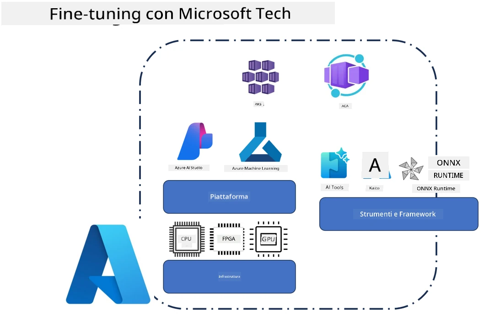
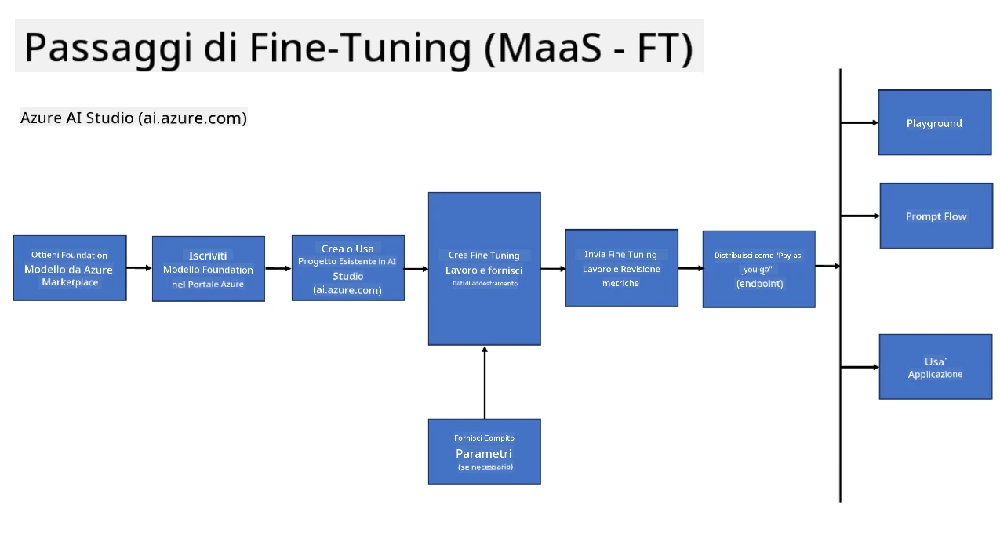
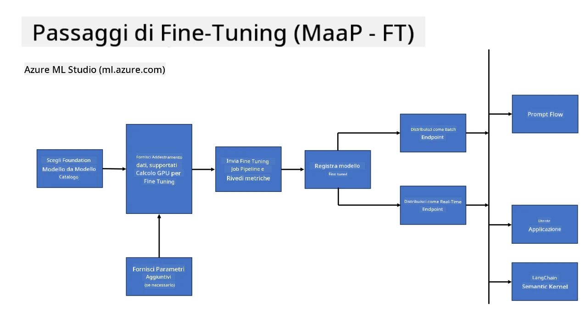
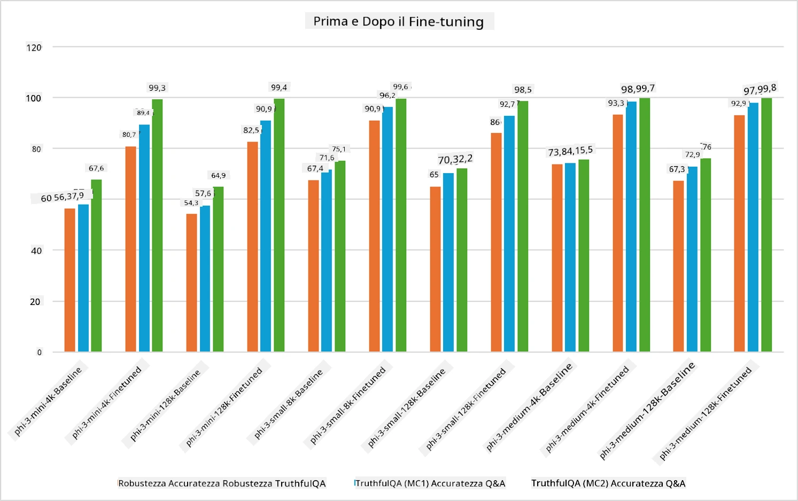

## Scenari di Fine Tuning

Questa sezione fornisce una panoramica degli scenari di fine-tuning negli ambienti Microsoft Foundry e Azure, inclusi i modelli di distribuzione, i livelli di infrastruttura e le tecniche di ottimizzazione comunemente utilizzate.

**Piattaforma**  
Include servizi gestiti come Microsoft Foundry (precedentemente Azure AI Foundry) e Azure Machine Learning, che offrono gestione dei modelli, orchestrazione, monitoraggio degli esperimenti e flussi di lavoro di deployment.

**Infrastruttura**  
Il fine-tuning richiede risorse di calcolo scalabili. Negli ambienti Azure, ciò include tipicamente macchine virtuali basate su GPU e risorse CPU per carichi di lavoro leggeri, oltre a storage scalabile per set di dati e checkpoint.

**Strumenti & Framework**  
I flussi di lavoro di fine-tuning si basano comunemente su framework e librerie di ottimizzazione come Hugging Face Transformers, DeepSpeed e PEFT (Parameter-Efficient Fine-Tuning).

Il processo di fine-tuning con le tecnologie Microsoft copre servizi di piattaforma, infrastruttura di calcolo e framework di addestramento. Comprendendo come questi componenti lavorano insieme, gli sviluppatori possono adattare efficacemente i modelli base a compiti specifici e scenari di produzione.

## Modello come Servizio

Affina il modello utilizzando il fine-tuning ospitato, senza la necessità di creare e gestire risorse di calcolo.

Il fine-tuning serverless è ora disponibile per le famiglie di modelli Phi-3, Phi-3.5 e Phi-4, permettendo agli sviluppatori di personalizzare rapidamente e facilmente i modelli per scenari cloud e edge senza dover organizzare risorse di calcolo.

## Modello come Piattaforma

Gli utenti gestiscono le proprie risorse di calcolo per affinare i propri modelli.

[Fine Tuning Sample](https://github.com/Azure/azureml-examples/blob/main/sdk/python/foundation-models/system/finetune/chat-completion/chat-completion.ipynb)

## Confronto Tecniche di Fine-Tuning

|Scenario|LoRA|QLoRA|PEFT|DeepSpeed|ZeRO|DoRA|
|---|---|---|---|---|---|---|
|Adattare LLM pre-addestrati a compiti o domini specifici|Sì|Sì|Sì|Sì|Sì|Sì|
|Fine-tuning per compiti NLP come classificazione del testo, riconoscimento entità nominate e traduzione automatica|Sì|Sì|Sì|Sì|Sì|Sì|
|Fine-tuning per compiti di QA|Sì|Sì|Sì|Sì|Sì|Sì|
|Fine-tuning per generare risposte umane in chatbot|Sì|Sì|Sì|Sì|Sì|Sì|
|Fine-tuning per generare musica, arte o altre forme di creatività|Sì|Sì|Sì|Sì|Sì|Sì|
|Riduzione dei costi computazionali e finanziari|Sì|Sì|Sì|Sì|Sì|Sì|
|Riduzione dell’uso della memoria|Sì|Sì|Sì|Sì|Sì|Sì|
|Uso di meno parametri per un fine-tuning efficiente|Sì|Sì|Sì|No|No|Sì|
|Forma di parallelismo dati a memoria efficiente che permette l’accesso alla memoria aggregata delle GPU disponibili|No|No|No|Sì|Sì|No|

> [!NOTE]
> LoRA, QLoRA, PEFT e DoRA sono metodi di fine-tuning a efficienza parametrica, mentre DeepSpeed e ZeRO si concentrano sull’addestramento distribuito e sull’ottimizzazione della memoria.

## Esempi di Performance di Fine Tuning

---

<!-- CO-OP TRANSLATOR DISCLAIMER START -->
**Disclaimer**:  
Questo documento è stato tradotto utilizzando il servizio di traduzione automatica [Co-op Translator](https://github.com/Azure/co-op-translator). Pur impegnandoci per garantire l’accuratezza, si prega di notare che le traduzioni automatiche possono contenere errori o imprecisioni. Il documento originale nella sua lingua natia deve essere considerato la fonte autorevole. Per informazioni di natura critica, si raccomanda una traduzione professionale effettuata da un umano. Non siamo responsabili per eventuali malintesi o interpretazioni errate derivanti dall’uso di questa traduzione.
<!-- CO-OP TRANSLATOR DISCLAIMER END -->