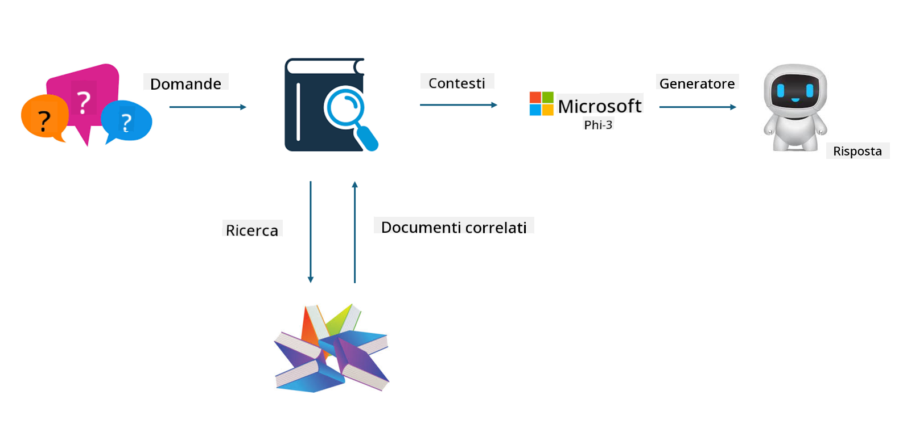

<!--
CO_OP_TRANSLATOR_METADATA:
{
  "original_hash": "e4e010400c2918557b36bb932a14004c",
  "translation_date": "2025-05-09T22:15:18+00:00",
  "source_file": "md/03.FineTuning/FineTuning_vs_RAG.md",
  "language_code": "it"
}
-->
## Fine-tuning vs RAG

## Retrieval Augmented Generation

RAG combina il recupero dati con la generazione di testo. I dati strutturati e non strutturati dell’azienda vengono archiviati in un database vettoriale. Quando si cerca contenuto rilevante, si trovano riassunti e contenuti pertinenti per creare un contesto, quindi si sfrutta la capacità di completamento testuale di LLM/SLM per generare il contenuto.

## Processo RAG

## Fine-tuning
Il fine-tuning si basa sul miglioramento di un modello specifico. Non è necessario partire dall’algoritmo del modello, ma serve accumulare dati in modo continuo. Se vuoi terminologia e espressioni linguistiche più precise nelle applicazioni industriali, il fine-tuning è la scelta migliore. Tuttavia, se i tuoi dati cambiano spesso, il fine-tuning può diventare complicato.

## Come scegliere
Se la nostra risposta richiede l’introduzione di dati esterni, RAG è la scelta migliore.

Se hai bisogno di fornire conoscenze di settore stabili e precise, il fine-tuning è una buona opzione. RAG dà priorità al recupero di contenuti rilevanti, ma potrebbe non cogliere sempre le sfumature specialistiche.

Il fine-tuning richiede un dataset di alta qualità e, se si tratta di un piccolo insieme di dati, non farà molta differenza. RAG è più flessibile.  
Il fine-tuning è una scatola nera, una sorta di metafisica, ed è difficile comprenderne il funzionamento interno. RAG invece facilita l’individuazione della fonte dei dati, permettendo così di correggere efficacemente allucinazioni o errori di contenuto e offrendo maggiore trasparenza.

**Disclaimer**:  
Questo documento è stato tradotto utilizzando il servizio di traduzione automatica AI [Co-op Translator](https://github.com/Azure/co-op-translator). Pur impegnandoci per garantire accuratezza, si prega di notare che le traduzioni automatiche possono contenere errori o inesattezze. Il documento originale nella sua lingua nativa deve essere considerato la fonte autorevole. Per informazioni critiche, si raccomanda la traduzione professionale effettuata da un essere umano. Non ci assumiamo alcuna responsabilità per eventuali malintesi o interpretazioni errate derivanti dall’uso di questa traduzione.