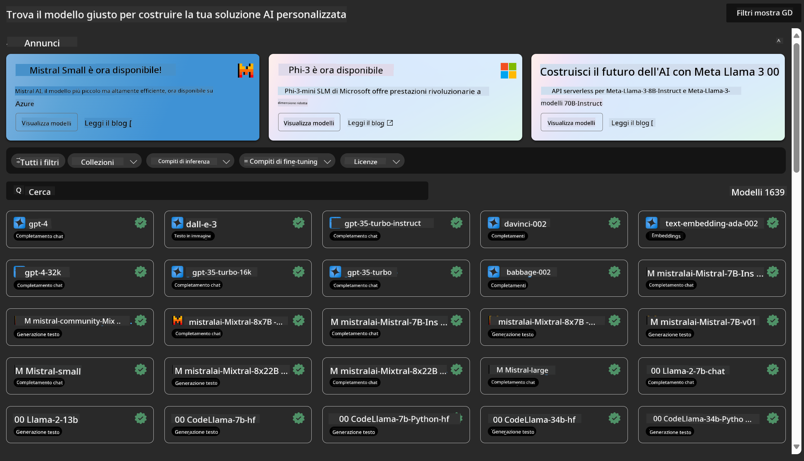
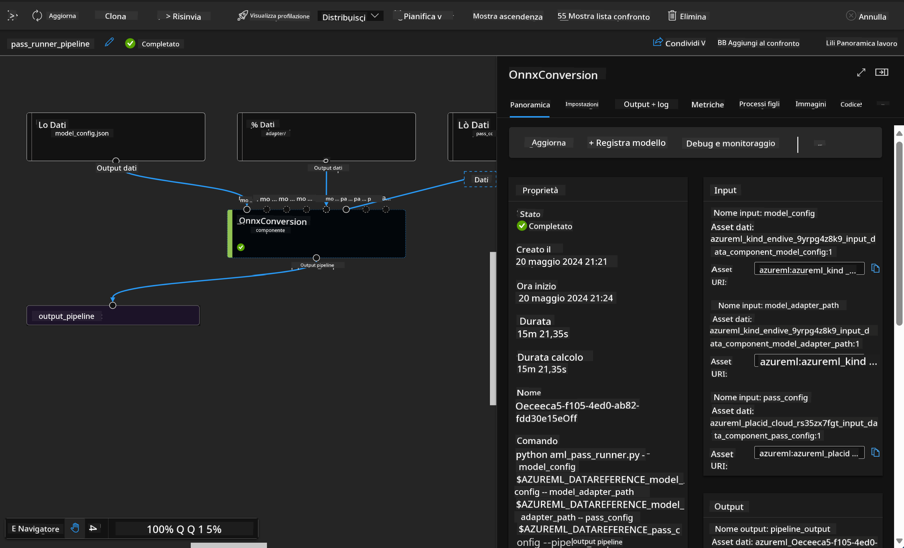

<!--
CO_OP_TRANSLATOR_METADATA:
{
  "original_hash": "7fe541373802e33568e94e13226d463c",
  "translation_date": "2025-05-09T22:19:32+00:00",
  "source_file": "md/03.FineTuning/Introduce_AzureML.md",
  "language_code": "it"
}
-->
# **Introduzione al servizio Azure Machine Learning**

[Azure Machine Learning](https://ml.azure.com?WT.mc_id=aiml-138114-kinfeylo) è un servizio cloud che accelera e gestisce il ciclo di vita dei progetti di machine learning (ML).

I professionisti ML, data scientist e ingegneri possono utilizzarlo nelle loro attività quotidiane per:

- Addestrare e distribuire modelli.
- Gestire le operazioni di machine learning (MLOps).
- È possibile creare un modello in Azure Machine Learning oppure utilizzare un modello sviluppato su piattaforme open-source come PyTorch, TensorFlow o scikit-learn.
- Gli strumenti MLOps aiutano a monitorare, riaddestrare e ridistribuire i modelli.

## A chi è rivolto Azure Machine Learning?

**Data Scientist e ML Engineer**

Possono utilizzare strumenti per accelerare e automatizzare i flussi di lavoro quotidiani.
Azure ML offre funzionalità per equità, spiegabilità, tracciabilità e auditabilità.

**Sviluppatori di applicazioni:**

Possono integrare modelli in applicazioni o servizi in modo semplice e fluido.

**Sviluppatori di piattaforme**

Hanno accesso a un set completo di strumenti supportati da robuste API di Azure Resource Manager.
Questi strumenti consentono di creare tool avanzati per ML.

**Aziende**

Lavorando nel cloud Microsoft Azure, le aziende beneficiano di una sicurezza familiare e di un controllo degli accessi basato sui ruoli.
Possono configurare i progetti per controllare l’accesso ai dati protetti e a specifiche operazioni.

## Produttività per tutto il team

I progetti ML spesso richiedono un team con competenze diversificate per costruire e mantenere i sistemi.

Azure ML offre strumenti che permettono di:
- Collaborare con il team tramite notebook condivisi, risorse di calcolo, calcolo serverless, dati e ambienti.
- Sviluppare modelli con attenzione a equità, spiegabilità, tracciabilità e auditabilità per rispettare requisiti di lineage e conformità.
- Distribuire modelli ML rapidamente e facilmente su larga scala, gestendoli e governandoli in modo efficiente con MLOps.
- Eseguire carichi di lavoro ML ovunque con governance, sicurezza e conformità integrate.

## Strumenti della piattaforma cross-compatibili

Chiunque nel team ML può usare gli strumenti preferiti per portare a termine il lavoro.
Che si tratti di esperimenti rapidi, tuning degli iperparametri, costruzione di pipeline o gestione delle inferenze, si possono utilizzare interfacce familiari come:
- Azure Machine Learning Studio
- Python SDK (v2)
- Azure CLI (v2)
- Azure Resource Manager REST APIs

Durante la raffinazione dei modelli e la collaborazione nel ciclo di sviluppo, è possibile condividere e trovare asset, risorse e metriche all’interno dell’interfaccia di Azure Machine Learning studio.

## **LLM/SLM in Azure ML**

Azure ML ha aggiunto molte funzioni legate a LLM/SLM, combinando LLMOps e SLMOps per creare una piattaforma tecnologica di intelligenza artificiale generativa a livello aziendale.

### **Catalogo Modelli**

Gli utenti aziendali possono distribuire modelli diversi a seconda degli scenari di business tramite il Catalogo Modelli, fornendo servizi come Model as Service per sviluppatori o utenti aziendali.

Il Catalogo Modelli in Azure Machine Learning studio è il punto centrale per scoprire e utilizzare un’ampia gamma di modelli che permettono di costruire applicazioni di Generative AI. Il catalogo include centinaia di modelli provenienti da provider come Azure OpenAI service, Mistral, Meta, Cohere, Nvidia, Hugging Face, inclusi modelli addestrati da Microsoft. I modelli di provider diversi da Microsoft sono Non-Microsoft Products, come definito nei Product Terms di Microsoft, e soggetti ai termini forniti con il modello.

### **Job Pipeline**

Il nucleo di una pipeline di machine learning è suddividere un compito ML completo in un flusso di lavoro a più fasi. Ogni fase è un componente gestibile che può essere sviluppato, ottimizzato, configurato e automatizzato singolarmente. Le fasi sono collegate tramite interfacce ben definite. Il servizio pipeline di Azure Machine Learning orchestra automaticamente tutte le dipendenze tra le fasi.

Nel fine-tuning di SLM / LLM, possiamo gestire dati, addestramento e processi di generazione tramite Pipeline.

### **Prompt flow**

Vantaggi dell’uso di Azure Machine Learning prompt flow  
Azure Machine Learning prompt flow offre numerosi vantaggi che aiutano gli utenti a passare dall’ideazione alla sperimentazione e, infine, ad applicazioni LLM pronte per la produzione:

**Agilità nell’ingegneria dei prompt**

Esperienza interattiva di authoring: Azure Machine Learning prompt flow fornisce una rappresentazione visiva della struttura del flusso, permettendo agli utenti di comprendere e navigare facilmente i progetti. Offre anche un’esperienza di coding simile a un notebook per uno sviluppo e debugging efficienti.  
Varianti per il tuning dei prompt: gli utenti possono creare e confrontare più varianti di prompt, facilitando un processo iterativo di raffinamento.

Valutazione: i flussi di valutazione integrati permettono di misurare la qualità e l’efficacia di prompt e flussi.

Risorse complete: Azure Machine Learning prompt flow include una libreria di strumenti, esempi e template incorporati che fungono da punto di partenza per lo sviluppo, stimolando la creatività e accelerando il processo.

**Prontezza aziendale per applicazioni basate su LLM**

Collaborazione: Azure Machine Learning prompt flow supporta la collaborazione di team, permettendo a più utenti di lavorare insieme su progetti di ingegneria dei prompt, condividere conoscenze e mantenere il controllo delle versioni.

Piattaforma tutto-in-uno: Azure Machine Learning prompt flow semplifica l’intero processo di ingegneria dei prompt, dallo sviluppo e valutazione fino alla distribuzione e monitoraggio. Gli utenti possono distribuire facilmente i flussi come endpoint Azure Machine Learning e monitorarne le prestazioni in tempo reale, garantendo operazioni ottimali e miglioramenti continui.

Soluzioni di Azure Machine Learning per la prontezza aziendale: Prompt flow sfrutta le robuste soluzioni di prontezza aziendale di Azure Machine Learning, offrendo una base sicura, scalabile e affidabile per sviluppo, sperimentazione e distribuzione dei flussi.

Con Azure Machine Learning prompt flow, gli utenti possono liberare la loro agilità nell’ingegneria dei prompt, collaborare efficacemente e sfruttare soluzioni di livello enterprise per sviluppare e distribuire con successo applicazioni basate su LLM.

Combinando la potenza di calcolo, i dati e i diversi componenti di Azure ML, gli sviluppatori aziendali possono costruire facilmente le proprie applicazioni di intelligenza artificiale.

**Disclaimer**:  
Questo documento è stato tradotto utilizzando il servizio di traduzione AI [Co-op Translator](https://github.com/Azure/co-op-translator). Pur impegnandoci per garantire l'accuratezza, si prega di notare che le traduzioni automatiche possono contenere errori o inesattezze. Il documento originale nella sua lingua nativa deve essere considerato la fonte autorevole. Per informazioni critiche, si raccomanda una traduzione professionale umana. Non siamo responsabili per eventuali incomprensioni o interpretazioni errate derivanti dall'uso di questa traduzione.