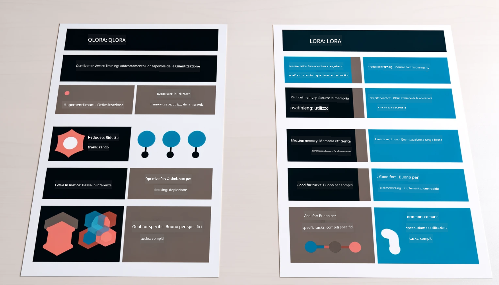

<!--
CO_OP_TRANSLATOR_METADATA:
{
  "original_hash": "743d7e9cb9c4e8ea642d77bee657a7fa",
  "translation_date": "2025-07-17T09:56:07+00:00",
  "source_file": "md/03.FineTuning/LetPhi3gotoIndustriy.md",
  "language_code": "it"
}
-->
# **Lascia che Phi-3 diventi un esperto del settore**

Per applicare il modello Phi-3 a un settore industriale, è necessario aggiungere dati aziendali specifici del settore al modello Phi-3. Abbiamo due opzioni diverse: la prima è RAG (Retrieval Augmented Generation) e la seconda è il Fine Tuning.

## **RAG vs Fine-Tuning**

### **Retrieval Augmented Generation**

RAG è recupero dati + generazione di testo. I dati strutturati e non strutturati dell’azienda vengono archiviati nel database vettoriale. Quando si cerca contenuto rilevante, si trovano il sommario e il contenuto pertinenti per formare un contesto, e si combina la capacità di completamento testuale di LLM/SLM per generare contenuti.

### **Fine-tuning**

Il fine-tuning si basa sul miglioramento di un modello esistente. Non è necessario partire dall’algoritmo del modello, ma i dati devono essere accumulati continuamente. Se desideri una terminologia e un’espressione linguistica più precise nelle applicazioni di settore, il fine-tuning è la scelta migliore. Tuttavia, se i tuoi dati cambiano frequentemente, il fine-tuning può diventare complicato.

### **Come scegliere**

1. Se la nostra risposta richiede l’introduzione di dati esterni, RAG è la scelta migliore

2. Se hai bisogno di fornire conoscenze di settore stabili e precise, il fine-tuning sarà una buona scelta. RAG dà priorità al recupero di contenuti rilevanti ma potrebbe non cogliere sempre le sfumature specialistiche.

3. Il fine-tuning richiede un set di dati di alta qualità e, se si tratta solo di un piccolo insieme di dati, non farà molta differenza. RAG è più flessibile.

4. Il fine-tuning è una scatola nera, una sorta di metafisica, ed è difficile comprendere il meccanismo interno. RAG invece facilita l’individuazione della fonte dei dati, permettendo di correggere efficacemente allucinazioni o errori di contenuto e offrendo maggiore trasparenza.

### **Scenari**

1. I settori verticali richiedono un vocabolario e un’espressione professionale specifici, ***Fine-tuning*** sarà la scelta migliore

2. Nei sistemi di QA, che coinvolgono la sintesi di diversi punti di conoscenza, ***RAG*** sarà la scelta migliore

3. La combinazione di flussi di lavoro aziendali automatizzati ***RAG + Fine-tuning*** è la scelta migliore

## **Come usare RAG**

Un database vettoriale è una raccolta di dati memorizzati in forma matematica. I database vettoriali facilitano ai modelli di machine learning la memorizzazione degli input precedenti, permettendo di supportare casi d’uso come ricerca, raccomandazioni e generazione di testo. I dati possono essere identificati in base a metriche di similarità anziché corrispondenze esatte, consentendo ai modelli di comprendere il contesto dei dati.

Il database vettoriale è la chiave per realizzare RAG. Possiamo convertire i dati in archiviazione vettoriale tramite modelli vettoriali come text-embedding-3, jina-ai-embedding, ecc.

Per saperne di più su come creare un’applicazione RAG [https://github.com/microsoft/Phi-3CookBook](https://github.com/microsoft/Phi-3CookBook?WT.mc_id=aiml-138114-kinfeylo) 

## **Come usare il Fine-tuning**

Gli algoritmi comunemente usati nel Fine-tuning sono Lora e QLora. Come scegliere?
- [Scopri di più con questo notebook di esempio](../../../../code/04.Finetuning/Phi_3_Inference_Finetuning.ipynb)
- [Esempio di Python FineTuning Sample](../../../../code/04.Finetuning/FineTrainingScript.py)

### **Lora e QLora**

LoRA (Low-Rank Adaptation) e QLoRA (Quantized Low-Rank Adaptation) sono entrambe tecniche utilizzate per il fine-tuning di grandi modelli linguistici (LLM) tramite Parameter Efficient Fine Tuning (PEFT). Le tecniche PEFT sono progettate per addestrare i modelli in modo più efficiente rispetto ai metodi tradizionali.  
LoRA è una tecnica di fine-tuning autonoma che riduce l’uso di memoria applicando un’approssimazione a basso rango alla matrice di aggiornamento dei pesi. Offre tempi di addestramento rapidi e mantiene prestazioni vicine ai metodi tradizionali di fine-tuning.

QLoRA è una versione estesa di LoRA che incorpora tecniche di quantizzazione per ridurre ulteriormente l’uso della memoria. QLoRA quantizza la precisione dei parametri di peso nel LLM pre-addestrato a una precisione di 4 bit, risultando più efficiente in termini di memoria rispetto a LoRA. Tuttavia, l’addestramento con QLoRA è circa il 30% più lento rispetto a LoRA a causa dei passaggi aggiuntivi di quantizzazione e dequantizzazione.

QLoRA utilizza LoRA come supporto per correggere gli errori introdotti durante la quantizzazione. QLoRA consente il fine-tuning di modelli enormi con miliardi di parametri su GPU relativamente piccole e facilmente disponibili. Ad esempio, QLoRA può effettuare il fine-tuning di un modello da 70 miliardi di parametri che richiederebbe 36 GPU con solo 2

**Disclaimer**:  
Questo documento è stato tradotto utilizzando il servizio di traduzione automatica [Co-op Translator](https://github.com/Azure/co-op-translator). Pur impegnandoci per garantire accuratezza, si prega di notare che le traduzioni automatiche possono contenere errori o imprecisioni. Il documento originale nella sua lingua nativa deve essere considerato la fonte autorevole. Per informazioni critiche, si raccomanda una traduzione professionale effettuata da un umano. Non ci assumiamo alcuna responsabilità per eventuali malintesi o interpretazioni errate derivanti dall’uso di questa traduzione.