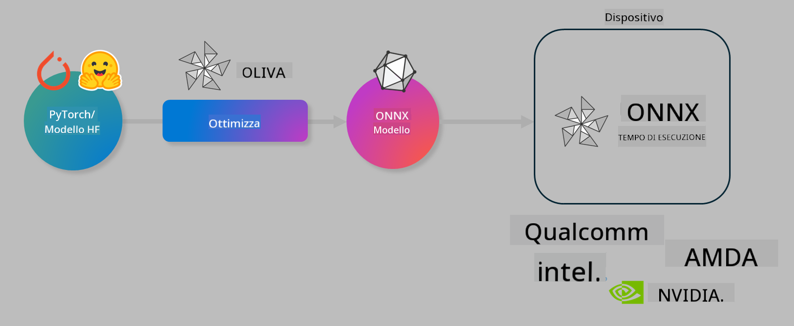

<!--
CO_OP_TRANSLATOR_METADATA:
{
  "original_hash": "6bbe47de3b974df7eea29dfeccf6032b",
  "translation_date": "2025-05-09T22:36:00+00:00",
  "source_file": "md/03.FineTuning/olive-lab/readme.md",
  "language_code": "it"
}
-->
# Lab. Ottimizza modelli AI per l'inferenza on-device

## Introduzione

> [!IMPORTANT]  
> Questo laboratorio richiede una **GPU Nvidia A10 o A100** con i driver associati e il toolkit CUDA (versione 12+) installati.

> [!NOTE]  
> Questo è un laboratorio di **35 minuti** che ti offrirà un'introduzione pratica ai concetti fondamentali per ottimizzare modelli per l'inferenza on-device usando OLIVE.

## Obiettivi di apprendimento

Al termine di questo laboratorio, sarai in grado di utilizzare OLIVE per:

- Quantizzare un modello AI utilizzando il metodo di quantizzazione AWQ.  
- Eseguire il fine-tuning di un modello AI per un compito specifico.  
- Generare adattatori LoRA (modello fine-tuned) per un'inferenza efficiente on-device su ONNX Runtime.

### Cos’è Olive

Olive (*O*NNX *live*) è un toolkit di ottimizzazione modelli con CLI integrata che ti permette di distribuire modelli per ONNX runtime +++https://onnxruntime.ai+++ garantendo qualità e performance.



L’input di Olive è solitamente un modello PyTorch o Hugging Face, mentre l’output è un modello ONNX ottimizzato, eseguito su un dispositivo (target di deployment) che utilizza ONNX runtime. Olive ottimizza il modello per l’acceleratore AI del dispositivo di destinazione (NPU, GPU, CPU) fornito da vendor hardware come Qualcomm, AMD, Nvidia o Intel.

Olive esegue un *workflow*, ovvero una sequenza ordinata di singoli task di ottimizzazione chiamati *pass* - esempi di pass includono: compressione modello, acquisizione grafo, quantizzazione, ottimizzazione grafo. Ogni pass ha un set di parametri che possono essere regolati per ottenere le migliori metriche, come accuratezza e latenza, valutate dal rispettivo evaluator. Olive utilizza una strategia di ricerca che impiega un algoritmo per auto-tunare ogni pass uno per uno o un insieme di pass insieme.

#### Vantaggi di Olive

- **Riduce frustrazione e tempo** di tentativi manuali con tecniche diverse per ottimizzazione grafo, compressione e quantizzazione. Definisci i tuoi vincoli di qualità e performance e lascia che Olive trovi automaticamente il miglior modello per te.  
- **Oltre 40 componenti di ottimizzazione modelli integrati** che coprono tecniche all’avanguardia in quantizzazione, compressione, ottimizzazione grafo e fine-tuning.  
- **CLI semplice da usare** per attività comuni di ottimizzazione modelli. Per esempio, olive quantize, olive auto-opt, olive finetune.  
- Packaging e deployment modello integrati.  
- Supporta la generazione di modelli per **Multi LoRA serving**.  
- Costruisci workflow usando YAML/JSON per orchestrare attività di ottimizzazione e deployment modello.  
- Integrazione con **Hugging Face** e **Azure AI**.  
- Meccanismo di **caching** integrato per **ridurre i costi**.

## Istruzioni del laboratorio  
> [!NOTE]  
> Assicurati di aver configurato il tuo Azure AI Hub e Progetto e di aver impostato il compute A100 come descritto nel Laboratorio 1.

### Step 0: Connettersi al tuo Azure AI Compute

Ti connetterai al compute Azure AI usando la funzionalità remota in **VS Code**.

1. Apri l’app desktop **VS Code**:  
1. Apri la **command palette** con **Shift+Ctrl+P**  
1. Cerca nella command palette **AzureML - remote: Connect to compute instance in New Window**.  
1. Segui le istruzioni a schermo per connetterti al Compute. Dovrai selezionare la tua Azure Subscription, Resource Group, Progetto e il nome del Compute configurato nel Laboratorio 1.  
1. Una volta connesso al nodo Azure ML Compute, questo sarà mostrato in basso a sinistra di Visual Studio Code `><Azure ML: Compute Name`

### Step 1: Clona questo repo

In VS Code, apri un nuovo terminale con **Ctrl+J** e clona questo repo:

Nel terminale vedrai il prompt

```
azureuser@computername:~/cloudfiles/code$ 
```  
Clona la soluzione  

```bash
cd ~/localfiles
git clone https://github.com/microsoft/phi-3cookbook.git
```

### Step 2: Apri la cartella in VS Code

Per aprire VS Code nella cartella corretta esegui il seguente comando nel terminale, che aprirà una nuova finestra:

```bash
code phi-3cookbook/code/04.Finetuning/Olive-lab
```

In alternativa, puoi aprire la cartella selezionando **File** > **Open Folder**.

### Step 3: Dipendenze

Apri una finestra terminale in VS Code nel tuo Azure AI Compute Instance (consiglio: **Ctrl+J**) ed esegui i seguenti comandi per installare le dipendenze:

```bash
conda create -n olive-ai python=3.11 -y
conda activate olive-ai
pip install -r requirements.txt
az extension remove -n azure-cli-ml
az extension add -n ml
```

> [!NOTE]  
> L’installazione di tutte le dipendenze richiederà circa 5 minuti.

In questo laboratorio scaricherai e caricherai modelli nel catalogo modelli Azure AI. Per accedere al catalogo modelli, dovrai effettuare il login ad Azure con:

```bash
az login
```

> [!NOTE]  
> Al momento del login ti sarà chiesto di selezionare la subscription. Assicurati di impostare la subscription fornita per questo laboratorio.

### Step 4: Esegui i comandi Olive

Apri una finestra terminale in VS Code nel tuo Azure AI Compute Instance (consiglio: **Ctrl+J**) e assicurati che l’ambiente conda `olive-ai` sia attivato:

```bash
conda activate olive-ai
```

Successivamente, esegui i seguenti comandi Olive da riga di comando.

1. **Ispeziona i dati:** In questo esempio, eseguirai il fine-tuning del modello Phi-3.5-Mini per specializzarlo nel rispondere a domande relative ai viaggi. Il codice sotto mostra i primi record del dataset, che sono in formato JSON lines:

    ```bash
    head data/data_sample_travel.jsonl
    ```

1. **Quantizza il modello:** Prima di addestrare il modello, lo quantizzi con il comando seguente che usa una tecnica chiamata Active Aware Quantization (AWQ) +++https://arxiv.org/abs/2306.00978+++. AWQ quantizza i pesi di un modello considerando le attivazioni prodotte durante l’inferenza. Ciò significa che il processo di quantizzazione tiene conto della distribuzione reale dei dati nelle attivazioni, preservando meglio l’accuratezza rispetto ai metodi tradizionali di quantizzazione dei pesi.

    ```bash
    olive quantize \
       --model_name_or_path microsoft/Phi-3.5-mini-instruct \
       --trust_remote_code \
       --algorithm awq \
       --output_path models/phi/awq \
       --log_level 1
    ```

    La quantizzazione AWQ richiede **circa 8 minuti** e **riduce la dimensione del modello da ~7.5GB a ~2.5GB**.

    In questo laboratorio mostriamo come inserire modelli da Hugging Face (per esempio: `microsoft/Phi-3.5-mini-instruct`). However, Olive also allows you to input models from the Azure AI catalog by updating the `model_name_or_path` argument to an Azure AI asset ID (for example:  `azureml://registries/azureml/models/Phi-3.5-mini-instruct/versions/4`). 

1. **Train the model:** Next, the `olive finetune` il comando effettua il fine-tuning del modello quantizzato. Quantizzare il modello *prima* del fine-tuning invece che dopo migliora l’accuratezza, poiché il fine-tuning recupera parte della perdita dovuta alla quantizzazione.

    ```bash
    olive finetune \
        --method lora \
        --model_name_or_path models/phi/awq \
        --data_files "data/data_sample_travel.jsonl" \
        --data_name "json" \
        --text_template "<|user|>\n{prompt}<|end|>\n<|assistant|>\n{response}<|end|>" \
        --max_steps 100 \
        --output_path ./models/phi/ft \
        --log_level 1
    ```

    Il fine-tuning richiede **circa 6 minuti** (con 100 step).

1. **Ottimizza:** Con il modello addestrato, ora lo ottimizzi usando i parametri `auto-opt` command, which will capture the ONNX graph and automatically perform a number of optimizations to improve the model performance for CPU by compressing the model and doing fusions. It should be noted, that you can also optimize for other devices such as NPU or GPU by just updating the `--device` and `--provider` di Olive - ma per questo laboratorio useremo la CPU.

    ```bash
    olive auto-opt \
       --model_name_or_path models/phi/ft/model \
       --adapter_path models/phi/ft/adapter \
       --device cpu \
       --provider CPUExecutionProvider \
       --use_ort_genai \
       --output_path models/phi/onnx-ao \
       --log_level 1
    ```

    L’ottimizzazione richiede **circa 5 minuti**.

### Step 5: Test rapido di inferenza modello

Per testare l’inferenza del modello, crea un file Python nella tua cartella chiamato **app.py** e copia-incolla il codice seguente:

```python
import onnxruntime_genai as og
import numpy as np

print("loading model and adapters...", end="", flush=True)
model = og.Model("models/phi/onnx-ao/model")
adapters = og.Adapters(model)
adapters.load("models/phi/onnx-ao/model/adapter_weights.onnx_adapter", "travel")
print("DONE!")

tokenizer = og.Tokenizer(model)
tokenizer_stream = tokenizer.create_stream()

params = og.GeneratorParams(model)
params.set_search_options(max_length=100, past_present_share_buffer=False)
user_input = "what is the best thing to see in chicago"
params.input_ids = tokenizer.encode(f"<|user|>\n{user_input}<|end|>\n<|assistant|>\n")

generator = og.Generator(model, params)

generator.set_active_adapter(adapters, "travel")

print(f"{user_input}")

while not generator.is_done():
    generator.compute_logits()
    generator.generate_next_token()

    new_token = generator.get_next_tokens()[0]
    print(tokenizer_stream.decode(new_token), end='', flush=True)

print("\n")
```

Esegui il codice con:

```bash
python app.py
```

### Step 6: Carica il modello su Azure AI

Caricare il modello in un repository modelli Azure AI rende il modello condivisibile con altri membri del team di sviluppo e gestisce anche il controllo delle versioni del modello. Per caricare il modello esegui il comando seguente:

> [!NOTE]  
> Aggiorna i segnaposto `{}` con il nome del tuo `resourceGroup` e del progetto Azure AI, quindi esegui il comando

```
az ml workspace show
```

Oppure vai su +++ai.azure.com+++ e seleziona **management center** > **project** > **overview**

Aggiorna i segnaposto `{}` con il nome del tuo resource group e del progetto Azure AI.

```bash
az ml model create \
    --name ft-for-travel \
    --version 1 \
    --path ./models/phi/onnx-ao \
    --resource-group {RESOURCE_GROUP_NAME} \
    --workspace-name {PROJECT_NAME}
```  
Potrai quindi vedere il modello caricato e distribuirlo su https://ml.azure.com/model/list

**Disclaimer**:  
Questo documento è stato tradotto utilizzando il servizio di traduzione automatica AI [Co-op Translator](https://github.com/Azure/co-op-translator). Pur impegnandoci per garantire l'accuratezza, si prega di notare che le traduzioni automatiche possono contenere errori o imprecisioni. Il documento originale nella sua lingua nativa deve essere considerato la fonte autorevole. Per informazioni critiche, si raccomanda una traduzione professionale umana. Non ci assumiamo alcuna responsabilità per eventuali malintesi o interpretazioni errate derivanti dall'uso di questa traduzione.