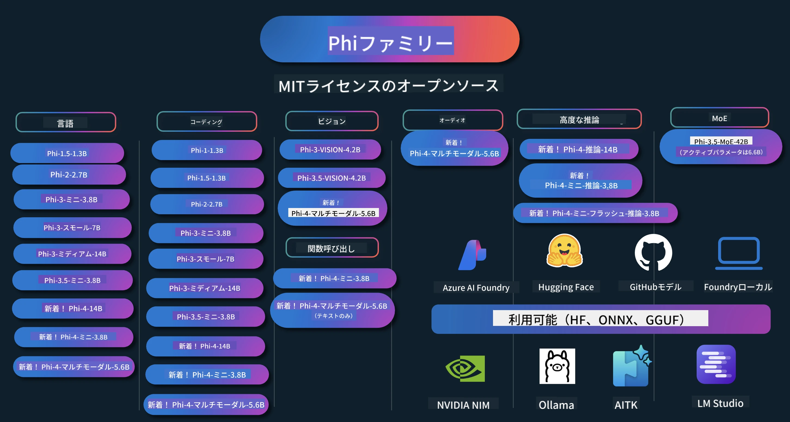

# Phi クックブック: Microsoft の Phi モデルを使った実践例

[](https://codespaces.new/microsoft/phicookbook)
[](https://vscode.dev/redirect?url=vscode://ms-vscode-remote.remote-containers/cloneInVolume?url=https://github.com/microsoft/phicookbook)

[](https://GitHub.com/microsoft/phicookbook/graphs/contributors/?WT.mc_id=aiml-137032-kinfeylo)
[](https://GitHub.com/microsoft/phicookbook/issues/?WT.mc_id=aiml-137032-kinfeylo)
[](https://GitHub.com/microsoft/phicookbook/pulls/?WT.mc_id=aiml-137032-kinfeylo)
[](http://makeapullrequest.com?WT.mc_id=aiml-137032-kinfeylo)

[](https://GitHub.com/microsoft/phicookbook/watchers/?WT.mc_id=aiml-137032-kinfeylo)
[](https://GitHub.com/microsoft/phicookbook/network/?WT.mc_id=aiml-137032-kinfeylo)
[](https://GitHub.com/microsoft/phicookbook/stargazers/?WT.mc_id=aiml-137032-kinfeylo)

[](https://discord.com/invite/ByRwuEEgH4)

Phi は Microsoft によって開発された一連のオープンソース AI モデルです。

Phi は現在、非常に多言語対応、推論、テキスト／チャット生成、コーディング、画像、音声などさまざまなシナリオで優れたベンチマークを持つ、最も強力でコスト効率の良い小規模言語モデル（SLM）です。

Phi はクラウドにもエッジデバイスにも展開でき、限られた計算資源でも簡単に生成 AI アプリケーションを構築できます。

以下の手順でこれらのリソースを使い始めてください：
1. **リポジトリをフォークする**: クリック [](https://GitHub.com/microsoft/phicookbook/network/?WT.mc_id=aiml-137032-kinfeylo)
2. **リポジトリをクローンする**: `git clone https://github.com/microsoft/PhiCookBook.git`
3. [**Microsoft AI Discord コミュニティに参加し、専門家や開発者仲間と交流する**](https://discord.com/invite/ByRwuEEgH4?WT.mc_id=aiml-137032-kinfeylo)



### 🌐 多言語対応

#### GitHub Actions によるサポート（自動化＆常に最新）

<!-- CO-OP TRANSLATOR LANGUAGES TABLE START -->
[アラビア語](../ar/README.md) | [ベンガル語](../bn/README.md) | [ブルガリア語](../bg/README.md) | [ビルマ語 (ミャンマー)](../my/README.md) | [中国語（簡体字）](../zh-CN/README.md) | [中国語（繁体字、香港）](../zh-HK/README.md) | [中国語（繁体字、マカオ）](../zh-MO/README.md) | [中国語（繁体字、台湾）](../zh-TW/README.md) | [クロアチア語](../hr/README.md) | [チェコ語](../cs/README.md) | [デンマーク語](../da/README.md) | [オランダ語](../nl/README.md) | [エストニア語](../et/README.md) | [フィンランド語](../fi/README.md) | [フランス語](../fr/README.md) | [ドイツ語](../de/README.md) | [ギリシャ語](../el/README.md) | [ヘブライ語](../he/README.md) | [ヒンディー語](../hi/README.md) | [ハンガリー語](../hu/README.md) | [インドネシア語](../id/README.md) | [イタリア語](../it/README.md) | [日本語](./README.md) | [カンナダ語](../kn/README.md) | [韓国語](../ko/README.md) | [リトアニア語](../lt/README.md) | [マレー語](../ms/README.md) | [マラヤーラム語](../ml/README.md) | [マラーティー語](../mr/README.md) | [ネパール語](../ne/README.md) | [ナイジェリアピジン](../pcm/README.md) | [ノルウェー語](../no/README.md) | [ペルシャ語 (ファルシー)](../fa/README.md) | [ポーランド語](../pl/README.md) | [ポルトガル語（ブラジル）](../pt-BR/README.md) | [ポルトガル語（ポルトガル）](../pt-PT/README.md) | [パンジャブ語（グルムキー）](../pa/README.md) | [ルーマニア語](../ro/README.md) | [ロシア語](../ru/README.md) | [セルビア語（キリル）](../sr/README.md) | [スロバキア語](../sk/README.md) | [スロベニア語](../sl/README.md) | [スペイン語](../es/README.md) | [スワヒリ語](../sw/README.md) | [スウェーデン語](../sv/README.md) | [タガログ語（フィリピン）](../tl/README.md) | [タミル語](../ta/README.md) | [テルグ語](../te/README.md) | [タイ語](../th/README.md) | [トルコ語](../tr/README.md) | [ウクライナ語](../uk/README.md) | [ウルドゥー語](../ur/README.md) | [ベトナム語](../vi/README.md)

> **ローカルでクローンしたいですか？**

> このリポジトリには50以上の言語翻訳が含まれており、ダウンロードサイズが大幅に増えます。翻訳抜きでクローンするにはスパースチェックアウトを使ってください：
> ```bash
> git clone --filter=blob:none --sparse https://github.com/microsoft/PhiCookBook.git
> cd PhiCookBook
> git sparse-checkout set --no-cone '/*' '!translations' '!translated_images'
> ```
> これにより、より高速にコースを完了するために必要なすべてが得られます。
<!-- CO-OP TRANSLATOR LANGUAGES TABLE END -->

## 目次

- はじめに
  - [Phi ファミリーへようこそ](./md/01.Introduction/01/01.PhiFamily.md)
  - [環境設定](./md/01.Introduction/01/01.EnvironmentSetup.md)
  - [主要技術の理解](./md/01.Introduction/01/01.Understandingtech.md)
  - [Phi モデルの AI 安全性](./md/01.Introduction/01/01.AISafety.md)
  - [Phi ハードウェアサポート](./md/01.Introduction/01/01.Hardwaresupport.md)
  - [Phi モデルとプラットフォーム別提供状況](./md/01.Introduction/01/01.Edgeandcloud.md)
  - [Guidance-ai と Phi の利用](./md/01.Introduction/01/01.Guidance.md)
  - [GitHub Marketplace Models](https://github.com/marketplace/models)
  - [Azure AI モデルカタログ](https://ai.azure.com)

- さまざまな環境での Phi 推論
    -  [Hugging face](./md/01.Introduction/02/01.HF.md)
    -  [GitHub モデル](./md/01.Introduction/02/02.GitHubModel.md)
    -  [Azure AI Foundry モデルカタログ](./md/01.Introduction/02/03.AzureAIFoundry.md)
    -  [Ollama](./md/01.Introduction/02/04.Ollama.md)
    -  [AI Toolkit VSCode (AITK)](./md/01.Introduction/02/05.AITK.md)
    -  [NVIDIA NIM](./md/01.Introduction/02/06.NVIDIA.md)
    -  [Foundry Local](./md/01.Introduction/02/07.FoundryLocal.md)

- Phi ファミリーの推論
    - [iOS での Phi 推論](./md/01.Introduction/03/iOS_Inference.md)
    - [Android での Phi 推論](./md/01.Introduction/03/Android_Inference.md)
    - [Jetson での Phi 推論](./md/01.Introduction/03/Jetson_Inference.md)
    - [AI PC での Phi 推論](./md/01.Introduction/03/AIPC_Inference.md)
    - [Apple MLX フレームワークによる Phi 推論](./md/01.Introduction/03/MLX_Inference.md)
    - [ローカルサーバーでの Phi 推論](./md/01.Introduction/03/Local_Server_Inference.md)
    - [AI Toolkit を使ったリモートサーバーでの Phi 推論](./md/01.Introduction/03/Remote_Interence.md)
    - [Rust での Phi 推論](./md/01.Introduction/03/Rust_Inference.md)
    - [ローカルでの Phi ビジョン推論](./md/01.Introduction/03/Vision_Inference.md)
    - [Kaito AKS、Azure コンテナによる Phi 推論（公式サポート）](./md/01.Introduction/03/Kaito_Inference.md)
-  [Phi ファミリーの量子化](./md/01.Introduction/04/QuantifyingPhi.md)
    - [llama.cpp を使った Phi-3.5 / 4 の量子化](./md/01.Introduction/04/UsingLlamacppQuantifyingPhi.md)
    - [onnxruntime の Generative AI 拡張を使った Phi-3.5 / 4 の量子化](./md/01.Introduction/04/UsingORTGenAIQuantifyingPhi.md)
    - [Intel OpenVINO を使った Phi-3.5 / 4 の量子化](./md/01.Introduction/04/UsingIntelOpenVINOQuantifyingPhi.md)
    - [Apple MLX フレームワークを使った Phi-3.5 / 4 の量子化](./md/01.Introduction/04/UsingAppleMLXQuantifyingPhi.md)

-  Phi の評価
    - [Responsible AI](./md/01.Introduction/05/ResponsibleAI.md)
    - [Azure AI Foundry を使った評価](./md/01.Introduction/05/AIFoundry.md)
    - [Promptflow を使った評価](./md/01.Introduction/05/Promptflow.md)
 
- Azure AI Search と RAG
    - [Phi-4-mini と Phi-4-multimodal(RAG) を Azure AI Search で使う方法](https://github.com/microsoft/PhiCookBook/blob/main/code/06.E2E/E2E_Phi-4-RAG-Azure-AI-Search.ipynb)

- Phi アプリケーション開発サンプル
  - テキスト & チャットアプリケーション
    - Phi-4 サンプル 🆕
      - [📓] [Phi-4-mini ONNX モデルでチャット](./md/02.Application/01.TextAndChat/Phi4/ChatWithPhi4ONNX/README.md)
      - [Phi-4 ローカル ONNX モデルでチャット（.NET）](../../md/04.HOL/dotnet/src/LabsPhi4-Chat-01OnnxRuntime)
      - [Semantic Kernel を使った Phi-4 ONNX の .NET コンソールチャットアプリ](../../md/04.HOL/dotnet/src/LabsPhi4-Chat-02SK)
    - Phi-3 / 3.5 サンプル
      - [Phi3、ONNX Runtime Web および WebGPU を使ったブラウザ内ローカルチャットボット](https://github.com/microsoft/onnxruntime-inference-examples/tree/main/js/chat)
      - [OpenVino チャット](./md/02.Application/01.TextAndChat/Phi3/E2E_OpenVino_Chat.md)
      - [マルチモデル - インタラクティブな Phi-3-mini と OpenAI Whisper](./md/02.Application/01.TextAndChat/Phi3/E2E_Phi-3-mini_with_whisper.md)
      - [MLFlow - ラッパーの構築と MLFlow での Phi-3 の使用](./md//02.Application/01.TextAndChat/Phi3/E2E_Phi-3-MLflow.md)
      - [モデル最適化 - Olive を使った ONNX Runtime Web 用の Phi-3-min モデルの最適化方法](https://github.com/microsoft/Olive/tree/main/examples/phi3)
      - [Phi-3 mini-4k-instruct-onnx を使った WinUI3 アプリ](https://github.com/microsoft/Phi3-Chat-WinUI3-Sample/)
      -[WinUI3 マルチモデル AI パワードノートアプリサンプル](https://github.com/microsoft/ai-powered-notes-winui3-sample)
      - [Prompt flow を使ったカスタム Phi-3 モデルのファインチューニングと統合](./md/02.Application/01.TextAndChat/Phi3/E2E_Phi-3-FineTuning_PromptFlow_Integration.md)
      - [Azure AI Foundry での Prompt flow を使ったカスタム Phi-3 モデルのファインチューニングと統合](./md/02.Application/01.TextAndChat/Phi3/E2E_Phi-3-FineTuning_PromptFlow_Integration_AIFoundry.md)
      - [Microsoft の責任ある AI 原則に焦点を当てた、Azure AI Foundry でのファインチューニング済み Phi-3 / Phi-3.5 モデルの評価](./md/02.Application/01.TextAndChat/Phi3/E2E_Phi-3-Evaluation_AIFoundry.md)
      - [📓] [Phi-3.5-mini-instruct 言語予測サンプル（中国語/英語）](./md/02.Application/01.TextAndChat/Phi3/phi3-instruct-demo.ipynb)
      - [Phi-3.5-Instruct WebGPU RAG チャットボット](./md/02.Application/01.TextAndChat/Phi3/WebGPUWithPhi35Readme.md)
      - [Windows GPU を使って Phi-3.5-Instruct ONNX の Prompt flow ソリューションを作成する方法](./md/02.Application/01.TextAndChat/Phi3/UsingPromptFlowWithONNX.md)
      - [Microsoft Phi-3.5 tflite を使った Android アプリの作成](./md/02.Application/01.TextAndChat/Phi3/UsingPhi35TFLiteCreateAndroidApp.md)
      - [Microsoft.ML.OnnxRuntime を使ったローカル ONNX Phi-3 モデルによる Q&A .NET サンプル](../../md/04.HOL/dotnet/src/LabsPhi301)
      - [Semantic Kernel と Phi-3 を使ったコンソールチャット .NET アプリ](../../md/04.HOL/dotnet/src/LabsPhi302)

  - Azure AI Inference SDK コードベースのサンプル
    - Phi-4 サンプル 🆕
      - [📓] [Phi-4-multimodal を使ったプロジェクトコードの生成](./md/02.Application/02.Code/Phi4/GenProjectCode/README.md)
    - Phi-3 / 3.5 サンプル
      - [Microsoft Phi-3 ファミリーで自分の Visual Studio Code GitHub Copilot チャットを構築する](./md/02.Application/02.Code/Phi3/VSCodeExt/README.md)
      - [GitHub モデルを使って Phi-3.5 で自分の Visual Studio Code チャットコパイロットエージェントを作成する](/md/02.Application/02.Code/Phi3/CreateVSCodeChatAgentWithGitHubModels.md)

  - 高度な推論サンプル
    - Phi-4 サンプル 🆕
      - [📓] [Phi-4-mini-reasoning または Phi-4-reasoning サンプル](./md/02.Application/03.AdvancedReasoning/Phi4/AdvancedResoningPhi4mini/README.md)
      - [📓] [Microsoft Olive を使った Phi-4-mini-reasoning のファインチューニング](./md/02.Application/03.AdvancedReasoning/Phi4/AdvancedResoningPhi4mini/olive_ft_phi_4_reasoning_with_medicaldata.ipynb)
      - [📓] [Apple MLX を使った Phi-4-mini-reasoning のファインチューニング](./md/02.Application/03.AdvancedReasoning/Phi4/AdvancedResoningPhi4mini/mlx_ft_phi_4_reasoning_with_medicaldata.ipynb)
      - [📓] [GitHub モデルを使った Phi-4-mini-reasoning](./md/02.Application/02.Code/Phi4r/github_models_inference.ipynb)
      - [📓] [Azure AI Foundry モデルを使った Phi-4-mini-reasoning](./md/02.Application/02.Code/Phi4r/azure_models_inference.ipynb)
  - デモ
      - [Hugging Face Spaces でホストされている Phi-4-mini デモ](https://huggingface.co/spaces/microsoft/phi-4-mini?WT.mc_id=aiml-137032-kinfeylo)
      - [Hugginge Face Spaces でホストされている Phi-4-multimodal デモ](https://huggingface.co/spaces/microsoft/phi-4-multimodal?WT.mc_id=aiml-137032-kinfeylo)
  - ビジョンサンプル
    - Phi-4 サンプル 🆕
      - [📓] [Phi-4-multimodal を使って画像を読み取りコードを生成する](./md/02.Application/04.Vision/Phi4/CreateFrontend/README.md) 
    - Phi-3 / 3.5 サンプル
      -  [📓][Phi-3-vision-画像テキストからテキストへ](./md/02.Application/04.Vision/Phi3/E2E_Phi-3-vision-image-text-to-text-online-endpoint.ipynb)
      - [Phi-3-vision-ONNX](https://onnxruntime.ai/docs/genai/tutorials/phi3-v.html)
      - [📓][Phi-3-vision CLIP エンベディング](./md/02.Application/04.Vision/Phi3/E2E_Phi-3-vision-image-text-to-text-online-endpoint.ipynb)
      - [DEMO: Phi-3 リサイクル](https://github.com/jennifermarsman/PhiRecycling/)
      - [Phi-3-vision - 視覚言語アシスタント - Phi3-Vision と OpenVINO を使って](https://docs.openvino.ai/nightly/notebooks/phi-3-vision-with-output.html)
      - [Phi-3 Vision Nvidia NIM](./md/02.Application/04.Vision/Phi3/E2E_Nvidia_NIM_Vision.md)
      - [Phi-3 Vision OpenVino](./md/02.Application/04.Vision/Phi3/E2E_OpenVino_Phi3Vision.md)
      - [📓][Phi-3.5 Vision マルチフレームまたはマルチ画像サンプル](./md/02.Application/04.Vision/Phi3/phi3-vision-demo.ipynb)
      - [Microsoft.ML.OnnxRuntime .NET を使った Phi-3 Vision ローカル ONNX モデル](../../md/04.HOL/dotnet/src/LabsPhi303)
      - [メニュー形式 Phi-3 Vision ローカル ONNX モデルを Microsoft.ML.OnnxRuntime .NET で使う](../../md/04.HOL/dotnet/src/LabsPhi304)

  - 数学サンプル
    -  Phi-4-Mini-Flash-Reasoning-Instruct サンプル 🆕 [Phi-4-Mini-Flash-Reasoning-Instruct を使った数学デモ](./md/02.Application/09.Math/MathDemo.ipynb)

  - オーディオサンプル
    - Phi-4 サンプル 🆕
      - [📓] [Phi-4-multimodal を使った音声の文字起こし抽出](./md/02.Application/05.Audio/Phi4/Transciption/README.md)
      - [📓] [Phi-4-multimodal オーディオサンプル](./md/02.Application/05.Audio/Phi4/Siri/demo.ipynb)
      - [📓] [Phi-4-multimodal 音声翻訳サンプル](./md/02.Application/05.Audio/Phi4/Translate/demo.ipynb)
      - [.NET コンソールアプリケーションで Phi-4-multimodal オーディオを使い音声ファイルを解析し文字起こしを生成](../../md/04.HOL/dotnet/src/LabsPhi4-MultiModal-02Audio)

  - MOE サンプル
    - Phi-3 / 3.5 サンプル
      - [📓] [Phi-3.5 Mixture of Experts Models (MoEs) ソーシャルメディアサンプル](./md/02.Application/06.MoE/Phi3/phi3_moe_demo.ipynb)
      - [📓] [NVIDIA NIM Phi-3 MOE、Azure AI Search、LlamaIndex を用いた RAG パイプラインの構築](./md/02.Application/06.MoE/Phi3/azure-ai-search-nvidia-rag.ipynb)
      - 
  - 関数呼び出しサンプル
    - Phi-4 サンプル 🆕
      -  [📓] [Phi-4-mini での関数呼び出しの使用](./md/02.Application/07.FunctionCalling/Phi4/FunctionCallingBasic/README.md)
      -  [📓] [Phi-4-mini を使ったマルチエージェントの関数呼び出し](./md/02.Application/07.FunctionCalling/Phi4/Multiagents/Phi_4_mini_multiagent.ipynb)
      -  [📓] [Ollama での関数呼び出しの使用](./md/02.Application/07.FunctionCalling/Phi4/Ollama/ollama_functioncalling.ipynb)
      -  [📓] [ONNX での関数呼び出しの使用](./md/02.Application/07.FunctionCalling/Phi4/ONNX/onnx_parallel_functioncalling.ipynb)
  - マルチモーダルミックスサンプル
    - Phi-4 サンプル 🆕
      -  [📓] [Phi-4-multimodal を使ってテクノロジージャーナリストになる](./md/02.Application/08.Multimodel/Phi4/TechJournalist/phi_4_mm_audio_text_publish_news.ipynb)
      - [.NET コンソールアプリケーションで Phi-4-multimodal を使って画像を解析する](../../md/04.HOL/dotnet/src/LabsPhi4-MultiModal-01Images)

- Phi ファインチューニングサンプル
  - [ファインチューニングシナリオ](./md/03.FineTuning/FineTuning_Scenarios.md)
  - [ファインチューニングと RAG の比較](./md/03.FineTuning/FineTuning_vs_RAG.md)
  - [Phi-3 を業界専門家にするファインチューニング](./md/03.FineTuning/LetPhi3gotoIndustriy.md)
  - [VS Code 用 AI Toolkit を使った Phi-3 のファインチューニング](./md/03.FineTuning/Finetuning_VSCodeaitoolkit.md)
  - [Azure Machine Learning サービスを使った Phi-3 のファインチューニング](./md/03.FineTuning/Introduce_AzureML.md)
  - [Lora を使った Phi-3 のファインチューニング](./md/03.FineTuning/FineTuning_Lora.md)
  - [QLora を使った Phi-3 のファインチューニング](./md/03.FineTuning/FineTuning_Qlora.md)
  - [Azure AI Foundry を使った Phi-3 のファインチューニング](./md/03.FineTuning/FineTuning_AIFoundry.md)
  - [Azure ML CLI/SDK を使った Phi-3 のファインチューニング](./md/03.FineTuning/FineTuning_MLSDK.md)
  - [Microsoft Olive を使ったファインチューニング](./md/03.FineTuning/FineTuning_MicrosoftOlive.md)
  - [Microsoft Olive ハンズオンラボでのファインチューニング](./md/03.FineTuning/olive-lab/readme.md)
  - [Weights and Bias を使った Phi-3-vision のファインチューニング](./md/03.FineTuning/FineTuning_Phi-3-visionWandB.md)
  - [Apple MLX Framework を使った Phi-3 のファインチューニング](./md/03.FineTuning/FineTuning_MLX.md)
  - [Phi-3-vision のファインチューニング（公式サポート）](./md/03.FineTuning/FineTuning_Vision.md)
  - [Kaito AKS、Azure Containers を使った Phi-3 のファインチューニング（公式サポート）](./md/03.FineTuning/FineTuning_Kaito.md)
  - [Phi-3 と 3.5 Vision のファインチューニング](https://github.com/2U1/Phi3-Vision-Finetune)

- ハンズオンラボ
  - [最先端モデルの探求：LLMs、SLMs、ローカル開発など](https://github.com/microsoft/aitour-exploring-cutting-edge-models)
  - [NLP の可能性を引き出す：Microsoft Olive を使ったファインチューニング](https://github.com/azure/Ignite_FineTuning_workshop)

- 学術研究論文と出版物
  - [教科書だけで十分 II: phi-1.5 技術報告](https://arxiv.org/abs/2309.05463)
  - [Phi-3 技術報告: あなたの電話上でローカルに動作する高度な言語モデル](https://arxiv.org/abs/2404.14219)
  - [Phi-4 技術報告](https://arxiv.org/abs/2412.08905)
  - [Phi-4-Mini 技術報告: Mixture-of-LoRAsによるコンパクトで強力なマルチモーダル言語モデル](https://arxiv.org/abs/2503.01743)
  - [車載機能呼び出しのための小型言語モデルの最適化](https://arxiv.org/abs/2501.02342)
  - [(WhyPHI) PHI-3の複数選択式質問応答へのファインチューニング: 方法論、結果、課題](https://arxiv.org/abs/2501.01588)
  - [Phi-4-推論技術報告](https://www.microsoft.com/en-us/research/wp-content/uploads/2025/04/phi_4_reasoning.pdf)
  - [Phi-4-mini-推論技術報告](https://huggingface.co/microsoft/Phi-4-mini-reasoning/blob/main/Phi-4-Mini-Reasoning.pdf)

## Phiモデルの利用

### Azure AI FoundryでのPhi

Microsoft Phiの使い方や、さまざまなハードウェアデバイスでのE2Eソリューション構築方法を学べます。Phiを実際に体験するには、モデルで遊んだり、シナリオに応じてPhiをカスタマイズしたりすることから始めましょう。[Azure AI Foundry Azure AI モデルカタログ](https://aka.ms/phi3-azure-ai)をご利用ください。詳細は[Azure AI Foundryの入門](/md/02.QuickStart/AzureAIFoundry_QuickStart.md)で確認できます。

**プレイグラウンド**  
各モデルには専用のプレイグラウンドがあり、[Azure AI Playground](https://aka.ms/try-phi3)でモデルをテストできます。

### GitHubモデルでのPhi

Microsoft Phiの使い方や、さまざまなハードウェアデバイスでのE2Eソリューション構築方法を学べます。Phiを実際に体験するには、モデルで遊んだり、シナリオに応じてPhiをカスタマイズしたりすることから始めましょう。[GitHubモデルカタログ](https://github.com/marketplace/models?WT.mc_id=aiml-137032-kinfeylo)をご利用ください。詳細は[GitHubモデルカタログの入門](/md/02.QuickStart/GitHubModel_QuickStart.md)で確認できます。

**プレイグラウンド**  
各モデルには専用の[モデルテスト用プレイグラウンド](/md/02.QuickStart/GitHubModel_QuickStart.md)があります。

### Hugging FaceでのPhi

モデルは[Hugging Face](https://huggingface.co/microsoft)でも見つけられます。

**プレイグラウンド**  
[Hugging Chat プレイグラウンド](https://huggingface.co/chat/models/microsoft/Phi-3-mini-4k-instruct)

## 🎒 その他のコース

私たちのチームは他のコースも作成しています！ぜひご覧ください：

<!-- CO-OP TRANSLATOR OTHER COURSES START -->
### LangChain
[](https://aka.ms/langchain4j-for-beginners)
[](https://aka.ms/langchainjs-for-beginners?WT.mc_id=m365-94501-dwahlin)
[](https://github.com/microsoft/langchain-for-beginners?WT.mc_id=m365-94501-dwahlin)
---

### Azure / Edge / MCP / エージェント
[](https://github.com/microsoft/AZD-for-beginners?WT.mc_id=academic-105485-koreyst)
[](https://github.com/microsoft/edgeai-for-beginners?WT.mc_id=academic-105485-koreyst)
[](https://github.com/microsoft/mcp-for-beginners?WT.mc_id=academic-105485-koreyst)
[](https://github.com/microsoft/ai-agents-for-beginners?WT.mc_id=academic-105485-koreyst)

---

### ジェネレーティブ AI シリーズ
[](https://github.com/microsoft/generative-ai-for-beginners?WT.mc_id=academic-105485-koreyst)
[-9333EA?style=for-the-badge&labelColor=E5E7EB&color=9333EA)](https://github.com/microsoft/Generative-AI-for-beginners-dotnet?WT.mc_id=academic-105485-koreyst)
[-C084FC?style=for-the-badge&labelColor=E5E7EB&color=C084FC)](https://github.com/microsoft/generative-ai-for-beginners-java?WT.mc_id=academic-105485-koreyst)
[-E879F9?style=for-the-badge&labelColor=E5E7EB&color=E879F9)](https://github.com/microsoft/generative-ai-with-javascript?WT.mc_id=academic-105485-koreyst)

---

### コアラーニング
[](https://aka.ms/ml-beginners?WT.mc_id=academic-105485-koreyst)
[](https://aka.ms/datascience-beginners?WT.mc_id=academic-105485-koreyst)
[](https://aka.ms/ai-beginners?WT.mc_id=academic-105485-koreyst)
[](https://github.com/microsoft/Security-101?WT.mc_id=academic-96948-sayoung)
[](https://aka.ms/webdev-beginners?WT.mc_id=academic-105485-koreyst)
[](https://aka.ms/iot-beginners?WT.mc_id=academic-105485-koreyst)
[](https://github.com/microsoft/xr-development-for-beginners?WT.mc_id=academic-105485-koreyst)

---

### Copilotシリーズ
[](https://aka.ms/GitHubCopilotAI?WT.mc_id=academic-105485-koreyst)
[](https://github.com/microsoft/mastering-github-copilot-for-dotnet-csharp-developers?WT.mc_id=academic-105485-koreyst)
[](https://github.com/microsoft/CopilotAdventures?WT.mc_id=academic-105485-koreyst)
<!-- CO-OP TRANSLATOR OTHER COURSES END -->

## 責任ある AI

Microsoftは、お客様がAI製品を責任を持って使用できるよう支援し、学びを共有し、Transparency NotesやImpact Assessmentsなどのツールを通じて信頼に基づくパートナーシップを構築することに取り組んでいます。これらのリソースの多くは[https://aka.ms/RAI](https://aka.ms/RAI)でご覧いただけます。  
Microsoftの責任あるAIへのアプローチは、公平性、信頼性と安全性、プライバシーとセキュリティ、包摂性、透明性、説明責任というAI原則に基づいています。

このサンプルで使用されるような大規模な自然言語、画像、および音声モデルは、不公平であったり信頼できなかったり、攻撃的な振る舞いをする可能性があり、その結果として害を及ぼすことがあります。リスクと制限について理解するには、[Azure OpenAIサービスのTransparency note](https://learn.microsoft.com/legal/cognitive-services/openai/transparency-note?tabs=text)をご確認ください。

これらのリスクを軽減するための推奨されるアプローチは、アーキテクチャに有害な振る舞いを検出し防止できる安全システムを組み込むことです。[Azure AI Content Safety](https://learn.microsoft.com/azure/ai-services/content-safety/overview)は、アプリケーションやサービスにおいて有害なユーザー生成コンテンツやAI生成コンテンツを検出可能な独立した保護層を提供します。Azure AI Content Safetyには有害な素材を検出するテキストと画像のAPIが含まれています。Azure AI Foundryでは、Content Safetyサービスを用いて異なるモダリティで有害コンテンツ検出のサンプルコードを閲覧、試用できます。以下の[クイックスタートドキュメント](https://learn.microsoft.com/azure/ai-services/content-safety/quickstart-text?tabs=visual-studio%2Clinux&pivots=programming-language-rest)ではサービスへのリクエスト手順が案内されています。
もう一つ考慮すべき点は、全体のアプリケーションパフォーマンスです。マルチモーダルおよびマルチモデルアプリケーションでは、パフォーマンスとはシステムがユーザーとあなたの期待通りに動作し、有害な出力を生成しないことを意味します。全体のアプリケーションのパフォーマンスを[Performance and Quality and Risk and Safety evaluators](https://learn.microsoft.com/azure/ai-studio/concepts/evaluation-metrics-built-in)を使用して評価することが重要です。また、[custom evaluators](https://learn.microsoft.com/azure/ai-studio/how-to/develop/evaluate-sdk#custom-evaluators)を作成して評価することも可能です。

[Azure AI Evaluation SDK](https://microsoft.github.io/promptflow/index.html)を使用すると、開発環境でAIアプリケーションを評価できます。テストデータセットやターゲットを指定すると、生成AIアプリケーションの生成物を組み込み評価者または選択したカスタム評価者で定量的に測定できます。azure ai evaluation sdkを使ってシステムを評価するには、[クイックスタートガイド](https://learn.microsoft.com/azure/ai-studio/how-to/develop/flow-evaluate-sdk)に従うことができます。評価の実行後は、[Azure AI Foundryで結果を可視化](https://learn.microsoft.com/azure/ai-studio/how-to/evaluate-flow-results)できます。

## 商標

このプロジェクトにはプロジェクト、製品、またはサービスの商標やロゴが含まれている場合があります。Microsoftの商標またはロゴの許可された使用は、[Microsoftの商標およびブランドガイドライン](https://www.microsoft.com/legal/intellectualproperty/trademarks/usage/general)に従う必要があります。  
このプロジェクトの修正バージョンにおけるMicrosoft商標またはロゴの使用は、混乱を引き起こしたりMicrosoftの後援を示唆したりしてはなりません。第三者の商標やロゴの使用については、それぞれの第三者の方針に従うものとします。

## サポートを得るには

AIアプリの開発で行き詰まったり質問がある場合は、以下に参加してください:

[](https://aka.ms/foundry/discord)

製品に関するフィードバックやビルド中のエラーについては以下を訪問してください:

[](https://aka.ms/foundry/forum)

---

<!-- CO-OP TRANSLATOR DISCLAIMER START -->
**免責事項**：  
本書類はAI翻訳サービス「[Co-op Translator](https://github.com/Azure/co-op-translator)」を使用して翻訳されました。正確性の向上に努めておりますが、自動翻訳には誤りや不正確な表現が含まれる可能性があります。原文の言語によるオリジナル文書が正式な情報源とみなされるべきです。重要な情報については、専門の人間による翻訳を推奨します。本翻訳の利用により生じた誤解や誤訳について、当方は一切の責任を負いかねます。
<!-- CO-OP TRANSLATOR DISCLAIMER END -->