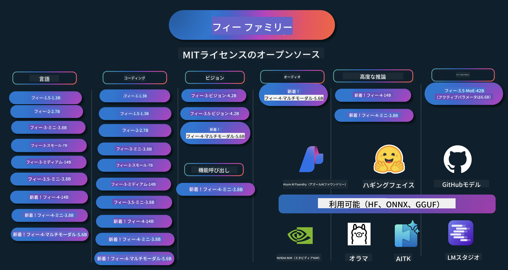

<!--
CO_OP_TRANSLATOR_METADATA:
{
  "original_hash": "10139744c0f1757a5ade1c66749e803f",
  "translation_date": "2025-05-04T13:37:19+00:00",
  "source_file": "README.md",
  "language_code": "ja"
}
-->
# Phi Cookbook: MicrosoftのPhiモデルを使った実践例

PhiはMicrosoftが開発したオープンソースのAIモデルシリーズです。

Phiは現在、最も強力でコストパフォーマンスに優れた小型言語モデル（SLM）であり、多言語対応、推論、テキスト/チャット生成、コーディング、画像、音声など様々なシナリオで高いベンチマークを誇ります。

Phiはクラウドやエッジデバイスにデプロイ可能で、限られた計算資源でも簡単に生成AIアプリケーションを構築できます。

以下の手順でこれらのリソースを使い始めましょう：
1. **リポジトリをフォークする**: クリック 
2. **リポジトリをクローンする**:   `git clone https://github.com/microsoft/PhiCookBook.git`
3. [**Microsoft AI Discordコミュニティに参加して、専門家や開発者仲間と交流する**](https://discord.com/invite/ByRwuEEgH4?WT.mc_id=aiml-137032-kinfeylo)

## 🌐 多言語対応
[フランス語](../fr/README.md) | [スペイン語](../es/README.md) | [ドイツ語](../de/README.md) | [ロシア語](../ru/README.md) | [アラビア語](../ar/README.md) | [ペルシャ語 (ファルシ)](../fa/README.md) | [ウルドゥー語](../ur/README.md) | [中国語（簡体字）](../zh/README.md) | [中国語（繁体字、マカオ）](../mo/README.md) | [中国語（繁体字、香港）](../hk/README.md) | [中国語（繁体字、台湾）](../tw/README.md) | [日本語](./README.md) | [韓国語](../ko/README.md) | [ヒンディー語](../hi/README.md) [ベンガル語](../bn/README.md) | [マラーティー語](../mr/README.md) | [ネパール語](../ne/README.md) | [パンジャブ語（グルムキー）](../pa/README.md) | [ポルトガル語（ポルトガル）](../pt/README.md) | [ポルトガル語（ブラジル）](../br/README.md) | [イタリア語](../it/README.md) | [ポーランド語](../pl/README.md) | [トルコ語](../tr/README.md) | [ギリシャ語](../el/README.md) | [タイ語](../th/README.md) | [スウェーデン語](../sv/README.md) | [デンマーク語](../da/README.md) | [ノルウェー語](../no/README.md) | [フィンランド語](../fi/README.md) | [オランダ語](../nl/README.md) | [ヘブライ語](../he/README.md) | [ベトナム語](../vi/README.md) | [インドネシア語](../id/README.md) | [マレー語](../ms/README.md) | [タガログ語（フィリピン）](../tl/README.md) | [スワヒリ語](../sw/README.md) | [ハンガリー語](../hu/README.md) | [チェコ語](../cs/README.md) | [スロバキア語](../sk/README.md) | [ルーマニア語](../ro/README.md) | [ブルガリア語](../bg/README.md) | [セルビア語（キリル文字）](../sr/README.md) | [クロアチア語](../hr/README.md) | [スロベニア語](../sl/README.md)
## 目次

- はじめに
  - [Phiファミリーへようこそ](./md/01.Introduction/01/01.PhiFamily.md)
  - [環境設定](./md/01.Introduction/01/01.EnvironmentSetup.md)
  - [主要技術の理解](./md/01.Introduction/01/01.Understandingtech.md)
  - [PhiモデルのAI安全性](./md/01.Introduction/01/01.AISafety.md)
  - [Phiハードウェアサポート](./md/01.Introduction/01/01.Hardwaresupport.md)
  - [Phiモデルとプラットフォーム別の利用可能性](./md/01.Introduction/01/01.Edgeandcloud.md)
  - [Guidance-aiとPhiの使い方](./md/01.Introduction/01/01.Guidance.md)
  - [GitHubマーケットプレイスモデル](https://github.com/marketplace/models)
  - [Azure AIモデルカタログ](https://ai.azure.com)

- さまざまな環境でのPhi推論
    -  [Hugging face](./md/01.Introduction/02/01.HF.md)
    -  [GitHubモデル](./md/01.Introduction/02/02.GitHubModel.md)
    -  [Azure AI Foundryモデルカタログ](./md/01.Introduction/02/03.AzureAIFoundry.md)
    -  [Ollama](./md/01.Introduction/02/04.Ollama.md)
    -  [AI Toolkit VSCode (AITK)](./md/01.Introduction/02/05.AITK.md)
    -  [NVIDIA NIM](./md/01.Introduction/02/06.NVIDIA.md)

- Phiファミリーの推論
    - [iOSでのPhi推論](./md/01.Introduction/03/iOS_Inference.md)
    - [AndroidでのPhi推論](./md/01.Introduction/03/Android_Inference.md)
    - [JetsonでのPhi推論](./md/01.Introduction/03/Jetson_Inference.md)
    - [AI PCでのPhi推論](./md/01.Introduction/03/AIPC_Inference.md)
    - [Apple MLXフレームワークでのPhi推論](./md/01.Introduction/03/MLX_Inference.md)
    - [ローカルサーバーでのPhi推論](./md/01.Introduction/03/Local_Server_Inference.md)
    - [AI Toolkitを使ったリモートサーバーでのPhi推論](./md/01.Introduction/03/Remote_Interence.md)
    - [RustでのPhi推論](./md/01.Introduction/03/Rust_Inference.md)
    - [ローカルでのPhi--Vision推論](./md/01.Introduction/03/Vision_Inference.md)
    - [Kaito AKS、Azureコンテナ（公式サポート）でのPhi推論](./md/01.Introduction/03/Kaito_Inference.md)
-  [Phiファミリーの量子化](./md/01.Introduction/04/QuantifyingPhi.md)
    - [llama.cppを使ったPhi-3.5 / 4の量子化](./md/01.Introduction/04/UsingLlamacppQuantifyingPhi.md)
    - [onnxruntimeのGenerative AI拡張を使ったPhi-3.5 / 4の量子化](./md/01.Introduction/04/UsingORTGenAIQuantifyingPhi.md)
    - [Intel OpenVINOを使ったPhi-3.5 / 4の量子化](./md/01.Introduction/04/UsingIntelOpenVINOQuantifyingPhi.md)
    - [Apple MLXフレームワークを使ったPhi-3.5 / 4の量子化](./md/01.Introduction/04/UsingAppleMLXQuantifyingPhi.md)

- Phiの評価
- [Response AI](./md/01.Introduction/05/ResponsibleAI.md)
    - [Azure AI Foundry for Evaluation](./md/01.Introduction/05/AIFoundry.md)
    - [Using Promptflow for Evaluation](./md/01.Introduction/05/Promptflow.md)
 
- Azure AI Searchを使ったRAG
    - [Azure AI SearchでPhi-4-miniとPhi-4-multimodal(RAG)を使う方法](https://github.com/microsoft/PhiCookBook/blob/main/code/06.E2E/E2E_Phi-4-RAG-Azure-AI-Search.ipynb)

- Phiアプリケーション開発サンプル
  - テキスト＆チャットアプリケーション
    - Phi-4サンプル 🆕
      - [📓] [Phi-4-mini ONNXモデルとのチャット](./md/02.Application/01.TextAndChat/Phi4/ChatWithPhi4ONNX/README.md)
      - [Phi-4ローカルONNXモデルとのチャット .NET](../../md/04.HOL/dotnet/src/LabsPhi4-Chat-01OnnxRuntime)
      - [Semantic Kernelを使ったPhi-4 ONNXによる.NETコンソールチャットアプリ](../../md/04.HOL/dotnet/src/LabsPhi4-Chat-02SK)
    - Phi-3 / 3.5サンプル
      - [ブラウザでのローカルチャットボット（Phi3、ONNX Runtime Web、WebGPU使用）](https://github.com/microsoft/onnxruntime-inference-examples/tree/main/js/chat)
      - [OpenVinoチャット](./md/02.Application/01.TextAndChat/Phi3/E2E_OpenVino_Chat.md)
      - [マルチモデル - Phi-3-miniとOpenAI Whisperのインタラクティブ連携](./md/02.Application/01.TextAndChat/Phi3/E2E_Phi-3-mini_with_whisper.md)
      - [MLFlow - ラッパー作成とPhi-3のMLFlow利用](./md//02.Application/01.TextAndChat/Phi3/E2E_Phi-3-MLflow.md)
      - [モデル最適化 - Oliveを使ったONNX Runtime Web向けPhi-3-miniモデルの最適化方法](https://github.com/microsoft/Olive/tree/main/examples/phi3)
      - [Phi-3 mini-4k-instruct-onnxを使ったWinUI3アプリ](https://github.com/microsoft/Phi3-Chat-WinUI3-Sample/)
      - [WinUI3マルチモデルAI搭載ノートアプリサンプル](https://github.com/microsoft/ai-powered-notes-winui3-sample)
      - [カスタムPhi-3モデルのファインチューニングとPrompt flowとの統合](./md/02.Application/01.TextAndChat/Phi3/E2E_Phi-3-FineTuning_PromptFlow_Integration.md)
      - [Azure AI FoundryでのカスタムPhi-3モデルのファインチューニングとPrompt flow統合](./md/02.Application/01.TextAndChat/Phi3/E2E_Phi-3-FineTuning_PromptFlow_Integration_AIFoundry.md)
      - [MicrosoftのResponsible AI原則に注目したAzure AI Foundryでのファインチューニング済みPhi-3 / Phi-3.5モデルの評価](./md/02.Application/01.TextAndChat/Phi3/E2E_Phi-3-Evaluation_AIFoundry.md)
      - [📓] [Phi-3.5-mini-instruct言語予測サンプル（中国語/英語）](../../md/02.Application/01.TextAndChat/Phi3/phi3-instruct-demo.ipynb)
      - [Phi-3.5-Instruct WebGPU RAGチャットボット](./md/02.Application/01.TextAndChat/Phi3/WebGPUWithPhi35Readme.md)
      - [Windows GPUを使ったPhi-3.5-Instruct ONNXのPrompt flowソリューション作成](./md/02.Application/01.TextAndChat/Phi3/UsingPromptFlowWithONNX.md)
      - [Microsoft Phi-3.5 tfliteを使ったAndroidアプリ作成](./md/02.Application/01.TextAndChat/Phi3/UsingPhi35TFLiteCreateAndroidApp.md)
      - [Microsoft.ML.OnnxRuntimeを使ったローカルONNX Phi-3モデルによるQ&A .NET例](../../md/04.HOL/dotnet/src/LabsPhi301)
      - [Semantic KernelとPhi-3を使ったコンソールチャット.NETアプリ](../../md/04.HOL/dotnet/src/LabsPhi302)

  - Azure AI Inference SDKコードベースサンプル
    - Phi-4サンプル 🆕
      - [📓] [Phi-4-multimodalを使ったプロジェクトコード生成](./md/02.Application/02.Code/Phi4/GenProjectCode/README.md)
    - Phi-3 / 3.5サンプル
      - [Microsoft Phi-3ファミリーを使ったVisual Studio Code GitHub Copilot Chatの構築](./md/02.Application/02.Code/Phi3/VSCodeExt/README.md)
      - [GitHubモデルでPhi-3.5を使ったVisual Studio Codeチャットコパイロットエージェントの作成](/md/02.Application/02.Code/Phi3/CreateVSCodeChatAgentWithGitHubModels.md)

  - 高度な推論サンプル
    - Phi-4サンプル 🆕
      - [📓] [Phi-4-mini-reasoningまたはPhi-4-reasoningサンプル](./md/02.Application/03.AdvancedReasoning/Phi4/AdvancedResoningPhi4mini/README.md)
      - [📓] [Microsoft Oliveを使ったPhi-4-mini-reasoningのファインチューニング](../../md/02.Application/03.AdvancedReasoning/Phi4/AdvancedResoningPhi4mini/olive_ft_phi_4_reasoning_with_medicaldata.ipynb)
      - [📓] [Apple MLXを使ったPhi-4-mini-reasoningのファインチューニング](../../md/02.Application/03.AdvancedReasoning/Phi4/AdvancedResoningPhi4mini/mlx_ft_phi_4_reasoning_with_medicaldata.ipynb)
      - [📓] [GitHubモデルを使ったPhi-4-mini-reasoning](../../md/02.Application/02.Code/Phi4r/github_models_inference.ipynb)
- [📓] [Azure AI Foundry Modelsを使ったPhi-4-mini推論](../../md/02.Application/02.Code/Phi4r/azure_models_inference.ipynb)
  - デモ
      - [Hugging Face SpacesでホストされているPhi-4-miniデモ](https://huggingface.co/spaces/microsoft/phi-4-mini?WT.mc_id=aiml-137032-kinfeylo)
      - [Hugging Face SpacesでホストされているPhi-4-multimodalデモ](https://huggingface.co/spaces/microsoft/phi-4-multimodal?WT.mc_id=aiml-137032-kinfeylo)
  - ビジョンサンプル
    - Phi-4サンプル 🆕
      - [📓] [Phi-4-multimodalを使って画像を読み取りコードを生成する](./md/02.Application/04.Vision/Phi4/CreateFrontend/README.md) 
    - Phi-3 / 3.5サンプル
      -  [📓][Phi-3-vision-画像のテキストからテキストへの変換](../../md/02.Application/04.Vision/Phi3/E2E_Phi-3-vision-image-text-to-text-online-endpoint.ipynb)
      - [Phi-3-vision-ONNX](https://onnxruntime.ai/docs/genai/tutorials/phi3-v.html)
      - [📓][Phi-3-vision CLIP埋め込み](../../md/02.Application/04.Vision/Phi3/E2E_Phi-3-vision-image-text-to-text-online-endpoint.ipynb)
      - [デモ: Phi-3リサイクル](https://github.com/jennifermarsman/PhiRecycling/)
      - [Phi-3-vision - Phi3-VisionとOpenVINOによるビジュアル言語アシスタント](https://docs.openvino.ai/nightly/notebooks/phi-3-vision-with-output.html)
      - [Phi-3 Vision Nvidia NIM](./md/02.Application/04.Vision/Phi3/E2E_Nvidia_NIM_Vision.md)
      - [Phi-3 Vision OpenVino](./md/02.Application/04.Vision/Phi3/E2E_OpenVino_Phi3Vision.md)
      - [📓][Phi-3.5 Vision マルチフレームまたはマルチイメージサンプル](../../md/02.Application/04.Vision/Phi3/phi3-vision-demo.ipynb)
      - [Microsoft.ML.OnnxRuntime .NETを使ったPhi-3 VisionローカルONNXモデル](../../md/04.HOL/dotnet/src/LabsPhi303)
      - [メニュー形式のMicrosoft.ML.OnnxRuntime .NETを使ったPhi-3 VisionローカルONNXモデル](../../md/04.HOL/dotnet/src/LabsPhi304)

  - オーディオサンプル
    - Phi-4サンプル 🆕
      - [📓] [Phi-4-multimodalを使った音声文字起こしの抽出](./md/02.Application/05.Audio/Phi4/Transciption/README.md)
      - [📓] [Phi-4-multimodalオーディオサンプル](../../md/02.Application/05.Audio/Phi4/Siri/demo.ipynb)
      - [📓] [Phi-4-multimodal音声翻訳サンプル](../../md/02.Application/05.Audio/Phi4/Translate/demo.ipynb)
      - [.NETコンソールアプリケーションでPhi-4-multimodalオーディオを使い音声ファイルを解析し文字起こしを生成](../../md/04.HOL/dotnet/src/LabsPhi4-MultiModal-02Audio)

  - MOEサンプル
    - Phi-3 / 3.5サンプル
      - [📓] [Phi-3.5 Mixture of Experts Models (MoEs) ソーシャルメディアサンプル](../../md/02.Application/06.MoE/Phi3/phi3_moe_demo.ipynb)
      - [📓] [NVIDIA NIM Phi-3 MOE、Azure AI Search、LlamaIndexを使ったRetrieval-Augmented Generation (RAG)パイプライン構築](../../md/02.Application/06.MoE/Phi3/azure-ai-search-nvidia-rag.ipynb)
  - 関数呼び出しサンプル
    - Phi-4サンプル 🆕
      -  [📓] [Phi-4-miniで関数呼び出しを使う](./md/02.Application/07.FunctionCalling/Phi4/FunctionCallingBasic/README.md)
      -  [📓] [関数呼び出しを使ってPhi-4-miniでマルチエージェントを作成](../../md/02.Application/07.FunctionCalling/Phi4/Multiagents/Phi_4_mini_multiagent.ipynb)
      -  [📓] [Ollamaで関数呼び出しを使う](../../md/02.Application/07.FunctionCalling/Phi4/Ollama/ollama_functioncalling.ipynb)
  - マルチモーダルミキシングサンプル
    - Phi-4サンプル 🆕
      -  [📓] [Phi-4-multimodalを使ったテクノロジージャーナリストの活用例](../../md/02.Application/08.Multimodel/Phi4/TechJournalist/phi_4_mm_audio_text_publish_news.ipynb)
      - [.NETコンソールアプリケーションでPhi-4-multimodalを使い画像を解析](../../md/04.HOL/dotnet/src/LabsPhi4-MultiModal-01Images)

- Phiファインチューニングサンプル
  - [ファインチューニングシナリオ](./md/03.FineTuning/FineTuning_Scenarios.md)
  - [ファインチューニングとRAGの比較](./md/03.FineTuning/FineTuning_vs_RAG.md)
  - [Phi-3を業界の専門家に育てるファインチューニング](./md/03.FineTuning/LetPhi3gotoIndustriy.md)
  - [VS Code用AIツールキットを使ったPhi-3のファインチューニング](./md/03.FineTuning/Finetuning_VSCodeaitoolkit.md)
  - [Azure Machine Learning Serviceを使ったPhi-3のファインチューニング](./md/03.FineTuning/Introduce_AzureML.md)
- [Loraを使ったPhi-3のファインチューニング](./md/03.FineTuning/FineTuning_Lora.md)
  - [QLoraを使ったPhi-3のファインチューニング](./md/03.FineTuning/FineTuning_Qlora.md)
  - [Azure AI Foundryを使ったPhi-3のファインチューニング](./md/03.FineTuning/FineTuning_AIFoundry.md)
  - [Azure ML CLI/SDKを使ったPhi-3のファインチューニング](./md/03.FineTuning/FineTuning_MLSDK.md)
  - [Microsoft Oliveを使ったファインチューニング](./md/03.FineTuning/FineTuning_MicrosoftOlive.md)
  - [Microsoft Oliveハンズオンラボでのファインチューニング](./md/03.FineTuning/olive-lab/readme.md)
  - [Weights and Biasを使ったPhi-3-visionのファインチューニング](./md/03.FineTuning/FineTuning_Phi-3-visionWandB.md)
  - [Apple MLX Frameworkを使ったPhi-3のファインチューニング](./md/03.FineTuning/FineTuning_MLX.md)
  - [Phi-3-visionのファインチューニング（公式サポート）](./md/03.FineTuning/FineTuning_Vision.md)
  - [Kaito AKS、Azure Containersを使ったPhi-3のファインチューニング（公式サポート）](./md/03.FineTuning/FineTuning_Kaito.md)
  - [Phi-3および3.5 Visionのファインチューニング](https://github.com/2U1/Phi3-Vision-Finetune)

- ハンズオンラボ
  - [最先端モデルの探求：LLM、SLM、ローカル開発など](https://github.com/microsoft/aitour-exploring-cutting-edge-models)
  - [NLPの可能性を引き出す：Microsoft Oliveによるファインチューニング](https://github.com/azure/Ignite_FineTuning_workshop)

- 学術研究論文および出版物
  - [Textbooks Are All You Need II: phi-1.5 技術レポート](https://arxiv.org/abs/2309.05463)
  - [Phi-3 技術レポート：高性能な言語モデルをあなたのスマホで](https://arxiv.org/abs/2404.14219)
  - [Phi-4 技術レポート](https://arxiv.org/abs/2412.08905)
  - [Phi-4-Mini 技術レポート：Mixture-of-LoRAsによるコンパクトで強力なマルチモーダル言語モデル](https://arxiv.org/abs/2503.01743)
  - [車載機能呼び出し向け小型言語モデルの最適化](https://arxiv.org/abs/2501.02342)
  - [(WhyPHI) PHI-3を用いた多肢選択式質問応答のファインチューニング：方法論、結果、課題](https://arxiv.org/abs/2501.01588)
  - [Phi-4-推論 技術レポート](https://www.microsoft.com/en-us/research/wp-content/uploads/2025/04/phi_4_reasoning.pdf)
  - [Phi-4-mini-推論 技術レポート](https://huggingface.co/microsoft/Phi-4-mini-reasoning/blob/main/Phi-4-Mini-Reasoning.pdf)

## Phiモデルの使い方

### Azure AI FoundryでのPhi

Microsoft Phiの使い方や、さまざまなハードウェアデバイスでのE2Eソリューション構築方法を学べます。実際にPhiを体験するには、モデルを試し、シナリオに合わせてPhiをカスタマイズしてみましょう。詳細は[Azure AI Foundry Azure AI Model Catalog](https://aka.ms/phi3-azure-ai)で、[Azure AI Foundryのはじめ方](/md/02.QuickStart/AzureAIFoundry_QuickStart.md)も参照してください。

**プレイグラウンド**  
各モデルには専用のプレイグラウンドがあり、モデルのテストができます。[Azure AI Playground](https://aka.ms/try-phi3)。

### GitHubモデルでのPhi

Microsoft Phiの使い方や、さまざまなハードウェアデバイスでのE2Eソリューション構築方法を学べます。モデルを試し、自分のシナリオに合わせてPhiをカスタマイズしてみましょう。詳細は[GitHub Model Catalog](https://github.com/marketplace/models?WT.mc_id=aiml-137032-kinfeylo)で、[GitHub Model Catalogのはじめ方](/md/02.QuickStart/GitHubModel_QuickStart.md)も参照してください。

**プレイグラウンド**  
各モデルには専用の[プレイグラウンドでのテスト環境](/md/02.QuickStart/GitHubModel_QuickStart.md)があります。

### Hugging FaceでのPhi

モデルは[Hugging Face](https://huggingface.co/microsoft)でも見つけられます。

**プレイグラウンド**  
[Hugging Chatプレイグラウンド](https://huggingface.co/chat/models/microsoft/Phi-3-mini-4k-instruct)

## Responsible AI

Microsoftは、お客様がAI製品を責任を持って利用できるよう支援し、学びを共有し、Transparency NotesやImpact Assessmentsなどのツールを通じて信頼に基づくパートナーシップを築くことに取り組んでいます。これらのリソースは多くが[https://aka.ms/RAI](https://aka.ms/RAI)で入手可能です。  
Microsoftの責任あるAIへの取り組みは、公平性、信頼性と安全性、プライバシーとセキュリティ、包摂性、透明性、説明責任というAI原則に基づいています。
大規模な自然言語、画像、音声モデル—このサンプルで使用されているもののような—は、不公平、不確実、または攻撃的な挙動を示す可能性があり、その結果として害を及ぼすことがあります。リスクや制限事項については、[Azure OpenAI service Transparency note](https://learn.microsoft.com/legal/cognitive-services/openai/transparency-note?tabs=text) をご確認ください。

これらのリスクを軽減する推奨される方法は、有害な行動を検知・防止できる安全システムをアーキテクチャに組み込むことです。[Azure AI Content Safety](https://learn.microsoft.com/azure/ai-services/content-safety/overview) は独立した保護レイヤーを提供し、アプリケーションやサービス内のユーザー生成コンテンツおよびAI生成コンテンツの有害な内容を検知できます。Azure AI Content Safety には、有害な素材を検出するためのテキストおよび画像APIが含まれています。Azure AI Foundry 内の Content Safety サービスでは、異なるモダリティにわたる有害コンテンツの検出サンプルコードの閲覧、探索、試用が可能です。以下の[クイックスタートドキュメント](https://learn.microsoft.com/azure/ai-services/content-safety/quickstart-text?tabs=visual-studio%2Clinux&pivots=programming-language-rest)では、サービスへのリクエスト方法を案内しています。

もう一つ考慮すべき点は、全体のアプリケーションパフォーマンスです。マルチモーダルかつマルチモデルのアプリケーションでは、パフォーマンスとは、システムがあなたやユーザーの期待通りに動作し、有害な出力を生成しないことを意味します。全体のアプリケーションのパフォーマンスを評価するには、[Performance and Quality and Risk and Safety evaluators](https://learn.microsoft.com/azure/ai-studio/concepts/evaluation-metrics-built-in)を利用することが重要です。また、[カスタム評価器](https://learn.microsoft.com/azure/ai-studio/how-to/develop/evaluate-sdk#custom-evaluators)を作成し評価に用いることも可能です。

開発環境で AI アプリケーションを評価するには、[Azure AI Evaluation SDK](https://microsoft.github.io/promptflow/index.html)を使用します。テストデータセットまたはターゲットが与えられると、生成AIアプリケーションの生成結果は、組み込み評価器または選択したカスタム評価器で定量的に測定されます。システム評価を開始するには、[クイックスタートガイド](https://learn.microsoft.com/azure/ai-studio/how-to/develop/flow-evaluate-sdk)に従ってください。評価を実行した後は、[Azure AI Foundryで結果を可視化](https://learn.microsoft.com/azure/ai-studio/how-to/evaluate-flow-results)することができます。

## トレードマーク

このプロジェクトには、プロジェクト、製品、サービスのトレードマークやロゴが含まれている場合があります。Microsoftのトレードマークやロゴの正当な使用は、[Microsoftのトレードマーク＆ブランドガイドライン](https://www.microsoft.com/legal/intellectualproperty/trademarks/usage/general)に従う必要があります。Microsoftのトレードマークやロゴを変更版のこのプロジェクトで使用する場合、混乱を招いたりMicrosoftのスポンサーシップを示唆したりしてはなりません。第三者のトレードマークやロゴの使用は、それら第三者のポリシーに従います。

**免責事項**:  
本書類はAI翻訳サービス「Co-op Translator」（https://github.com/Azure/co-op-translator）を使用して翻訳されました。正確性を期していますが、自動翻訳には誤りや不正確な部分が含まれる可能性があります。原文の言語によるオリジナル文書が正式な情報源とみなされるべきです。重要な情報については、専門の人間による翻訳を推奨します。本翻訳の利用により生じた誤解や誤訳について、当方は一切責任を負いません。