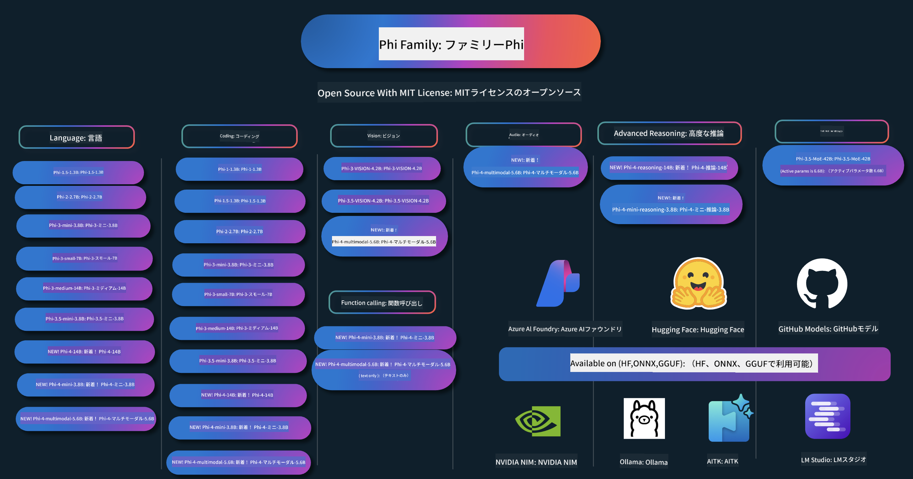

<!--
CO_OP_TRANSLATOR_METADATA:
{
  "original_hash": "1cab9282e04f2e1c388a38dca7763c16",
  "translation_date": "2025-05-10T12:16:54+00:00",
  "source_file": "README.md",
  "language_code": "ja"
}
-->
# Phi クックブック：Microsoft の Phi モデルを使ったハンズオン例

  

  
  
  

  
  

PhiはMicrosoftが開発したオープンソースのAIモデルシリーズです。

Phiは現在、最も強力でコスト効率の高い小型言語モデル（SLM）であり、多言語対応、推論、テキスト/チャット生成、コーディング、画像、音声など多様なシナリオで優れたベンチマークを誇ります。

Phiはクラウドやエッジデバイスにデプロイ可能で、限られた計算リソースでも生成系AIアプリケーションを簡単に構築できます。

以下の手順でこれらのリソースの利用を始めましょう：  
1. **リポジトリをフォークする**: クリック   
2. **リポジトリをクローンする**: `git clone https://github.com/microsoft/PhiCookBook.git`  
3. [**Microsoft AI Discordコミュニティに参加して、専門家や開発者仲間と交流する**](https://discord.com/invite/ByRwuEEgH4?WT.mc_id=aiml-137032-kinfeylo)

## 🌐 多言語対応

### GitHub Actionsによるサポート（自動化＆常に最新）

[フランス語](../fr/README.md) | [スペイン語](../es/README.md) | [ドイツ語](../de/README.md) | [ロシア語](../ru/README.md) | [アラビア語](../ar/README.md) | [ペルシア語（ファルシ）](../fa/README.md) | [ウルドゥー語](../ur/README.md) | [中国語（簡体字）](../zh/README.md) | [中国語（繁体字・マカオ）](../mo/README.md) | [中国語（繁体字・香港）](../hk/README.md) | [中国語（繁体字・台湾）](../tw/README.md) | [日本語](./README.md) | [韓国語](../ko/README.md) | [ヒンディー語](../hi/README.md)

### CLIによるサポート
[Bengali](../bn/README.md) | [Marathi](../mr/README.md) | [Nepali](../ne/README.md) | [Punjabi (Gurmukhi)](../pa/README.md) | [Portuguese (Portugal)](../pt/README.md) | [Portuguese (Brazil)](../br/README.md) | [Italian](../it/README.md) | [Polish](../pl/README.md) | [Turkish](../tr/README.md) | [Greek](../el/README.md) | [Thai](../th/README.md) | [Swedish](../sv/README.md) | [Danish](../da/README.md) | [Norwegian](../no/README.md) | [Finnish](../fi/README.md) | [Dutch](../nl/README.md) | [Hebrew](../he/README.md) | [Vietnamese](../vi/README.md) | [Indonesian](../id/README.md) | [Malay](../ms/README.md) | [Tagalog (Filipino)](../tl/README.md) | [Swahili](../sw/README.md) | [Hungarian](../hu/README.md) | [Czech](../cs/README.md) | [Slovak](../sk/README.md) | [Romanian](../ro/README.md) | [Bulgarian](../bg/README.md) | [Serbian (Cyrillic)](../sr/README.md) | [Croatian](../hr/README.md) | [Slovenian](../sl/README.md)

## 目次

- はじめに
- [Phiファミリーへようこそ](./md/01.Introduction/01/01.PhiFamily.md)
  - [環境のセットアップ](./md/01.Introduction/01/01.EnvironmentSetup.md)
  - [主要技術の理解](./md/01.Introduction/01/01.Understandingtech.md)
  - [PhiモデルのAIセーフティ](./md/01.Introduction/01/01.AISafety.md)
  - [Phiハードウェアサポート](./md/01.Introduction/01/01.Hardwaresupport.md)
  - [Phiモデルとプラットフォーム別の利用可能性](./md/01.Introduction/01/01.Edgeandcloud.md)
  - [Guidance-aiとPhiの使い方](./md/01.Introduction/01/01.Guidance.md)
  - [GitHub Marketplace Models](https://github.com/marketplace/models)
  - [Azure AI Model Catalog](https://ai.azure.com)

- 様々な環境でのPhi推論
    -  [Hugging face](./md/01.Introduction/02/01.HF.md)
    -  [GitHub Models](./md/01.Introduction/02/02.GitHubModel.md)
    -  [Azure AI Foundry Model Catalog](./md/01.Introduction/02/03.AzureAIFoundry.md)
    -  [Ollama](./md/01.Introduction/02/04.Ollama.md)
    -  [AI Toolkit VSCode (AITK)](./md/01.Introduction/02/05.AITK.md)
    -  [NVIDIA NIM](./md/01.Introduction/02/06.NVIDIA.md)

- Phiファミリーの推論
    - [iOSでのPhi推論](./md/01.Introduction/03/iOS_Inference.md)
    - [AndroidでのPhi推論](./md/01.Introduction/03/Android_Inference.md)
    - [JetsonでのPhi推論](./md/01.Introduction/03/Jetson_Inference.md)
    - [AI PCでのPhi推論](./md/01.Introduction/03/AIPC_Inference.md)
    - [Apple MLXフレームワークでのPhi推論](./md/01.Introduction/03/MLX_Inference.md)
    - [ローカルサーバーでのPhi推論](./md/01.Introduction/03/Local_Server_Inference.md)
    - [AI Toolkitを使ったリモートサーバーでのPhi推論](./md/01.Introduction/03/Remote_Interence.md)
    - [RustでのPhi推論](./md/01.Introduction/03/Rust_Inference.md)
    - [ローカルでのPhi--Vision推論](./md/01.Introduction/03/Vision_Inference.md)
    - [Kaito AKS、Azureコンテナ（公式サポート）でのPhi推論](./md/01.Introduction/03/Kaito_Inference.md)
-  [Phiファミリーの量子化](./md/01.Introduction/04/QuantifyingPhi.md)
    - [llama.cppを使ったPhi-3.5 / 4の量子化](./md/01.Introduction/04/UsingLlamacppQuantifyingPhi.md)
    - [onnxruntimeの生成AI拡張を使ったPhi-3.5 / 4の量子化](./md/01.Introduction/04/UsingORTGenAIQuantifyingPhi.md)
    - [Intel OpenVINOを使ったPhi-3.5 / 4の量子化](./md/01.Introduction/04/UsingIntelOpenVINOQuantifyingPhi.md)
    - [Apple MLXフレームワークを使ったPhi-3.5 / 4の量子化](./md/01.Introduction/04/UsingAppleMLXQuantifyingPhi.md)

-  Phiの評価
- [Response AI](./md/01.Introduction/05/ResponsibleAI.md)
    - [Azure AI Foundry for Evaluation](./md/01.Introduction/05/AIFoundry.md)
    - [Using Promptflow for Evaluation](./md/01.Introduction/05/Promptflow.md)
 
- Azure AI Searchを使ったRAG
    - [Azure AI SearchでPhi-4-miniとPhi-4-multimodal(RAG)を使う方法](https://github.com/microsoft/PhiCookBook/blob/main/code/06.E2E/E2E_Phi-4-RAG-Azure-AI-Search.ipynb)

- Phiアプリケーション開発サンプル
  - テキスト＆チャットアプリケーション
    - Phi-4サンプル 🆕
      - [📓] [Phi-4-mini ONNXモデルでチャット](./md/02.Application/01.TextAndChat/Phi4/ChatWithPhi4ONNX/README.md)
      - [Phi-4ローカルONNXモデルでチャット .NET](../../md/04.HOL/dotnet/src/LabsPhi4-Chat-01OnnxRuntime)
      - [Semantic Kernelを使ったPhi-4 ONNXチャット .NETコンソールアプリ](../../md/04.HOL/dotnet/src/LabsPhi4-Chat-02SK)
    - Phi-3 / 3.5サンプル
      - [Phi3、ONNX Runtime Web、WebGPUを使ったブラウザ内ローカルチャットボット](https://github.com/microsoft/onnxruntime-inference-examples/tree/main/js/chat)
      - [OpenVinoチャット](./md/02.Application/01.TextAndChat/Phi3/E2E_OpenVino_Chat.md)
      - [マルチモデル - Phi-3-miniとOpenAI Whisperのインタラクティブ連携](./md/02.Application/01.TextAndChat/Phi3/E2E_Phi-3-mini_with_whisper.md)
      - [MLFlow - ラッパー作成とPhi-3のMLFlow利用](./md//02.Application/01.TextAndChat/Phi3/E2E_Phi-3-MLflow.md)
      - [モデル最適化 - OliveでONNX Runtime Web向けPhi-3-miniモデルを最適化する方法](https://github.com/microsoft/Olive/tree/main/examples/phi3)
      - [WinUI3アプリでPhi-3 mini-4k-instruct-onnxを使う](https://github.com/microsoft/Phi3-Chat-WinUI3-Sample/)
      - [WinUI3 マルチモデル AI搭載ノートアプリサンプル](https://github.com/microsoft/ai-powered-notes-winui3-sample)
      - [Prompt flowを使ったカスタムPhi-3モデルのファインチューニングと統合](./md/02.Application/01.TextAndChat/Phi3/E2E_Phi-3-FineTuning_PromptFlow_Integration.md)
      - [Azure AI FoundryでのPrompt flowを使ったカスタムPhi-3モデルのファインチューニングと統合](./md/02.Application/01.TextAndChat/Phi3/E2E_Phi-3-FineTuning_PromptFlow_Integration_AIFoundry.md)
      - [MicrosoftのResponsible AI原則に基づくAzure AI Foundryでのファインチューニング済みPhi-3 / Phi-3.5モデルの評価](./md/02.Application/01.TextAndChat/Phi3/E2E_Phi-3-Evaluation_AIFoundry.md)
      - [📓] [Phi-3.5-mini-instruct 言語予測サンプル（中国語/英語）](../../md/02.Application/01.TextAndChat/Phi3/phi3-instruct-demo.ipynb)
      - [Phi-3.5-Instruct WebGPU RAGチャットボット](./md/02.Application/01.TextAndChat/Phi3/WebGPUWithPhi35Readme.md)
      - [Windows GPUを使ったPhi-3.5-Instruct ONNXのPrompt flowソリューション作成](./md/02.Application/01.TextAndChat/Phi3/UsingPromptFlowWithONNX.md)
      - [Microsoft Phi-3.5 tfliteを使ったAndroidアプリ作成](./md/02.Application/01.TextAndChat/Phi3/UsingPhi35TFLiteCreateAndroidApp.md)
      - [Microsoft.ML.OnnxRuntimeを使ったローカルONNX Phi-3モデルのQ&A .NET例](../../md/04.HOL/dotnet/src/LabsPhi301)
      - [Semantic KernelとPhi-3を使ったコンソールチャット .NETアプリ](../../md/04.HOL/dotnet/src/LabsPhi302)

  - Azure AI Inference SDK コードベースサンプル 
    - Phi-4サンプル 🆕
      - [📓] [Phi-4-multimodalを使ったプロジェクトコード生成](./md/02.Application/02.Code/Phi4/GenProjectCode/README.md)
    - Phi-3 / 3.5サンプル
      - [Microsoft Phi-3ファミリーで自作Visual Studio Code GitHub Copilot Chatを作る](./md/02.Application/02.Code/Phi3/VSCodeExt/README.md)
      - [GitHubモデルを使ったPhi-3.5でVisual Studio Codeチャットコパイロットエージェントを作成](./md/02.Application/02.Code/Phi3/CreateVSCodeChatAgentWithGitHubModels.md)

  - 高度推論サンプル
    - Phi-4サンプル 🆕
      - [📓] [Phi-4-mini-reasoning または Phi-4-reasoning サンプル](./md/02.Application/03.AdvancedReasoning/Phi4/AdvancedResoningPhi4mini/README.md)
      - [📓] [Microsoft Oliveを使ったPhi-4-mini-reasoningのファインチューニング](../../md/02.Application/03.AdvancedReasoning/Phi4/AdvancedResoningPhi4mini/olive_ft_phi_4_reasoning_with_medicaldata.ipynb)
      - [📓] [Apple MLXを使ったPhi-4-mini-reasoningのファインチューニング](../../md/02.Application/03.AdvancedReasoning/Phi4/AdvancedResoningPhi4mini/mlx_ft_phi_4_reasoning_with_medicaldata.ipynb)
      - [📓] [GitHubモデルを使ったPhi-4-mini-reasoning](../../md/02.Application/02.Code/Phi4r/github_models_inference.ipynb)
- [📓] [Azure AI Foundry Modelsを使ったPhi-4-miniの推論](../../md/02.Application/02.Code/Phi4r/azure_models_inference.ipynb)
  - デモ
      - [Hugging Face SpacesでホストされているPhi-4-miniデモ](https://huggingface.co/spaces/microsoft/phi-4-mini?WT.mc_id=aiml-137032-kinfeylo)
      - [Hugging Face SpacesでホストされているPhi-4-multimodalデモ](https://huggingface.co/spaces/microsoft/phi-4-multimodal?WT.mc_id=aiml-137032-kinfeylo)
  - ビジョンサンプル
    - Phi-4サンプル 🆕
      - [📓] [Phi-4-multimodalを使って画像を読み取りコードを生成する](./md/02.Application/04.Vision/Phi4/CreateFrontend/README.md) 
    - Phi-3 / 3.5 サンプル
      -  [📓][Phi-3-vision 画像テキストからテキストへ](../../md/02.Application/04.Vision/Phi3/E2E_Phi-3-vision-image-text-to-text-online-endpoint.ipynb)
      - [Phi-3-vision-ONNX](https://onnxruntime.ai/docs/genai/tutorials/phi3-v.html)
      - [📓][Phi-3-vision CLIP埋め込み](../../md/02.Application/04.Vision/Phi3/E2E_Phi-3-vision-image-text-to-text-online-endpoint.ipynb)
      - [デモ: Phi-3リサイクリング](https://github.com/jennifermarsman/PhiRecycling/)
      - [Phi-3-vision - Phi3-VisionとOpenVINOを使ったビジュアル言語アシスタント](https://docs.openvino.ai/nightly/notebooks/phi-3-vision-with-output.html)
      - [Phi-3 Vision Nvidia NIM](./md/02.Application/04.Vision/Phi3/E2E_Nvidia_NIM_Vision.md)
      - [Phi-3 Vision OpenVino](./md/02.Application/04.Vision/Phi3/E2E_OpenVino_Phi3Vision.md)
      - [📓][Phi-3.5 Vision マルチフレームまたはマルチイメージサンプル](../../md/02.Application/04.Vision/Phi3/phi3-vision-demo.ipynb)
      - [Microsoft.ML.OnnxRuntime .NETを使ったPhi-3 VisionローカルONNXモデル](../../md/04.HOL/dotnet/src/LabsPhi303)
      - [メニュー形式のPhi-3 VisionローカルONNXモデル（Microsoft.ML.OnnxRuntime .NET使用）](../../md/04.HOL/dotnet/src/LabsPhi304)

  - オーディオサンプル
    - Phi-4サンプル 🆕
      - [📓] [Phi-4-multimodalを使った音声文字起こし](./md/02.Application/05.Audio/Phi4/Transciption/README.md)
      - [📓] [Phi-4-multimodal オーディオサンプル](../../md/02.Application/05.Audio/Phi4/Siri/demo.ipynb)
      - [📓] [Phi-4-multimodal 音声翻訳サンプル](../../md/02.Application/05.Audio/Phi4/Translate/demo.ipynb)
      - [.NETコンソールアプリケーションでPhi-4-multimodalを使い音声ファイルを解析し文字起こしを生成](../../md/04.HOL/dotnet/src/LabsPhi4-MultiModal-02Audio)

  - MOEサンプル
    - Phi-3 / 3.5 サンプル
      - [📓] [Phi-3.5 Mixture of Expertsモデル（MoEs）ソーシャルメディアサンプル](../../md/02.Application/06.MoE/Phi3/phi3_moe_demo.ipynb)
      - [📓] [NVIDIA NIM Phi-3 MOE、Azure AI Search、LlamaIndexを使ったRetrieval-Augmented Generation (RAG)パイプライン構築](../../md/02.Application/06.MoE/Phi3/azure-ai-search-nvidia-rag.ipynb)
  - 関数呼び出しサンプル
    - Phi-4サンプル 🆕
      -  [📓] [Phi-4-miniでの関数呼び出しの使い方](./md/02.Application/07.FunctionCalling/Phi4/FunctionCallingBasic/README.md)
      -  [📓] [Phi-4-miniでマルチエージェントを作成するための関数呼び出し](../../md/02.Application/07.FunctionCalling/Phi4/Multiagents/Phi_4_mini_multiagent.ipynb)
      -  [📓] [Ollamaでの関数呼び出しの使い方](../../md/02.Application/07.FunctionCalling/Phi4/Ollama/ollama_functioncalling.ipynb)
  - マルチモーダルミキシングサンプル
    - Phi-4サンプル 🆕
      -  [📓] [Phi-4-multimodalをテクノロジージャーナリストとして使う](../../md/02.Application/08.Multimodel/Phi4/TechJournalist/phi_4_mm_audio_text_publish_news.ipynb)
      - [.NETコンソールアプリケーションでPhi-4-multimodalを使い画像を解析](../../md/04.HOL/dotnet/src/LabsPhi4-MultiModal-01Images)

- Phiのファインチューニングサンプル
  - [ファインチューニングシナリオ](./md/03.FineTuning/FineTuning_Scenarios.md)
  - [ファインチューニングとRAGの違い](./md/03.FineTuning/FineTuning_vs_RAG.md)
  - [Phi-3を業界の専門家に育てるファインチューニング](./md/03.FineTuning/LetPhi3gotoIndustriy.md)
  - [VS Code用AI ToolkitでのPhi-3ファインチューニング](./md/03.FineTuning/Finetuning_VSCodeaitoolkit.md)
  - [Azure Machine Learning Serviceを使ったPhi-3ファインチューニング](./md/03.FineTuning/Introduce_AzureML.md)
- [Loraを使ったPhi-3のファインチューニング](./md/03.FineTuning/FineTuning_Lora.md)
  - [QLoraを使ったPhi-3のファインチューニング](./md/03.FineTuning/FineTuning_Qlora.md)
  - [Azure AI Foundryを使ったPhi-3のファインチューニング](./md/03.FineTuning/FineTuning_AIFoundry.md)
  - [Azure ML CLI/SDKを使ったPhi-3のファインチューニング](./md/03.FineTuning/FineTuning_MLSDK.md)
  - [Microsoft Oliveを使ったファインチューニング](./md/03.FineTuning/FineTuning_MicrosoftOlive.md)
  - [Microsoft Oliveハンズオンラボでのファインチューニング](./md/03.FineTuning/olive-lab/readme.md)
  - [Weights and Biasを使ったPhi-3-visionのファインチューニング](./md/03.FineTuning/FineTuning_Phi-3-visionWandB.md)
  - [Apple MLXフレームワークを使ったPhi-3のファインチューニング](./md/03.FineTuning/FineTuning_MLX.md)
  - [Phi-3-visionのファインチューニング（公式サポート）](./md/03.FineTuning/FineTuning_Vision.md)
  - [Kaito AKS、Azure Containersを使ったPhi-3のファインチューニング（公式サポート）](./md/03.FineTuning/FineTuning_Kaito.md)
  - [Phi-3および3.5 Visionのファインチューニング](https://github.com/2U1/Phi3-Vision-Finetune)

- ハンズオンラボ
  - [最先端モデルの探求：LLM、SLM、ローカル開発など](https://github.com/microsoft/aitour-exploring-cutting-edge-models)
  - [NLPの可能性を引き出す：Microsoft Oliveでのファインチューニング](https://github.com/azure/Ignite_FineTuning_workshop)

- 学術論文・出版物
  - [Textbooks Are All You Need II: phi-1.5技術レポート](https://arxiv.org/abs/2309.05463)
  - [Phi-3技術レポート：あなたのスマホで動く高性能言語モデル](https://arxiv.org/abs/2404.14219)
  - [Phi-4技術レポート](https://arxiv.org/abs/2412.08905)
  - [Phi-4-Mini技術レポート：Mixture-of-LoRAsによるコンパクトかつ強力なマルチモーダル言語モデル](https://arxiv.org/abs/2503.01743)
  - [車載向け機能呼び出しのための小型言語モデルの最適化](https://arxiv.org/abs/2501.02342)
  - [(WhyPHI) 複数選択式質問応答のためのPHI-3ファインチューニング：方法論、結果、課題](https://arxiv.org/abs/2501.01588)
  - [Phi-4推論技術レポート](https://www.microsoft.com/en-us/research/wp-content/uploads/2025/04/phi_4_reasoning.pdf)
  - [Phi-4-mini推論技術レポート](https://huggingface.co/microsoft/Phi-4-mini-reasoning/blob/main/Phi-4-Mini-Reasoning.pdf)

## Phiモデルの利用

### Azure AI FoundryでのPhi

Microsoft Phiの使い方や、さまざまなハードウェアデバイスでのエンドツーエンドソリューションの構築方法を学べます。Phiを体験するには、まずモデルを触ってみて、[Azure AI Foundry Azure AI Model Catalog](https://aka.ms/phi3-azure-ai)を使ってシナリオに合わせてカスタマイズしてみましょう。詳細は[Azure AI Foundryのクイックスタート](/md/02.QuickStart/AzureAIFoundry_QuickStart.md)でご確認ください。

**プレイグラウンド**  
各モデルには専用のプレイグラウンドがあり、モデルを試すことができます。[Azure AI Playground](https://aka.ms/try-phi3)をご利用ください。

### GitHubモデルでのPhi

Microsoft Phiの使い方や、異なるハードウェアデバイスでのエンドツーエンドソリューション構築方法を学べます。Phiを体験するには、モデルを触ってみて、[GitHub Model Catalog](https://github.com/marketplace/models?WT.mc_id=aiml-137032-kinfeylo)を使ってシナリオに合わせてカスタマイズしてみましょう。詳細は[GitHub Model Catalogのクイックスタート](/md/02.QuickStart/GitHubModel_QuickStart.md)でご確認ください。

**プレイグラウンド**  
各モデルには専用の[プレイグラウンドが用意されており、モデルを試すことができます](/md/02.QuickStart/GitHubModel_QuickStart.md)。

### Hugging FaceでのPhi

モデルは[Hugging Face](https://huggingface.co/microsoft)でも見つけることができます。

**プレイグラウンド**  
[Hugging Chatプレイグラウンド](https://huggingface.co/chat/models/microsoft/Phi-3-mini-4k-instruct)

## Responsible AI

Microsoftは、お客様が当社のAI製品を責任を持って使用できるよう支援し、学びを共有し、Transparency NotesやImpact Assessmentsなどのツールを通じて信頼に基づくパートナーシップを築くことに取り組んでいます。これらのリソースは多くが[https://aka.ms/RAI](https://aka.ms/RAI)でご覧いただけます。  
MicrosoftのResponsible AIへのアプローチは、公平性、信頼性と安全性、プライバシーとセキュリティ、包摂性、透明性、説明責任というAI原則に基づいています。
大規模な自然言語、画像、音声モデルは、このサンプルで使用されているもののように、不公平で信頼性に欠けたり、不快感を与えたりする可能性があり、その結果として害を引き起こすことがあります。リスクや制限については、[Azure OpenAI service Transparency note](https://learn.microsoft.com/legal/cognitive-services/openai/transparency-note?tabs=text) をご参照ください。

これらのリスクを軽減するための推奨される方法は、有害な行動を検出し防止できる安全システムをアーキテクチャに組み込むことです。[Azure AI Content Safety](https://learn.microsoft.com/azure/ai-services/content-safety/overview) は独立した保護レイヤーを提供し、アプリケーションやサービス内での有害なユーザー生成コンテンツやAI生成コンテンツを検出できます。Azure AI Content Safety には、有害な素材を検出できるテキストおよび画像のAPIが含まれています。Azure AI Foundry では、Content Safety サービスを利用して、異なるモダリティにわたる有害コンテンツの検出に関するサンプルコードの閲覧、探索、試用が可能です。以下の[クイックスタートドキュメント](https://learn.microsoft.com/azure/ai-services/content-safety/quickstart-text?tabs=visual-studio%2Clinux&pivots=programming-language-rest)は、サービスへのリクエスト方法を案内しています。

もう一つ考慮すべき点は、全体的なアプリケーションのパフォーマンスです。マルチモーダルかつマルチモデルのアプリケーションでは、パフォーマンスとは、システムがユーザーや開発者の期待通りに動作し、有害な出力を生成しないことを意味します。全体的なアプリケーションのパフォーマンスを評価するには、[Performance and Quality and Risk and Safety evaluators](https://learn.microsoft.com/azure/ai-studio/concepts/evaluation-metrics-built-in)を使用することが重要です。また、[カスタム評価者](https://learn.microsoft.com/azure/ai-studio/how-to/develop/evaluate-sdk#custom-evaluators)を作成して評価することも可能です。

開発環境でAIアプリケーションを評価するには、[Azure AI Evaluation SDK](https://microsoft.github.io/promptflow/index.html)を利用できます。テストデータセットやターゲットが与えられると、生成AIアプリケーションの生成物は、組み込み評価者または選択したカスタム評価者で定量的に測定されます。システム評価を開始するには、[クイックスタートガイド](https://learn.microsoft.com/azure/ai-studio/how-to/develop/flow-evaluate-sdk)に従ってください。評価を実行すると、[Azure AI Foundryで結果を可視化](https://learn.microsoft.com/azure/ai-studio/how-to/evaluate-flow-results)することができます。

## 商標

このプロジェクトには、プロジェクト、製品、またはサービスの商標やロゴが含まれている場合があります。Microsoftの商標やロゴの使用は、[Microsoftの商標およびブランドガイドライン](https://www.microsoft.com/legal/intellectualproperty/trademarks/usage/general)に従う必要があります。Microsoftの商標やロゴを修正したバージョンで使用する場合は、混乱を招いたりMicrosoftの後援を示唆したりしてはなりません。第三者の商標やロゴの使用は、それら第三者のポリシーに従う必要があります。

**免責事項**：  
本書類はAI翻訳サービス「[Co-op Translator](https://github.com/Azure/co-op-translator)」を使用して翻訳されました。正確性を期しておりますが、自動翻訳には誤りや不正確な部分が含まれる可能性があります。原文の言語で記載されたオリジナルの文書が正式な情報源となります。重要な情報については、専門の人間による翻訳を推奨します。本翻訳の使用により生じた誤解や解釈の相違について、当方は一切の責任を負いかねます。