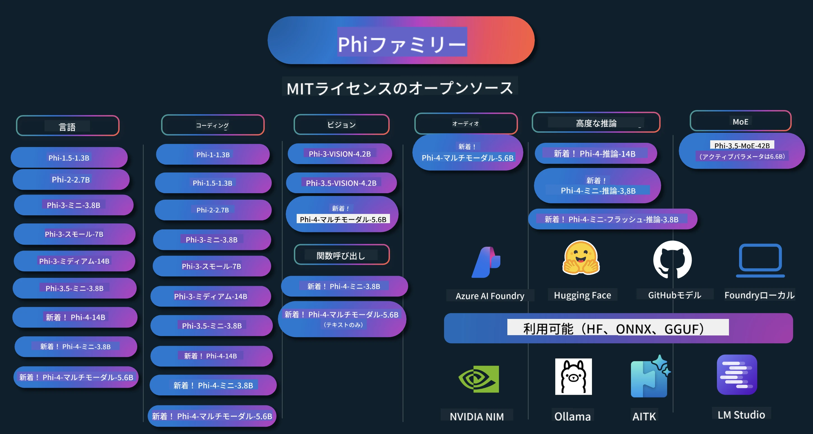

# Phiクックブック：MicrosoftのPhiモデルを使ったハンズオン例

[](https://codespaces.new/microsoft/phicookbook)
[](https://vscode.dev/redirect?url=vscode://ms-vscode-remote.remote-containers/cloneInVolume?url=https://github.com/microsoft/phicookbook)

[](https://GitHub.com/microsoft/phicookbook/graphs/contributors/?WT.mc_id=aiml-137032-kinfeylo)
[](https://GitHub.com/microsoft/phicookbook/issues/?WT.mc_id=aiml-137032-kinfeylo)
[](https://GitHub.com/microsoft/phicookbook/pulls/?WT.mc_id=aiml-137032-kinfeylo)
[](http://makeapullrequest.com?WT.mc_id=aiml-137032-kinfeylo)

[](https://GitHub.com/microsoft/phicookbook/watchers/?WT.mc_id=aiml-137032-kinfeylo)
[](https://GitHub.com/microsoft/phicookbook/network/?WT.mc_id=aiml-137032-kinfeylo)
[](https://GitHub.com/microsoft/phicookbook/stargazers/?WT.mc_id=aiml-137032-kinfeylo)

[](https://discord.com/invite/ByRwuEEgH4)

PhiはMicrosoftが開発したオープンソースのAIモデルシリーズです。

Phiは現在、最も強力でコスト効果の高い小型言語モデル（SLM）であり、多言語、推論、テキスト／チャット生成、コーディング、画像、音声など様々なシナリオで非常に優れたベンチマークを持っています。

Phiはクラウドまたはエッジデバイスに展開可能で、限られた計算リソースでも簡単に生成AIアプリケーションを構築できます。

これらのリソースを使い始めるには以下のステップに従ってください：
1. **リポジトリをフォークする**：クリック [](https://GitHub.com/microsoft/phicookbook/network/?WT.mc_id=aiml-137032-kinfeylo)
2. **リポジトリをクローンする**： `git clone https://github.com/microsoft/PhiCookBook.git`
3. [**Microsoft AI Discordコミュニティに参加し、専門家や開発者仲間と交流する**](https://discord.com/invite/ByRwuEEgH4?WT.mc_id=aiml-137032-kinfeylo)



### 🌐 多言語対応

#### GitHub Actionsによるサポート（自動化＆常に最新）

<!-- CO-OP TRANSLATOR LANGUAGES TABLE START -->
[アラビア語](../ar/README.md) | [ベンガル語](../bn/README.md) | [ブルガリア語](../bg/README.md) | [ビルマ語（ミャンマー）](../my/README.md) | [中国語（簡体字）](../zh-CN/README.md) | [中国語（繁体字、香港）](../zh-HK/README.md) | [中国語（繁体字、マカオ）](../zh-MO/README.md) | [中国語（繁体字、台湾）](../zh-TW/README.md) | [クロアチア語](../hr/README.md) | [チェコ語](../cs/README.md) | [デンマーク語](../da/README.md) | [オランダ語](../nl/README.md) | [エストニア語](../et/README.md) | [フィンランド語](../fi/README.md) | [フランス語](../fr/README.md) | [ドイツ語](../de/README.md) | [ギリシャ語](../el/README.md) | [ヘブライ語](../he/README.md) | [ヒンディー語](../hi/README.md) | [ハンガリー語](../hu/README.md) | [インドネシア語](../id/README.md) | [イタリア語](../it/README.md) | [日本語](./README.md) | [カンナダ語](../kn/README.md) | [韓国語](../ko/README.md) | [リトアニア語](../lt/README.md) | [マレー語](../ms/README.md) | [マラヤーラム語](../ml/README.md) | [マラーティー語](../mr/README.md) | [ネパール語](../ne/README.md) | [ナイジェリアピジン](../pcm/README.md) | [ノルウェー語](../no/README.md) | [ペルシア語（ファルシー）](../fa/README.md) | [ポーランド語](../pl/README.md) | [ポルトガル語（ブラジル）](../pt-BR/README.md) | [ポルトガル語（ポルトガル）](../pt-PT/README.md) | [パンジャブ語（グルムキー）](../pa/README.md) | [ルーマニア語](../ro/README.md) | [ロシア語](../ru/README.md) | [セルビア語（キリル）](../sr/README.md) | [スロバキア語](../sk/README.md) | [スロベニア語](../sl/README.md) | [スペイン語](../es/README.md) | [スワヒリ語](../sw/README.md) | [スウェーデン語](../sv/README.md) | [タガログ語（フィリピノ）](../tl/README.md) | [タミル語](../ta/README.md) | [テルグ語](../te/README.md) | [タイ語](../th/README.md) | [トルコ語](../tr/README.md) | [ウクライナ語](../uk/README.md) | [ウルドゥー語](../ur/README.md) | [ベトナム語](../vi/README.md)

> **ローカルでクローンする場合は？**
>
> 本リポジトリには50以上の言語翻訳が含まれており、ダウンロードサイズが大幅に増加します。翻訳なしでクローンするにはスパースチェックアウトを使用してください：
>
> **Bash / macOS / Linux:**
> ```bash
> git clone --filter=blob:none --sparse https://github.com/microsoft/PhiCookBook.git
> cd PhiCookBook
> git sparse-checkout set --no-cone '/*' '!translations' '!translated_images'
> ```
>
> **CMD（Windows）:**
> ```cmd
> git clone --filter=blob:none --sparse https://github.com/microsoft/PhiCookBook.git
> cd PhiCookBook
> git sparse-checkout set --no-cone "/*" "!translations" "!translated_images"
> ```
>
> これにより、コースを完了するために必要なものをすべて高速にダウンロードできます。
<!-- CO-OP TRANSLATOR LANGUAGES TABLE END -->

## 目次

- はじめに
  - [Phiファミリーへようこそ](./md/01.Introduction/01/01.PhiFamily.md)
  - [環境のセットアップ](./md/01.Introduction/01/01.EnvironmentSetup.md)
  - [主要技術の理解](./md/01.Introduction/01/01.Understandingtech.md)
  - [PhiモデルのAIセーフティ](./md/01.Introduction/01/01.AISafety.md)
  - [Phiハードウェアサポート](./md/01.Introduction/01/01.Hardwaresupport.md)
  - [Phiモデルとプラットフォーム間の利用可能性](./md/01.Introduction/01/01.Edgeandcloud.md)
  - [Guidance-aiとPhiの使用](./md/01.Introduction/01/01.Guidance.md)
  - [GitHub Marketplaceモデル](https://github.com/marketplace/models)
  - [Azure AIモデルカタログ](https://ai.azure.com)

- さまざまな環境でのPhi推論
    -  [Hugging Face](./md/01.Introduction/02/01.HF.md)
    -  [GitHubモデル](./md/01.Introduction/02/02.GitHubModel.md)
    -  [Microsoft Foundryモデルカタログ](./md/01.Introduction/02/03.AzureAIFoundry.md)
    -  [Ollama](./md/01.Introduction/02/04.Ollama.md)
    -  [AIツールキット VSCode (AITK)](./md/01.Introduction/02/05.AITK.md)
    -  [NVIDIA NIM](./md/01.Introduction/02/06.NVIDIA.md)
    -  [Foundryローカル](./md/01.Introduction/02/07.FoundryLocal.md)

- Phiファミリーの推論
    - [iOSでのPhi推論](./md/01.Introduction/03/iOS_Inference.md)
    - [AndroidでのPhi推論](./md/01.Introduction/03/Android_Inference.md)
    - [JetsonでのPhi推論](./md/01.Introduction/03/Jetson_Inference.md)
    - [AI PCでのPhi推論](./md/01.Introduction/03/AIPC_Inference.md)
    - [Apple MLXフレームワークでのPhi推論](./md/01.Introduction/03/MLX_Inference.md)
    - [ローカルサーバーでのPhi推論](./md/01.Introduction/03/Local_Server_Inference.md)
    - [AIツールキットを使ったリモートサーバーでのPhi推論](./md/01.Introduction/03/Remote_Interence.md)
    - [RustでのPhi推論](./md/01.Introduction/03/Rust_Inference.md)
    - [ローカルでのPhiビジョン推論](./md/01.Introduction/03/Vision_Inference.md)
    - [Kaito AKS、Azureコンテナ（公式サポート）でのPhi推論](./md/01.Introduction/03/Kaito_Inference.md)
-  [Phiファミリーの量子化](./md/01.Introduction/04/QuantifyingPhi.md)
    - [llama.cppを使ったPhi-3.5 / 4の量子化](./md/01.Introduction/04/UsingLlamacppQuantifyingPhi.md)
    - [onnxruntime用の生成AI拡張を使ったPhi-3.5 / 4の量子化](./md/01.Introduction/04/UsingORTGenAIQuantifyingPhi.md)
    - [Intel OpenVINOを使ったPhi-3.5 / 4の量子化](./md/01.Introduction/04/UsingIntelOpenVINOQuantifyingPhi.md)
    - [Apple MLXフレームワークを使ったPhi-3.5 / 4の量子化](./md/01.Introduction/04/UsingAppleMLXQuantifyingPhi.md)

- Phiの評価
    - [Responsible AI](./md/01.Introduction/05/ResponsibleAI.md)
    - [Microsoft Foundryを使った評価](./md/01.Introduction/05/AIFoundry.md)
    - [Promptflowを使った評価](./md/01.Introduction/05/Promptflow.md)
 
- Azure AI Searchを使ったRAG
    - [Azure AI SearchでPhi-4-miniとPhi-4-multimodal(RAG)の使い方](https://github.com/microsoft/PhiCookBook/blob/main/code/06.E2E/E2E_Phi-4-RAG-Azure-AI-Search.ipynb)

- Phiアプリケーション開発サンプル
  - テキスト＆チャットアプリケーション
    - Phi-4サンプル 🆕
      - [📓] [Phi-4-mini ONNXモデルでチャット](./md/02.Application/01.TextAndChat/Phi4/ChatWithPhi4ONNX/README.md)
      - [Phi-4ローカルONNXモデルとのチャット (.NET)](../../md/04.HOL/dotnet/src/LabsPhi4-Chat-01OnnxRuntime)
      - [Semantic Kernelを使ったPhi-4 ONNXのチャット .NETコンソールアプリ](../../md/04.HOL/dotnet/src/LabsPhi4-Chat-02SK)
    - Phi-3 / 3.5サンプル
      - [ブラウザでPhi3、ONNX Runtime Web、WebGPUを使ったローカルチャットボット](https://github.com/microsoft/onnxruntime-inference-examples/tree/main/js/chat)
      - [OpenVino Chat](./md/02.Application/01.TextAndChat/Phi3/E2E_OpenVino_Chat.md)
      - [マルチモデル - インタラクティブな Phi-3-mini と OpenAI Whisper](./md/02.Application/01.TextAndChat/Phi3/E2E_Phi-3-mini_with_whisper.md)
      - [MLFlow - ラッパーの構築と Phi-3 の MLFlow 利用](./md//02.Application/01.TextAndChat/Phi3/E2E_Phi-3-MLflow.md)
      - [モデル最適化 - Olive を用いた ONNX Runtime Web 向け Phi-3-min モデル最適化方法](https://github.com/microsoft/Olive/tree/main/examples/phi3)
      - [WinUI3 アプリケーション Phi-3 mini-4k-instruct-onnx 使用例](https://github.com/microsoft/Phi3-Chat-WinUI3-Sample/)
      -[WinUI3 マルチモデル AI パワードノートアプリサンプル](https://github.com/microsoft/ai-powered-notes-winui3-sample)
      - [与えられた Phi-3 カスタムモデルを Prompt flow で微調整と統合](./md/02.Application/01.TextAndChat/Phi3/E2E_Phi-3-FineTuning_PromptFlow_Integration.md)
      - [Microsoft Foundry における Prompt flow によるカスタム Phi-3 モデル微調整と統合](./md/02.Application/01.TextAndChat/Phi3/E2E_Phi-3-FineTuning_PromptFlow_Integration_AIFoundry.md)
      - [Microsoft の責任ある AI 原則に焦点をあてた Microsoft Foundry 内の Fine-tuned Phi-3 / Phi-3.5 モデル評価](./md/02.Application/01.TextAndChat/Phi3/E2E_Phi-3-Evaluation_AIFoundry.md)
      - [📓] [Phi-3.5-mini-instruct 言語予測サンプル（中国語/英語）](./md/02.Application/01.TextAndChat/Phi3/phi3-instruct-demo.ipynb)
      - [Phi-3.5-Instruct WebGPU RAG チャットボット](./md/02.Application/01.TextAndChat/Phi3/WebGPUWithPhi35Readme.md)
      - [Windows GPU を利用した Phi-3.5-Instruct ONNX による Prompt flow ソリューション作成](./md/02.Application/01.TextAndChat/Phi3/UsingPromptFlowWithONNX.md)
      - [Microsoft Phi-3.5 tflite を使った Android アプリ作成](./md/02.Application/01.TextAndChat/Phi3/UsingPhi35TFLiteCreateAndroidApp.md)
      - [ローカル ONNX Phi-3 モデルを使った Q&A .NET サンプル Microsoft.ML.OnnxRuntime](../../md/04.HOL/dotnet/src/LabsPhi301)
      - [Semantic Kernel と Phi-3 を使ったコンソールチャット .NET アプリ](../../md/04.HOL/dotnet/src/LabsPhi302)

  - Azure AI Inference SDK コードベースサンプル 
    - Phi-4 サンプル 🆕
      - [📓] [Phi-4-multimodal を使用したプロジェクトコード生成](./md/02.Application/02.Code/Phi4/GenProjectCode/README.md)
    - Phi-3 / 3.5 サンプル
      - [Microsoft Phi-3 ファミリーを用いた Visual Studio Code GitHub Copilot Chat の構築](./md/02.Application/02.Code/Phi3/VSCodeExt/README.md)
      - [GitHub モデルを使った Phi-3.5 による Visual Studio Code Chat Copilot Agent 作成](/md/02.Application/02.Code/Phi3/CreateVSCodeChatAgentWithGitHubModels.md)

  - 高度推論サンプル
    - Phi-4 サンプル 🆕
      - [📓] [Phi-4-mini-reasoning または Phi-4-reasoning サンプル](./md/02.Application/03.AdvancedReasoning/Phi4/AdvancedResoningPhi4mini/README.md)
      - [📓] [Microsoft Olive による Phi-4-mini-reasoning 微調整](./md/02.Application/03.AdvancedReasoning/Phi4/AdvancedResoningPhi4mini/olive_ft_phi_4_reasoning_with_medicaldata.ipynb)
      - [📓] [Apple MLX を用いた Phi-4-mini-reasoning 微調整](./md/02.Application/03.AdvancedReasoning/Phi4/AdvancedResoningPhi4mini/mlx_ft_phi_4_reasoning_with_medicaldata.ipynb)
      - [📓] [GitHub モデルを使った Phi-4-mini-reasoning](./md/02.Application/02.Code/Phi4r/github_models_inference.ipynb)
      - [📓] [Microsoft Foundry モデルを利用した Phi-4-mini-reasoning](./md/02.Application/02.Code/Phi4r/azure_models_inference.ipynb)
  - デモ
      - [Hugging Face Spaces でホストされている Phi-4-mini デモ](https://huggingface.co/spaces/microsoft/phi-4-mini?WT.mc_id=aiml-137032-kinfeylo)
      - [Hugging Face Spaces でホストされている Phi-4-multimodal デモ](https://huggingface.co/spaces/microsoft/phi-4-multimodal?WT.mc_id=aiml-137032-kinfeylo)
  - Vision サンプル
    - Phi-4 サンプル 🆕
      - [📓] [Phi-4-multimodal で画像を読み込みコード生成](./md/02.Application/04.Vision/Phi4/CreateFrontend/README.md) 
    - Phi-3 / 3.5 サンプル
      -  [📓][Phi-3-vision-画像テキストからテキストへ](./md/02.Application/04.Vision/Phi3/E2E_Phi-3-vision-image-text-to-text-online-endpoint.ipynb)
      - [Phi-3-vision-ONNX](https://onnxruntime.ai/docs/genai/tutorials/phi3-v.html)
      - [📓][Phi-3-vision CLIP 埋め込み](./md/02.Application/04.Vision/Phi3/E2E_Phi-3-vision-image-text-to-text-online-endpoint.ipynb)
      - [デモ: Phi-3 リサイクル](https://github.com/jennifermarsman/PhiRecycling/)
      - [Phi-3-vision - Phi3-Vision と OpenVINO を用いたビジュアル言語アシスタント](https://docs.openvino.ai/nightly/notebooks/phi-3-vision-with-output.html)
      - [Phi-3 Vision Nvidia NIM](./md/02.Application/04.Vision/Phi3/E2E_Nvidia_NIM_Vision.md)
      - [Phi-3 Vision OpenVino](./md/02.Application/04.Vision/Phi3/E2E_OpenVino_Phi3Vision.md)
      - [📓][Phi-3.5 Vision マルチフレームまたはマルチ画像サンプル](./md/02.Application/04.Vision/Phi3/phi3-vision-demo.ipynb)
      - [Microsoft.ML.OnnxRuntime .NET を用いた Phi-3 Vision ローカル ONNX モデル](../../md/04.HOL/dotnet/src/LabsPhi303)
      - [メニュー ベースの Microsoft.ML.OnnxRuntime .NET を用いた Phi-3 Vision ローカル ONNX モデル](../../md/04.HOL/dotnet/src/LabsPhi304)

  - 数学サンプル
    -  Phi-4-Mini-Flash-Reasoning-Instruct サンプル 🆕 [Phi-4-Mini-Flash-Reasoning-Instruct による数学デモ](./md/02.Application/09.Math/MathDemo.ipynb)

  - オーディオサンプル
    - Phi-4 サンプル 🆕
      - [📓] [Phi-4-multimodal を使った音声文字起こし抽出](./md/02.Application/05.Audio/Phi4/Transciption/README.md)
      - [📓] [Phi-4-multimodal オーディオサンプル](./md/02.Application/05.Audio/Phi4/Siri/demo.ipynb)
      - [📓] [Phi-4-multimodal 音声翻訳サンプル](./md/02.Application/05.Audio/Phi4/Translate/demo.ipynb)
      - [.NET コンソールアプリケーション Phi-4-multimodal を利用し音声ファイル分析と文字起こし生成](../../md/04.HOL/dotnet/src/LabsPhi4-MultiModal-02Audio)

  - MOE サンプル
    - Phi-3 / 3.5 サンプル
      - [📓] [Phi-3.5 エキスパートミクスチャモデル（MoEs）ソーシャルメディアサンプル](./md/02.Application/06.MoE/Phi3/phi3_moe_demo.ipynb)
      - [📓] [NVIDIA NIM Phi-3 MOE、Azure AI Search、LlamaIndex を用いた Retrieval-Augmented Generation (RAG) パイプライン構築](./md/02.Application/06.MoE/Phi3/azure-ai-search-nvidia-rag.ipynb)
      - 
  - ファンクションコーリングサンプル
    - Phi-4 サンプル 🆕
      -  [📓] [Phi-4-mini によるファンクションコーリングの利用](./md/02.Application/07.FunctionCalling/Phi4/FunctionCallingBasic/README.md)
      -  [📓] [Phi-4-mini でのファンクションコーリングを用いたマルチエージェント作成](./md/02.Application/07.FunctionCalling/Phi4/Multiagents/Phi_4_mini_multiagent.ipynb)
      -  [📓] [Ollama とのファンクションコーリング使用](./md/02.Application/07.FunctionCalling/Phi4/Ollama/ollama_functioncalling.ipynb)
      -  [📓] [ONNX とのファンクションコーリング利用](./md/02.Application/07.FunctionCalling/Phi4/ONNX/onnx_parallel_functioncalling.ipynb)
  - マルチモーダルミキシングサンプル
    - Phi-4 サンプル 🆕
      -  [📓] [Phi-4-multimodal をテクノロジージャーナリストとして利用する](./md/02.Application/08.Multimodel/Phi4/TechJournalist/phi_4_mm_audio_text_publish_news.ipynb)
      - [.NET コンソールアプリケーション Phi-4-multimodal による画像解析](../../md/04.HOL/dotnet/src/LabsPhi4-MultiModal-01Images)

- Phi 微調整サンプル
  - [微調整シナリオ](./md/03.FineTuning/FineTuning_Scenarios.md)
  - [微調整と RAG の比較](./md/03.FineTuning/FineTuning_vs_RAG.md)
  - [Phi-3 を業界専門家にする微調整](./md/03.FineTuning/LetPhi3gotoIndustriy.md)
  - [VS Code の AI Toolkit を用いた Phi-3 微調整](./md/03.FineTuning/Finetuning_VSCodeaitoolkit.md)
  - [Azure Machine Learning Service を使った Phi-3 微調整](./md/03.FineTuning/Introduce_AzureML.md)
  - [Lora を用いた Phi-3 微調整](./md/03.FineTuning/FineTuning_Lora.md)
  - [QLora を用いた Phi-3 微調整](./md/03.FineTuning/FineTuning_Qlora.md)
  - [Microsoft Foundry による Phi-3 微調整](./md/03.FineTuning/FineTuning_AIFoundry.md)
  - [Azure ML CLI/SDK による Phi-3 微調整](./md/03.FineTuning/FineTuning_MLSDK.md)
  - [Microsoft Olive を使った微調整](./md/03.FineTuning/FineTuning_MicrosoftOlive.md)
  - [Microsoft Olive Hands-On Lab を使った微調整](./md/03.FineTuning/olive-lab/readme.md)
  - [Weights and Bias を利用した Phi-3-vision 微調整](./md/03.FineTuning/FineTuning_Phi-3-visionWandB.md)
  - [Apple MLX フレームワークを用いた Phi-3 微調整](./md/03.FineTuning/FineTuning_MLX.md)
  - [Phi-3-vision 微調整（公式サポート）](./md/03.FineTuning/FineTuning_Vision.md)
  - [Kaito AKS、Azure Containers による Phi-3 微調整（公式サポート）](./md/03.FineTuning/FineTuning_Kaito.md)
  - [Phi-3 および 3.5 Vision の微調整](https://github.com/2U1/Phi3-Vision-Finetune)

- ハンズオンラボ
  - [最先端モデルの探求：LLMs、SLMs、ローカル開発など](https://github.com/microsoft/aitour-exploring-cutting-edge-models)
  - [NLP の可能性を引き出す: Microsoft Olive によるファインチューニング](https://github.com/azure/Ignite_FineTuning_workshop)
- 学術研究論文と出版物
  - [Textbooks Are All You Need II: phi-1.5 技術レポート](https://arxiv.org/abs/2309.05463)
  - [Phi-3 技術レポート: 携帯電話でローカルに高性能な言語モデル](https://arxiv.org/abs/2404.14219)
  - [Phi-4 技術レポート](https://arxiv.org/abs/2412.08905)
  - [Phi-4-Mini 技術レポート: Mixture-of-LoRAsによるコンパクトで強力なマルチモーダル言語モデル](https://arxiv.org/abs/2503.01743)
  - [車載機能呼び出しのための小型言語モデル最適化](https://arxiv.org/abs/2501.02342)
  - [(WhyPHI) PHI-3の多肢選択式質問応答向けファインチューニング: 方法論、結果、および課題](https://arxiv.org/abs/2501.01588)
  - [Phi-4-推論技術レポート](https://www.microsoft.com/en-us/research/wp-content/uploads/2025/04/phi_4_reasoning.pdf)
  - [Phi-4-mini-推論技術レポート](https://huggingface.co/microsoft/Phi-4-mini-reasoning/blob/main/Phi-4-Mini-Reasoning.pdf)

## Phiモデルの使用方法

### Microsoft Foundry 上の Phi

Microsoft Phi の使い方や、さまざまなハードウェアデバイス向けのエンドツーエンドソリューションの構築方法を学べます。Phi を体験するには、まずモデルを操作し、シナリオに合わせて Phi をカスタマイズしてみてください。詳細は [Microsoft Foundry Azure AI Model Catalog](https://aka.ms/phi3-azure-ai)を参照し、[Microsoft Foundryのはじめかた](/md/02.QuickStart/AzureAIFoundry_QuickStart.md)でさらに学べます。

**プレイグラウンド**
各モデルには専用プレイグラウンドがあり、モデルを試せます。[Azure AI Playground](https://aka.ms/try-phi3)。

### GitHub Models 上の Phi

Microsoft Phi の使い方や、さまざまなハードウェアデバイス向けのエンドツーエンドソリューションの構築方法を学べます。Phi を体験するには、まずモデルを操作し、シナリオに合わせて Phi をカスタマイズしてみてください。詳細は [GitHub Model Catalog](https://github.com/marketplace/models?WT.mc_id=aiml-137032-kinfeylo) を参照し、[GitHub Model Catalogのはじめかた](/md/02.QuickStart/GitHubModel_QuickStart.md)でさらに学べます。

**プレイグラウンド**
各モデルには専用の[プレイグラウンド (/md/02.QuickStart/GitHubModel_QuickStart.md) ]があり、モデルを試せます。

### Hugging Face 上の Phi

モデルは[Hugging Face](https://huggingface.co/microsoft)でも見つけられます。

**プレイグラウンド**
[Hugging Chat プレイグラウンド](https://huggingface.co/chat/models/microsoft/Phi-3-mini-4k-instruct)

## 🎒 その他のコース

当チームは他にもコースを制作しています！ぜひご覧ください：

<!-- CO-OP TRANSLATOR OTHER COURSES START -->
### LangChain
[](https://aka.ms/langchain4j-for-beginners)
[](https://aka.ms/langchainjs-for-beginners?WT.mc_id=m365-94501-dwahlin)
[](https://github.com/microsoft/langchain-for-beginners?WT.mc_id=m365-94501-dwahlin)
---

### Azure / Edge / MCP / Agents
[](https://github.com/microsoft/AZD-for-beginners?WT.mc_id=academic-105485-koreyst)
[](https://github.com/microsoft/edgeai-for-beginners?WT.mc_id=academic-105485-koreyst)
[](https://github.com/microsoft/mcp-for-beginners?WT.mc_id=academic-105485-koreyst)
[](https://github.com/microsoft/ai-agents-for-beginners?WT.mc_id=academic-105485-koreyst)

---
 
### Generative AI シリーズ
[](https://github.com/microsoft/generative-ai-for-beginners?WT.mc_id=academic-105485-koreyst)
[-9333EA?style=for-the-badge&labelColor=E5E7EB&color=9333EA)](https://github.com/microsoft/Generative-AI-for-beginners-dotnet?WT.mc_id=academic-105485-koreyst)
[-C084FC?style=for-the-badge&labelColor=E5E7EB&color=C084FC)](https://github.com/microsoft/generative-ai-for-beginners-java?WT.mc_id=academic-105485-koreyst)
[-E879F9?style=for-the-badge&labelColor=E5E7EB&color=E879F9)](https://github.com/microsoft/generative-ai-with-javascript?WT.mc_id=academic-105485-koreyst)

---
 
### コア学習
[](https://aka.ms/ml-beginners?WT.mc_id=academic-105485-koreyst)
[](https://aka.ms/datascience-beginners?WT.mc_id=academic-105485-koreyst)
[](https://aka.ms/ai-beginners?WT.mc_id=academic-105485-koreyst)
[](https://github.com/microsoft/Security-101?WT.mc_id=academic-96948-sayoung)
[](https://aka.ms/webdev-beginners?WT.mc_id=academic-105485-koreyst)
[](https://aka.ms/iot-beginners?WT.mc_id=academic-105485-koreyst)
[](https://github.com/microsoft/xr-development-for-beginners?WT.mc_id=academic-105485-koreyst)

---
 
### コパイロットシリーズ
[](https://aka.ms/GitHubCopilotAI?WT.mc_id=academic-105485-koreyst)
[](https://github.com/microsoft/mastering-github-copilot-for-dotnet-csharp-developers?WT.mc_id=academic-105485-koreyst)
[](https://github.com/microsoft/CopilotAdventures?WT.mc_id=academic-105485-koreyst)
<!-- CO-OP TRANSLATOR OTHER COURSES END -->

## 責任あるAI

Microsoftは、お客様が当社のAI製品を責任を持って利用できるよう支援し、学びを共有し、Transparency NotesやImpact Assessmentsなどのツールを通じて信頼に基づくパートナーシップを構築することに取り組んでいます。これらのリソースの多くは[https://aka.ms/RAI](https://aka.ms/RAI)で入手可能です。  
Microsoftの責任あるAIへのアプローチは、公平性、信頼性と安全性、プライバシーとセキュリティ、包摂性、透明性、および説明責任というAI原則に基づいています。

本サンプルで使用されているような大規模な自然言語、画像、音声モデルは、不公平、不信頼、もしくは不快な振る舞いをする可能性があり、その結果として害を引き起こすことがあります。リスクや制限については、[Azure OpenAI サービスのTransparency note](https://learn.microsoft.com/legal/cognitive-services/openai/transparency-note?tabs=text) をご確認ください。

これらのリスクを軽減する推奨される方法は、有害な振る舞いを検出・防止できる安全システムをアーキテクチャに組み込むことです。[Azure AI Content Safety](https://learn.microsoft.com/azure/ai-services/content-safety/overview) は独立した保護層を提供し、アプリケーションやサービス内の有害なユーザー生成コンテンツやAI生成コンテンツを検出します。Azure AI Content Safety にはテキストおよび画像APIが含まれており、有害な素材の検出が可能です。Microsoft Foundry内のContent Safetyサービスでは、異なるモダリティでの有害コンテンツ検出のサンプルコードを表示、探索、試行できます。以下の[クイックスタートドキュメント](https://learn.microsoft.com/azure/ai-services/content-safety/quickstart-text?tabs=visual-studio%2Clinux&pivots=programming-language-rest)は、サービスへのリクエストの方法を案内しています。
別の考慮すべき側面は、アプリケーション全体のパフォーマンスです。マルチモーダルおよびマルチモデルアプリケーションでは、パフォーマンスとはシステムがあなたやユーザーの期待通りに動作すること、危険な出力を生成しないことを意味します。[Performance and Quality and Risk and Safety evaluators](https://learn.microsoft.com/azure/ai-studio/concepts/evaluation-metrics-built-in) を使ってアプリケーション全体のパフォーマンスを評価することが重要です。また、[custom evaluators](https://learn.microsoft.com/azure/ai-studio/how-to/develop/evaluate-sdk#custom-evaluators) を作成して評価することも可能です。

[Azure AI Evaluation SDK](https://microsoft.github.io/promptflow/index.html) を使って開発環境でAIアプリケーションを評価できます。テストデータセットまたはターゲットが与えられると、生成されたAIアプリケーションの出力が組み込み評価器や選択したカスタム評価器によって定量的に測定されます。システムを評価するためにazure ai evaluation sdkの使い方を始めるには、[quickstart guide](https://learn.microsoft.com/azure/ai-studio/how-to/develop/flow-evaluate-sdk) に従ってください。評価実行を行うと、[Microsoft Foundryで結果を可視化](https://learn.microsoft.com/azure/ai-studio/how-to/evaluate-flow-results) できます。

## Trademarks

このプロジェクトには、プロジェクト、製品、またはサービスの商標やロゴが含まれている場合があります。Microsoftの商標やロゴの使用は、[Microsoft's Trademark & Brand Guidelines](https://www.microsoft.com/legal/intellectualproperty/trademarks/usage/general) に従い、許可された使用に限定されます。Microsoftの商標やロゴを変更したプロジェクトでの使用は、混乱を招いたりMicrosoftのスポンサーシップを示唆したりしてはなりません。第三者の商標やロゴの使用は、該当する第三者のポリシーに従います。

## Getting Help

AIアプリの構築で行き詰まったり質問がある場合は、以下に参加してください:

[](https://aka.ms/foundry/discord)

製品フィードバックやエラーがあった場合は、以下をご利用ください:

[](https://aka.ms/foundry/forum)

---

<!-- CO-OP TRANSLATOR DISCLAIMER START -->
**免責事項**：
この文書はAI翻訳サービス「[Co-op Translator](https://github.com/Azure/co-op-translator)」を使用して翻訳されました。正確性の向上に努めておりますが、自動翻訳には誤りや不正確な箇所が含まれる場合があります。原文はあくまで正式な情報源としてご参照ください。重要な情報については、専門の人間翻訳をご利用いただくことを推奨します。本翻訳の利用により生じたいかなる誤解や解釈の相違についても、一切責任を負いかねます。
<!-- CO-OP TRANSLATOR DISCLAIMER END -->
