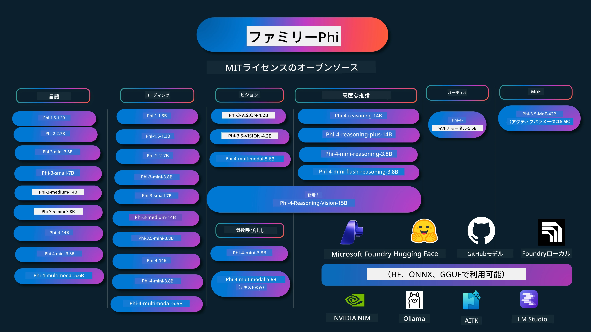

# Phi クックブック: Microsoftの Phi モデルを使ったハンズオン例

[](https://codespaces.new/microsoft/phicookbook)
[](https://vscode.dev/redirect?url=vscode://ms-vscode-remote.remote-containers/cloneInVolume?url=https://github.com/microsoft/phicookbook)

[](https://GitHub.com/microsoft/phicookbook/graphs/contributors/?WT.mc_id=aiml-137032-kinfeylo)
[](https://GitHub.com/microsoft/phicookbook/issues/?WT.mc_id=aiml-137032-kinfeylo)
[](https://GitHub.com/microsoft/phicookbook/pulls/?WT.mc_id=aiml-137032-kinfeylo)
[](http://makeapullrequest.com?WT.mc_id=aiml-137032-kinfeylo)

[](https://GitHub.com/microsoft/phicookbook/watchers/?WT.mc_id=aiml-137032-kinfeylo)
[](https://GitHub.com/microsoft/phicookbook/network/?WT.mc_id=aiml-137032-kinfeylo)
[](https://GitHub.com/microsoft/phicookbook/stargazers/?WT.mc_id=aiml-137032-kinfeylo)

[](https://discord.com/invite/ByRwuEEgH4)

Phi は Microsoft によって開発された一連のオープンソース AI モデルです。

Phi は現在、マルチ言語、推論、テキスト／チャット生成、コーディング、画像、音声などのシナリオで非常に優れたベンチマークを持つ、最も強力でコスト効率の高い小型言語モデル（SLM）です。

Phi はクラウドまたはエッジデバイスに展開でき、限られた計算リソースでも生成AIアプリケーションを簡単に構築可能です。

これらのリソースを使い始めるには次の手順を実行してください：
1. <strong>リポジトリをフォークする</strong>: クリック [](https://GitHub.com/microsoft/phicookbook/network/?WT.mc_id=aiml-137032-kinfeylo)
2. <strong>リポジトリをクローンする</strong>: `git clone https://github.com/microsoft/PhiCookBook.git`
3. [**Microsoft AI Discord コミュニティに参加し、専門家や開発者仲間と交流する**](https://discord.com/invite/ByRwuEEgH4?WT.mc_id=aiml-137032-kinfeylo)



### 🌐 マルチ言語対応

#### GitHub Action によるサポート（自動化＆常に最新）

<!-- CO-OP TRANSLATOR LANGUAGES TABLE START -->
[Arabic](../ar/README.md) | [Bengali](../bn/README.md) | [Bulgarian](../bg/README.md) | [Burmese (Myanmar)](../my/README.md) | [Chinese (Simplified)](../zh-CN/README.md) | [Chinese (Traditional, Hong Kong)](../zh-HK/README.md) | [Chinese (Traditional, Macau)](../zh-MO/README.md) | [Chinese (Traditional, Taiwan)](../zh-TW/README.md) | [Croatian](../hr/README.md) | [Czech](../cs/README.md) | [Danish](../da/README.md) | [Dutch](../nl/README.md) | [Estonian](../et/README.md) | [Finnish](../fi/README.md) | [French](../fr/README.md) | [German](../de/README.md) | [Greek](../el/README.md) | [Hebrew](../he/README.md) | [Hindi](../hi/README.md) | [Hungarian](../hu/README.md) | [Indonesian](../id/README.md) | [Italian](../it/README.md) | [Japanese](./README.md) | [Kannada](../kn/README.md) | [Khmer](../km/README.md) | [Korean](../ko/README.md) | [Lithuanian](../lt/README.md) | [Malay](../ms/README.md) | [Malayalam](../ml/README.md) | [Marathi](../mr/README.md) | [Nepali](../ne/README.md) | [Nigerian Pidgin](../pcm/README.md) | [Norwegian](../no/README.md) | [Persian (Farsi)](../fa/README.md) | [Polish](../pl/README.md) | [Portuguese (Brazil)](../pt-BR/README.md) | [Portuguese (Portugal)](../pt-PT/README.md) | [Punjabi (Gurmukhi)](../pa/README.md) | [Romanian](../ro/README.md) | [Russian](../ru/README.md) | [Serbian (Cyrillic)](../sr/README.md) | [Slovak](../sk/README.md) | [Slovenian](../sl/README.md) | [Spanish](../es/README.md) | [Swahili](../sw/README.md) | [Swedish](../sv/README.md) | [Tagalog (Filipino)](../tl/README.md) | [Tamil](../ta/README.md) | [Telugu](../te/README.md) | [Thai](../th/README.md) | [Turkish](../tr/README.md) | [Ukrainian](../uk/README.md) | [Urdu](../ur/README.md) | [Vietnamese](../vi/README.md)

> **ローカルでクローンしたいですか？**
>
> このリポジトリには50以上の言語翻訳が含まれているため、ダウンロードサイズが大幅に増加します。翻訳なしでクローンするにはスパースチェックアウトを使用してください：
>
> **Bash / macOS / Linux:**
> ```bash
> git clone --filter=blob:none --sparse https://github.com/microsoft/PhiCookBook.git
> cd PhiCookBook
> git sparse-checkout set --no-cone '/*' '!translations' '!translated_images'
> ```
>
> **CMD (Windows):**
> ```cmd
> git clone --filter=blob:none --sparse https://github.com/microsoft/PhiCookBook.git
> cd PhiCookBook
> git sparse-checkout set --no-cone "/*" "!translations" "!translated_images"
> ```
>
> これにより翻訳なしでより速くダウンロードしてコースを完了するために必要なすべてが得られます。
<!-- CO-OP TRANSLATOR LANGUAGES TABLE END -->

## 目次

- はじめに
  - [Phi ファミリーへようこそ](./md/01.Introduction/01/01.PhiFamily.md)
  - [環境設定](./md/01.Introduction/01/01.EnvironmentSetup.md)
  - [主要技術の理解](./md/01.Introduction/01/01.Understandingtech.md)
  - [Phi モデルの AI セーフティ](./md/01.Introduction/01/01.AISafety.md)
  - [Phi ハードウェアサポート](./md/01.Introduction/01/01.Hardwaresupport.md)
  - [Phi モデルとプラットフォーム間の可用性](./md/01.Introduction/01/01.Edgeandcloud.md)
  - [Guidance-ai と Phi の利用法](./md/01.Introduction/01/01.Guidance.md)
  - [GitHub マーケットプレイスのモデル](https://github.com/marketplace/models)
  - [Azure AI モデルカタログ](https://ai.azure.com)

- 様々な環境で Phi 推論
    -  [Hugging face](./md/01.Introduction/02/01.HF.md)
    -  [GitHub モデル](./md/01.Introduction/02/02.GitHubModel.md)
    -  [Microsoft Foundry モデルカタログ](./md/01.Introduction/02/03.AzureAIFoundry.md)
    -  [Ollama](./md/01.Introduction/02/04.Ollama.md)
    -  [AI Toolkit VSCode (AITK)](./md/01.Introduction/02/05.AITK.md)
    -  [NVIDIA NIM](./md/01.Introduction/02/06.NVIDIA.md)
    -  [Foundry Local](./md/01.Introduction/02/07.FoundryLocal.md)

- Phi ファミリーの推論
    - [iOS での Phi 推論](./md/01.Introduction/03/iOS_Inference.md)
    - [Android での Phi 推論](./md/01.Introduction/03/Android_Inference.md)
    - [Jetson での Phi 推論](./md/01.Introduction/03/Jetson_Inference.md)
    - [AI PC での Phi 推論](./md/01.Introduction/03/AIPC_Inference.md)
    - [Apple MLX フレームワークでの Phi 推論](./md/01.Introduction/03/MLX_Inference.md)
    - [ローカルサーバーでの Phi 推論](./md/01.Introduction/03/Local_Server_Inference.md)
    - [AI Toolkit を使ったリモートサーバでの Phi 推論](./md/01.Introduction/03/Remote_Interence.md)
    - [Rust での Phi 推論](./md/01.Introduction/03/Rust_Inference.md)
    - [ローカルでの Phi--Vision 推論](./md/01.Introduction/03/Vision_Inference.md)
    - [Kaito AKS、Azure コンテナ（公式サポート）での Phi 推論](./md/01.Introduction/03/Kaito_Inference.md)
-  [Phi ファミリーの量子化](./md/01.Introduction/04/QuantifyingPhi.md)
    - [llama.cpp を使った Phi-3.5 / 4 の量子化](./md/01.Introduction/04/UsingLlamacppQuantifyingPhi.md)
    - [onnxruntime 用生成AI拡張を使った Phi-3.5 / 4 の量子化](./md/01.Introduction/04/UsingORTGenAIQuantifyingPhi.md)
    - [Intel OpenVINO を使った Phi-3.5 / 4 の量子化](./md/01.Introduction/04/UsingIntelOpenVINOQuantifyingPhi.md)
    - [Apple MLX フレームワークを使った Phi-3.5 / 4 の量子化](./md/01.Introduction/04/UsingAppleMLXQuantifyingPhi.md)

- Phi の評価
    - [責任ある AI](./md/01.Introduction/05/ResponsibleAI.md)
    - [Microsoft Foundry を使った評価](./md/01.Introduction/05/AIFoundry.md)
    - [Promptflow を使った評価](./md/01.Introduction/05/Promptflow.md)
 
- Azure AI Search を使った RAG
    - [Phi-4-mini と Phi-4-multimodal（RAG）を Azure AI Search で使う方法](https://github.com/microsoft/PhiCookBook/blob/main/code/06.E2E/E2E_Phi-4-RAG-Azure-AI-Search.ipynb)
    - [SQLite FTS5 と phi-4-mini を使ったゼロクラウドローカルハイブリッド RAG](https://github.com/microsoft/PhiCookBook/blob/main/code/06.E2E/E2E_Phi-4-mini_Local_Hybrid_RAG_SQLite_FTS5.ipynb)

- Phi アプリケーション開発サンプル
  - テキスト & チャットアプリケーション
    - Phi-4 サンプル
      - [📓] [Phi-4-mini ONNX モデルとのチャット](./md/02.Application/01.TextAndChat/Phi4/ChatWithPhi4ONNX/README.md)
      - [Phi-4 ローカル ONNX モデル .NET でチャット](../../md/04.HOL/dotnet/src/LabsPhi4-Chat-01OnnxRuntime)
      - [Semantic Kernel を使用した Phi-4 ONNX の .NET コンソールアプリでチャット](../../md/04.HOL/dotnet/src/LabsPhi4-Chat-02SK)

    - Phi-3 / 3.5 サンプル
      - [Phi3、ONNX Runtime Web、および WebGPU を使用したブラウザ内ローカルチャットボット](https://github.com/microsoft/onnxruntime-inference-examples/tree/main/js/chat)
      - [OpenVino チャット](./md/02.Application/01.TextAndChat/Phi3/E2E_OpenVino_Chat.md)
      - [マルチモデル - インタラクティブな Phi-3-mini と OpenAI Whisper](./md/02.Application/01.TextAndChat/Phi3/E2E_Phi-3-mini_with_whisper.md)
      - [MLFlow - ラッパーの構築および Phi-3 の MLFlow での使用](./md//02.Application/01.TextAndChat/Phi3/E2E_Phi-3-MLflow.md)
      - [モデル最適化 - Olive を使用した ONNX Runtime Web 向け Phi-3-min モデルの最適化方法](https://github.com/microsoft/Olive/tree/main/examples/phi3)
      - [Phi-3 mini-4k-instruct-onnx を使った WinUI3 アプリ](https://github.com/microsoft/Phi3-Chat-WinUI3-Sample/)
      -[WinUI3 マルチモデル AI 搭載ノートアプリサンプル](https://github.com/microsoft/ai-powered-notes-winui3-sample)
      - [カスタム Phi-3 モデルのファインチューニングと Prompt flow との統合](./md/02.Application/01.TextAndChat/Phi3/E2E_Phi-3-FineTuning_PromptFlow_Integration.md)
      - [Microsoft Foundry における Prompt flow とカスタム Phi-3 モデルのファインチューニングおよび統合](./md/02.Application/01.TextAndChat/Phi3/E2E_Phi-3-FineTuning_PromptFlow_Integration_AIFoundry.md)
      - [Microsoft の責任ある AI 原則に焦点を当てた Microsoft Foundry でのファインチューニング済み Phi-3 / Phi-3.5 モデルの評価](./md/02.Application/01.TextAndChat/Phi3/E2E_Phi-3-Evaluation_AIFoundry.md)
      - [📓] [Phi-3.5-mini-instruct の言語予測サンプル（中国語/英語）](./md/02.Application/01.TextAndChat/Phi3/phi3-instruct-demo.ipynb)
      - [Phi-3.5-Instruct WebGPU RAG チャットボット](./md/02.Application/01.TextAndChat/Phi3/WebGPUWithPhi35Readme.md)
      - [Windows GPU を使用して Phi-3.5-Instruct ONNX で Prompt flow ソリューションを作成する方法](./md/02.Application/01.TextAndChat/Phi3/UsingPromptFlowWithONNX.md)
      - [Microsoft Phi-3.5 tflite を使用して Android アプリを作成する方法](./md/02.Application/01.TextAndChat/Phi3/UsingPhi35TFLiteCreateAndroidApp.md)
      - [Microsoft.ML.OnnxRuntime を使用したローカル ONNX Phi-3 モデルによる Q&A .NET サンプル](../../md/04.HOL/dotnet/src/LabsPhi301)
      - [Semantic Kernel と Phi-3 を用いたコンソールチャット .NET アプリ](../../md/04.HOL/dotnet/src/LabsPhi302)

  - Azure AI Inference SDK コードベースのサンプル
    - Phi-4 サンプル
      - [📓] [Phi-4-multimodal を使用したプロジェクトコード生成](./md/02.Application/02.Code/Phi4/GenProjectCode/README.md)
    - Phi-3 / 3.5 サンプル
      - [Microsoft Phi-3 ファミリーを用いて Visual Studio Code GitHub Copilot Chat を構築する](./md/02.Application/02.Code/Phi3/VSCodeExt/README.md)
      - [GitHub モデルで Phi-3.5 を使った Visual Studio Code チャットコパイロットエージェントの作成](/md/02.Application/02.Code/Phi3/CreateVSCodeChatAgentWithGitHubModels.md)

  - 高度な推論サンプル
    - Phi-4 サンプル
      - [📓] [Phi-4-mini-reasoning または Phi-4-reasoning サンプル](./md/02.Application/03.AdvancedReasoning/Phi4/AdvancedResoningPhi4mini/README.md)
      - [📓] [Microsoft Olive を使った Phi-4-mini-reasoning のファインチューニング](./md/02.Application/03.AdvancedReasoning/Phi4/AdvancedResoningPhi4mini/olive_ft_phi_4_reasoning_with_medicaldata.ipynb)
      - [📓] [Apple MLX を使った Phi-4-mini-reasoning のファインチューニング](./md/02.Application/03.AdvancedReasoning/Phi4/AdvancedResoningPhi4mini/mlx_ft_phi_4_reasoning_with_medicaldata.ipynb)
      - [📓] [GitHub モデルを使った Phi-4-mini-reasoning](./md/02.Application/02.Code/Phi4r/github_models_inference.ipynb)
      - [📓] [Microsoft Foundry モデルを使った Phi-4-mini-reasoning](./md/02.Application/02.Code/Phi4r/azure_models_inference.ipynb)
  - デモ
      - [Hugging Face Spaces でホストされている Phi-4-mini デモ](https://huggingface.co/spaces/microsoft/phi-4-mini?WT.mc_id=aiml-137032-kinfeylo)
      - [Hugging Face Spaces でホストされている Phi-4-multimodal デモ](https://huggingface.co/spaces/microsoft/phi-4-multimodal?WT.mc_id=aiml-137032-kinfeylo)
  - ビジョンサンプル
    - Phi-4 サンプル
      - [📓] [Phi-4-multimodal を使用して画像を読み取りコードを生成する](./md/02.Application/04.Vision/Phi4/CreateFrontend/README.md)
    - Phi-3 / 3.5 サンプル
      -  [📓][Phi-3-vision 画像テキストからテキストへの変換](./md/02.Application/04.Vision/Phi3/E2E_Phi-3-vision-image-text-to-text-online-endpoint.ipynb)
      - [Phi-3-vision-ONNX](https://onnxruntime.ai/docs/genai/tutorials/phi3-v.html)
      - [📓][Phi-3-vision CLIP 埋め込み](./md/02.Application/04.Vision/Phi3/E2E_Phi-3-vision-image-text-to-text-online-endpoint.ipynb)
      - [デモ: Phi-3 リサイクル](https://github.com/jennifermarsman/PhiRecycling/)
      - [Phi-3-vision - Phi3-Vision と OpenVINO を使ったビジュアル言語アシスタント](https://docs.openvino.ai/nightly/notebooks/phi-3-vision-with-output.html)
      - [Phi-3 Vision Nvidia NIM](./md/02.Application/04.Vision/Phi3/E2E_Nvidia_NIM_Vision.md)
      - [Phi-3 Vision OpenVino](./md/02.Application/04.Vision/Phi3/E2E_OpenVino_Phi3Vision.md)
      - [📓][Phi-3.5 Vision マルチフレームまたはマルチ画像サンプル](./md/02.Application/04.Vision/Phi3/phi3-vision-demo.ipynb)
      - [Microsoft.ML.OnnxRuntime .NET を使用した Phi-3 Vision ローカル ONNX モデル](../../md/04.HOL/dotnet/src/LabsPhi303)
      - [メニュー方式 Phi-3 Vision ローカル ONNX モデル Microsoft.ML.OnnxRuntime .NET 使用](../../md/04.HOL/dotnet/src/LabsPhi304)

  - 推論・ビジョンサンプル
    - Phi-4-Reasoning-Vision-15B
      - [📓] [Phi-4-Reasoning-Vision-15B を使った歩行者無視検出](./md/02.Application/10.ReasoningVision/Phi_4_reasoning_vision_15b_Jaywalking.ipynb)
      - [📓] [Phi-4-Reasoning-Vision-15B を使った数学](./md/02.Application/10.ReasoningVision/Phi_4_reasoning_vision_15b_Math.ipynb)
      - [📓] [Phi-4-Reasoning-Vision-15B を使った UI 検出](./md/02.Application/10.ReasoningVision/Phi_4_reasoning_vision_15b_ui.ipynb)

  - 数式サンプル
    -  Phi-4-Mini-Flash-Reasoning-Instruct サンプル  [Phi-4-Mini-Flash-Reasoning-Instruct を使った数学デモ](./md/02.Application/09.Math/MathDemo.ipynb)

  - オーディオサンプル
    - Phi-4 サンプル
      - [📓] [Phi-4-multimodal を使ったオーディオ転写抽出](./md/02.Application/05.Audio/Phi4/Transciption/README.md)
      - [📓] [Phi-4-multimodal オーディオサンプル](./md/02.Application/05.Audio/Phi4/Siri/demo.ipynb)
      - [📓] [Phi-4-multimodal 音声翻訳サンプル](./md/02.Application/05.Audio/Phi4/Translate/demo.ipynb)
      - [.NET コンソールアプリで Phi-4-multimodal オーディオを使って音声ファイル分析と転写生成](../../md/04.HOL/dotnet/src/LabsPhi4-MultiModal-02Audio)

  - MOE サンプル
    - Phi-3 / 3.5 サンプル
      - [📓] [Phi-3.5 Mixture of Experts (MoEs) ソーシャルメディアサンプル](./md/02.Application/06.MoE/Phi3/phi3_moe_demo.ipynb)
      - [📓] [NVIDIA NIM Phi-3 MOE、Azure AI Search、および LlamaIndex を使用した Retrieval-Augmented Generation (RAG) パイプライン構築](./md/02.Application/06.MoE/Phi3/azure-ai-search-nvidia-rag.ipynb)
      - 
  - 関数呼び出しサンプル
    - Phi-4 サンプル 🆕
      -  [📓] [Phi-4-mini での関数呼び出しの使用](./md/02.Application/07.FunctionCalling/Phi4/FunctionCallingBasic/README.md)
      -  [📓] [Phi-4-mini で関数呼び出しを使いマルチエージェントを作成](./md/02.Application/07.FunctionCalling/Phi4/Multiagents/Phi_4_mini_multiagent.ipynb)
      -  [📓] [Ollama で関数呼び出しを使う](./md/02.Application/07.FunctionCalling/Phi4/Ollama/ollama_functioncalling.ipynb)
      -  [📓] [ONNX で関数呼び出しを使う](./md/02.Application/07.FunctionCalling/Phi4/ONNX/onnx_parallel_functioncalling.ipynb)
  - マルチモーダルミキシングサンプル
    - Phi-4 サンプル 🆕
      -  [📓] [技術ジャーナリストとして Phi-4-multimodal を使う](./md/02.Application/08.Multimodel/Phi4/TechJournalist/phi_4_mm_audio_text_publish_news.ipynb)
      - [.NET コンソールアプリで Phi-4-multimodal を使って画像分析](../../md/04.HOL/dotnet/src/LabsPhi4-MultiModal-01Images)

- Phi ファインチューニング
  - [ファインチューニングシナリオ](./md/03.FineTuning/FineTuning_Scenarios.md)
  - [ファインチューニングと RAG の比較](./md/03.FineTuning/FineTuning_vs_RAG.md)
  - [Phi-3 を業界の専門家にするファインチューニング](./md/03.FineTuning/LetPhi3gotoIndustriy.md)
  - [VS Code の AI Toolkit で Phi-3 ファインチューニング](./md/03.FineTuning/Finetuning_VSCodeaitoolkit.md)
  - [Azure Machine Learning Service で Phi-3 ファインチューニング](./md/03.FineTuning/Introduce_AzureML.md)
  - [Lora で Phi-3 ファインチューニング](./md/03.FineTuning/FineTuning_Lora.md)
  - [QLora で Phi-3 ファインチューニング](./md/03.FineTuning/FineTuning_Qlora.md)
  - [Microsoft Foundry で Phi-3 ファインチューニング](./md/03.FineTuning/FineTuning_AIFoundry.md)
  - [Azure ML CLI/SDK で Phi-3 ファインチューニング](./md/03.FineTuning/FineTuning_MLSDK.md)
  - [Microsoft Olive でファインチューニング](./md/03.FineTuning/FineTuning_MicrosoftOlive.md)
  - [Microsoft Olive ハンズオンラボでファインチューニング](./md/03.FineTuning/olive-lab/readme.md)
  - [Weights and Bias を使った Phi-3-vision のファインチューニング](./md/03.FineTuning/FineTuning_Phi-3-visionWandB.md)

  - [Apple MLX フレームワークによる Phi-3 のファインチューニング](./md/03.FineTuning/FineTuning_MLX.md)
  - [Phi-3-vision のファインチューニング（公式サポート）](./md/03.FineTuning/FineTuning_Vision.md)
  - [Kaito AKS、Azure コンテナによる Phi-3 のファインチューニング（公式サポート）](./md/03.FineTuning/FineTuning_Kaito.md)
  - [Phi-3 および 3.5 Vision のファインチューニング](https://github.com/2U1/Phi3-Vision-Finetune)

- ハンズオンラボ
  - [最先端モデルの探索：LLM、SLM、ローカル開発など](https://github.com/microsoft/aitour-exploring-cutting-edge-models)
  - [NLPの可能性を解き放つ：Microsoft Oliveでのファインチューニング](https://github.com/azure/Ignite_FineTuning_workshop)

- 学術研究論文と出版物
  - [Textbooks Are All You Need II: phi-1.5 技術レポート](https://arxiv.org/abs/2309.05463)
  - [Phi-3 技術レポート: 高性能な言語モデルをローカルのスマホ上で](https://arxiv.org/abs/2404.14219)
  - [Phi-4 技術レポート](https://arxiv.org/abs/2412.08905)
  - [Phi-4-Mini 技術レポート: Mixture-of-LoRAs によるコンパクトで強力なマルチモーダル言語モデル](https://arxiv.org/abs/2503.01743)
  - [車載機能呼び出しに最適化された小型言語モデル](https://arxiv.org/abs/2501.02342)
  - [(WhyPHI) 複数選択式質問応答のための PHI-3 ファインチューニング：方法論、結果、課題](https://arxiv.org/abs/2501.01588)
  - [Phi-4-reasoning 技術レポート](https://www.microsoft.com/en-us/research/wp-content/uploads/2025/04/phi_4_reasoning.pdf)
  - [Phi-4-mini-reasoning 技術レポート](https://huggingface.co/microsoft/Phi-4-mini-reasoning/blob/main/Phi-4-Mini-Reasoning.pdf)

## Phi モデルの利用方法

### Microsoft Foundry 上の Phi

Microsoft Phi の使い方やさまざまなハードウェアデバイス上での E2E ソリューション構築方法を学べます。Phi を実際に体験するには、モデルを操作し、ご自身のシナリオに合わせて Phi をカスタマイズすることから始めましょう。詳しくは [Microsoft Foundry Azure AI Model Catalog](https://aka.ms/phi3-azure-ai) で学べます。[Microsoft Foundry](/md/02.QuickStart/AzureAIFoundry_QuickStart.md) の始め方もご覧ください。

<strong>プレイグラウンド</strong>
各モデルには専用のプレイグラウンドが用意されており、モデルを試すことができます。[Azure AI Playground](https://aka.ms/try-phi3)。

### GitHub モデル上の Phi

Microsoft Phi の使い方やさまざまなハードウェアデバイス上での E2E ソリューション構築方法を学べます。Phi を実際に体験するには、モデルを操作し、ご自身のシナリオに合わせて Phi をカスタマイズすることから始めましょう。[GitHub Model Catalog](https://github.com/marketplace/models?WT.mc_id=aiml-137032-kinfeylo) から学ぶことができ、[GitHub Model Catalog](/md/02.QuickStart/GitHubModel_QuickStart.md) の始め方もご覧ください。

<strong>プレイグラウンド</strong>
各モデルには専用の[モデルを試すためのプレイグラウンド](/md/02.QuickStart/GitHubModel_QuickStart.md)があります。

### Hugging Face 上の Phi

モデルは [Hugging Face](https://huggingface.co/microsoft) でも見つけることができます。

<strong>プレイグラウンド</strong>
 [Hugging Chat プレイグラウンド](https://huggingface.co/chat/models/microsoft/Phi-3-mini-4k-instruct)

 ## 🎒 その他のコース

私たちのチームは他にもコースを制作しています！ぜひご覧ください：

<!-- CO-OP TRANSLATOR OTHER COURSES START -->
### LangChain
[](https://aka.ms/langchain4j-for-beginners)
[](https://aka.ms/langchainjs-for-beginners?WT.mc_id=m365-94501-dwahlin)
[](https://github.com/microsoft/langchain-for-beginners?WT.mc_id=m365-94501-dwahlin)
---

### Azure / Edge / MCP / Agents
[](https://github.com/microsoft/AZD-for-beginners?WT.mc_id=academic-105485-koreyst)
[](https://github.com/microsoft/edgeai-for-beginners?WT.mc_id=academic-105485-koreyst)
[](https://github.com/microsoft/mcp-for-beginners?WT.mc_id=academic-105485-koreyst)
[](https://github.com/microsoft/ai-agents-for-beginners?WT.mc_id=academic-105485-koreyst)

---
 
### ジェネレーティブAIシリーズ
[](https://github.com/microsoft/generative-ai-for-beginners?WT.mc_id=academic-105485-koreyst)
[-9333EA?style=for-the-badge&labelColor=E5E7EB&color=9333EA)](https://github.com/microsoft/Generative-AI-for-beginners-dotnet?WT.mc_id=academic-105485-koreyst)
[-C084FC?style=for-the-badge&labelColor=E5E7EB&color=C084FC)](https://github.com/microsoft/generative-ai-for-beginners-java?WT.mc_id=academic-105485-koreyst)
[-E879F9?style=for-the-badge&labelColor=E5E7EB&color=E879F9)](https://github.com/microsoft/generative-ai-with-javascript?WT.mc_id=academic-105485-koreyst)

---
 
### コアラーニング
[](https://aka.ms/ml-beginners?WT.mc_id=academic-105485-koreyst)
[](https://aka.ms/datascience-beginners?WT.mc_id=academic-105485-koreyst)
[](https://aka.ms/ai-beginners?WT.mc_id=academic-105485-koreyst)
[](https://github.com/microsoft/Security-101?WT.mc_id=academic-96948-sayoung)
[](https://aka.ms/webdev-beginners?WT.mc_id=academic-105485-koreyst)
[](https://aka.ms/iot-beginners?WT.mc_id=academic-105485-koreyst)
[](https://github.com/microsoft/xr-development-for-beginners?WT.mc_id=academic-105485-koreyst)

---
 
### Copilot シリーズ
[](https://aka.ms/GitHubCopilotAI?WT.mc_id=academic-105485-koreyst)
[](https://github.com/microsoft/mastering-github-copilot-for-dotnet-csharp-developers?WT.mc_id=academic-105485-koreyst)
[](https://github.com/microsoft/CopilotAdventures?WT.mc_id=academic-105485-koreyst)
<!-- CO-OP TRANSLATOR OTHER COURSES END -->

## 責任ある AI 

Microsoft は、お客様が私たちの AI 製品を責任を持って使用できるよう支援し、学びを共有し、Transparency Notes や Impact Assessments のようなツールを通じて信頼に基づくパートナーシップを構築することにコミットしています。これらのリソースの多くは [https://aka.ms/RAI](https://aka.ms/RAI) で入手可能です。
Microsoft の責任ある AI アプローチは、公平性、信頼性と安全性、プライバシーとセキュリティ、包括性、透明性、および説明責任という AI 原則に基づいています。

このサンプルで使われているような大規模な自然言語処理、画像処理、音声モデルは、不公平、不信頼、攻撃的な動作をする可能性があり、それによって害を生じさせる危険性があります。リスクと制限については [Azure OpenAI サービスの Transparency note](https://learn.microsoft.com/legal/cognitive-services/openai/transparency-note?tabs=text) をご参照ください。


これらのリスクを軽減するための推奨される方法は、有害な行動を検知し防止できる安全システムをアーキテクチャに組み込むことです。[Azure AI Content Safety](https://learn.microsoft.com/azure/ai-services/content-safety/overview)は独立した保護層を提供し、アプリケーションやサービス内での有害なユーザー生成コンテンツおよびAI生成コンテンツを検出できます。Azure AI Content Safetyには、有害な素材を検出するためのテキストおよび画像APIが含まれています。Microsoft Foundry内では、Content Safetyサービスを利用してさまざまなモダリティにわたる有害コンテンツの検出に関するサンプルコードを閲覧、探索、試用できます。以下の[クイックスタートドキュメント](https://learn.microsoft.com/azure/ai-services/content-safety/quickstart-text?tabs=visual-studio%2Clinux&pivots=programming-language-rest)はサービスへのリクエスト方法を案内しています。

もう一つ考慮すべき点は全体的なアプリケーション性能です。マルチモーダルかつマルチモデルのアプリケーションでは、性能とはシステムがあなたとユーザーの期待通りに動作し、有害な出力を生成しないことを意味します。[Performance and Quality and Risk and Safety evaluators](https://learn.microsoft.com/azure/ai-studio/concepts/evaluation-metrics-built-in)を使用して全体のアプリケーション性能を評価することが重要です。また、[カスタム評価者](https://learn.microsoft.com/azure/ai-studio/how-to/develop/evaluate-sdk#custom-evaluators)を作成して評価することも可能です。

[Azure AI Evaluation SDK](https://microsoft.github.io/promptflow/index.html)を使用すると、開発環境でAIアプリケーションを評価できます。テストデータセットかターゲットが与えられると、生成AIアプリケーションの生成物は、組み込み評価者または選択したカスタム評価者で定量的に測定されます。システムの評価を始めるためにazure ai evaluation sdkの始め方は、[クイックスタートガイド](https://learn.microsoft.com/azure/ai-studio/how-to/develop/flow-evaluate-sdk)に従ってください。評価実行を行ったら、[Microsoft Foundryで結果を可視化](https://learn.microsoft.com/azure/ai-studio/how-to/evaluate-flow-results)できます。 

## 商標

このプロジェクトには、プロジェクト、製品、またはサービスの商標やロゴが含まれている場合があります。Microsoftの商標またはロゴの使用は、[Microsoftの商標およびブランドガイドライン](https://www.microsoft.com/legal/intellectualproperty/trademarks/usage/general)に従い、許可された範囲で行わなければなりません。
このプロジェクトの修正バージョンでMicrosoftの商標やロゴを使用する際は、混同やMicrosoftのスポンサーシップの示唆を生じさせてはなりません。第三者の商標やロゴの使用については、それら第三者の方針に従います。

## ヘルプの取得

AIアプリの構築で行き詰まったり質問がある場合は、以下に参加してください：

[](https://aka.ms/foundry/discord)

製品フィードバックやエラー報告は以下をご利用ください：

[](https://aka.ms/foundry/forum)

---

<!-- CO-OP TRANSLATOR DISCLAIMER START -->
**免責事項**：
本書類は AI 翻訳サービス [Co-op Translator](https://github.com/Azure/co-op-translator) を使用して翻訳されています。正確性を期していますが、自動翻訳には誤りや不正確な部分が含まれる可能性があることをご承知おきください。原文の原語版が正式な情報源とみなされるべきです。重要な情報については、専門の人間による翻訳を推奨します。本翻訳の利用により生じたいかなる誤解や解釈違いについても、当方は責任を負いかねます。
<!-- CO-OP TRANSLATOR DISCLAIMER END -->