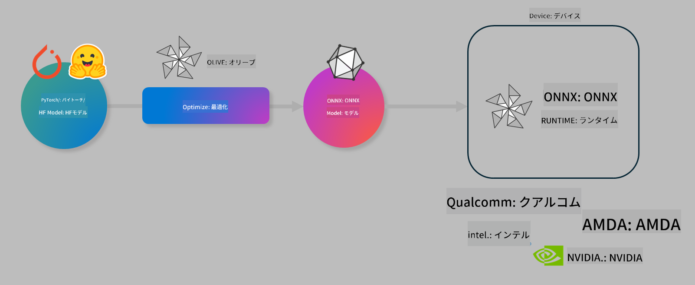

<!--
CO_OP_TRANSLATOR_METADATA:
{
  "original_hash": "6bbe47de3b974df7eea29dfeccf6032b",
  "translation_date": "2025-05-08T06:38:50+00:00",
  "source_file": "code/03.Finetuning/olive-lab/readme.md",
  "language_code": "ja"
}
-->
# Lab. オンデバイス推論向けAIモデルの最適化

## はじめに

> [!IMPORTANT]  
> このラボでは、**Nvidia A10またはA100 GPU** とそれに対応したドライバーおよびCUDAツールキット（バージョン12以上）が必要です。

> [!NOTE]  
> 本ラボは**35分**で、OLIVEを使ったオンデバイス推論向けモデル最適化の基本概念を実践的に学べます。

## 学習目標

このラボを終える頃には、OLIVEを使って以下ができるようになります：

- AWQ量子化手法を使ったAIモデルの量子化
- 特定タスク向けAIモデルのファインチューニング
- ONNX Runtime上で効率的に動作するLoRAアダプター（ファインチューニング済みモデル）の生成

### Oliveとは何か

Olive (*O*NNX *live*) は、ONNXランタイム +++https://onnxruntime.ai+++ 向けにモデルの品質とパフォーマンスを両立させて提供できる、CLI付きのモデル最適化ツールキットです。



Oliveの入力は通常PyTorchやHugging Faceのモデルで、出力はONNXランタイム上で動作する最適化済みのONNXモデルです。OliveはQualcomm、AMD、Nvidia、Intelなどのハードウェアベンダーが提供するAIアクセラレータ（NPU、GPU、CPU）に合わせてモデルを最適化します。

Oliveは「ワークフロー」と呼ばれる一連のモデル最適化タスク（*パス*）を順に実行します。パスの例にはモデル圧縮、グラフキャプチャ、量子化、グラフ最適化などがあります。各パスにはチューニング可能なパラメーターがあり、精度やレイテンシなどの評価指標に基づいて最適化されます。Oliveは探索アルゴリズムを用いて各パスまたは複数パスを自動チューニングします。

#### Oliveのメリット

- グラフ最適化、圧縮、量子化などの試行錯誤による手動実験の手間と時間を大幅に削減。品質と性能の制約を設定すれば、Oliveが最適モデルを自動で見つけます。  
- 量子化、圧縮、グラフ最適化、ファインチューニングなど最先端手法を網羅した40以上の組み込みコンポーネント。  
- よく使うモデル最適化タスク向けの使いやすいCLI（例：olive quantize、olive auto-opt、olive finetune）。  
- モデルのパッケージングとデプロイ機能を内蔵。  
- **Multi LoRA serving** 向けモデル生成をサポート。  
- YAML/JSONでワークフローを構築し、モデル最適化やデプロイタスクを管理可能。  
- **Hugging Face** や **Azure AI** との統合。  
- 組み込みの**キャッシュ機構**によりコスト削減が可能。

## ラボ手順

> [!NOTE]  
> Azure AI Hubとプロジェクトの準備、およびLab 1に従ったA100コンピュートのセットアップが完了していることを確認してください。

### Step 0: Azure AI Computeへの接続

**VS Code**のリモート機能を使ってAzure AI Computeに接続します。

1. **VS Code**デスクトップアプリを開く  
1. **Shift+Ctrl+P** でコマンドパレットを開く  
1. コマンドパレットで **AzureML - remote: Connect to compute instance in New Window** を検索  
1. 表示される指示に従い、Azureサブスクリプション、リソースグループ、プロジェクト、Lab 1で設定したコンピュート名を選択して接続  
1. 接続が完了すると、VS Codeの左下に接続中のAzure ML Computeノードが表示されます `><Azure ML: Compute Name`

### Step 1: リポジトリのクローン

VS Codeで新しいターミナルを開く（**Ctrl+J**）し、リポジトリをクローンします：

ターミナルには以下のプロンプトが表示されます。

```
azureuser@computername:~/cloudfiles/code$ 
```  
ソリューションをクローン

```bash
cd ~/localfiles
git clone https://github.com/microsoft/phi-3cookbook.git
```

### Step 2: フォルダーをVS Codeで開く

ターミナルで以下のコマンドを実行すると、新しいウィンドウでフォルダーが開きます：

```bash
code phi-3cookbook/code/04.Finetuning/Olive-lab
```

または、**ファイル** > **フォルダーを開く** から該当フォルダーを選択して開くことも可能です。

### Step 3: 依存関係のインストール

VS CodeのAzure AI Computeインスタンス上でターミナルを開き（ヒント：**Ctrl+J**）、以下のコマンドを実行して依存関係をインストールします：

```bash
conda create -n olive-ai python=3.11 -y
conda activate olive-ai
pip install -r requirements.txt
az extension remove -n azure-cli-ml
az extension add -n ml
```

> [!NOTE]  
> 依存関係のインストールには約5分かかります。

このラボではモデルをAzure AIモデルカタログからダウンロード・アップロードします。モデルカタログにアクセスするために、Azureへログインしてください：

```bash
az login
```

> [!NOTE]  
> ログイン時にサブスクリプションの選択を求められます。必ず本ラボ用に指定されたサブスクリプションを選択してください。

### Step 4: Oliveコマンドの実行

VS CodeのAzure AI Computeインスタンスでターミナルを開き（ヒント：**Ctrl+J**）、`olive-ai`のconda環境がアクティベートされていることを確認します：

```bash
conda activate olive-ai
```

次に、以下のOliveコマンドを順に実行します。

1. **データの確認:** ここではPhi-3.5-Miniモデルをファインチューニングし、旅行関連の質問に特化させます。以下のコードはJSON Lines形式のデータセットの最初の数レコードを表示します：

    ```bash
    head data/data_sample_travel.jsonl
    ```

1. **モデルの量子化:** トレーニング前に、Active Aware Quantization (AWQ) +++https://arxiv.org/abs/2306.00978+++ という手法で量子化を行います。AWQは推論時の活性化値を考慮して重みを量子化するため、従来の重み量子化より精度の保持が優れています。

    ```bash
    olive quantize \
       --model_name_or_path microsoft/Phi-3.5-mini-instruct \
       --trust_remote_code \
       --algorithm awq \
       --output_path models/phi/awq \
       --log_level 1
    ```

    AWQ量子化には**約8分**かかり、モデルサイズは**約7.5GBから約2.5GBに削減**されます。

    本ラボではHugging Faceからモデルを取り込み（例：`microsoft/Phi-3.5-mini-instruct`）、``). However, Olive also allows you to input models from the Azure AI catalog by updating the `model_name_or_path` argument to an Azure AI asset ID (for example:  `azureml://registries/azureml/models/Phi-3.5-mini-instruct/versions/4`). 

1. **Train the model:** Next, the `olive finetune` コマンドで量子化済みモデルをファインチューニングします。量子化後にファインチューニングするよりも、量子化前にファインチューニングしたほうが精度が良くなるためです。

    ```bash
    olive finetune \
        --method lora \
        --model_name_or_path models/phi/awq \
        --data_files "data/data_sample_travel.jsonl" \
        --data_name "json" \
        --text_template "<|user|>\n{prompt}<|end|>\n<|assistant|>\n{response}<|end|>" \
        --max_steps 100 \
        --output_path ./models/phi/ft \
        --log_level 1
    ```

    ファインチューニング（100ステップ）は**約6分**かかります。

1. **最適化:** モデルのトレーニング後、Oliveの `auto-opt` command, which will capture the ONNX graph and automatically perform a number of optimizations to improve the model performance for CPU by compressing the model and doing fusions. It should be noted, that you can also optimize for other devices such as NPU or GPU by just updating the `--device` and `--provider` 引数を使ってモデルを最適化しますが、本ラボではCPUを使用します。

    ```bash
    olive auto-opt \
       --model_name_or_path models/phi/ft/model \
       --adapter_path models/phi/ft/adapter \
       --device cpu \
       --provider CPUExecutionProvider \
       --use_ort_genai \
       --output_path models/phi/onnx-ao \
       --log_level 1
    ```

    最適化には**約5分**かかります。

### Step 5: モデル推論の簡単なテスト

モデル推論をテストするため、フォルダー内に **app.py** というPythonファイルを作成し、以下のコードをコピー＆ペーストしてください：

```python
import onnxruntime_genai as og
import numpy as np

print("loading model and adapters...", end="", flush=True)
model = og.Model("models/phi/onnx-ao/model")
adapters = og.Adapters(model)
adapters.load("models/phi/onnx-ao/model/adapter_weights.onnx_adapter", "travel")
print("DONE!")

tokenizer = og.Tokenizer(model)
tokenizer_stream = tokenizer.create_stream()

params = og.GeneratorParams(model)
params.set_search_options(max_length=100, past_present_share_buffer=False)
user_input = "what is the best thing to see in chicago"
params.input_ids = tokenizer.encode(f"<|user|>\n{user_input}<|end|>\n<|assistant|>\n")

generator = og.Generator(model, params)

generator.set_active_adapter(adapters, "travel")

print(f"{user_input}")

while not generator.is_done():
    generator.compute_logits()
    generator.generate_next_token()

    new_token = generator.get_next_tokens()[0]
    print(tokenizer_stream.decode(new_token), end='', flush=True)

print("\n")
```

以下のコマンドで実行します：

```bash
python app.py
```

### Step 6: モデルをAzure AIにアップロード

モデルをAzure AIのモデルリポジトリにアップロードすると、開発チーム内で共有できるほか、モデルのバージョン管理も行えます。モデルをアップロードするには、以下のコマンドを実行してください：

> [!NOTE]  
> `{}`の部分を自分のリソースグループ名およびAzure AIプロジェクト名に置き換えてください。

```
az ml workspace show
```

または +++ai.azure.com+++ にアクセスし、**management center** > **project** > **overview** から操作可能です。

`{}`のプレースホルダーにリソースグループ名とAzure AIプロジェクト名を入力してください。

```bash
az ml model create \
    --name ft-for-travel \
    --version 1 \
    --path ./models/phi/onnx-ao \
    --resource-group {RESOURCE_GROUP_NAME} \
    --workspace-name {PROJECT_NAME}
```

アップロードしたモデルは https://ml.azure.com/model/list で確認およびデプロイできます。

**免責事項**：  
本書類はAI翻訳サービス「[Co-op Translator](https://github.com/Azure/co-op-translator)」を使用して翻訳されました。正確性には努めておりますが、自動翻訳には誤りや不正確な箇所が含まれる可能性があることをご承知おきください。原文の言語によるオリジナル文書が権威ある情報源とみなされます。重要な情報については、専門の人間による翻訳を推奨します。本翻訳の使用により生じたいかなる誤解や誤訳についても、当方は一切責任を負いかねます。