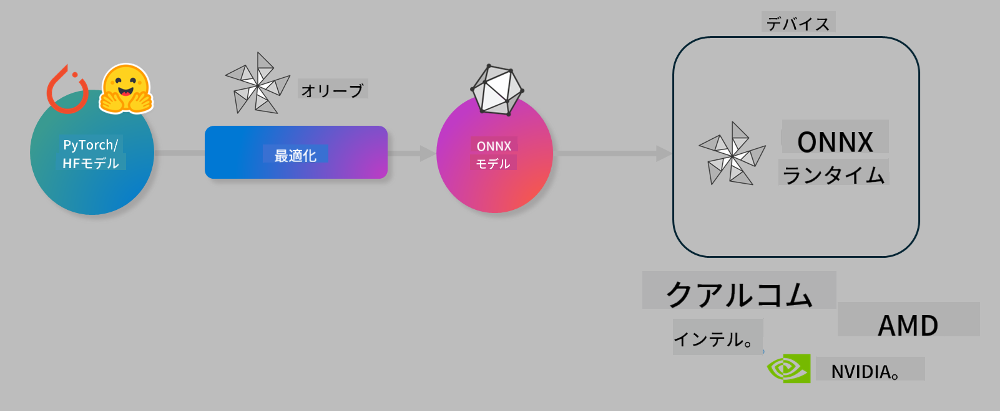

<!--
CO_OP_TRANSLATOR_METADATA:
{
  "original_hash": "76956c0c22e5686908a6d85ec72126af",
  "translation_date": "2025-04-04T11:24:11+00:00",
  "source_file": "code\\03.Finetuning\\olive-lab\\readme.md",
  "language_code": "ja"
}
-->
# ラボ. AIモデルのデバイス上での推論を最適化

## はじめに

> [!IMPORTANT]
> このラボには、**Nvidia A10 または A100 GPU** と関連するドライバーおよび CUDA ツールキット (バージョン12以上) が必要です。

> [!NOTE]
> このラボは**35分間**で、OLIVEを使用してモデルをデバイス上での推論に最適化するための基本概念を実践的に学ぶことができます。

## 学習目標

このラボを終えると、以下をOLIVEで実行できるようになります:

- AWQ量子化法を使用してAIモデルを量子化する。
- 特定のタスク向けにAIモデルを微調整する。
- ONNX Runtimeで効率的なデバイス上推論を行うためのLoRAアダプター（微調整済みモデル）を生成する。

### Oliveとは何か

Olive (*O*NNX *live*) は、ONNX Runtime +++https://onnxruntime.ai+++向けのモデル最適化ツールキットで、CLIも付属しており、品質とパフォーマンスを備えたモデルを提供することができます。



Oliveの入力は通常PyTorchやHugging Faceのモデルで、出力はデバイス（デプロイメントターゲット）上でONNX Runtimeで実行される最適化されたONNXモデルです。Oliveは、Qualcomm、AMD、Nvidia、Intelなどのハードウェアベンダーが提供するデプロイメントターゲットのAIアクセラレーター（NPU、GPU、CPU）に合わせてモデルを最適化します。

Oliveは*ワークフロー*を実行します。これは、*パス*と呼ばれる個々のモデル最適化タスクの順序付けされたシーケンスです。例としては、モデル圧縮、グラフキャプチャ、量子化、グラフ最適化などがあります。各パスには、精度やレイテンシなどの最適なメトリクスを達成するために調整できる一連のパラメーターがあり、これらはそれぞれの評価者によって評価されます。Oliveは、検索アルゴリズムを使用して各パスを1つずつ、または複数のパスをまとめて自動調整する検索戦略を採用しています。

#### Oliveの利点

- グラフ最適化、圧縮、量子化のさまざまな技術を試行錯誤で手動で実験する際の**フラストレーションと時間を削減**します。品質とパフォーマンスの制約を定義すれば、Oliveが自動的に最適なモデルを見つけます。
- **40以上の組み込みモデル最適化コンポーネント**により、量子化、圧縮、グラフ最適化、微調整の最新技術をカバー。
- **使いやすいCLI**で一般的なモデル最適化タスクを簡単に実行可能。例: olive quantize、olive auto-opt、olive finetune。
- モデルのパッケージ化とデプロイメントが組み込み。
- **マルチLoRAサービング**用のモデル生成をサポート。
- YAML/JSONを使用してワークフローを構築し、モデル最適化とデプロイメントタスクを調整可能。
- **Hugging Face**および**Azure AI**との統合。
- **キャッシュ機構**が組み込まれており、**コストを節約**。

## ラボの手順
> [!NOTE]
> Lab 1に従ってAzure AI Hubとプロジェクトをプロビジョニングし、A100コンピュートをセットアップしてください。

### ステップ0: Azure AI Computeに接続する

**VS Code**のリモート機能を使用してAzure AI Computeに接続します。

1. **VS Code**デスクトップアプリケーションを開きます。
1. **コマンドパレット**を**Shift+Ctrl+P**で開きます。
1. コマンドパレットで**AzureML - remote: Connect to compute instance in New Window**を検索します。
1. 画面の指示に従ってComputeに接続します。これには、Lab 1で設定したAzure Subscription、Resource Group、Project、Compute名を選択するプロセスが含まれます。
1. Azure ML Computeノードに接続すると、**Visual Codeの左下**に表示されます `><Azure ML: Compute Name`

### ステップ1: このリポジトリをクローンする

VS Codeで**Ctrl+J**を使って新しいターミナルを開き、このリポジトリをクローンします。

ターミナルで以下のプロンプトが表示されます。

```
azureuser@computername:~/cloudfiles/code$ 
```
ソリューションをクローンします。

```bash
cd ~/localfiles
git clone https://github.com/microsoft/phi-3cookbook.git
```

### ステップ2: VS Codeでフォルダーを開く

関連するフォルダーでVS Codeを開くには、ターミナルで以下のコマンドを実行します。これにより新しいウィンドウが開きます。

```bash
code phi-3cookbook/code/04.Finetuning/Olive-lab
```

または、**ファイル** > **フォルダーを開く**を選択してフォルダーを開くこともできます。

### ステップ3: 依存関係

VS CodeのAzure AI Computeインスタンスでターミナルウィンドウを開き（ヒント: **Ctrl+J**）、以下のコマンドを実行して依存関係をインストールします。

```bash
conda create -n olive-ai python=3.11 -y
conda activate olive-ai
pip install -r requirements.txt
az extension remove -n azure-cli-ml
az extension add -n ml
```

> [!NOTE]
> すべての依存関係をインストールするには約5分かかります。

このラボでは、Azure AI Modelカタログにモデルをダウンロードしてアップロードします。モデルカタログにアクセスできるようにするには、Azureにログインする必要があります:

```bash
az login
```

> [!NOTE]
> ログイン時にサブスクリプションを選択するよう求められます。このラボで提供されたサブスクリプションを設定してください。

### ステップ4: Oliveコマンドを実行する

VS CodeのAzure AI Computeインスタンスでターミナルウィンドウを開き（ヒント: **Ctrl+J**）、`olive-ai` conda環境がアクティブになっていることを確認します。

```bash
conda activate olive-ai
```

次に、以下のOliveコマンドをコマンドラインで実行します。

1. **データを確認する:** この例では、Phi-3.5-Miniモデルを微調整して旅行関連の質問に特化させます。以下のコードは、JSONライン形式のデータセットの最初の数レコードを表示します:
   
    ```bash
    head data/data_sample_travel.jsonl
    ```
1. **モデルを量子化する:** モデルをトレーニングする前に、以下のコマンドを使用してActive Aware Quantization (AWQ) +++https://arxiv.org/abs/2306.00978+++という技術で量子化します。AWQは、推論中に生成される活性化を考慮してモデルの重みを量子化します。これは、活性化の実際のデータ分布を考慮するため、従来の重み量子化法と比較してモデルの精度がより良く保持されます。
    
    ```bash
    olive quantize \
       --model_name_or_path microsoft/Phi-3.5-mini-instruct \
       --trust_remote_code \
       --algorithm awq \
       --output_path models/phi/awq \
       --log_level 1
    ```
    
    AWQ量子化には**約8分**かかり、モデルサイズを**約7.5GBから約2.5GBに削減**します。
   
   このラボでは、Hugging Faceからモデルを入力する方法を紹介します（例: `microsoft/Phi-3.5-mini-instruct`). However, Olive also allows you to input models from the Azure AI catalog by updating the `model_name_or_path` argument to an Azure AI asset ID (for example:  `azureml://registries/azureml/models/Phi-3.5-mini-instruct/versions/4`). 

1. **Train the model:** Next, the `olive finetune`コマンドで量子化済みモデルを微調整します。量子化後ではなく*前*に微調整することで、量子化による損失を微調整プロセスが回復するため、より良い精度が得られます。
    
    ```bash
    olive finetune \
        --method lora \
        --model_name_or_path models/phi/awq \
        --data_files "data/data_sample_travel.jsonl" \
        --data_name "json" \
        --text_template "<|user|>\n{prompt}<|end|>\n<|assistant|>\n{response}<|end|>" \
        --max_steps 100 \
        --output_path ./models/phi/ft \
        --log_level 1
    ```
    
    微調整には**約6分**かかります（100ステップ）。

1. **最適化:** トレーニング済みモデルを使用して、Oliveの`auto-opt` command, which will capture the ONNX graph and automatically perform a number of optimizations to improve the model performance for CPU by compressing the model and doing fusions. It should be noted, that you can also optimize for other devices such as NPU or GPU by just updating the `--device` and `--provider`引数でモデルを最適化しますが、このラボではCPUを使用します。

    ```bash
    olive auto-opt \
       --model_name_or_path models/phi/ft/model \
       --adapter_path models/phi/ft/adapter \
       --device cpu \
       --provider CPUExecutionProvider \
       --use_ort_genai \
       --output_path models/phi/onnx-ao \
       --log_level 1
    ```
    
    最適化には**約5分**かかります。

### ステップ5: モデル推論の簡易テスト

モデルの推論をテストするには、**app.py**というPythonファイルをフォルダーに作成し、以下のコードをコピー＆ペーストしてください:

```python
import onnxruntime_genai as og
import numpy as np

print("loading model and adapters...", end="", flush=True)
model = og.Model("models/phi/onnx-ao/model")
adapters = og.Adapters(model)
adapters.load("models/phi/onnx-ao/model/adapter_weights.onnx_adapter", "travel")
print("DONE!")

tokenizer = og.Tokenizer(model)
tokenizer_stream = tokenizer.create_stream()

params = og.GeneratorParams(model)
params.set_search_options(max_length=100, past_present_share_buffer=False)
user_input = "what is the best thing to see in chicago"
params.input_ids = tokenizer.encode(f"<|user|>\n{user_input}<|end|>\n<|assistant|>\n")

generator = og.Generator(model, params)

generator.set_active_adapter(adapters, "travel")

print(f"{user_input}")

while not generator.is_done():
    generator.compute_logits()
    generator.generate_next_token()

    new_token = generator.get_next_tokens()[0]
    print(tokenizer_stream.decode(new_token), end='', flush=True)

print("\n")
```

以下のコマンドでコードを実行します:

```bash
python app.py
```

### ステップ6: モデルをAzure AIにアップロードする

モデルをAzure AIモデルリポジトリにアップロードすることで、開発チームの他のメンバーとモデルを共有でき、モデルのバージョン管理も行えます。以下のコマンドを実行してモデルをアップロードします:

> [!NOTE]
> `{}`` placeholders with the name of your resource group and Azure AI Project Name. 

To find your resource group `の`resourceGroup`とAzure AIプロジェクト名を更新して、以下のコマンドを実行してください。

```
az ml workspace show
```

または、+++ai.azure.com+++にアクセスし、**管理センター** > **プロジェクト** > **概要**を選択します。

`{}`プレースホルダーをリソースグループ名とAzure AIプロジェクト名に更新してください。

```bash
az ml model create \
    --name ft-for-travel \
    --version 1 \
    --path ./models/phi/onnx-ao \
    --resource-group {RESOURCE_GROUP_NAME} \
    --workspace-name {PROJECT_NAME}
```
アップロードされたモデルを確認し、https://ml.azure.com/model/list でモデルをデプロイできます。

**免責事項**:  
この文書は、AI翻訳サービス [Co-op Translator](https://github.com/Azure/co-op-translator) を使用して翻訳されています。正確性を追求しておりますが、自動翻訳には誤りや不正確な部分が含まれる場合がありますのでご了承ください。元の言語で記載された文書を公式な情報源としてお考えください。重要な情報については、専門の人間による翻訳を推奨いたします。この翻訳の使用に起因する誤解や解釈の誤りについて、当社は一切の責任を負いません。