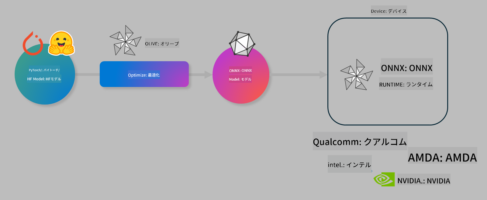

<!--
CO_OP_TRANSLATOR_METADATA:
{
  "original_hash": "6bbe47de3b974df7eea29dfeccf6032b",
  "translation_date": "2025-05-08T06:32:28+00:00",
  "source_file": "code/04.Finetuning/olive-lab/readme.md",
  "language_code": "ja"
}
-->
# Lab. オンデバイス推論向けAIモデルの最適化

## はじめに

> [!IMPORTANT]  
> このラボでは、**Nvidia A10 または A100 GPU** とそれに対応するドライバーおよびCUDAツールキット（バージョン12以上）が必要です。

> [!NOTE]  
> このラボは**35分間**で、OLIVEを使ったオンデバイス推論向けモデル最適化の基本概念を実践的に学べます。

## 学習目標

このラボを終えると、OLIVEを使って以下ができるようになります：

- AWQ量子化方式を用いたAIモデルの量子化
- 特定タスク向けのAIモデルのファインチューニング
- ONNX Runtime上で効率的に動作するLoRAアダプター（ファインチューニング済みモデル）の生成

### Oliveとは

Olive (*O*NNX *live*) は、ONNX Runtime +++https://onnxruntime.ai+++ 向けのモデルの品質とパフォーマンスを両立した最適化を可能にするツールキットで、CLIも付属しています。



Oliveの入力は通常PyTorchまたはHugging Faceモデルで、出力はONNX Runtimeが動作するデバイス（展開先）上で実行される最適化済みONNXモデルです。OliveはQualcomm、AMD、Nvidia、Intelなどのハードウェアベンダーが提供するNPU、GPU、CPUなどのAIアクセラレータ向けにモデルを最適化します。

Oliveは*workflow*（ワークフロー）を実行します。これは、*passes*（パス）と呼ばれる個々のモデル最適化タスクの順序付きシーケンスです。例としてはモデル圧縮、グラフキャプチャ、量子化、グラフ最適化などがあります。各パスにはパラメータセットがあり、精度やレイテンシなどの評価指標を最適化するために調整可能です。Oliveは探索アルゴリズムを使い、各パスまたはパス群を自動でチューニングします。

#### Oliveのメリット

- グラフ最適化、圧縮、量子化の手動試行錯誤にかかる時間とストレスを大幅に削減。品質と性能の制約を設定すれば、Oliveが最適モデルを自動で見つけます。
- 40以上の最先端モデル最適化コンポーネントを内蔵（量子化、圧縮、グラフ最適化、ファインチューニングなど）。
- 一般的なモデル最適化タスク向けの使いやすいCLI（例：olive quantize、olive auto-opt、olive finetune）。
- モデルのパッケージングとデプロイ機能を内蔵。
- **Multi LoRA serving**向けモデル生成に対応。
- YAML/JSONでワークフローを構築し、モデル最適化とデプロイタスクを管理可能。
- **Hugging Face** と **Azure AI** と連携。
- コスト削減に役立つキャッシュ機構を内蔵。

## ラボ手順

> [!NOTE]  
> Azure AI Hubとプロジェクトの準備、Lab 1に従ったA100コンピュートのセットアップが完了していることを確認してください。

### ステップ0: Azure AI Computeに接続

**VS Code**のリモート機能を使ってAzure AI Computeに接続します。

1. **VS Code**デスクトップアプリを開く  
1. **Shift+Ctrl+P**でコマンドパレットを開く  
1. コマンドパレットで「AzureML - remote: Connect to compute instance in New Window」を検索  
1. 画面の指示に従い、Azureサブスクリプション、リソースグループ、プロジェクト、Lab 1で設定したコンピュート名を選択して接続  
1. 接続が成功すると、Visual Studio Codeの左下に接続先が表示されます `><Azure ML: Compute Name`

### ステップ1: リポジトリのクローン

VS Codeで**Ctrl+J**を押して新しいターミナルを開き、以下のコマンドでリポジトリをクローンします。

ターミナルに以下のプロンプトが表示されます。

```
azureuser@computername:~/cloudfiles/code$ 
```  
ソリューションをクローン

```bash
cd ~/localfiles
git clone https://github.com/microsoft/phi-3cookbook.git
```

### ステップ2: VS Codeでフォルダを開く

以下のコマンドをターミナルで実行すると、新しいウィンドウで該当フォルダが開きます。

```bash
code phi-3cookbook/code/04.Finetuning/Olive-lab
```

または、メニューから**ファイル** > **フォルダーを開く**でフォルダを選択しても構いません。

### ステップ3: 依存関係のインストール

Azure AI Computeインスタンス上のVS Codeでターミナルを開き（ヒント：**Ctrl+J**）、以下のコマンドを実行して依存関係をインストールします。

```bash
conda create -n olive-ai python=3.11 -y
conda activate olive-ai
pip install -r requirements.txt
az extension remove -n azure-cli-ml
az extension add -n ml
```

> [!NOTE]  
> 依存関係のインストールには約5分かかります。

このラボではモデルをAzure AI Modelカタログからダウンロードおよびアップロードします。そのため、Azureにログインが必要です：

```bash
az login
```

> [!NOTE]  
> ログイン時にサブスクリプションの選択を求められます。ラボ用に提供されたサブスクリプションを選択してください。

### ステップ4: Oliveコマンドの実行

VS CodeのAzure AI Computeインスタンス上のターミナルで、`olive-ai` conda環境がアクティブになっていることを確認します。

```bash
conda activate olive-ai
```

次に、以下のOliveコマンドを順に実行します。

1. **データの確認：** この例ではPhi-3.5-Miniモデルを旅行関連の質問に特化させるためにファインチューニングします。以下のコードはJSON Lines形式のデータセットの最初の数件を表示します。

    ```bash
    head data/data_sample_travel.jsonl
    ```

1. **モデルの量子化：** モデルをトレーニングする前に、Active Aware Quantization (AWQ) +++https://arxiv.org/abs/2306.00978+++ を使って量子化します。AWQは推論時に生成される活性化を考慮して重みを量子化するため、従来の重み量子化よりも精度をよく保てます。

    ```bash
    olive quantize \
       --model_name_or_path microsoft/Phi-3.5-mini-instruct \
       --trust_remote_code \
       --algorithm awq \
       --output_path models/phi/awq \
       --log_level 1
    ```

    AWQの量子化は**約8分**かかり、モデルサイズを約7.5GBから約2.5GBに削減します。

    このラボではHugging Faceからのモデル入力（例：`microsoft/Phi-3.5-mini-instruct`). However, Olive also allows you to input models from the Azure AI catalog by updating the `model_name_or_path` argument to an Azure AI asset ID (for example:  `azureml://registries/azureml/models/Phi-3.5-mini-instruct/versions/4`). 

1. **Train the model:** Next, the `olive finetune`コマンドで量子化済みモデルをファインチューニング）を紹介します。量子化後にファインチューニングするのではなく、ファインチューニング前に量子化することで精度が向上します。これはファインチューニングで量子化による損失の一部を回復できるためです。

    ```bash
    olive finetune \
        --method lora \
        --model_name_or_path models/phi/awq \
        --data_files "data/data_sample_travel.jsonl" \
        --data_name "json" \
        --text_template "<|user|>\n{prompt}<|end|>\n<|assistant|>\n{response}<|end|>" \
        --max_steps 100 \
        --output_path ./models/phi/ft \
        --log_level 1
    ```

    ファインチューニング（100ステップ）は**約6分**かかります。

1. **最適化：** モデルがトレーニングされたら、Oliveの`auto-opt` command, which will capture the ONNX graph and automatically perform a number of optimizations to improve the model performance for CPU by compressing the model and doing fusions. It should be noted, that you can also optimize for other devices such as NPU or GPU by just updating the `--device` and `--provider`引数を使ってモデルを最適化しますが、このラボではCPUを使います。

    ```bash
    olive auto-opt \
       --model_name_or_path models/phi/ft/model \
       --adapter_path models/phi/ft/adapter \
       --device cpu \
       --provider CPUExecutionProvider \
       --use_ort_genai \
       --output_path models/phi/onnx-ao \
       --log_level 1
    ```

    最適化には**約5分**かかります。

### ステップ5: モデル推論の簡単なテスト

モデル推論をテストするため、フォルダ内に**app.py**というPythonファイルを作成し、以下のコードをコピー＆ペーストしてください。

```python
import onnxruntime_genai as og
import numpy as np

print("loading model and adapters...", end="", flush=True)
model = og.Model("models/phi/onnx-ao/model")
adapters = og.Adapters(model)
adapters.load("models/phi/onnx-ao/model/adapter_weights.onnx_adapter", "travel")
print("DONE!")

tokenizer = og.Tokenizer(model)
tokenizer_stream = tokenizer.create_stream()

params = og.GeneratorParams(model)
params.set_search_options(max_length=100, past_present_share_buffer=False)
user_input = "what is the best thing to see in chicago"
params.input_ids = tokenizer.encode(f"<|user|>\n{user_input}<|end|>\n<|assistant|>\n")

generator = og.Generator(model, params)

generator.set_active_adapter(adapters, "travel")

print(f"{user_input}")

while not generator.is_done():
    generator.compute_logits()
    generator.generate_next_token()

    new_token = generator.get_next_tokens()[0]
    print(tokenizer_stream.decode(new_token), end='', flush=True)

print("\n")
```

以下のコマンドでコードを実行します。

```bash
python app.py
```

### ステップ6: モデルのAzure AIへのアップロード

モデルをAzure AIモデルリポジトリにアップロードすると、開発チーム内でモデルを共有でき、バージョン管理も自動で行えます。モデルをアップロードするには以下のコマンドを実行してください。

> [!NOTE]  
> `{}`の部分をリソースグループ名とAzure AIプロジェクト名に更新して実行してください。

```
az ml workspace show
```

または +++ai.azure.com+++ にアクセスし、**management center** > **project** > **overview** を選択してアップロードできます。

`{}`のプレースホルダーには、ご自身のリソースグループ名とAzure AIプロジェクト名を入力してください。

```bash
az ml model create \
    --name ft-for-travel \
    --version 1 \
    --path ./models/phi/onnx-ao \
    --resource-group {RESOURCE_GROUP_NAME} \
    --workspace-name {PROJECT_NAME}
```

アップロードしたモデルは https://ml.azure.com/model/list で確認・デプロイが可能です。

**免責事項**：  
本書類はAI翻訳サービス「Co-op Translator」（https://github.com/Azure/co-op-translator）を使用して翻訳されています。正確性の確保に努めておりますが、自動翻訳には誤りや不正確な部分が含まれる可能性があることをご了承ください。原文の言語で記載されたオリジナル文書が正式な情報源とみなされます。重要な情報については、専門の人間による翻訳を推奨します。本翻訳の使用により生じた誤解や誤訳について、当方は一切の責任を負いかねます。