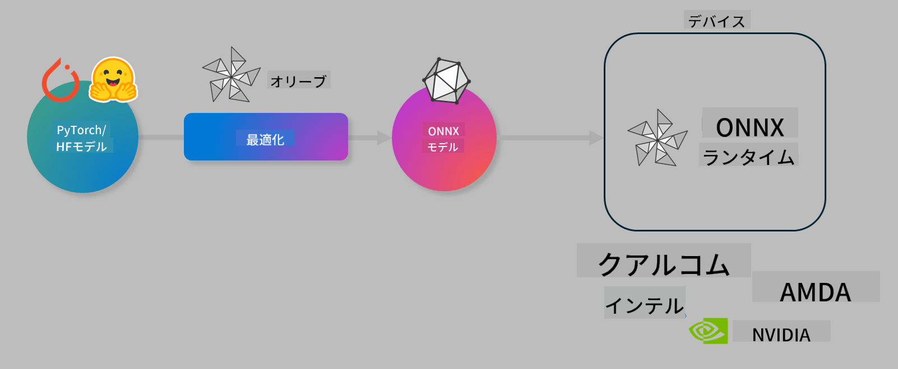

<!--
CO_OP_TRANSLATOR_METADATA:
{
  "original_hash": "76956c0c22e5686908a6d85ec72126af",
  "translation_date": "2025-04-04T11:27:09+00:00",
  "source_file": "code\\04.Finetuning\\olive-lab\\readme.md",
  "language_code": "ja"
}
-->
# ラボ. デバイス上での推論に向けたAIモデルの最適化

## はじめに

> [!IMPORTANT]
> このラボには、**Nvidia A10またはA100 GPU**と、それに対応するドライバおよびCUDAツールキット（バージョン12以上）が必要です。

> [!NOTE]
> このラボは**35分**のハンズオン形式で、OLIVEを使用したデバイス上での推論向けモデル最適化の基本概念を紹介します。

## 学習目標

このラボを終えると、OLIVEを使用して以下を実行できるようになります：

- AWQ量子化手法を使用したAIモデルの量子化。
- 特定のタスクに向けたAIモデルの微調整。
- ONNX Runtimeで効率的なデバイス上推論を実現するためのLoRAアダプター（微調整済みモデル）の生成。

### Oliveとは

Olive (*O*NNX *live*)は、ONNX Runtime +++https://onnxruntime.ai+++ 用のモデル最適化ツールキットで、CLIを備えており、品質とパフォーマンスを向上させたモデルを提供します。



Oliveへの入力は通常PyTorchまたはHugging Faceモデルであり、出力はデバイス（デプロイメントターゲット）上でONNX Runtimeを使用して実行される最適化済みONNXモデルです。Oliveは、Qualcomm、AMD、Nvidia、Intelなどのハードウェアベンダーが提供するAIアクセラレーター（NPU、GPU、CPU）向けにモデルを最適化します。

Oliveは*ワークフロー*を実行します。これは、モデル最適化タスクの順序付けられたシーケンスである*パス*の集合です。例として、モデル圧縮、グラフキャプチャ、量子化、グラフ最適化などがあります。各パスには、精度やレイテンシーなどの最良の評価指標を達成するために調整可能なパラメータが設定されています。Oliveは検索アルゴリズムを使用して各パスまたは一連のパスを自動調整します。

#### Oliveの利点

- グラフ最適化、圧縮、量子化などの手法を試行錯誤する手間と時間を**大幅に削減**します。品質とパフォーマンスの制約を定義すれば、Oliveが最適なモデルを自動的に見つけてくれます。
- **40以上の組み込みモデル最適化コンポーネント**により、量子化、圧縮、グラフ最適化、微調整の最新技術を網羅。
- **使いやすいCLI**で、一般的なモデル最適化タスクを簡単に実行可能（例: olive quantize、olive auto-opt、olive finetune）。
- モデルのパッケージングとデプロイメントが組み込み。
- **Multi LoRAサービング**用のモデル生成をサポート。
- YAML/JSONを使用してワークフローを構築し、モデル最適化およびデプロイメントタスクをオーケストレーション。
- **Hugging Face**および**Azure AI**との統合。
- **キャッシュ機能**を内蔵して**コスト削減**。

## ラボの手順
> [!NOTE]
> Lab 1に従ってAzure AI Hubとプロジェクトをプロビジョニングし、A100コンピュートを設定してください。

### ステップ0: Azure AI Computeに接続

**VS Code**のリモート機能を使用してAzure AI Computeに接続します。

1. **VS Code**デスクトップアプリケーションを開きます。
1. **コマンドパレット**を**Shift+Ctrl+P**で開きます。
1. コマンドパレットで**AzureML - remote: Connect to compute instance in New Window**を検索します。
1. 画面の指示に従い、Lab 1で設定したAzureサブスクリプション、リソースグループ、プロジェクト、コンピュート名を選択して接続します。
1. 接続が成功すると、**Visual Codeの左下**に接続先が表示されます `><Azure ML: Compute Name`

### ステップ1: このリポジトリをクローン

VS Codeで**Ctrl+J**を使用して新しいターミナルを開き、このリポジトリをクローンします。

ターミナルで以下のプロンプトが表示されます：

```
azureuser@computername:~/cloudfiles/code$ 
```
リポジトリをクローンします：

```bash
cd ~/localfiles
git clone https://github.com/microsoft/phi-3cookbook.git
```

### ステップ2: フォルダをVS Codeで開く

ターミナルで以下のコマンドを実行し、関連するフォルダを開きます。このコマンドは新しいウィンドウを開きます：

```bash
code phi-3cookbook/code/04.Finetuning/Olive-lab
```

または、**File** > **Open Folder**を選択してフォルダを開くこともできます。

### ステップ3: 依存関係のインストール

Azure AI Computeインスタンス内でVS Codeのターミナルウィンドウを開き（**Ctrl+J**が便利です）、以下のコマンドを実行して依存関係をインストールします：

```bash
conda create -n olive-ai python=3.11 -y
conda activate olive-ai
pip install -r requirements.txt
az extension remove -n azure-cli-ml
az extension add -n ml
```

> [!NOTE]
> すべての依存関係のインストールには約5分かかります。

このラボでは、Azure AIモデルカタログにモデルをダウンロードおよびアップロードします。モデルカタログにアクセスするために、以下を使用してAzureにログインしてください：

```bash
az login
```

> [!NOTE]
> ログイン時にサブスクリプションを選択する必要があります。このラボで提供されたサブスクリプションを選択してください。

### ステップ4: Oliveコマンドの実行

Azure AI Computeインスタンス内でVS Codeのターミナルウィンドウを開き（**Ctrl+J**が便利です）、`olive-ai`コンダ環境がアクティブになっていることを確認します：

```bash
conda activate olive-ai
```

次に、以下のOliveコマンドをコマンドラインで実行します。

1. **データの確認:** この例では、Phi-3.5-Miniモデルを微調整して旅行関連の質問に特化させます。以下のコードは、JSONライン形式のデータセットの最初の数件を表示します：

    ```bash
    head data/data_sample_travel.jsonl
    ```
1. **モデルの量子化:** モデルをトレーニングする前に、以下のコマンドを使用してActive Aware Quantization (AWQ) +++https://arxiv.org/abs/2306.00978+++という手法で量子化します。AWQは、推論中に生成される活性化を考慮してモデルの重みを量子化します。このため、従来の重み量子化手法と比較してモデルの精度をより良く保持できます。

    ```bash
    olive quantize \
       --model_name_or_path microsoft/Phi-3.5-mini-instruct \
       --trust_remote_code \
       --algorithm awq \
       --output_path models/phi/awq \
       --log_level 1
    ```

    AWQ量子化には約8分かかり、モデルサイズが**約7.5GBから約2.5GB**に削減されます。

    このラボでは、Hugging Faceからモデルを入力する方法を示します（例: `microsoft/Phi-3.5-mini-instruct`). However, Olive also allows you to input models from the Azure AI catalog by updating the `model_name_or_path` argument to an Azure AI asset ID (for example:  `azureml://registries/azureml/models/Phi-3.5-mini-instruct/versions/4`). 

1. **Train the model:** Next, the `olive finetune`コマンドで量子化済みモデルを微調整します）。モデルを微調整する前に量子化することで、量子化による損失を微調整プロセスで回復し、より良い精度を得られます。

    ```bash
    olive finetune \
        --method lora \
        --model_name_or_path models/phi/awq \
        --data_files "data/data_sample_travel.jsonl" \
        --data_name "json" \
        --text_template "<|user|>\n{prompt}<|end|>\n<|assistant|>\n{response}<|end|>" \
        --max_steps 100 \
        --output_path ./models/phi/ft \
        --log_level 1
    ```

    微調整には約6分かかります（100ステップ）。

1. **最適化:** トレーニング済みモデルを、Oliveの`auto-opt` command, which will capture the ONNX graph and automatically perform a number of optimizations to improve the model performance for CPU by compressing the model and doing fusions. It should be noted, that you can also optimize for other devices such as NPU or GPU by just updating the `--device` and `--provider`引数を使用して最適化します。ただし、このラボではCPUを使用します。

    ```bash
    olive auto-opt \
       --model_name_or_path models/phi/ft/model \
       --adapter_path models/phi/ft/adapter \
       --device cpu \
       --provider CPUExecutionProvider \
       --use_ort_genai \
       --output_path models/phi/onnx-ao \
       --log_level 1
    ```

    最適化には約5分かかります。

### ステップ5: モデル推論の簡易テスト

モデルの推論をテストするために、**app.py**という名前のPythonファイルをフォルダ内に作成し、以下のコードをコピー＆ペーストします：

```python
import onnxruntime_genai as og
import numpy as np

print("loading model and adapters...", end="", flush=True)
model = og.Model("models/phi/onnx-ao/model")
adapters = og.Adapters(model)
adapters.load("models/phi/onnx-ao/model/adapter_weights.onnx_adapter", "travel")
print("DONE!")

tokenizer = og.Tokenizer(model)
tokenizer_stream = tokenizer.create_stream()

params = og.GeneratorParams(model)
params.set_search_options(max_length=100, past_present_share_buffer=False)
user_input = "what is the best thing to see in chicago"
params.input_ids = tokenizer.encode(f"<|user|>\n{user_input}<|end|>\n<|assistant|>\n")

generator = og.Generator(model, params)

generator.set_active_adapter(adapters, "travel")

print(f"{user_input}")

while not generator.is_done():
    generator.compute_logits()
    generator.generate_next_token()

    new_token = generator.get_next_tokens()[0]
    print(tokenizer_stream.decode(new_token), end='', flush=True)

print("\n")
```

以下のコマンドでコードを実行します：

```bash
python app.py
```

### ステップ6: モデルをAzure AIにアップロード

モデルをAzure AIモデルリポジトリにアップロードすることで、開発チームの他のメンバーと共有可能になり、モデルのバージョン管理も行えます。以下のコマンドを実行してモデルをアップロードします：

> [!NOTE]
> `{}` placeholders with the name of your resource group and Azure AI Project Name. 

To find your resource group `"resourceGroup"とAzure AIプロジェクト名を更新し、以下のコマンドを実行します。

```
az ml workspace show
```

または、+++ai.azure.com+++にアクセスし、**管理センター** > **プロジェクト** > **概要**を選択します。

`{}`プレースホルダーをリソースグループ名とAzure AIプロジェクト名に置き換えてください。

```bash
az ml model create \
    --name ft-for-travel \
    --version 1 \
    --path ./models/phi/onnx-ao \
    --resource-group {RESOURCE_GROUP_NAME} \
    --workspace-name {PROJECT_NAME}
```
アップロードしたモデルを確認し、以下でモデルをデプロイできます：https://ml.azure.com/model/list

**免責事項**:  
この文書はAI翻訳サービス [Co-op Translator](https://github.com/Azure/co-op-translator) を使用して翻訳されています。正確性を追求していますが、自動翻訳には誤りや不正確な部分が含まれる可能性があります。原文の母国語による文書を公式な情報源としてご参照ください。重要な情報については、専門の人間による翻訳を推奨します。本翻訳の使用により生じた誤解や誤認について、当方は一切の責任を負いません。