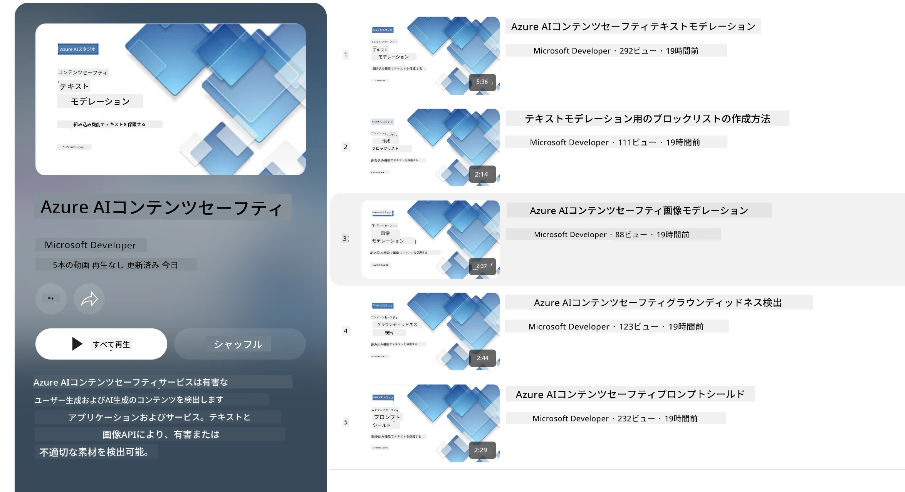

# PhiモデルのAI安全性
Phiファミリーのモデルは、以下の6つの原則に基づいた企業全体の要件である[Microsoft Responsible AI Standard](https://www.microsoft.com/ai/principles-and-approach#responsible-ai-standard) に準拠して開発されました。これらは説明責任、透明性、公平性、信頼性と安全性、プライバシーとセキュリティ、包摂性から構成されており、[Microsoftの責任あるAI原則](https://www.microsoft.com/ai/responsible-ai)を形成しています。

前のPhiモデルと同様に、多面的な安全性評価および安全性ポストトレーニングアプローチを採用し、このリリースの多言語能力を考慮して追加の措置が取られました。複数の言語およびリスクカテゴリにまたがるテストを含む安全性トレーニングと評価への当社のアプローチは、[Phi Safety Post-Training Paper](https://arxiv.org/abs/2407.13833)に記載されています。Phiモデルはこのアプローチの恩恵を受けていますが、開発者は責任あるAIのベストプラクティスを適用し、特定のユースケースや文化的・言語的文脈に関連するリスクのマッピング、測定、軽減を行うべきです。

## ベストプラクティス

他のモデルと同様に、Phiファミリーモデルは公平でない、信頼できない、または攻撃的な振る舞いをする可能性があります。

SLMおよびLLMの制約的な振る舞いには以下のようなものがあります。

- **サービス品質:** Phiモデルは主に英語テキストで訓練されています。英語以外の言語ではパフォーマンスが劣る可能性があります。訓練データでの代表性が低い英語の言語変種では、標準的なアメリカ英語よりもパフォーマンスが低下する可能性があります。
- **有害表現の再現および固定化:** これらのモデルは、あるグループの人々を過大または過少に表現したり、一部のグループの表現を消したり、侮辱的あるいは否定的なステレオタイプを強化したりすることがあります。安全性ポストトレーニングを経ても、異なるグループの表現レベルの差や、実世界のパターンや社会的偏見を反映した訓練データ内の否定的なステレオタイプの例が存在するため、これらの制約は残る可能性があります。
- **不適切または攻撃的なコンテンツ:** これらのモデルは他の種類の不適切または攻撃的なコンテンツを生成することがあり、ユースケース固有の追加の軽減策なしには、センシティブな文脈での展開が不適切になる可能性があります。
情報の信頼性：言語モデルは無意味な内容を生成したり、妥当そうに聞こえても不正確または古い内容をでっち上げたりすることがあります。
- **コードの範囲の制限:** Phi-3の訓練データの大部分はPythonをベースにしており、「typing, math, random, collections, datetime, itertools」などの一般的なパッケージを使用しています。モデルが他のパッケージを利用したり他の言語のスクリプトを生成した場合は、必ずすべてのAPI利用を手動で検証することを強く推奨します。

開発者は責任あるAIのベストプラクティスを適用すべきであり、特定のユースケースが関連する法律や規制（例：プライバシー、貿易など）に準拠していることを保証する責任があります。

## 責任あるAIに関する考慮事項

他の言語モデルと同様、Phiシリーズのモデルは公平でない、信頼できない、または攻撃的な振る舞いをする可能性があります。意識すべき制約的な振る舞いには以下が含まれます。

**サービス品質:** Phiモデルは主に英語テキストで訓練されています。英語以外の言語ではパフォーマンスが劣ります。訓練データでの代表性が低い英語の言語変種では、標準的なアメリカ英語よりパフォーマンスが低下することがあります。

**有害表現の再現および固定化:** これらのモデルは、あるグループを過大または過小に表現したり、一部のグループの表現を消したり、侮辱的または否定的なステレオタイプを強化したりします。安全性ポストトレーニングを経ても、異なるグループの代表性の違いや、実世界のパターンや社会的偏見を反映した訓練データ内の否定的なステレオタイプの例の存在により、これらの制約は残る可能性があります。

**不適切または攻撃的なコンテンツ:** これらのモデルはその他の種類の不適切または攻撃的なコンテンツを生成することがあり、ユースケース固有の追加軽減策なしではセンシティブな文脈での利用が不適切になる場合があります。
情報の信頼性：言語モデルは無意味な内容や、一見妥当でも不正確または古い内容を生成することがあります。

**コードの範囲の制限:** Phi-3の訓練データの大半はPythonを基盤とし、「typing, math, random, collections, datetime, itertools」など一般的なパッケージを使用しています。その他のパッケージや他の言語のスクリプトを生成する場合は、ユーザーが全てのAPI利用を手動で確認することを強く推奨します。

開発者は責任あるAIのベストプラクティスを適用し、特定ユースケースが関係法規（例：プライバシー、貿易など）に適合していることを保証する責任があります。重要な考慮点には以下が含まれます。

**割り当て:** 法的地位や資源または生活機会の割り当て（例：住宅、雇用、信用など）に重大な影響を及ぼす可能性があるシナリオには、さらなる評価や追加のバイアス除去技術なしにモデルを使用するのは適さない可能性があります。

**高リスクシナリオ:** 開発者は、不公平、不信頼、攻撃的な出力が極めて高コストまたは害をもたらす可能性がある高リスクシナリオでのモデル使用の適合性を評価するべきです。これには、正確性と信頼性が重要なセンシティブまたは専門分野（例：法律・健康アドバイス）での助言提供が含まれます。展開環境に応じて追加の安全対策をアプリケーションレベルで実装する必要があります。

**誤情報:** モデルは不正確な情報を生成する可能性があります。開発者は透明性のベストプラクティスを遵守し、エンドユーザーにAIシステムと対話していることを知らせるべきです。アプリケーションレベルでは、フィードバック機構やユースケース固有の文脈情報に基づく応答を構築するパイプライン（Retrieval Augmented Generation、RAGとして知られる）を導入可能です。

**有害コンテンツの生成:** 開発者は文脈に応じて出力を評価し、利用可能な安全分類器やユースケースに適したカスタムソリューションを活用すべきです。

**悪用:** 詐欺、スパム、マルウェア生成などの他の悪用形態が考えられ、開発者は自分のアプリケーションが適用法令に違反していないことを保証しなければなりません。

### ファインチューニングとAIコンテンツ安全性

モデルのファインチューニング後は、[Azure AI Content Safety](https://learn.microsoft.com/azure/ai-services/content-safety/overview)の対策を活用し、モデルが生成するコンテンツを監視し、潜在的なリスク、脅威、品質問題を特定およびブロックすることを強く推奨します。

[Azure AI Content Safety](https://learn.microsoft.com/azure/ai-services/content-safety/overview)はテキストと画像両方のコンテンツをサポートし、クラウド、切断されたコンテナ、エッジ/組み込みデバイスで展開可能です。

## Azure AI Content Safetyの概要

Azure AI Content Safetyは万人向けの一律解決策ではなく、企業の特定ポリシーに合わせてカスタマイズが可能です。さらに、多言語モデルにより複数の言語を同時に理解する能力を備えています。

- **Azure AI Content Safety**
- **Microsoft Developer**
- **5 videos**

Azure AI Content Safetyサービスは、アプリケーションやサービス内で有害なユーザー生成およびAI生成コンテンツを検出します。テキストおよび画像APIを含み、有害または不適切な素材の検出を可能にします。

[AI Content Safety Playlist](https://www.youtube.com/playlist?list=PLlrxD0HtieHjaQ9bJjyp1T7FeCbmVcPkQ)

---

<!-- CO-OP TRANSLATOR DISCLAIMER START -->
**免責事項**：  
本書類はAI翻訳サービス「Co-op Translator」（https://github.com/Azure/co-op-translator）を使用して翻訳されました。正確性を追求しておりますが、自動翻訳には誤りや不正確な部分が含まれる可能性があることをご了承ください。原文はその言語の正式な資料とみなされるべきです。重要な情報については、専門の人間翻訳をご利用になることをお勧めします。本翻訳の利用により生じたいかなる誤解や解釈の相違についても、当方は一切の責任を負いかねます。
<!-- CO-OP TRANSLATOR DISCLAIMER END -->