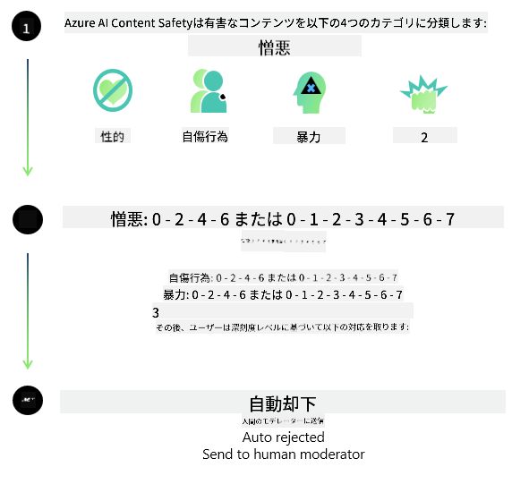
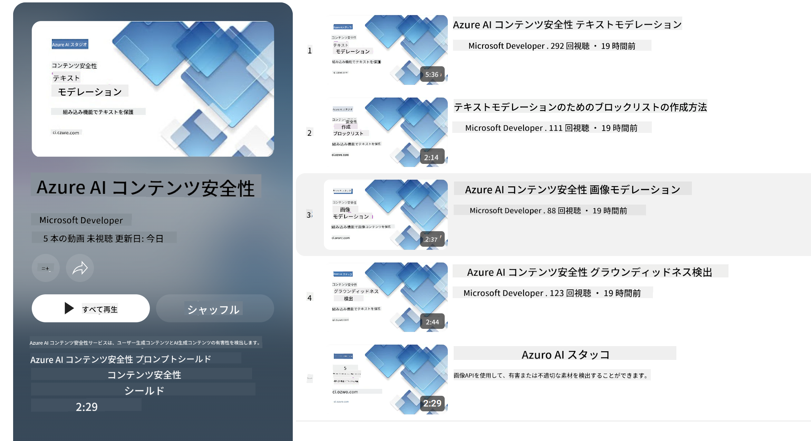

<!--
CO_OP_TRANSLATOR_METADATA:
{
  "original_hash": "1f6b561a224336bd4f413176ec40d994",
  "translation_date": "2025-04-04T11:42:28+00:00",
  "source_file": "md\\01.Introduction\\01\\01.AISafety.md",
  "language_code": "ja"
}
-->
# PhiモデルのAI安全性
Phiモデルファミリーは、[Microsoft Responsible AI Standard](https://query.prod.cms.rt.microsoft.com/cms/api/am/binary/RE5cmFl) に基づいて開発されました。この基準は、責任、透明性、公平性、信頼性と安全性、プライバシーとセキュリティ、包括性という6つの原則に基づく、企業全体の要件を定めています。これらの原則は[Microsoftの責任あるAIの原則](https://www.microsoft.com/ai/responsible-ai)を形成しています。

従来のPhiモデルと同様に、多面的な安全性評価と安全性ポストトレーニングアプローチが採用されており、今回のリリースでは多言語対応に特化した追加措置が取られています。安全性トレーニングと評価のアプローチには、複数の言語やリスクカテゴリにわたるテストが含まれており、その詳細は[Phi Safety Post-Training Paper](https://arxiv.org/abs/2407.13833)で説明されています。Phiモデルはこのアプローチの恩恵を受けていますが、開発者は特定の使用事例や文化的・言語的文脈に関連するリスクを特定し、測定し、軽減する責任あるAIのベストプラクティスを適用する必要があります。

## ベストプラクティス

他のモデルと同様に、Phiモデルファミリーは不公平、不信頼、または不快な振る舞いをする可能性があります。

開発者が認識しておくべきSLMやLLMの制限された挙動には以下が含まれます：

- **サービス品質:** Phiモデルは主に英語テキストでトレーニングされています。英語以外の言語では性能が低下する可能性があります。また、トレーニングデータでの表現が少ない英語のバリエーション（例: 標準的なアメリカ英語以外）では性能が低下する可能性があります。
- **害の表現とステレオタイプの助長:** これらのモデルは特定の人々のグループを過剰または不足して表現したり、一部のグループの表現を消去したり、侮辱的または否定的なステレオタイプを強化したりする可能性があります。安全性ポストトレーニングを行ったにもかかわらず、異なるグループの表現の度合いやトレーニングデータ内の否定的なステレオタイプの例の頻度により、これらの制限が依然として存在する可能性があります。
- **不適切または攻撃的なコンテンツ:** これらのモデルは他の種類の不適切または攻撃的なコンテンツを生成する可能性があり、特定の使用事例に合わせた追加の軽減策なしでは、センシティブな状況での展開に不向きである可能性があります。
- **情報の信頼性:** 言語モデルは意味不明な内容を生成したり、合理的に聞こえるが不正確または古い内容を捏造したりする可能性があります。
- **コードの限定的な範囲:** Phi-3のトレーニングデータの大部分はPythonに基づいており、「typing, math, random, collections, datetime, itertools」などの一般的なパッケージを使用しています。モデルが他のパッケージを使用するPythonスクリプトや他の言語のスクリプトを生成する場合、すべてのAPIの使用を手動で確認することを強く推奨します。

開発者は責任あるAIのベストプラクティスを適用し、特定の使用事例が関連する法律や規制（例: プライバシー、貿易など）を遵守することを保証する責任を負います。

## 責任あるAIに関する考慮事項

他の言語モデルと同様に、Phiシリーズモデルは不公平、不信頼、または不快な振る舞いをする可能性があります。認識しておくべき制限された挙動には以下が含まれます：

**サービス品質:** Phiモデルは主に英語テキストでトレーニングされています。英語以外の言語では性能が低下する可能性があります。また、トレーニングデータでの表現が少ない英語のバリエーション（例: 標準的なアメリカ英語以外）では性能が低下する可能性があります。

**害の表現とステレオタイプの助長:** これらのモデルは特定の人々のグループを過剰または不足して表現したり、一部のグループの表現を消去したり、侮辱的または否定的なステレオタイプを強化したりする可能性があります。安全性ポストトレーニングを行ったにもかかわらず、異なるグループの表現の度合いやトレーニングデータ内の否定的なステレオタイプの例の頻度により、これらの制限が依然として存在する可能性があります。

**不適切または攻撃的なコンテンツ:** これらのモデルは他の種類の不適切または攻撃的なコンテンツを生成する可能性があり、特定の使用事例に合わせた追加の軽減策なしでは、センシティブな状況での展開に不向きである可能性があります。

**情報の信頼性:** 言語モデルは意味不明な内容を生成したり、合理的に聞こえるが不正確または古い内容を捏造したりする可能性があります。

**コードの限定的な範囲:** Phi-3のトレーニングデータの大部分はPythonに基づいており、「typing, math, random, collections, datetime, itertools」などの一般的なパッケージを使用しています。モデルが他のパッケージを使用するPythonスクリプトや他の言語のスクリプトを生成する場合、すべてのAPIの使用を手動で確認することを強く推奨します。

開発者は責任あるAIのベストプラクティスを適用し、特定の使用事例が関連する法律や規制（例: プライバシー、貿易など）を遵守することを保証する責任を負います。重要な考慮事項には以下が含まれます：

**割り当て:** モデルは、法律上の地位やリソース、生活機会（例: 住宅、雇用、信用など）の割り当てに重大な影響を及ぼす可能性があるシナリオには、さらなる評価や追加の偏り軽減技術なしでは適していない場合があります。

**高リスクシナリオ:** 不公平、不信頼、または不快な出力が非常に高いコストや損害につながる可能性がある高リスクシナリオでモデルを使用する適合性を評価する必要があります。これは、正確性と信頼性が重要なセンシティブまたは専門的な分野でのアドバイスの提供（例: 法律または健康関連のアドバイス）を含みます。展開の文脈に応じて、アプリケーションレベルで追加の安全対策を実施する必要があります。

**誤情報:** モデルは不正確な情報を生成する可能性があります。開発者は透明性のベストプラクティスを遵守し、エンドユーザーにAIシステムと対話していることを通知する必要があります。アプリケーションレベルでは、フィードバックメカニズムや、使用事例固有の文脈情報に基づいた応答を生成するためのパイプラインを構築することができます。この技術は、Retrieval Augmented Generation (RAG) として知られています。

**有害なコンテンツの生成:** 開発者は出力をその文脈に合わせて評価し、利用可能な安全性分類器や使用事例に適したカスタムソリューションを使用する必要があります。

**悪用:** 詐欺、スパム、マルウェアの生成など、他の形態の悪用が発生する可能性があり、開発者はそのアプリケーションが適用される法律や規制に違反しないことを保証する必要があります。

### ファインチューニングとAIコンテンツ安全性

モデルをファインチューニングした後は、[Azure AI Content Safety](https://learn.microsoft.com/azure/ai-services/content-safety/overview) を活用して、モデルが生成するコンテンツを監視し、潜在的なリスク、脅威、および品質問題を特定してブロックすることを強く推奨します。

[Azure AI Content Safety](https://learn.microsoft.com/azure/ai-services/content-safety/overview) はテキストと画像コンテンツの両方をサポートしており、クラウド、切断されたコンテナ、エッジ/組み込みデバイスに展開することができます。

## Azure AI Content Safetyの概要

Azure AI Content Safetyは万能なソリューションではなく、企業の特定のポリシーに合わせてカスタマイズすることができます。さらに、多言語モデルにより、複数の言語を同時に理解することが可能です。

- **Azure AI Content Safety**
- **Microsoft Developer**
- **5本の動画**

Azure AI Content Safetyサービスは、アプリケーションやサービス内で生成された有害なユーザーコンテンツやAIコンテンツを検出します。これには、有害または不適切な素材を検出するためのテキストおよび画像APIが含まれています。

[AI Content Safety Playlist](https://www.youtube.com/playlist?list=PLlrxD0HtieHjaQ9bJjyp1T7FeCbmVcPkQ)

**免責事項**:  
この文書はAI翻訳サービス [Co-op Translator](https://github.com/Azure/co-op-translator) を使用して翻訳されています。正確性を追求しておりますが、自動翻訳には誤りや不正確な部分が含まれる可能性があります。元の言語で記載された文書を正式な情報源としてお考えください。重要な情報については、専門の人間による翻訳を推奨します。本翻訳の使用に起因する誤解や誤認について、当方は責任を負いません。