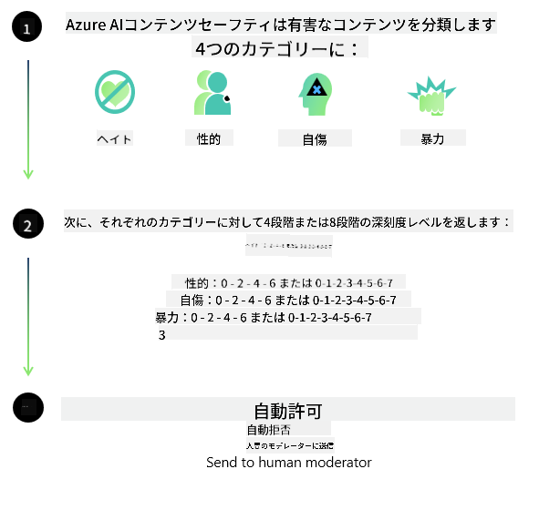
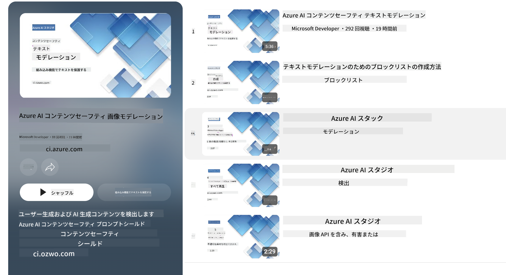

<!--
CO_OP_TRANSLATOR_METADATA:
{
  "original_hash": "c8273672cc57df2be675407a1383aaf0",
  "translation_date": "2025-05-08T06:13:22+00:00",
  "source_file": "md/01.Introduction/01/01.AISafety.md",
  "language_code": "ja"
}
-->
# PhiモデルのAIセーフティ  
Phiファミリーのモデルは、[Microsoft Responsible AI Standard](https://query.prod.cms.rt.microsoft.com/cms/api/am/binary/RE5cmFl) に基づいて開発されました。これは、説明責任、透明性、公平性、信頼性と安全性、プライバシーとセキュリティ、包括性という6つの原則に基づく、企業全体の要件セットであり、[MicrosoftのResponsible AI原則](https://www.microsoft.com/ai/responsible-ai)を形成しています。

従来のPhiモデル同様、多面的な安全評価と安全性のポストトレーニングアプローチを採用しており、今回のリリースでは多言語対応を考慮した追加措置も講じています。安全性トレーニングと評価のアプローチ、複数言語やリスクカテゴリでのテストについては、[Phi Safety Post-Training Paper](https://arxiv.org/abs/2407.13833)にまとめられています。Phiモデルはこのアプローチの恩恵を受けていますが、開発者はそれぞれのユースケースや文化的・言語的文脈に応じたリスクのマッピング、測定、軽減を含む責任あるAIのベストプラクティスを適用する必要があります。

## ベストプラクティス  

他のモデルと同様に、Phiファミリーのモデルも不公平、不安定、攻撃的な振る舞いを示す可能性があります。

SLMやLLMの制限的な挙動として注意すべき点は以下の通りです：

- **サービス品質:** Phiモデルは主に英語テキストでトレーニングされています。英語以外の言語ではパフォーマンスが低下します。また、トレーニングデータにあまり含まれていない英語の方言では、標準的なアメリカ英語よりもパフォーマンスが劣る可能性があります。  
- **有害表現の再現やステレオタイプの助長:** これらのモデルは、特定の人々のグループを過剰または過小に表現したり、あるグループの表現を消したり、侮辱的または否定的なステレオタイプを強化したりする可能性があります。安全性のポストトレーニングを行っても、異なるグループの表現レベルの違いや、現実世界のパターンや社会的偏見を反映したトレーニングデータ内の否定的なステレオタイプの例の存在により、これらの制限は依然として残る場合があります。  
- **不適切または攻撃的なコンテンツ:** これらのモデルはその他の種類の不適切または攻撃的なコンテンツを生成することがあり、追加のユースケースに特化した緩和策なしにセンシティブな文脈での利用は適さない場合があります。  
- **情報の信頼性:** 言語モデルは無意味な内容や、一見もっともらしいが不正確または古い情報を生成することがあります。  
- **コードの適用範囲の制限:** Phi-3のトレーニングデータの大部分はPythonベースで、「typing, math, random, collections, datetime, itertools」などの一般的なパッケージを使用しています。モデルが他のパッケージを使ったPythonスクリプトや他言語のスクリプトを生成した場合は、ユーザーがすべてのAPI使用を手動で検証することを強く推奨します。

開発者は責任あるAIのベストプラクティスを適用し、特定のユースケースが関連する法令（例：プライバシー、貿易など）に準拠していることを保証する責任があります。

## 責任あるAIに関する考慮事項  

他の言語モデル同様、Phiシリーズモデルも不公平、不安定、攻撃的な振る舞いを示す可能性があります。注意すべき制限的な挙動は以下の通りです：

**サービス品質:** Phiモデルは主に英語テキストでトレーニングされているため、英語以外の言語ではパフォーマンスが低下します。トレーニングデータに少ない英語の方言では、標準的なアメリカ英語よりも性能が劣る可能性があります。

**有害表現の再現やステレオタイプの助長:** これらのモデルは、特定のグループを過剰または過小に表現したり、あるグループの表現を消したり、侮辱的または否定的なステレオタイプを強化したりする可能性があります。安全性のポストトレーニングを行っても、異なるグループの表現レベルの違いやトレーニングデータに含まれる否定的なステレオタイプの例の存在により、これらの制限は残る場合があります。

**不適切または攻撃的なコンテンツ:** モデルはその他の種類の不適切または攻撃的なコンテンツを生成することがあり、追加のユースケースに特化した緩和策なしにセンシティブな文脈での利用は適さない場合があります。  
情報の信頼性: 言語モデルは無意味な内容や、一見もっともらしいが不正確または古い情報を生成することがあります。

**コードの適用範囲の制限:** Phi-3のトレーニングデータの大部分はPythonベースで、「typing, math, random, collections, datetime, itertools」などの一般的なパッケージを使用しています。モデルが他のパッケージを使ったPythonスクリプトや他言語のスクリプトを生成した場合は、ユーザーがすべてのAPI使用を手動で検証することを強く推奨します。

開発者は責任あるAIのベストプラクティスを適用し、特定のユースケースが関連する法令（例：プライバシー、貿易など）に準拠していることを保証する責任があります。重要な検討事項は以下の通りです：

**割り当て:** 法的地位や資源、生活機会の割り当てに重大な影響を及ぼす可能性のあるシナリオ（例：住宅、雇用、信用など）には、さらなる評価と追加のバイアス軽減技術なしではモデルの利用は適さない場合があります。

**ハイリスクシナリオ:** 不公平、不安定、攻撃的な出力が非常に高コストまたは害をもたらす可能性があるハイリスクなシナリオでのモデル利用適合性を開発者が評価すべきです。これには、正確性と信頼性が重要なセンシティブまたは専門的な領域（例：法律や健康アドバイス）での助言提供が含まれます。追加の安全策は、展開コンテキストに応じてアプリケーションレベルで実装する必要があります。

**誤情報:** モデルは不正確な情報を生成する可能性があります。開発者は透明性のベストプラクティスに従い、エンドユーザーにAIシステムと対話していることを通知すべきです。アプリケーションレベルでは、ユースケース固有の文脈情報に基づく応答を構築するためのフィードバックメカニズムやパイプライン（Retrieval Augmented Generation (RAG) と呼ばれる手法）を構築できます。

**有害コンテンツの生成:** 開発者は出力を文脈に応じて評価し、利用可能な安全性分類器やユースケースに適したカスタムソリューションを活用すべきです。

**悪用:** 詐欺、スパム、マルウェア生成などの悪用の可能性もあり、開発者は自分たちのアプリケーションが関連法令を遵守していることを保証すべきです。

### ファインチューニングとAIコンテンツセーフティ  

モデルのファインチューニング後は、[Azure AI Content Safety](https://learn.microsoft.com/azure/ai-services/content-safety/overview) の機能を活用し、モデルが生成するコンテンツを監視して潜在的なリスク、脅威、品質問題を検出・ブロックすることを強く推奨します。

[Azure AI Content Safety](https://learn.microsoft.com/azure/ai-services/content-safety/overview) はテキストと画像の両方のコンテンツに対応し、クラウド、切断されたコンテナ、エッジ／組み込みデバイス上で展開可能です。

## Azure AI Content Safetyの概要  

Azure AI Content Safetyは万能のソリューションではなく、企業のポリシーに合わせてカスタマイズ可能です。また、多言語モデルにより複数言語を同時に理解できます。

- **Azure AI Content Safety**  
- **Microsoft Developer**  
- **5本の動画**

Azure AI Content Safetyサービスは、アプリケーションやサービス内の有害なユーザー生成コンテンツおよびAI生成コンテンツを検出します。テキストおよび画像のAPIを含み、有害または不適切な素材の検出が可能です。

[AI Content Safety Playlist](https://www.youtube.com/playlist?list=PLlrxD0HtieHjaQ9bJjyp1T7FeCbmVcPkQ)

**免責事項**：  
本書類はAI翻訳サービス「[Co-op Translator](https://github.com/Azure/co-op-translator)」を使用して翻訳されています。正確性には努めておりますが、自動翻訳には誤りや不正確な部分が含まれる可能性があることをご承知おきください。原文はその言語での正式な情報源とみなされるべきです。重要な情報については、専門の人間翻訳を推奨します。本翻訳の利用によって生じたいかなる誤解や誤訳についても、当方は一切責任を負いかねます。