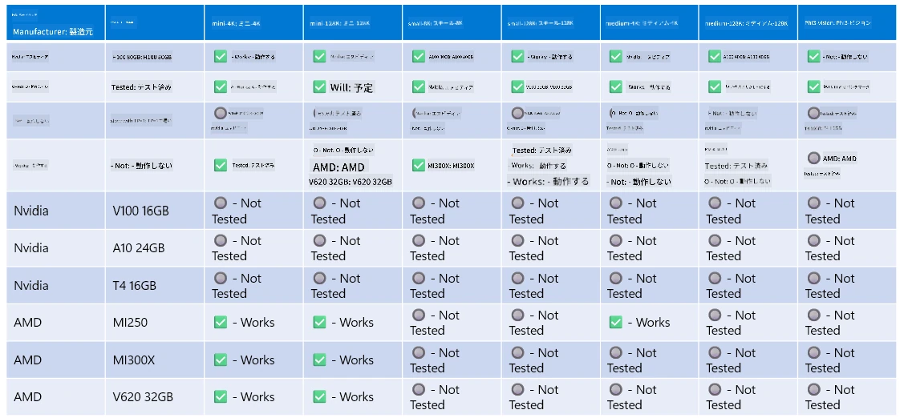

# Phi ハードウェアサポート

Microsoft Phi は ONNX Runtime 向けに最適化されており、Windows DirectML をサポートしています。GPU、CPU、さらにはモバイルデバイスなど、さまざまなハードウェアで良好に動作します。

## デバイスハードウェア  
具体的にサポートされているハードウェアは以下の通りです：

- GPU SKU: RTX 4090 (DirectML)
- GPU SKU: 1 A100 80GB (CUDA)
- CPU SKU: Standard F64s v2 (64 vCPU、128 GiB メモリ)

## モバイル SKU

- Android - Samsung Galaxy S21
- Apple iPhone 14 以降の A16/A17 プロセッサ搭載モデル

## Phi ハードウェア仕様

- 最低構成要件
- Windows: DirectX 12 対応 GPU と合計 4GB 以上の RAM

CUDA: Compute Capability >= 7.02 の NVIDIA GPU



## 複数 GPU で onnxruntime を実行する

現在利用可能な Phi ONNX モデルは 1 GPU のみ対応しています。Phi モデルでマルチ GPU をサポートすることは可能ですが、2 GPU での ORT が 2 インスタンスの ORT よりもスループットが向上する保証はありません。最新情報は [ONNX Runtime](https://onnxruntime.ai/) をご覧ください。

[Build 2024 the GenAI ONNX Team](https://youtu.be/WLW4SE8M9i8?si=EtG04UwDvcjunyfC) では、Phi モデル向けにマルチ GPU ではなくマルチインスタンスを有効にしたことが発表されました。

現在は CUDA_VISIBLE_DEVICES 環境変数を使って、1 つの onnxruntime または onnxruntime-genai インスタンスをこのように実行できます。

```Python
CUDA_VISIBLE_DEVICES=0 python infer.py
CUDA_VISIBLE_DEVICES=1 python infer.py
```

[Azure AI Foundry](https://ai.azure.com) で Phi をさらにお試しください。

**免責事項**：  
本書類はAI翻訳サービス「[Co-op Translator](https://github.com/Azure/co-op-translator)」を使用して翻訳されました。正確性を期しておりますが、自動翻訳には誤りや不正確な部分が含まれる可能性があります。原文の言語によるオリジナル文書が正式な情報源とみなされるべきです。重要な情報については、専門の人間による翻訳を推奨します。本翻訳の利用により生じたいかなる誤解や誤訳についても、当方は一切の責任を負いかねます。