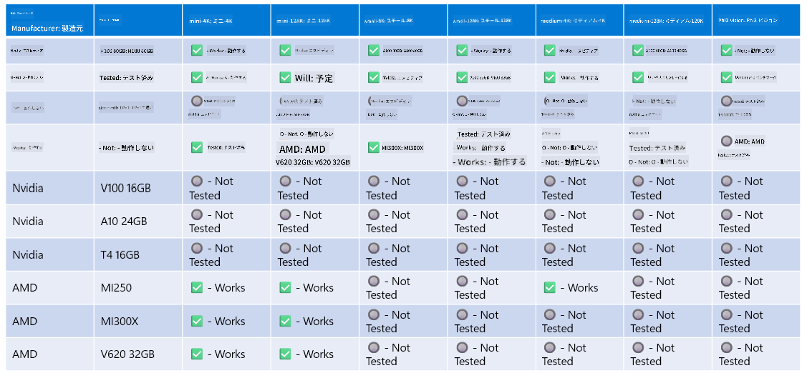

<!--
CO_OP_TRANSLATOR_METADATA:
{
  "original_hash": "8cdc17ce0f10535da30b53d23fe1a795",
  "translation_date": "2025-05-08T06:14:27+00:00",
  "source_file": "md/01.Introduction/01/01.Hardwaresupport.md",
  "language_code": "ja"
}
-->
# Phi ハードウェアサポート

Microsoft Phi は ONNX Runtime 向けに最適化されており、Windows DirectML をサポートしています。GPU、CPU、さらにはモバイルデバイスなど、さまざまなハードウェアで問題なく動作します。

## デバイスハードウェア  
対応しているハードウェアは以下の通りです：

- GPU SKU: RTX 4090 (DirectML)
- GPU SKU: 1 A100 80GB (CUDA)
- CPU SKU: Standard F64s v2 (64 vCPU、128 GiB メモリ)

## モバイル SKU

- Android - Samsung Galaxy S21
- Apple iPhone 14 以降の A16/A17 プロセッサ搭載モデル

## Phi ハードウェア仕様

- 最低限必要な構成
- Windows: DirectX 12 対応 GPU と合計 4GB 以上の RAM

CUDA: Compute Capability >= 7.02 の NVIDIA GPU



## 複数 GPU で onnxruntime を実行する

現時点で利用可能な Phi ONNX モデルは1 GPU用のみです。Phi モデルでのマルチ GPU 対応は可能ですが、2 GPU の ORT が 2 インスタンスの ORT よりもスループットが向上する保証はありません。最新情報は [ONNX Runtime](https://onnxruntime.ai/) をご覧ください。

[Build 2024 the GenAI ONNX Team](https://youtu.be/WLW4SE8M9i8?si=EtG04UwDvcjunyfC) にて、Phi モデルではマルチ GPU の代わりにマルチインスタンスを有効化したことが発表されました。

現在は、CUDA_VISIBLE_DEVICES 環境変数を使って1つの onnxruntime または onnxruntime-genai インスタンスを次のように実行できます。

```Python
CUDA_VISIBLE_DEVICES=0 python infer.py
CUDA_VISIBLE_DEVICES=1 python infer.py
```

[Azure AI Foundry](https://ai.azure.com) で Phi をさらにお試しください。

**免責事項**:  
本書類はAI翻訳サービス「[Co-op Translator](https://github.com/Azure/co-op-translator)」を使用して翻訳されています。正確性の確保に努めておりますが、自動翻訳には誤りや不正確な部分が含まれる可能性があることをご承知おきください。原文の言語によるオリジナル文書が正式な情報源とみなされます。重要な情報については、専門の人間による翻訳を推奨いたします。本翻訳の利用により生じたいかなる誤解や解釈の相違についても、一切の責任を負いかねます。