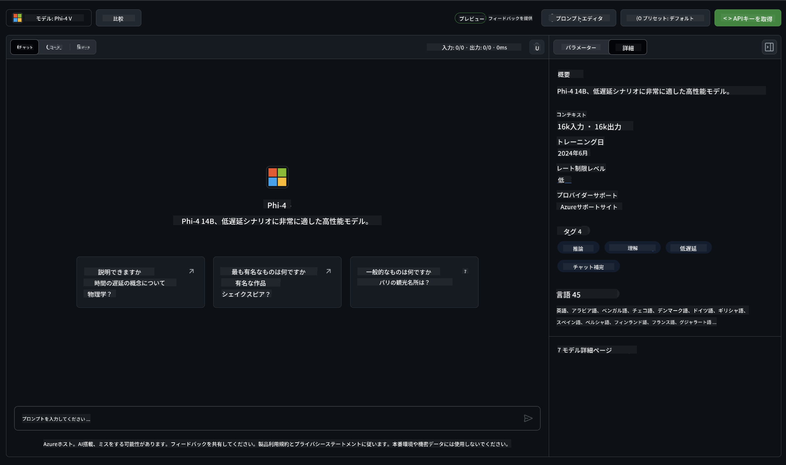

<!--
CO_OP_TRANSLATOR_METADATA:
{
  "original_hash": "fa5cdbc832e5bcffebb25ce25ec1a3c3",
  "translation_date": "2025-04-04T11:52:48+00:00",
  "source_file": "md\\01.Introduction\\02\\02.GitHubModel.md",
  "language_code": "ja"
}
-->
## GitHubモデル内のPhiファミリー

[GitHub Models](https://github.com/marketplace/models)へようこそ！Azure AIにホストされたAIモデルを探索する準備は整っています。


GitHub Modelsで利用可能なモデルについての詳細は、[GitHub Model Marketplace](https://github.com/marketplace/models)をご覧ください。

## 利用可能なモデル

各モデルには専用のプレイグラウンドとサンプルコードがあります。



### GitHubモデルカタログ内のPhiファミリー

- [Phi-4](https://github.com/marketplace/models/azureml/Phi-4)

- [Phi-3.5-MoE instruct (128k)](https://github.com/marketplace/models/azureml/Phi-3-5-MoE-instruct)

- [Phi-3.5-vision instruct (128k)](https://github.com/marketplace/models/azureml/Phi-3-5-vision-instruct)

- [Phi-3.5-mini instruct (128k)](https://github.com/marketplace/models/azureml/Phi-3-5-mini-instruct)

- [Phi-3-Medium-128k-Instruct](https://github.com/marketplace/models/azureml/Phi-3-medium-128k-instruct)

- [Phi-3-medium-4k-instruct](https://github.com/marketplace/models/azureml/Phi-3-medium-4k-instruct)

- [Phi-3-mini-128k-instruct](https://github.com/marketplace/models/azureml/Phi-3-mini-128k-instruct)

- [Phi-3-mini-4k-instruct](https://github.com/marketplace/models/azureml/Phi-3-mini-4k-instruct)

- [Phi-3-small-128k-instruct](https://github.com/marketplace/models/azureml/Phi-3-small-128k-instruct)

- [Phi-3-small-8k-instruct](https://github.com/marketplace/models/azureml/Phi-3-small-8k-instruct)

## はじめに

すぐに実行可能な基本的なサンプルがいくつか用意されています。サンプルディレクトリでそれらを見つけることができます。お気に入りの言語で始めたい場合は、以下の言語で例を見つけることができます：

- Python
- JavaScript
- C#
- Java
- cURL

また、サンプルとモデルを実行するための専用のCodespaces環境も用意されています。


## サンプルコード

以下は、いくつかの使用例に関するコードスニペットです。Azure AI Inference SDKの詳細なドキュメントとサンプルについては、完全なドキュメントをご覧ください。

## セットアップ

1. パーソナルアクセストークンを作成する
トークンに許可を付与する必要はありません。このトークンはMicrosoftのサービスに送信されることに注意してください。

以下のコードスニペットを使用するには、環境変数を作成してトークンをクライアントコードのキーとして設定してください。

bashを使用している場合：
```
export GITHUB_TOKEN="<your-github-token-goes-here>"
```
powershellを使用している場合：

```
$Env:GITHUB_TOKEN="<your-github-token-goes-here>"
```

Windowsコマンドプロンプトを使用している場合：

```
set GITHUB_TOKEN=<your-github-token-goes-here>
```

## Pythonのサンプル

### 依存関係をインストール
pipを使用してAzure AI Inference SDKをインストールします（要件：Python >=3.8）。

```
pip install azure-ai-inference
```
### 基本的なコードサンプルを実行

このサンプルは、チャット完了APIへの基本的な呼び出しを示しています。GitHub AIモデル推論エンドポイントとGitHubトークンを利用しています。この呼び出しは同期的に行われます。

```python
import os
from azure.ai.inference import ChatCompletionsClient
from azure.ai.inference.models import SystemMessage, UserMessage
from azure.core.credentials import AzureKeyCredential

endpoint = "https://models.inference.ai.azure.com"
model_name = "Phi-4"
token = os.environ["GITHUB_TOKEN"]

client = ChatCompletionsClient(
    endpoint=endpoint,
    credential=AzureKeyCredential(token),
)

response = client.complete(
    messages=[
        UserMessage(content="I have $20,000 in my savings account, where I receive a 4% profit per year and payments twice a year. Can you please tell me how long it will take for me to become a millionaire? Also, can you please explain the math step by step as if you were explaining it to an uneducated person?"),
    ],
    temperature=0.4,
    top_p=1.0,
    max_tokens=2048,
    model=model_name
)

print(response.choices[0].message.content)
```

### マルチターン会話を実行

このサンプルは、チャット完了APIを使用したマルチターン会話を示しています。チャットアプリケーションでモデルを使用する場合、会話の履歴を管理し、最新のメッセージをモデルに送信する必要があります。

```
import os
from azure.ai.inference import ChatCompletionsClient
from azure.ai.inference.models import AssistantMessage, SystemMessage, UserMessage
from azure.core.credentials import AzureKeyCredential

token = os.environ["GITHUB_TOKEN"]
endpoint = "https://models.inference.ai.azure.com"
# Replace Model_Name
model_name = "Phi-4"

client = ChatCompletionsClient(
    endpoint=endpoint,
    credential=AzureKeyCredential(token),
)

messages = [
    SystemMessage(content="You are a helpful assistant."),
    UserMessage(content="What is the capital of France?"),
    AssistantMessage(content="The capital of France is Paris."),
    UserMessage(content="What about Spain?"),
]

response = client.complete(messages=messages, model=model_name)

print(response.choices[0].message.content)
```

### 出力をストリームする

より良いユーザー体験のために、モデルの応答をストリームして最初のトークンが早く表示されるようにし、長い応答を待つのを避けることをお勧めします。

```
import os
from azure.ai.inference import ChatCompletionsClient
from azure.ai.inference.models import SystemMessage, UserMessage
from azure.core.credentials import AzureKeyCredential

token = os.environ["GITHUB_TOKEN"]
endpoint = "https://models.inference.ai.azure.com"
# Replace Model_Name
model_name = "Phi-4"

client = ChatCompletionsClient(
    endpoint=endpoint,
    credential=AzureKeyCredential(token),
)

response = client.complete(
    stream=True,
    messages=[
        SystemMessage(content="You are a helpful assistant."),
        UserMessage(content="Give me 5 good reasons why I should exercise every day."),
    ],
    model=model_name,
)

for update in response:
    if update.choices:
        print(update.choices[0].delta.content or "", end="")

client.close()
```

## GitHubモデルの無料利用と制限


[プレイグラウンドと無料API利用の制限](https://docs.github.com/en/github-models/prototyping-with-ai-models#rate-limits)は、モデルを試してAIアプリケーションをプロトタイプするためのものです。これらの制限を超えて利用し、アプリケーションをスケールさせたい場合は、Azureアカウントからリソースをプロビジョニングし、GitHubのパーソナルアクセストークンではなくAzureから認証する必要があります。コードの他の部分を変更する必要はありません。このリンクを使用して、Azure AIで無料利用枠を超える方法を確認してください。

### 注意事項

モデルと対話する際には、AIを試していることを忘れず、コンテンツに誤りが含まれる可能性があります。

この機能には、リクエスト数（1分あたり、1日あたり）、リクエストごとのトークン数、同時リクエスト数などのさまざまな制限があり、プロダクション用途には設計されていません。

GitHub ModelsはAzure AI Content Safetyを使用しています。これらのフィルターはGitHub Modelsの体験の一部としてオフにすることはできません。有料サービスを通じてモデルを利用する場合は、コンテンツフィルターを要件に合わせて設定してください。

このサービスはGitHubのプレリリース利用規約の下にあります。

**免責事項**:  
この文書は、AI翻訳サービス[Co-op Translator](https://github.com/Azure/co-op-translator)を使用して翻訳されています。正確性を追求しておりますが、自動翻訳には誤りや不正確さが含まれる場合があります。元の言語で作成された文書が正式な情報源としてみなされるべきです。重要な情報については、専門の人間による翻訳を推奨します。この翻訳の使用により生じる誤解や誤解釈について、当方は責任を負いません。