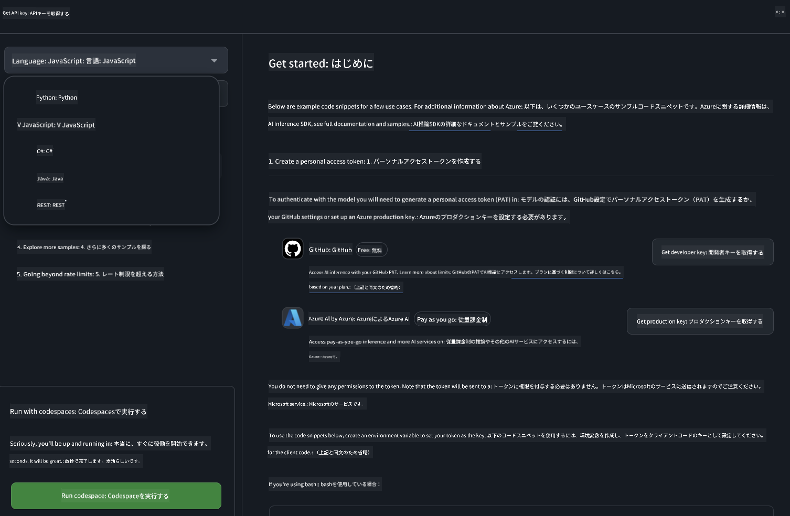

<!--
CO_OP_TRANSLATOR_METADATA:
{
  "original_hash": "fb67a08b9fc911a10ed58081fadef416",
  "translation_date": "2025-07-16T18:58:33+00:00",
  "source_file": "md/01.Introduction/02/02.GitHubModel.md",
  "language_code": "ja"
}
-->
## GitHub ModelsのPhiファミリー

[GitHub Models](https://github.com/marketplace/models)へようこそ！Azure AI上でホストされているAIモデルを自由に探索できるよう、すべて準備が整っています。


GitHub Modelsで利用可能なモデルの詳細については、[GitHub Model Marketplace](https://github.com/marketplace/models)をご覧ください。

## 利用可能なモデル

各モデルには専用のプレイグラウンドとサンプルコードがあります。


### GitHub Model CatalogのPhiファミリー

- [Phi-4](https://github.com/marketplace/models/azureml/Phi-4)

- [Phi-3.5-MoE instruct (128k)](https://github.com/marketplace/models/azureml/Phi-3-5-MoE-instruct)

- [Phi-3.5-vision instruct (128k)](https://github.com/marketplace/models/azureml/Phi-3-5-vision-instruct)

- [Phi-3.5-mini instruct (128k)](https://github.com/marketplace/models/azureml/Phi-3-5-mini-instruct)

- [Phi-3-Medium-128k-Instruct](https://github.com/marketplace/models/azureml/Phi-3-medium-128k-instruct)

- [Phi-3-medium-4k-instruct](https://github.com/marketplace/models/azureml/Phi-3-medium-4k-instruct)

- [Phi-3-mini-128k-instruct](https://github.com/marketplace/models/azureml/Phi-3-mini-128k-instruct)

- [Phi-3-mini-4k-instruct](https://github.com/marketplace/models/azureml/Phi-3-mini-4k-instruct)

- [Phi-3-small-128k-instruct](https://github.com/marketplace/models/azureml/Phi-3-small-128k-instruct)

- [Phi-3-small-8k-instruct](https://github.com/marketplace/models/azureml/Phi-3-small-8k-instruct)

## はじめに

すぐに実行できる基本的なサンプルがいくつか用意されています。samplesディレクトリで見つけることができます。お好みの言語にすぐにアクセスしたい場合は、以下の言語でサンプルが用意されています：

- Python
- JavaScript
- C#
- Java
- cURL

また、サンプルやモデルを実行するための専用のCodespaces環境もあります。



## サンプルコード

以下は、いくつかのユースケースに対応したコード例です。Azure AI Inference SDKの詳細については、公式ドキュメントとサンプルをご参照ください。

## セットアップ

1. パーソナルアクセストークンを作成する  
トークンに権限を付与する必要はありません。トークンはMicrosoftのサービスに送信されることに注意してください。

以下のコードスニペットを使うには、環境変数にトークンを設定してクライアントコードのキーとして使用してください。

bashを使っている場合：  
```
export GITHUB_TOKEN="<your-github-token-goes-here>"
```  
powershellの場合：  

```
$Env:GITHUB_TOKEN="<your-github-token-goes-here>"
```  

Windowsコマンドプロンプトの場合：  

```
set GITHUB_TOKEN=<your-github-token-goes-here>
```  

## Pythonサンプル

### 依存関係のインストール  
pipを使ってAzure AI Inference SDKをインストールします（Python >=3.8が必要です）：

```
pip install azure-ai-inference
```

### 基本的なコードサンプルの実行

このサンプルはchat completion APIへの基本的な呼び出しを示しています。GitHub AIモデルの推論エンドポイントとGitHubトークンを利用しています。呼び出しは同期的です。

```python
import os
from azure.ai.inference import ChatCompletionsClient
from azure.ai.inference.models import SystemMessage, UserMessage
from azure.core.credentials import AzureKeyCredential

endpoint = "https://models.inference.ai.azure.com"
model_name = "Phi-4"
token = os.environ["GITHUB_TOKEN"]

client = ChatCompletionsClient(
    endpoint=endpoint,
    credential=AzureKeyCredential(token),
)

response = client.complete(
    messages=[
        UserMessage(content="I have $20,000 in my savings account, where I receive a 4% profit per year and payments twice a year. Can you please tell me how long it will take for me to become a millionaire? Also, can you please explain the math step by step as if you were explaining it to an uneducated person?"),
    ],
    temperature=0.4,
    top_p=1.0,
    max_tokens=2048,
    model=model_name
)

print(response.choices[0].message.content)
```

### マルチターン会話の実行

このサンプルはchat completion APIを使ったマルチターン会話を示しています。チャットアプリケーションでモデルを使う場合は、会話履歴を管理し、最新のメッセージをモデルに送る必要があります。

```
import os
from azure.ai.inference import ChatCompletionsClient
from azure.ai.inference.models import AssistantMessage, SystemMessage, UserMessage
from azure.core.credentials import AzureKeyCredential

token = os.environ["GITHUB_TOKEN"]
endpoint = "https://models.inference.ai.azure.com"
# Replace Model_Name
model_name = "Phi-4"

client = ChatCompletionsClient(
    endpoint=endpoint,
    credential=AzureKeyCredential(token),
)

messages = [
    SystemMessage(content="You are a helpful assistant."),
    UserMessage(content="What is the capital of France?"),
    AssistantMessage(content="The capital of France is Paris."),
    UserMessage(content="What about Spain?"),
]

response = client.complete(messages=messages, model=model_name)

print(response.choices[0].message.content)
```

### 出力のストリーミング

より良いユーザー体験のために、モデルの応答をストリーミングして最初のトークンを早く表示し、長い応答を待つ時間を減らすことができます。

```
import os
from azure.ai.inference import ChatCompletionsClient
from azure.ai.inference.models import SystemMessage, UserMessage
from azure.core.credentials import AzureKeyCredential

token = os.environ["GITHUB_TOKEN"]
endpoint = "https://models.inference.ai.azure.com"
# Replace Model_Name
model_name = "Phi-4"

client = ChatCompletionsClient(
    endpoint=endpoint,
    credential=AzureKeyCredential(token),
)

response = client.complete(
    stream=True,
    messages=[
        SystemMessage(content="You are a helpful assistant."),
        UserMessage(content="Give me 5 good reasons why I should exercise every day."),
    ],
    model=model_name,
)

for update in response:
    if update.choices:
        print(update.choices[0].delta.content or "", end="")

client.close()
```

## GitHub Modelsの無料利用とレート制限


[プレイグラウンドと無料API利用のレート制限](https://docs.github.com/en/github-models/prototyping-with-ai-models#rate-limits)は、モデルを試したりAIアプリケーションのプロトタイプを作成したりするためのものです。これらの制限を超えて利用し、アプリケーションをスケールさせるには、Azureアカウントからリソースをプロビジョニングし、GitHubのパーソナルアクセストークンではなくそちらで認証する必要があります。コードの他の部分を変更する必要はありません。Azure AIで無料枠を超える方法については、こちらのリンクをご利用ください。

### 注意事項

モデルとやり取りする際は、AIを試している段階であるため、内容に誤りが含まれる可能性があることを覚えておいてください。

この機能は様々な制限（1分あたりのリクエスト数、1日あたりのリクエスト数、1リクエストあたりのトークン数、同時リクエスト数など）があり、本番用途を想定していません。

GitHub ModelsはAzure AI Content Safetyを使用しています。これらのフィルターはGitHub Modelsの体験の一部として無効にできません。有料サービスを利用してモデルを使う場合は、コンテンツフィルターを適切に設定してください。

このサービスはGitHubのプレリリース利用規約の対象です。

**免責事項**：  
本書類はAI翻訳サービス「[Co-op Translator](https://github.com/Azure/co-op-translator)」を使用して翻訳されました。正確性を期しておりますが、自動翻訳には誤りや不正確な部分が含まれる可能性があります。原文の言語によるオリジナル文書が正式な情報源とみなされるべきです。重要な情報については、専門の人間による翻訳を推奨します。本翻訳の利用により生じた誤解や誤訳について、当方は一切の責任を負いかねます。