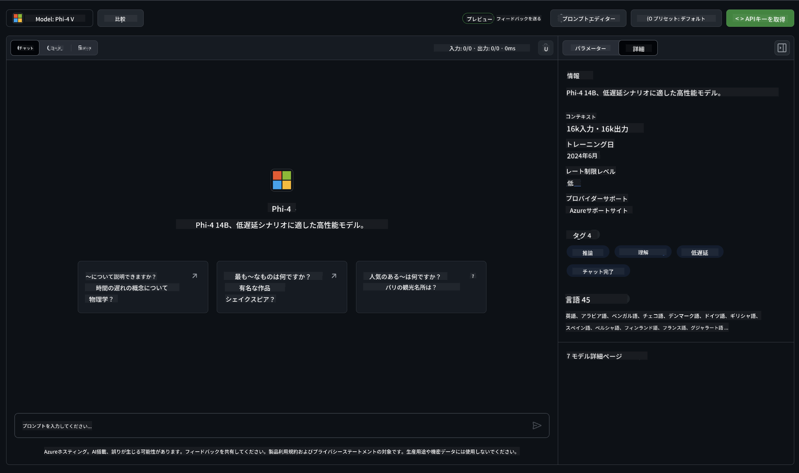

<!--
CO_OP_TRANSLATOR_METADATA:
{
  "original_hash": "fb67a08b9fc911a10ed58081fadef416",
  "translation_date": "2025-05-08T06:26:08+00:00",
  "source_file": "md/01.Introduction/02/02.GitHubModel.md",
  "language_code": "ja"
}
-->
## GitHub Models における Phi ファミリー

[GitHub Models](https://github.com/marketplace/models) へようこそ！Azure AI 上でホストされているAIモデルを自由に探索できるよう、すべて準備が整っています。


GitHub Modelsで利用可能なモデルの詳細については、[GitHub Model Marketplace](https://github.com/marketplace/models) をご覧ください。

## 利用可能なモデル

各モデルには専用のプレイグラウンドとサンプルコードがあります。



### GitHub Model Catalog における Phi ファミリー

- [Phi-4](https://github.com/marketplace/models/azureml/Phi-4)

- [Phi-3.5-MoE instruct (128k)](https://github.com/marketplace/models/azureml/Phi-3-5-MoE-instruct)

- [Phi-3.5-vision instruct (128k)](https://github.com/marketplace/models/azureml/Phi-3-5-vision-instruct)

- [Phi-3.5-mini instruct (128k)](https://github.com/marketplace/models/azureml/Phi-3-5-mini-instruct)

- [Phi-3-Medium-128k-Instruct](https://github.com/marketplace/models/azureml/Phi-3-medium-128k-instruct)

- [Phi-3-medium-4k-instruct](https://github.com/marketplace/models/azureml/Phi-3-medium-4k-instruct)

- [Phi-3-mini-128k-instruct](https://github.com/marketplace/models/azureml/Phi-3-mini-128k-instruct)

- [Phi-3-mini-4k-instruct](https://github.com/marketplace/models/azureml/Phi-3-mini-4k-instruct)

- [Phi-3-small-128k-instruct](https://github.com/marketplace/models/azureml/Phi-3-small-128k-instruct)

- [Phi-3-small-8k-instruct](https://github.com/marketplace/models/azureml/Phi-3-small-8k-instruct)

## はじめに

すぐに実行できる基本的なサンプルがいくつか用意されています。samples ディレクトリにあります。お好みの言語にすぐに移りたい場合は、以下の言語でサンプルを見つけることができます：

- Python
- JavaScript
- C#
- Java
- cURL

また、サンプルやモデルを実行するための専用の Codespaces 環境も用意されています。


## サンプルコード

以下は代表的なユースケースのコード例です。Azure AI Inference SDKの詳細については、公式ドキュメントとサンプルをご覧ください。

## セットアップ

1. パーソナルアクセストークンを作成する  
トークンに特別な権限を与える必要はありません。トークンはMicrosoftのサービスに送信されることにご注意ください。

以下のコード例を使うには、環境変数にトークンを設定してクライアントコードで利用できるようにしてください。

bashを使う場合：  
```
export GITHUB_TOKEN="<your-github-token-goes-here>"
```  
powershellの場合：  

```
$Env:GITHUB_TOKEN="<your-github-token-goes-here>"
```  

Windowsコマンドプロンプトの場合：  

```
set GITHUB_TOKEN=<your-github-token-goes-here>
```  

## Python サンプル

### 依存関係のインストール  
pipを使ってAzure AI Inference SDKをインストールします（Python 3.8以上が必要です）：

```
pip install azure-ai-inference
```

### 基本的なコードサンプルを実行

このサンプルはchat completion APIへの基本的な呼び出しを示しています。GitHub AIモデル推論エンドポイントとあなたのGitHubトークンを利用し、呼び出しは同期的に行われます。

```python
import os
from azure.ai.inference import ChatCompletionsClient
from azure.ai.inference.models import SystemMessage, UserMessage
from azure.core.credentials import AzureKeyCredential

endpoint = "https://models.inference.ai.azure.com"
model_name = "Phi-4"
token = os.environ["GITHUB_TOKEN"]

client = ChatCompletionsClient(
    endpoint=endpoint,
    credential=AzureKeyCredential(token),
)

response = client.complete(
    messages=[
        UserMessage(content="I have $20,000 in my savings account, where I receive a 4% profit per year and payments twice a year. Can you please tell me how long it will take for me to become a millionaire? Also, can you please explain the math step by step as if you were explaining it to an uneducated person?"),
    ],
    temperature=0.4,
    top_p=1.0,
    max_tokens=2048,
    model=model_name
)

print(response.choices[0].message.content)
```

### マルチターン会話を実行

このサンプルはchat completion APIを使ったマルチターン会話の例です。チャットアプリケーションでモデルを使う場合は、会話履歴を管理し、最新のメッセージをモデルに送る必要があります。

```
import os
from azure.ai.inference import ChatCompletionsClient
from azure.ai.inference.models import AssistantMessage, SystemMessage, UserMessage
from azure.core.credentials import AzureKeyCredential

token = os.environ["GITHUB_TOKEN"]
endpoint = "https://models.inference.ai.azure.com"
# Replace Model_Name
model_name = "Phi-4"

client = ChatCompletionsClient(
    endpoint=endpoint,
    credential=AzureKeyCredential(token),
)

messages = [
    SystemMessage(content="You are a helpful assistant."),
    UserMessage(content="What is the capital of France?"),
    AssistantMessage(content="The capital of France is Paris."),
    UserMessage(content="What about Spain?"),
]

response = client.complete(messages=messages, model=model_name)

print(response.choices[0].message.content)
```

### 出力のストリーミング

より良いユーザー体験のために、モデルの応答をストリーミングして最初のトークンが早く表示されるようにし、長い応答を待つ時間を短縮します。

```
import os
from azure.ai.inference import ChatCompletionsClient
from azure.ai.inference.models import SystemMessage, UserMessage
from azure.core.credentials import AzureKeyCredential

token = os.environ["GITHUB_TOKEN"]
endpoint = "https://models.inference.ai.azure.com"
# Replace Model_Name
model_name = "Phi-4"

client = ChatCompletionsClient(
    endpoint=endpoint,
    credential=AzureKeyCredential(token),
)

response = client.complete(
    stream=True,
    messages=[
        SystemMessage(content="You are a helpful assistant."),
        UserMessage(content="Give me 5 good reasons why I should exercise every day."),
    ],
    model=model_name,
)

for update in response:
    if update.choices:
        print(update.choices[0].delta.content or "", end="")

client.close()
```

## GitHub Models の無料利用とレート制限


[プレイグラウンドと無料API利用のレート制限](https://docs.github.com/en/github-models/prototyping-with-ai-models#rate-limits) は、モデルの実験やAIアプリケーションのプロトタイピングを支援するためのものです。これらの制限を超えて利用し、アプリケーションをスケールさせる場合は、Azureアカウントからリソースをプロビジョニングし、GitHubのパーソナルアクセストークンではなくそちらで認証してください。コードの他の部分を変更する必要はありません。Azure AIで無料枠を超える方法はこのリンクから確認できます。

### 注意事項

モデルとやり取りする際は、AIを使った実験であるため、内容に誤りが含まれる可能性があることを念頭に置いてください。

この機能にはさまざまな制限（1分あたりのリクエスト数、1日あたりのリクエスト数、1リクエストあたりのトークン数、同時リクエスト数など）があり、本番環境での利用を想定していません。

GitHub ModelsはAzure AI Content Safetyを利用しています。これらのフィルターはGitHub Modelsの利用中は無効にできません。有料サービスを通じてモデルを利用する場合は、必要に応じてコンテンツフィルターを設定してください。

このサービスはGitHubのプレリリース利用規約の対象です。

**免責事項**：  
本書類はAI翻訳サービス[Co-op Translator](https://github.com/Azure/co-op-translator)を使用して翻訳されています。正確性には努めておりますが、自動翻訳には誤りや不正確な部分が含まれる可能性があることをご承知ください。原文はあくまで正式な情報源とみなしてください。重要な情報については、専門の人間による翻訳を推奨します。本翻訳の利用により生じたいかなる誤解や誤訳についても、当方は責任を負いかねます。