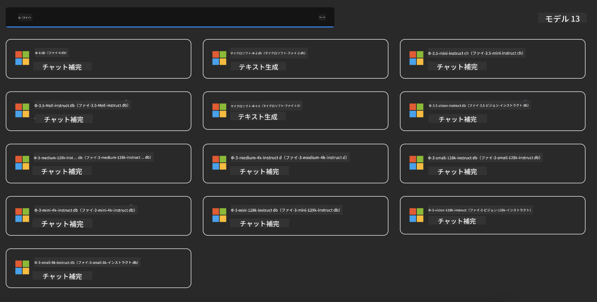
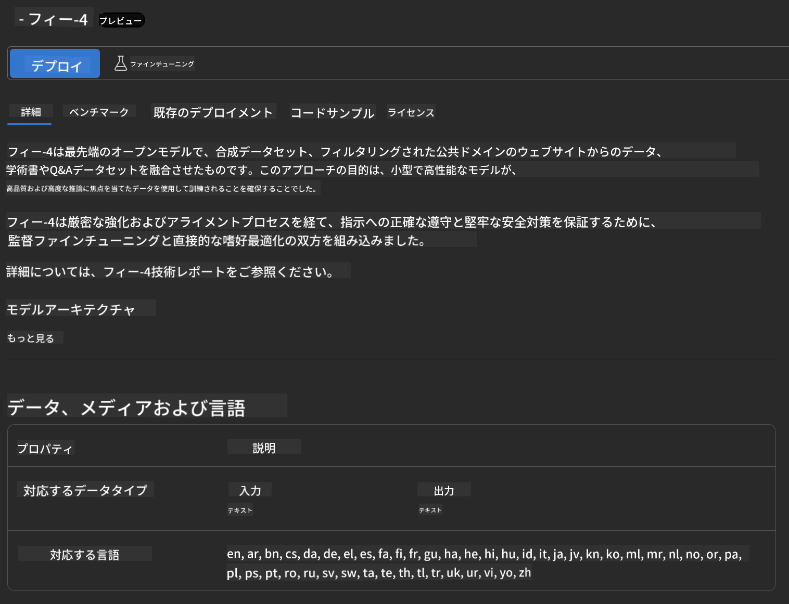
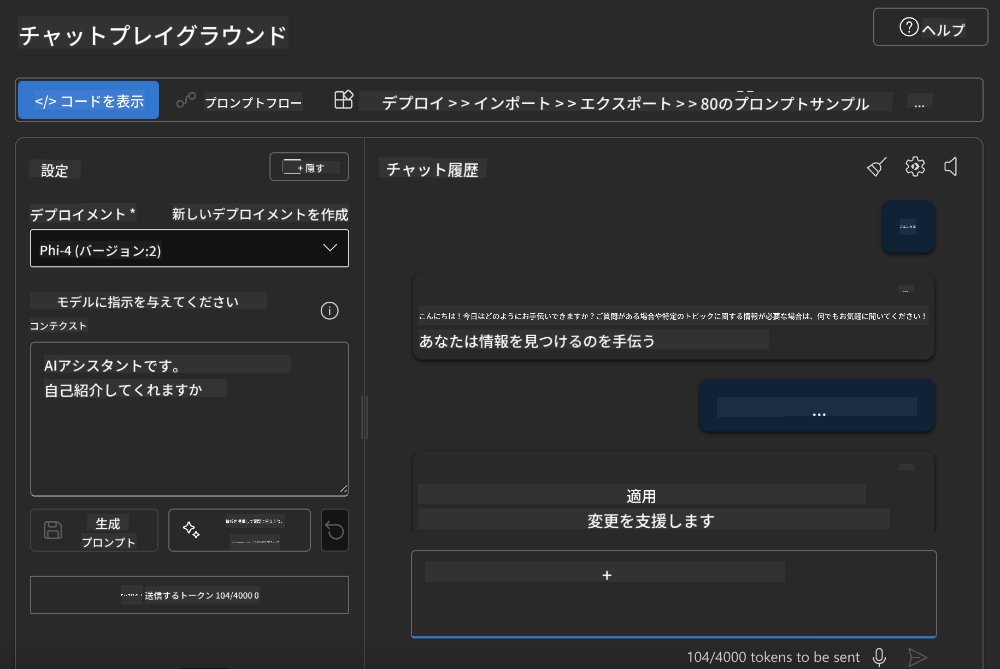

<!--
CO_OP_TRANSLATOR_METADATA:
{
  "original_hash": "70dc9bd6453f70f1a5f6833fe6e24bd0",
  "translation_date": "2025-04-04T11:53:50+00:00",
  "source_file": "md\\01.Introduction\\02\\03.AzureAIFoundry.md",
  "language_code": "ja"
}
-->
## Azure AI FoundryにおけるPhiファミリー

[Azure AI Foundry](https://ai.azure.com)は、開発者が安全でセキュアかつ責任ある方法でAIを活用し、イノベーションを推進し未来を形作ることを支援する信頼性の高いプラットフォームです。

[Azure AI Foundry](https://ai.azure.com)は以下を目的としたプラットフォームです：

- エンタープライズグレードのプラットフォーム上で生成AIアプリケーションを構築する。
- 責任あるAIの実践に基づき、最先端のAIツールやMLモデルを使って探索、構築、テスト、デプロイを行う。
- アプリケーション開発のライフサイクル全体を通じてチームと協力する。

Azure AI Foundryを活用することで、多様なモデル、サービス、機能を探索し、目標に最適なAIアプリケーションを構築できます。Azure AI Foundryプラットフォームは、概念実証を本格的なプロダクションアプリケーションへとスムーズに変換するためのスケーラビリティを提供します。また、継続的なモニタリングと改良により、長期的な成功を支援します。


Azure AI Foundryでは、Azure AOAI Serviceを利用するだけでなく、Azure AI Foundry Model Catalogを通じてサードパーティモデルも利用できます。Azure AI FoundryをAIソリューションプラットフォームとして活用したい場合に適した選択肢です。

Azure AI FoundryのModel Catalogを通じて、Phiファミリーモデルを迅速にデプロイすることができます。



### **Azure AI FoundryでPhi-4をデプロイする**



### **Azure AI Foundry PlaygroundでPhi-4をテストする**



### **Azure AI Foundry Phi-4を呼び出すPythonコードの実行**

```python

import os  
import base64
from openai import AzureOpenAI  
from azure.identity import DefaultAzureCredential, get_bearer_token_provider  
        
endpoint = os.getenv("ENDPOINT_URL", "Your Azure AOAI Service Endpoint")  
deployment = os.getenv("DEPLOYMENT_NAME", "Phi-4")  
      
token_provider = get_bearer_token_provider(  
    DefaultAzureCredential(),  
    "https://cognitiveservices.azure.com/.default"  
)  
  
client = AzureOpenAI(  
    azure_endpoint=endpoint,  
    azure_ad_token_provider=token_provider,  
    api_version="2024-05-01-preview",  
)  
  

chat_prompt = [
    {
        "role": "system",
        "content": "You are an AI assistant that helps people find information."
    },
    {
        "role": "user",
        "content": "can you introduce yourself"
    }
] 
    
# Include speech result if speech is enabled  
messages = chat_prompt 

completion = client.chat.completions.create(  
    model=deployment,  
    messages=messages,
    max_tokens=800,  
    temperature=0.7,  
    top_p=0.95,  
    frequency_penalty=0,  
    presence_penalty=0,
    stop=None,  
    stream=False  
)  
  
print(completion.to_json())  

```

**免責事項**:  
この文書はAI翻訳サービス[Co-op Translator](https://github.com/Azure/co-op-translator)を使用して翻訳されています。正確性を追求しておりますが、自動翻訳には誤りや不正確な部分が含まれる可能性があります。元の言語で作成された文書を公式な情報源としてお考えください。重要な情報については、プロの人間による翻訳をお勧めします。この翻訳の使用に起因する誤解や誤解釈について、当方は責任を負いません。