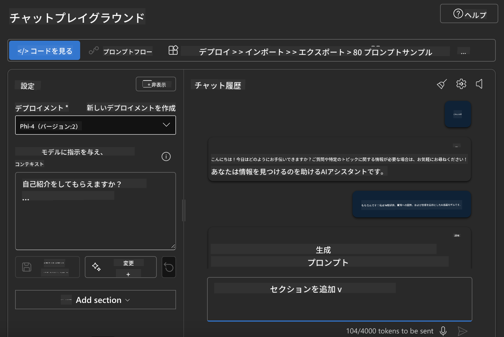

<!--
CO_OP_TRANSLATOR_METADATA:
{
  "original_hash": "3ae21dc5554e888defbe57946ee995ee",
  "translation_date": "2025-07-16T19:07:47+00:00",
  "source_file": "md/01.Introduction/02/03.AzureAIFoundry.md",
  "language_code": "ja"
}
-->
## Azure AI FoundryのPhiファミリー

[Azure AI Foundry](https://ai.azure.com)は、開発者が安全で安心かつ責任ある方法でAIを活用し、イノベーションを推進し未来を切り拓くための信頼できるプラットフォームです。

[Azure AI Foundry](https://ai.azure.com)は開発者向けに以下のことを実現します：

- エンタープライズグレードのプラットフォーム上で生成AIアプリケーションを構築する。
- 最先端のAIツールやMLモデルを使って、責任あるAIの実践に基づき探索、構築、テスト、デプロイを行う。
- アプリケーション開発のライフサイクル全体でチームと協力する。

Azure AI Foundryを使えば、多様なモデルやサービス、機能を探索し、目標に最適なAIアプリケーションの構築に取り組めます。Azure AI Foundryプラットフォームは、概念実証から本格的な本番アプリケーションへのスケールアップを容易にし、継続的な監視と改善によって長期的な成功を支援します。


Azure AI FoundryでAzure AOAI Serviceを利用するだけでなく、Azure AI Foundry Model Catalogにあるサードパーティモデルも使用可能です。Azure AI FoundryをAIソリューションプラットフォームとして活用したい場合に適した選択肢です。

Azure AI FoundryのModel Catalogを通じてPhiファミリーモデルを素早くデプロイできます。

[Microsoft Phi Models in Azure AI Foundry Models](https://ai.azure.com/explore/models/?selectedCollection=phi)


### **Azure AI FoundryでPhi-4をデプロイする**


### **Azure AI Foundry PlaygroundでPhi-4をテストする**



### **PythonコードでAzure AI FoundryのPhi-4を呼び出す**

```python

import os  
import base64
from openai import AzureOpenAI  
from azure.identity import DefaultAzureCredential, get_bearer_token_provider  
        
endpoint = os.getenv("ENDPOINT_URL", "Your Azure AOAI Service Endpoint")  
deployment = os.getenv("DEPLOYMENT_NAME", "Phi-4")  
      
token_provider = get_bearer_token_provider(  
    DefaultAzureCredential(),  
    "https://cognitiveservices.azure.com/.default"  
)  
  
client = AzureOpenAI(  
    azure_endpoint=endpoint,  
    azure_ad_token_provider=token_provider,  
    api_version="2024-05-01-preview",  
)  
  

chat_prompt = [
    {
        "role": "system",
        "content": "You are an AI assistant that helps people find information."
    },
    {
        "role": "user",
        "content": "can you introduce yourself"
    }
] 
    
# Include speech result if speech is enabled  
messages = chat_prompt 

completion = client.chat.completions.create(  
    model=deployment,  
    messages=messages,
    max_tokens=800,  
    temperature=0.7,  
    top_p=0.95,  
    frequency_penalty=0,  
    presence_penalty=0,
    stop=None,  
    stream=False  
)  
  
print(completion.to_json())  

```

**免責事項**：  
本書類はAI翻訳サービス「[Co-op Translator](https://github.com/Azure/co-op-translator)」を使用して翻訳されました。正確性を期しておりますが、自動翻訳には誤りや不正確な部分が含まれる可能性があります。原文の言語による文書が正式な情報源とみなされるべきです。重要な情報については、専門の人間による翻訳を推奨します。本翻訳の利用により生じた誤解や誤訳について、当方は一切の責任を負いかねます。