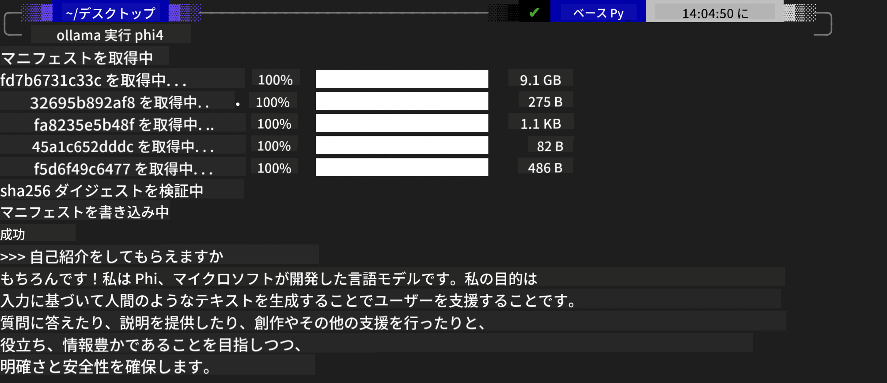
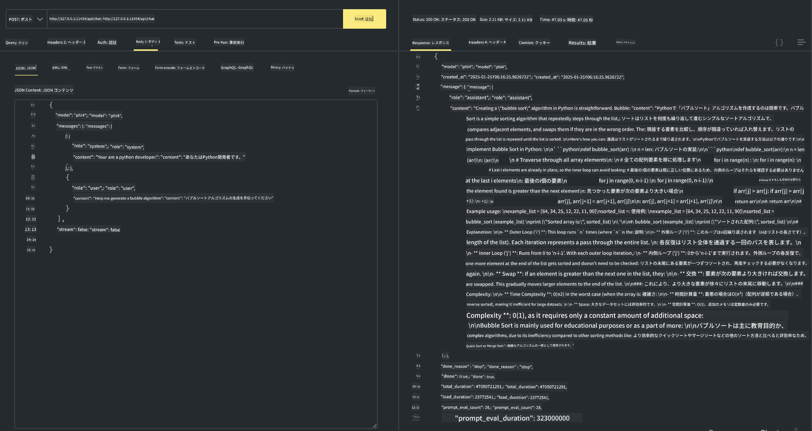

<!--
CO_OP_TRANSLATOR_METADATA:
{
  "original_hash": "0b38834693bb497f96bf53f0d941f9a1",
  "translation_date": "2025-05-08T06:29:31+00:00",
  "source_file": "md/01.Introduction/02/04.Ollama.md",
  "language_code": "ja"
}
-->
## OllamaのPhiファミリー


[Ollama](https://ollama.com)は、より多くの人がシンプルなスクリプトでオープンソースのLLMやSLMを直接デプロイできるようにし、ローカルのCopilotアプリケーションシナリオを支援するAPIも構築可能です。

## **1. インストール**

OllamaはWindows、macOS、Linuxでの動作をサポートしています。こちらのリンク（[https://ollama.com/download](https://ollama.com/download)）からOllamaをインストールできます。インストールが成功すると、ターミナルウィンドウから直接Ollamaスクリプトを使ってPhi-3を呼び出せます。利用可能な[ライブラリ一覧はこちら](https://ollama.com/library)で確認できます。このリポジトリをCodespaceで開くと、すでにOllamaがインストールされています。

```bash

ollama run phi4

```

> [!NOTE]
> 初回実行時にモデルがダウンロードされます。もちろん、あらかじめダウンロード済みのPhi-4モデルを直接指定することも可能です。ここではWSLを例にコマンドを実行しています。モデルのダウンロードが完了すれば、ターミナル上で直接対話が可能です。



## **2. Ollamaからphi-4 APIを呼び出す**

Ollamaで生成されたPhi-4 APIを呼び出したい場合、ターミナルで以下のコマンドを使ってOllamaサーバーを起動できます。

```bash

ollama serve

```

> [!NOTE]
> macOSやLinuxで実行すると、以下のエラーが出ることがあります。**"Error: listen tcp 127.0.0.1:11434: bind: address already in use"** このエラーは、サーバーがすでに起動していることを示している場合が多いので無視しても構いません。もし問題があれば、Ollamaを停止して再起動してください。

**macOS**

```bash

brew services restart ollama

```

**Linux**

```bash

sudo systemctl stop ollama

```

Ollamaはgenerateとchatの2つのAPIをサポートしています。ポート11434で動作しているローカルサービスにリクエストを送ることで、必要に応じてOllamaが提供するモデルAPIを呼び出せます。

**Chat**

```bash

curl http://127.0.0.1:11434/api/chat -d '{
  "model": "phi3",
  "messages": [
    {
      "role": "system",
      "content": "Your are a python developer."
    },
    {
      "role": "user",
      "content": "Help me generate a bubble algorithm"
    }
  ],
  "stream": false
  
}'

This is the result in Postman



## Additional Resources

Check the list of available models in Ollama in [their library](https://ollama.com/library).

Pull your model from the Ollama server using this command

```bash
ollama pull phi4
```

Run the model using this command

```bash
ollama run phi4
```

***Note:*** Visit this link [https://github.com/ollama/ollama/blob/main/docs/api.md](https://github.com/ollama/ollama/blob/main/docs/api.md) to learn more

## Calling Ollama from Python

You can use `requests` or `urllib3` to make requests to the local server endpoints used above. However, a popular way to use Ollama in Python is via the [openai](https://pypi.org/project/openai/) SDK, since Ollama provides OpenAI-compatible server endpoints as well.

Here is an example for phi3-mini:

```python
import openai

client = openai.OpenAI(
    base_url="http://localhost:11434/v1",
    api_key="nokeyneeded",
)

response = client.chat.completions.create(
    model="phi4",
    temperature=0.7,
    n=1,
    messages=[
        {"role": "system", "content": "You are a helpful assistant."},
        {"role": "user", "content": "Write a haiku about a hungry cat"},
    ],
)

print("Response:")
print(response.choices[0].message.content)
```

## Calling Ollama from JavaScript 

```javascript
// Phi-4でファイルを要約する例
script({
    model: "ollama:phi4",
    title: "Phi-4で要約",
    system: ["system"],
})

// 要約の例
const file = def("FILE", env.files)
$`Summarize ${file} in a single paragraph.`
```

## Calling Ollama from C#

Create a new C# Console application and add the following NuGet package:

```bash
dotnet add package Microsoft.SemanticKernel --version 1.34.0
```

Then replace this code in the `Program.cs` file

```csharp
using Microsoft.SemanticKernel;
using Microsoft.SemanticKernel.ChatCompletion;

// ローカルのOllamaサーバーエンドポイントを使ったチャット完了サービスの追加
#pragma warning disable SKEXP0001, SKEXP0003, SKEXP0010, SKEXP0011, SKEXP0050, SKEXP0052
builder.AddOpenAIChatCompletion(
    modelId: "phi4",
    endpoint: new Uri("http://localhost:11434/"),
    apiKey: "non required");

// シンプルなプロンプトをチャットサービスに送信
string prompt = "Write a joke about kittens";
var response = await kernel.InvokePromptAsync(prompt);
Console.WriteLine(response.GetValue<string>());
```

Run the app with the command:

```bash
dotnet run


**免責事項**：  
本書類はAI翻訳サービス「[Co-op Translator](https://github.com/Azure/co-op-translator)」を使用して翻訳されています。正確性には努めておりますが、自動翻訳には誤りや不正確な部分が含まれる可能性があることをご了承ください。原文はあくまで正式な情報源とみなされるべきです。重要な情報については、専門の人間による翻訳を推奨します。本翻訳の使用により生じた誤解や解釈の違いについて、一切の責任を負いかねます。