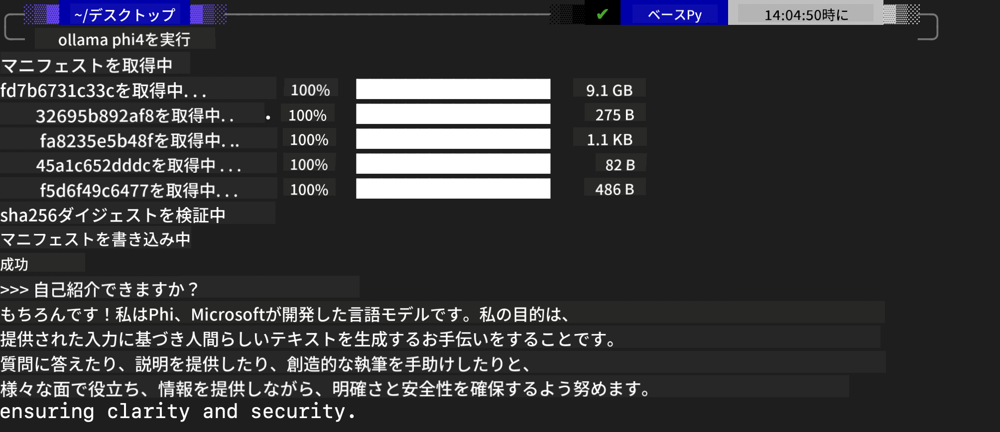
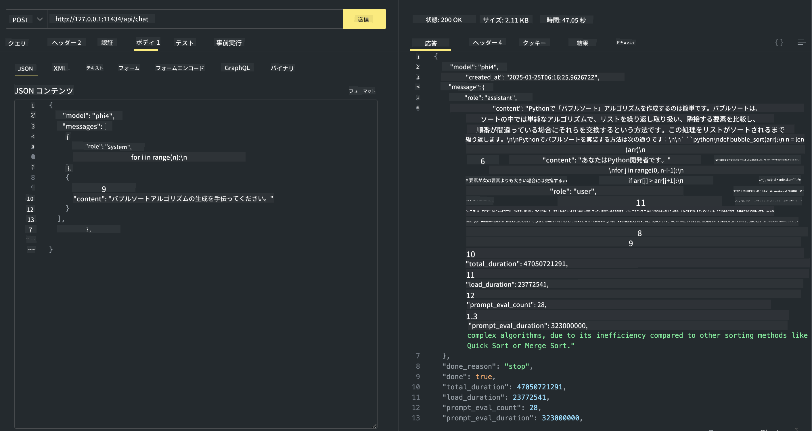

<!--
CO_OP_TRANSLATOR_METADATA:
{
  "original_hash": "ea58f7c3348e894feaeecb90f5bfa98f",
  "translation_date": "2025-04-04T11:54:50+00:00",
  "source_file": "md\\01.Introduction\\02\\04.Ollama.md",
  "language_code": "ja"
}
-->
## Phiファミリー in Ollama

[Ollama](https://ollama.com)は、シンプルなスクリプトを使用して、より多くの人々がオープンソースのLLMやSLMを直接デプロイできるようにし、ローカルのCopilotアプリケーションシナリオを支援するAPIを構築することも可能にします。

## **1. インストール**

OllamaはWindows、macOS、Linux上で動作します。このリンクからOllamaをインストールできます（[https://ollama.com/download](https://ollama.com/download)）。インストールが成功すると、ターミナルウィンドウを通じてOllamaスクリプトを使用してPhi-3を直接呼び出すことができます。すべての[利用可能なライブラリ](https://ollama.com/library)を確認できます。Codespaceでこのリポジトリを開くと、すでにOllamaがインストールされています。

```bash

ollama run phi4

```

> [!NOTE]
> 初めて実行する際にはモデルがダウンロードされます。もちろん、ダウンロード済みのPhi-4モデルを直接指定することも可能です。ここではWSLを例にしてコマンドを実行します。モデルが正常にダウンロードされた後、ターミナル上で直接対話することができます。



## **2. Ollamaからphi-4 APIを呼び出す**

Ollamaによって生成されたPhi-4 APIを呼び出したい場合は、以下のコマンドをターミナルで使用してOllamaサーバーを起動できます。

```bash

ollama serve

```

> [!NOTE]
> macOSやLinuxを実行している場合、以下のエラーが発生する可能性があります **"Error: listen tcp 127.0.0.1:11434: bind: address already in use"** このエラーはコマンドを実行する際に表示されることがあります。このエラーを無視することもできます（通常、サーバーがすでに起動していることを示します）、またはOllamaを停止して再起動することも可能です。

**macOS**

```bash

brew services restart ollama

```

**Linux**

```bash

sudo systemctl stop ollama

```

Ollamaは、generateとchatの2種類のAPIをサポートしています。必要に応じて、ポート11434で動作するローカルサービスにリクエストを送信することで、Ollamaが提供するモデルAPIを呼び出すことができます。

**Chat**

```bash

curl http://127.0.0.1:11434/api/chat -d '{
  "model": "phi3",
  "messages": [
    {
      "role": "system",
      "content": "Your are a python developer."
    },
    {
      "role": "user",
      "content": "Help me generate a bubble algorithm"
    }
  ],
  "stream": false
  
}'

This is the result in Postman



## Additional Resources

Check the list of available models in Ollama in [their library](https://ollama.com/library).

Pull your model from the Ollama server using this command

```bash
ollama pull phi4
```

Run the model using this command

```bash
ollama run phi4
```

***Note:*** Visit this link [https://github.com/ollama/ollama/blob/main/docs/api.md](https://github.com/ollama/ollama/blob/main/docs/api.md) to learn more

## Calling Ollama from Python

You can use `requests` or `urllib3` to make requests to the local server endpoints used above. However, a popular way to use Ollama in Python is via the [openai](https://pypi.org/project/openai/) SDK, since Ollama provides OpenAI-compatible server endpoints as well.

Here is an example for phi3-mini:

```python
import openai

client = openai.OpenAI(
    base_url="http://localhost:11434/v1",
    api_key="nokeyneeded",
)

response = client.chat.completions.create(
    model="phi4",
    temperature=0.7,
    n=1,
    messages=[
        {"role": "system", "content": "You are a helpful assistant."},
        {"role": "user", "content": "Write a haiku about a hungry cat"},
    ],
)

print("Response:")
print(response.choices[0].message.content)
```

## Calling Ollama from JavaScript 

```javascript
// Phi-4でファイルを要約する例
script({
    model: "ollama:phi4",
    title: "Summarize with Phi-4",
    system: ["system"],
})

// 要約の例
const file = def("FILE", env.files)
$`Summarize ${file} in a single paragraph.`
```

## Calling Ollama from C#

Create a new C# Console application and add the following NuGet package:

```bash
dotnet add package Microsoft.SemanticKernel --version 1.34.0
```

Then replace this code in the `Program.cs` file

```csharp
using Microsoft.SemanticKernel;
using Microsoft.SemanticKernel.ChatCompletion;

// ローカルOllamaサーバーエンドポイントを使用してチャット補完サービスを追加
#pragma warning disable SKEXP0001, SKEXP0003, SKEXP0010, SKEXP0011, SKEXP0050, SKEXP0052
builder.AddOpenAIChatCompletion(
    modelId: "phi4",
    endpoint: new Uri("http://localhost:11434/"),
    apiKey: "non required");

// チャットサービスにシンプルなプロンプトを送信
string prompt = "Write a joke about kittens";
var response = await kernel.InvokePromptAsync(prompt);
Console.WriteLine(response.GetValue<string>());
```

Run the app with the command:

```bash
dotnet run

**免責事項**:  
この文書はAI翻訳サービス[Co-op Translator](https://github.com/Azure/co-op-translator)を使用して翻訳されています。正確性を追求しておりますが、自動翻訳には誤りや不正確さが含まれる場合がありますのでご了承ください。元の言語で書かれた文書が正式な情報源として考慮されるべきです。重要な情報については、専門の人間による翻訳を推奨します。この翻訳の使用に起因する誤解や誤解釈について、当社は一切責任を負いません。