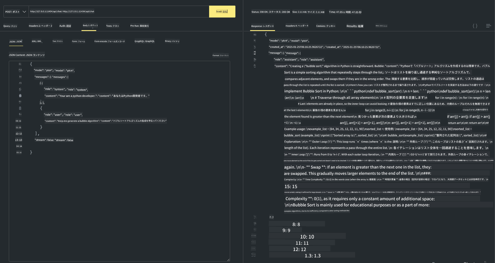

<!--
CO_OP_TRANSLATOR_METADATA:
{
  "original_hash": "0b38834693bb497f96bf53f0d941f9a1",
  "translation_date": "2025-07-16T19:14:01+00:00",
  "source_file": "md/01.Introduction/02/04.Ollama.md",
  "language_code": "ja"
}
-->
## OllamaのPhiファミリー


[Ollama](https://ollama.com)は、より多くの人がシンプルなスクリプトでオープンソースのLLMやSLMを直接展開できるようにし、ローカルのCopilotアプリケーションシナリオを支援するAPIの構築も可能にします。

## **1. インストール**

OllamaはWindows、macOS、Linuxでの実行をサポートしています。こちらのリンク（[https://ollama.com/download](https://ollama.com/download)）からOllamaをインストールできます。インストールが完了すると、ターミナルからOllamaスクリプトを使って直接Phi-3を呼び出せます。利用可能な[ライブラリ一覧はこちら](https://ollama.com/library)で確認できます。このリポジトリをCodespaceで開くと、すでにOllamaがインストールされています。

```bash

ollama run phi4

```

> [!NOTE]
> 初回実行時にモデルがダウンロードされます。もちろん、あらかじめダウンロード済みのPhi-4モデルを指定することも可能です。ここではWSLを例にコマンドを実行しています。モデルのダウンロードが完了すれば、ターミナル上で直接対話が可能です。


## **2. Ollamaからphi-4 APIを呼び出す**

Ollamaで生成されたPhi-4 APIを呼び出したい場合は、ターミナルで以下のコマンドを使ってOllamaサーバーを起動します。

```bash

ollama serve

```

> [!NOTE]
> macOSやLinuxで実行する際に、**"Error: listen tcp 127.0.0.1:11434: bind: address already in use"**というエラーが出ることがあります。このエラーはサーバーがすでに起動していることを示す場合が多いため無視しても構いませんが、気になる場合はOllamaを停止して再起動してください。

**macOS**

```bash

brew services restart ollama

```

**Linux**

```bash

sudo systemctl stop ollama

```

Ollamaはgenerateとchatの2つのAPIをサポートしています。ポート11434で動作しているローカルサービスにリクエストを送ることで、用途に応じてモデルAPIを呼び出せます。

**チャット**

```bash

curl http://127.0.0.1:11434/api/chat -d '{
  "model": "phi3",
  "messages": [
    {
      "role": "system",
      "content": "Your are a python developer."
    },
    {
      "role": "user",
      "content": "Help me generate a bubble algorithm"
    }
  ],
  "stream": false
  
}'

```

これはPostmanの結果です



## 追加リソース

Ollamaで利用可能なモデルのリストは、[Ollamaライブラリ](https://ollama.com/library)でご確認ください。

以下のコマンドを使用して、Ollamaサーバーからモデルを取得します。

```bash
ollama pull phi4
```

このコマンドを使用してモデルを実行します

```bash
ollama run phi4
```

***注:*** 詳細については、このリンク [https://github.com/ollama/ollama/blob/main/docs/api.md](https://github.com/ollama/ollama/blob/main/docs/api.md) をご覧ください。

## PythonからOllamaを呼び出す

上記で使用したローカルサーバーエンドポイントへのリクエストには、`requests` または `urllib3` を使用できます。ただし、Ollama は OpenAI 互換のサーバーエンドポイントも提供しているため、Python で Ollama を使用する一般的な方法は [openai](https://pypi.org/project/openai/) SDK を使用することです。

以下はphi3-miniの例です。

```python
import openai

client = openai.OpenAI(
    base_url="http://localhost:11434/v1",
    api_key="nokeyneeded",
)

response = client.chat.completions.create(
    model="phi4",
    temperature=0.7,
    n=1,
    messages=[
        {"role": "system", "content": "You are a helpful assistant."},
        {"role": "user", "content": "Write a haiku about a hungry cat"},
    ],
)

print("Response:")
print(response.choices[0].message.content)
```

## JavaScriptからOllamaを呼び出す

```javascript
// Phi-4でファイルを要約する例
script({
    model: "ollama:phi4",
    title: "Phi-4で要約",
    system: ["system"],
})

// 要約の例
const file = def("FILE", env.files)
$`Summarize ${file} in a single paragraph.`
```

## C# から Ollama を呼び出す

新しい C# コンソールアプリケーションを作成し、次の NuGet パッケージを追加します。

```bash
dotnet add package Microsoft.SemanticKernel --version 1.34.0
```

次に、`Program.cs`ファイル内のこのコードを置き換えます。

```csharp
using Microsoft.SemanticKernel;
using Microsoft.SemanticKernel.ChatCompletion;

// ローカルのollamaサーバーエンドポイントを使ってチャット補完サービスを追加
#pragma warning disable SKEXP0001, SKEXP0003, SKEXP0010, SKEXP0011, SKEXP0050, SKEXP0052
builder.AddOpenAIChatCompletion(
    modelId: "phi4",
    endpoint: new Uri("http://localhost:11434/"),
    apiKey: "non required");

// チャットサービスに簡単なプロンプトを送信
string prompt = "Write a joke about kittens";
var response = await kernel.InvokePromptAsync(prompt);
Console.WriteLine(response.GetValue<string>());
```

次のコマンドでアプリを実行します。

```bash
dotnet run
```

**免責事項**：  

本書類はAI翻訳サービス「[Co-op Translator](https://github.com/Azure/co-op-translator)」を使用して翻訳されました。正確性の向上に努めておりますが、自動翻訳には誤りや不正確な部分が含まれる可能性があります。原文の言語によるオリジナル文書が正式な情報源とみなされるべきです。重要な情報については、専門の人間による翻訳を推奨します。本翻訳の利用により生じたいかなる誤解や誤訳についても、当方は一切の責任を負いかねます。

