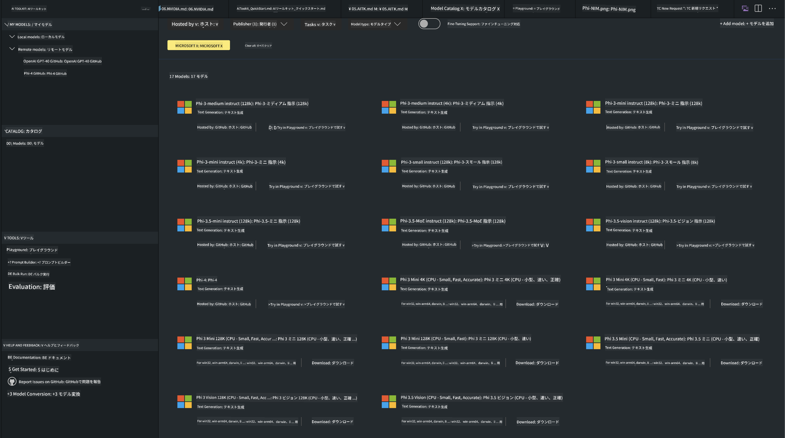

<!--
CO_OP_TRANSLATOR_METADATA:
{
  "original_hash": "4951d458c0b60c02cd1e751b40903877",
  "translation_date": "2025-05-08T06:19:49+00:00",
  "source_file": "md/01.Introduction/02/05.AITK.md",
  "language_code": "ja"
}
-->
# Phi Family in AITK

[AI Toolkit for VS Code](https://marketplace.visualstudio.com/items?itemName=ms-windows-ai-studio.windows-ai-studio) は、Azure AI Foundry Catalog や Hugging Face などのカタログから最新のAI開発ツールやモデルを統合し、生成AIアプリの開発を簡素化します。GitHub Models や Azure AI Foundry Model Catalog によって提供されるAIモデルカタログを閲覧し、ローカルまたはリモートにダウンロード、ファインチューニング、テストし、アプリケーションで活用できます。

AI Toolkit Preview はローカルで動作します。ローカル推論やファインチューニングは選択したモデルによりますが、NVIDIA CUDA GPUなどのGPUが必要になる場合があります。GitHub ModelsもAITKで直接実行可能です。

## はじめに

[Windows Subsystem for Linux のインストール方法について詳しくはこちら](https://learn.microsoft.com/windows/wsl/install?WT.mc_id=aiml-137032-kinfeylo)

および [デフォルトのディストリビューションの変更方法](https://learn.microsoft.com/windows/wsl/install#change-the-default-linux-distribution-installed) をご参照ください。

[AI Toolkit GitHubリポジトリ](https://github.com/microsoft/vscode-ai-toolkit/)

- Windows、Linux、macOS 対応
  
- WindowsとLinuxの両方でファインチューニングを行う場合、Nvidia GPUが必要です。加えて、**Windows**ではUbuntu 18.4以降のディストリビューションを用いたLinuxサブシステムが必要です。[Windows Subsystem for Linux のインストール方法](https://learn.microsoft.com/windows/wsl/install) と [デフォルトディストリビューションの変更方法](https://learn.microsoft.com/windows/wsl/install#change-the-default-linux-distribution-installed) をご確認ください。

### AI Toolkitのインストール

AI Toolkitは[Visual Studio Code拡張機能](https://code.visualstudio.com/docs/setup/additional-components#_vs-code-extensions)として提供されているため、まず[VS Code](https://code.visualstudio.com/docs/setup/windows?WT.mc_id=aiml-137032-kinfeylo)をインストールし、[VS Marketplace](https://marketplace.visualstudio.com/items?itemName=ms-windows-ai-studio.windows-ai-studio)からAI Toolkitをダウンロードしてください。  
[Visual Studio MarketplaceでAI Toolkitは入手可能](https://marketplace.visualstudio.com/items?itemName=ms-windows-ai-studio.windows-ai-studio)で、他のVS Code拡張と同様にインストールできます。

VS Code拡張のインストールに慣れていない場合は、以下の手順に従ってください。

### サインイン

1. VS Codeのアクティビティバーで **Extensions** を選択  
1. 検索バーに「AI Toolkit」と入力  
1. 「AI Toolkit for Visual Studio code」を選択  
1. **Install** を選択

これで拡張機能の使用準備が整いました！

GitHubへのサインインを求められるので、「Allow」をクリックして続行してください。GitHubのサインインページにリダイレクトされます。

サインインし、指示に従って操作を完了すると、VS Codeに戻ります。

拡張機能がインストールされると、アクティビティバーにAI Toolkitのアイコンが表示されます。

利用可能な機能を見てみましょう！

### 利用可能な機能

AI Toolkitのメインサイドバーは以下のように構成されています。

- **Models**  
- **Resources**  
- **Playground**  
- **Fine-tuning**  
- **Evaluation**

Resourcesセクションにあります。まずは **Model Catalog** を選択して始めましょう。

### カタログからモデルをダウンロードする

VS CodeのサイドバーからAI Toolkitを起動すると、次のオプションが選べます。



- **Model Catalog** から対応モデルを見つけてローカルにダウンロード  
- **Model Playground** でモデル推論をテスト  
- **Model Fine-tuning** でローカルまたはリモートでファインチューニング  
- ファインチューニング済みモデルをAI Toolkitのコマンドパレット経由でクラウドにデプロイ  
- モデルの評価

> [!NOTE]
>
> **GPU と CPU の違い**
>
> モデルカードにはモデルサイズ、プラットフォーム、アクセラレータタイプ（CPU、GPU）が表示されます。**GPUを1つ以上搭載したWindowsデバイス**で最適なパフォーマンスを得るには、Windows向けに最適化されたモデルバージョンを選択してください。
>
> これにより、DirectMLアクセラレータに最適化されたモデルを利用できます。
>
> モデル名は以下の形式です。
>
> - `{model_name}-{accelerator}-{quantization}-{format}`
>
> WindowsデバイスにGPUが搭載されているか確認するには、**タスクマネージャー**を開き、**パフォーマンス**タブを選択します。GPUがあれば「GPU 0」や「GPU 1」といった名前で表示されます。

### Playgroundでモデルを実行する

すべてのパラメータを設定したら、**Generate Project** をクリックします。

モデルがダウンロードされたら、カタログのモデルカードで **Load in Playground** を選択します。

- モデルのダウンロードを開始  
- 必要な前提条件と依存関係をインストール  
- VS Codeのワークスペースを作成


### アプリケーションでREST APIを使う

AI Toolkitには、[OpenAIチャット補完フォーマット](https://platform.openai.com/docs/api-reference/chat/create)を使用するローカルREST APIウェブサーバーが **ポート5272** で搭載されています。

これにより、クラウドAIモデルサービスに依存せずにアプリケーションをローカルでテスト可能です。例えば、以下のJSONファイルはリクエストのボディを設定する例です。

```json
{
    "model": "Phi-4",
    "messages": [
        {
            "role": "user",
            "content": "what is the golden ratio?"
        }
    ],
    "temperature": 0.7,
    "top_p": 1,
    "top_k": 10,
    "max_tokens": 100,
    "stream": true
}
```

[Postman](https://www.postman.com/) や CURL (Client URL) ユーティリティを使ってREST APIをテストできます。

```bash
curl -vX POST http://127.0.0.1:5272/v1/chat/completions -H 'Content-Type: application/json' -d @body.json
```

### Python用OpenAIクライアントライブラリの使用例

```python
from openai import OpenAI

client = OpenAI(
    base_url="http://127.0.0.1:5272/v1/", 
    api_key="x" # required for the API but not used
)

chat_completion = client.chat.completions.create(
    messages=[
        {
            "role": "user",
            "content": "what is the golden ratio?",
        }
    ],
    model="Phi-4",
)

print(chat_completion.choices[0].message.content)
```

### .NET用Azure OpenAIクライアントライブラリの使用例

NuGetを使って[Azure OpenAIクライアントライブラリ for .NET](https://www.nuget.org/packages/Azure.AI.OpenAI/)をプロジェクトに追加します。

```bash
dotnet add {project_name} package Azure.AI.OpenAI --version 1.0.0-beta.17
```

**OverridePolicy.cs** というC#ファイルをプロジェクトに追加し、以下のコードを貼り付けます。

```csharp
// OverridePolicy.cs
using Azure.Core.Pipeline;
using Azure.Core;

internal partial class OverrideRequestUriPolicy(Uri overrideUri)
    : HttpPipelineSynchronousPolicy
{
    private readonly Uri _overrideUri = overrideUri;

    public override void OnSendingRequest(HttpMessage message)
    {
        message.Request.Uri.Reset(_overrideUri);
    }
}
```

続いて、**Program.cs** ファイルに以下のコードを貼り付けます。

```csharp
// Program.cs
using Azure.AI.OpenAI;

Uri localhostUri = new("http://localhost:5272/v1/chat/completions");

OpenAIClientOptions clientOptions = new();
clientOptions.AddPolicy(
    new OverrideRequestUriPolicy(localhostUri),
    Azure.Core.HttpPipelinePosition.BeforeTransport);
OpenAIClient client = new(openAIApiKey: "unused", clientOptions);

ChatCompletionsOptions options = new()
{
    DeploymentName = "Phi-4",
    Messages =
    {
        new ChatRequestSystemMessage("You are a helpful assistant. Be brief and succinct."),
        new ChatRequestUserMessage("What is the golden ratio?"),
    }
};

StreamingResponse<StreamingChatCompletionsUpdate> streamingChatResponse
    = await client.GetChatCompletionsStreamingAsync(options);

await foreach (StreamingChatCompletionsUpdate chatChunk in streamingChatResponse)
{
    Console.Write(chatChunk.ContentUpdate);
}
```


## AI Toolkitでのファインチューニング

- モデル探索とPlaygroundの利用開始  
- ローカル計算資源を使ったモデルのファインチューニングと推論  
- Azureリソースを使ったリモートファインチューニングと推論

[AI Toolkitでのファインチューニング](../../03.FineTuning/Finetuning_VSCodeaitoolkit.md)

## AI Toolkit Q&Aリソース

よくある問題と解決策については、[Q&Aページ](https://github.com/microsoft/vscode-ai-toolkit/blob/main/archive/QA.md)をご参照ください。

**免責事項**：  
本書類はAI翻訳サービス「[Co-op Translator](https://github.com/Azure/co-op-translator)」を使用して翻訳されています。正確性を期しておりますが、自動翻訳には誤りや不正確な箇所が含まれる可能性があることをご承知ください。原文の母国語版が正式な情報源とみなされます。重要な情報については、専門の人間による翻訳を推奨します。本翻訳の使用により生じたいかなる誤解や誤訳についても、一切の責任を負いかねます。