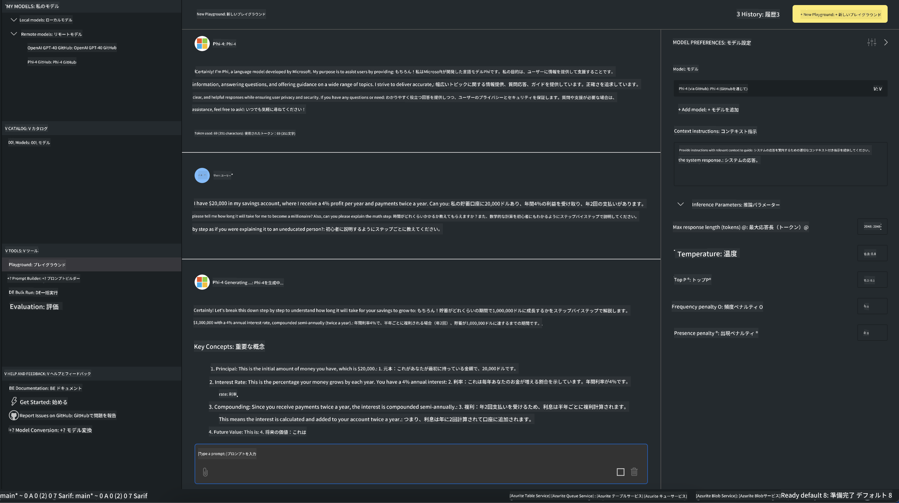

<!--
CO_OP_TRANSLATOR_METADATA:
{
  "original_hash": "9365fb38f5c75c4d7ac9b9a4baa7c9d1",
  "translation_date": "2025-04-04T11:55:51+00:00",
  "source_file": "md\\01.Introduction\\02\\05.AITK.md",
  "language_code": "ja"
}
-->
# AITKのPhiファミリー

[VS Code用AI Toolkit](https://marketplace.visualstudio.com/items?itemName=ms-windows-ai-studio.windows-ai-studio)は、Azure AI Foundry CatalogやHugging Faceなどのカタログから最新のAI開発ツールやモデルを組み合わせることで、生成AIアプリの開発を簡素化します。GitHub ModelsやAzure AI Foundry Model Catalogsを利用したAIモデルカタログを閲覧し、ローカルまたはリモートでダウンロード、微調整、テスト、そしてアプリケーションで使用することができます。

AI Toolkit Previewはローカルで実行されます。選択したモデルによっては、ローカル推論や微調整にNVIDIA CUDA GPUなどのGPUが必要になる場合があります。また、GitHub ModelsをAITKで直接実行することも可能です。

## はじめに

[Windows Subsystem for Linuxのインストール方法を学ぶ](https://learn.microsoft.com/windows/wsl/install?WT.mc_id=aiml-137032-kinfeylo)

および[デフォルトのディストリビューションを変更する方法](https://learn.microsoft.com/windows/wsl/install#change-the-default-linux-distribution-installed)。

[AI Toolkit GitHubリポジトリ](https://github.com/microsoft/vscode-ai-toolkit/)

- Windows、Linux、macOS対応
  
- WindowsとLinuxの両方で微調整を行うには、Nvidia GPUが必要です。さらに、**Windows**ではUbuntuディストリビューション18.4以上を備えたLinuxのサブシステムが必要です。[Windows Subsystem for Linuxのインストール方法を学ぶ](https://learn.microsoft.com/windows/wsl/install)と[デフォルトのディストリビューションを変更する方法](https://learn.microsoft.com/windows/wsl/install#change-the-default-linux-distribution-installed)。

### AI Toolkitのインストール

AI Toolkitは[Visual Studio Code Extension](https://code.visualstudio.com/docs/setup/additional-components#_vs-code-extensions)として提供されているため、まず[VS Code](https://code.visualstudio.com/docs/setup/windows?WT.mc_id=aiml-137032-kinfeylo)をインストールし、[VS Marketplace](https://marketplace.visualstudio.com/items?itemName=ms-windows-ai-studio.windows-ai-studio)からAI Toolkitをダウンロードする必要があります。
[AI ToolkitはVisual Studio Marketplaceで利用可能](https://marketplace.visualstudio.com/items?itemName=ms-windows-ai-studio.windows-ai-studio)で、他のVS Code拡張機能と同様にインストールできます。

VS Code拡張機能のインストールに不慣れな場合は、以下の手順を参考にしてください：

### サインイン

1. VS Codeのアクティビティバーで**Extensions**を選択します。
1. Extensions検索バーに「AI Toolkit」と入力します。
1. 「AI Toolkit for Visual Studio Code」を選択します。
1. **Install**を選択します。

これで拡張機能を使用する準備が整いました！

GitHubへのサインインを求められるので、「Allow」をクリックして続行してください。GitHubのサインインページにリダイレクトされます。

サインインして手順に従ってください。成功すると、VS Codeにリダイレクトされます。

拡張機能がインストールされると、AI Toolkitアイコンがアクティビティバーに表示されます。

利用可能なアクションを見てみましょう！

### 利用可能なアクション

AI Toolkitの主要なサイドバーは以下のセクションで構成されています：

- **Models**
- **Resources**
- **Playground**
- **Fine-tuning**
- **Evaluation**

これらはResourcesセクションで利用可能です。まず**Model Catalog**を選択して始めましょう。

### カタログからモデルをダウンロードする

VS CodeのサイドバーからAI Toolkitを起動すると、以下のオプションを選択できます：


- **Model Catalog**から対応するモデルを見つけてローカルにダウンロード
- **Model Playground**でモデル推論をテスト
- **Model Fine-tuning**でモデルをローカルまたはリモートで微調整
- AI Toolkitのコマンドパレットを使って微調整済みモデルをクラウドにデプロイ
- モデルの評価

> [!NOTE]
>
> **GPUとCPU**
>
> モデルカードにはモデルサイズ、プラットフォーム、アクセラレータタイプ（CPU、GPU）が表示されます。**GPUを搭載したWindowsデバイス**で最適化されたパフォーマンスを得るには、Windowsを対象としたモデルバージョンを選択してください。
>
> これにより、DirectMLアクセラレータに最適化されたモデルを使用できます。
>
> モデル名は以下の形式です：
>
> - `{model_name}-{accelerator}-{quantization}-{format}`.
>
> WindowsデバイスにGPUがあるかどうか確認するには、**Task Manager**を開き、**Performance**タブを選択してください。GPUがある場合、「GPU 0」や「GPU 1」のような名前で表示されます。

### Playgroundでモデルを実行する

すべてのパラメータが設定されたら、**Generate Project**をクリックします。

モデルをダウンロードした後、カタログ内のモデルカードで**Load in Playground**を選択します：

- モデルダウンロードを開始
- すべての前提条件と依存関係をインストール
- VS Codeワークスペースを作成



### アプリケーションでREST APIを使用する

AI Toolkitは、[OpenAIのチャット完了形式](https://platform.openai.com/docs/api-reference/chat/create)を使用するローカルREST APIウェブサーバーを**ポート5272**で提供します。

これにより、クラウドAIモデルサービスに依存せずにアプリケーションをローカルでテストできます。例えば、以下のJSONファイルはリクエストの本文を設定する方法を示しています：

```json
{
    "model": "Phi-4",
    "messages": [
        {
            "role": "user",
            "content": "what is the golden ratio?"
        }
    ],
    "temperature": 0.7,
    "top_p": 1,
    "top_k": 10,
    "max_tokens": 100,
    "stream": true
}
```

[Postman](https://www.postman.com/)やCURL（Client URL）ユーティリティを使用してREST APIをテストすることができます：

```bash
curl -vX POST http://127.0.0.1:5272/v1/chat/completions -H 'Content-Type: application/json' -d @body.json
```

### PythonでOpenAIクライアントライブラリを使用する

```python
from openai import OpenAI

client = OpenAI(
    base_url="http://127.0.0.1:5272/v1/", 
    api_key="x" # required for the API but not used
)

chat_completion = client.chat.completions.create(
    messages=[
        {
            "role": "user",
            "content": "what is the golden ratio?",
        }
    ],
    model="Phi-4",
)

print(chat_completion.choices[0].message.content)
```

### .NETでAzure OpenAIクライアントライブラリを使用する

NuGetを使用してプロジェクトに[Azure OpenAIクライアントライブラリ for .NET](https://www.nuget.org/packages/Azure.AI.OpenAI/)を追加します：

```bash
dotnet add {project_name} package Azure.AI.OpenAI --version 1.0.0-beta.17
```

プロジェクトに**OverridePolicy.cs**という名前のC#ファイルを追加し、以下のコードを貼り付けます：

```csharp
// OverridePolicy.cs
using Azure.Core.Pipeline;
using Azure.Core;

internal partial class OverrideRequestUriPolicy(Uri overrideUri)
    : HttpPipelineSynchronousPolicy
{
    private readonly Uri _overrideUri = overrideUri;

    public override void OnSendingRequest(HttpMessage message)
    {
        message.Request.Uri.Reset(_overrideUri);
    }
}
```

次に、以下のコードを**Program.cs**ファイルに貼り付けます：

```csharp
// Program.cs
using Azure.AI.OpenAI;

Uri localhostUri = new("http://localhost:5272/v1/chat/completions");

OpenAIClientOptions clientOptions = new();
clientOptions.AddPolicy(
    new OverrideRequestUriPolicy(localhostUri),
    Azure.Core.HttpPipelinePosition.BeforeTransport);
OpenAIClient client = new(openAIApiKey: "unused", clientOptions);

ChatCompletionsOptions options = new()
{
    DeploymentName = "Phi-4",
    Messages =
    {
        new ChatRequestSystemMessage("You are a helpful assistant. Be brief and succinct."),
        new ChatRequestUserMessage("What is the golden ratio?"),
    }
};

StreamingResponse<StreamingChatCompletionsUpdate> streamingChatResponse
    = await client.GetChatCompletionsStreamingAsync(options);

await foreach (StreamingChatCompletionsUpdate chatChunk in streamingChatResponse)
{
    Console.Write(chatChunk.ContentUpdate);
}
```

## AI Toolkitでの微調整

- モデルの発見とPlaygroundから始めましょう。
- ローカルコンピューティングリソースを使用したモデルの微調整と推論。
- Azureリソースを使用したリモート微調整と推論。

[AI Toolkitでの微調整](../../03.FineTuning/Finetuning_VSCodeaitoolkit.md)

## AI Toolkit Q&Aリソース

一般的な問題と解決策については、[Q&Aページ](https://github.com/microsoft/vscode-ai-toolkit/blob/main/archive/QA.md)を参照してください。

**免責事項**:  
この文書は、AI翻訳サービス [Co-op Translator](https://github.com/Azure/co-op-translator) を使用して翻訳されています。正確性を追求していますが、自動翻訳には誤りや不正確さが含まれる可能性があることにご注意ください。元の言語で作成された文書が正式な情報源と見なされるべきです。重要な情報については、専門の人間による翻訳を推奨します。この翻訳の使用により生じた誤解や誤認について、当社は責任を負いません。