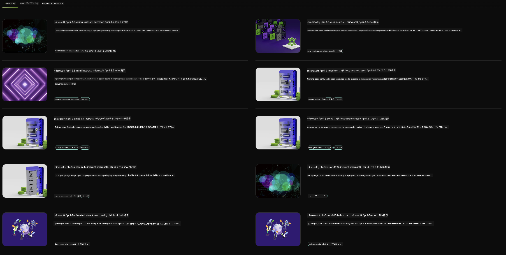

<!--
CO_OP_TRANSLATOR_METADATA:
{
  "original_hash": "7b08e277df2a9307f861ae54bc30c772",
  "translation_date": "2025-05-08T06:21:28+00:00",
  "source_file": "md/01.Introduction/02/06.NVIDIA.md",
  "language_code": "ja"
}
-->
## NVIDIA NIMのPhiファミリー

NVIDIA NIMは、クラウド、データセンター、ワークステーションでの生成AIモデルの展開を加速するために設計された使いやすいマイクロサービス群です。NIMはモデルファミリーごと、または個々のモデル単位で分類されています。例えば、大規模言語モデル（LLM）向けのNVIDIA NIMは、最先端のLLMの力を企業アプリケーションに提供し、他に類を見ない自然言語処理と理解能力を実現します。

NIMはITやDevOpsチームが自社管理環境内で大規模言語モデル（LLM）をセルフホストしやすくしつつ、開発者には強力なコパイロットやチャットボット、AIアシスタントを構築できる業界標準のAPIを提供します。NVIDIAの最先端GPUアクセラレーションとスケーラブルな展開を活用し、NIMは比類なきパフォーマンスで最速の推論パスを提供します。

NVIDIA NIMを使ってPhiファミリーモデルを推論できます。



### **サンプル - NVIDIA NIMのPhi-3-Vision**

画像（`demo.png`）があり、この画像を処理して新しいバージョンを保存するPythonコード（`phi-3-vision.jpg`）を生成したいとします。

上記のコードは次の手順を自動化しています：

1. 環境と必要な設定の準備。
2. モデルに必要なPythonコードを生成させるためのプロンプト作成。
3. プロンプトをモデルに送り、生成されたコードを取得。
4. 生成コードの抽出と実行。
5. 元画像と処理後の画像の表示。

この方法はAIの力を活用して画像処理タスクを自動化し、目標達成をより簡単かつ迅速にします。

[サンプルコードソリューション](../../../../../code/06.E2E/E2E_Nvidia_NIM_Phi3_Vision.ipynb)

コード全体の処理をステップごとに見ていきましょう：

1. **必要なパッケージのインストール**:
    ```python
    !pip install langchain_nvidia_ai_endpoints -U
    ```  
    `langchain_nvidia_ai_endpoints`パッケージを最新バージョンでインストールします。

2. **必要なモジュールのインポート**:
    ```python
    from langchain_nvidia_ai_endpoints import ChatNVIDIA
    import getpass
    import os
    import base64
    ```  
    NVIDIA AIエンドポイントとのやり取り、パスワードの安全な扱い、OS操作、base64のエンコード/デコードに必要なモジュールをインポートします。

3. **APIキーの設定**:
    ```python
    if not os.getenv("NVIDIA_API_KEY"):
        os.environ["NVIDIA_API_KEY"] = getpass.getpass("Enter your NVIDIA API key: ")
    ```  
    環境変数`NVIDIA_API_KEY`が設定されているか確認し、なければユーザーに安全にAPIキーの入力を促します。

4. **モデルと画像パスの定義**:
    ```python
    model = 'microsoft/phi-3-vision-128k-instruct'
    chat = ChatNVIDIA(model=model)
    img_path = './imgs/demo.png'
    ```  
    使用するモデルを設定し、`ChatNVIDIA`のインスタンスを作成、画像ファイルのパスを指定します。

5. **テキストプロンプトの作成**:
    ```python
    text = "Please create Python code for image, and use plt to save the new picture under imgs/ and name it phi-3-vision.jpg."
    ```  
    画像を処理するPythonコードを生成するようモデルに指示するテキストプロンプトを定義します。

6. **画像のbase64エンコード**:
    ```python
    with open(img_path, "rb") as f:
        image_b64 = base64.b64encode(f.read()).decode()
    image = f''
    ```  
    画像ファイルを読み込み、base64でエンコードし、エンコードデータを含むHTMLのimgタグを作成します。

7. **テキストと画像をプロンプトに結合**:
    ```python
    prompt = f"{text} {image}"
    ```  
    テキストプロンプトとHTMLの画像タグを一つの文字列にまとめます。

8. **ChatNVIDIAでコードを生成**:
    ```python
    code = ""
    for chunk in chat.stream(prompt):
        print(chunk.content, end="")
        code += chunk.content
    ```  
    プロンプトを`ChatNVIDIA`に送り、生成されたコードを受け取ります。

9. **生成コンテンツからPythonコードを抽出**:
    ```python
    begin = code.index('```python') + 9  
    code = code[begin:]  
    end = code.index('```')
    code = code[:end]
    ```  
    マークダウンのフォーマットを除去して実際のPythonコードを抽出します。

10. **生成コードの実行**:
    ```python
    import subprocess
    result = subprocess.run(["python", "-c", code], capture_output=True)
    ```  
    抽出したPythonコードをサブプロセスとして実行し、その出力を取得します。

11. **画像の表示**:
    ```python
    from IPython.display import Image, display
    display(Image(filename='./imgs/phi-3-vision.jpg'))
    display(Image(filename='./imgs/demo.png'))
    ```  
    `IPython.display`モジュールを使って元画像と処理後の画像を表示します。

**免責事項**:  
本書類はAI翻訳サービス[Co-op Translator](https://github.com/Azure/co-op-translator)を使用して翻訳されました。正確性の向上に努めておりますが、自動翻訳には誤りや不正確な部分が含まれる可能性があります。原文の言語によるオリジナル文書が正式な情報源とみなされます。重要な情報については、専門の人間による翻訳を推奨します。本翻訳の使用により生じた誤解や誤訳について、一切の責任を負いかねますのでご了承ください。