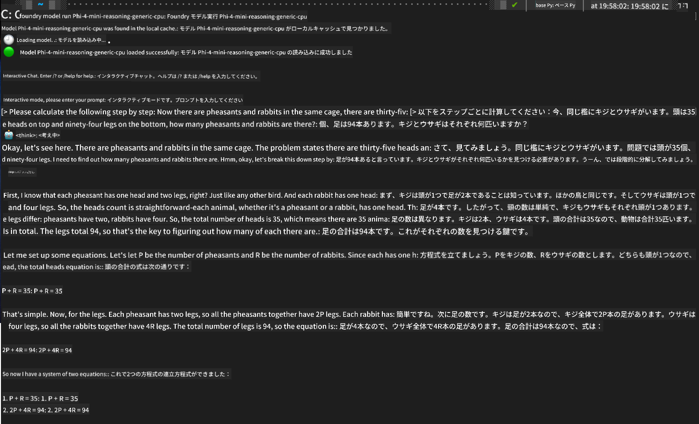

<!--
CO_OP_TRANSLATOR_METADATA:
{
  "original_hash": "52973a5680a65a810aa80b7036afd31f",
  "translation_date": "2025-07-16T19:43:53+00:00",
  "source_file": "md/01.Introduction/02/07.FoundryLocal.md",
  "language_code": "ja"
}
-->
## Foundry LocalでのPhiファミリーモデルの始め方

### Foundry Localの紹介

Foundry Localは、エンタープライズレベルのAI機能をローカルハードウェア上で直接実行できる強力なオンデバイスAI推論ソリューションです。このチュートリアルでは、Foundry LocalでPhiファミリーモデルをセットアップし使用する方法を案内します。プライバシーを守りつつコストを抑え、AIワークロードを完全にコントロールできます。

Foundry Localは、デバイス上でAIモデルを実行することで、パフォーマンス、プライバシー、カスタマイズ性、コスト面でのメリットを提供します。直感的なCLI、SDK、REST APIを通じて既存のワークフローやアプリケーションにシームレスに統合可能です。


### なぜFoundry Localを選ぶのか？

Foundry Localの利点を理解することで、AI導入戦略の判断に役立ちます：

- **オンデバイス推論:** 自分のハードウェア上でモデルを実行し、コストを削減しながらデータをデバイス内に保持。

- **モデルのカスタマイズ:** 既存のモデルから選ぶか、自分のモデルを使って特定の要件やユースケースに対応。

- **コスト効率:** 既存のハードウェアを活用し、クラウドサービスの継続的な費用を削減。AIをより手軽に。

- **シームレスな統合:** SDK、APIエンドポイント、CLIを通じてアプリケーションと接続。ニーズに応じてAzure AI Foundryへのスケールも簡単。

> **はじめにの注意:** このチュートリアルではCLIとSDKの両方を使ったFoundry Localの利用方法に焦点を当てています。用途に合った方法を選べるように両方を学びましょう。

## パート1: Foundry Local CLIのセットアップ

### ステップ1: インストール

Foundry Local CLIは、ローカルでAIモデルを管理・実行するための入り口です。まずはシステムにインストールしましょう。

**対応プラットフォーム:** WindowsとmacOS

詳しいインストール手順は[公式Foundry Localドキュメント](https://github.com/microsoft/Foundry-Local/blob/main/README.md)をご参照ください。

### ステップ2: 利用可能なモデルの確認

Foundry Local CLIをインストールしたら、利用可能なモデルを確認できます。以下のコマンドでサポートされているモデル一覧が表示されます：


```bash
foundry model list
```

### ステップ3: Phiファミリーモデルの理解

Phiファミリーは、さまざまなユースケースやハードウェア構成に最適化されたモデル群です。Foundry Localで利用可能なPhiモデルは以下の通りです：

**利用可能なPhiモデル:** 

- **phi-3.5-mini** - 基本的なタスク向けのコンパクトモデル
- **phi-3-mini-128k** - 長い会話に対応した拡張コンテキスト版
- **phi-3-mini-4k** - 一般用途向けの標準コンテキストモデル
- **phi-4** - 高度な機能を備えたモデル
- **phi-4-mini** - Phi-4の軽量版
- **phi-4-mini-reasoning** - 複雑な推論タスクに特化

> **ハードウェア互換性:** 各モデルはシステムの性能に応じてCPUやGPUなど異なるハードウェアアクセラレーションで設定可能です。

### ステップ4: 最初のPhiモデルを実行する

実践例として、複雑な問題を段階的に解くのに優れた`phi-4-mini-reasoning`モデルを動かしてみましょう。


**モデル実行コマンド:**

```bash
foundry model run Phi-4-mini-reasoning-generic-cpu
```

> **初回セットアップ:** モデルを初めて実行する際、Foundry Localは自動的にモデルをローカルにダウンロードします。ネットワーク速度によって時間がかかる場合があるので、初回はしばらくお待ちください。

### ステップ5: 実際の問題でモデルをテスト

次に、古典的な論理問題を使ってモデルの段階的推論能力を試してみましょう：

**例題:**

```txt
Please calculate the following step by step: Now there are pheasants and rabbits in the same cage, there are thirty-five heads on top and ninety-four legs on the bottom, how many pheasants and rabbits are there?
```

**期待される動作:** モデルはキジが2本足、ウサギが4本足であることを利用し、連立方程式を論理的に分解して解決します。

**結果:**



## パート2: Foundry Local SDKでアプリケーションを構築する

### なぜSDKを使うのか？

CLIはテストや簡単な操作に最適ですが、SDKを使うことでFoundry Localをプログラム的にアプリケーションに組み込めます。これにより以下が可能になります：

- カスタムAIアプリケーションの構築
- 自動化ワークフローの作成
- 既存システムへのAI機能統合
- チャットボットやインタラクティブツールの開発

### 対応プログラミング言語

Foundry Localは複数のプログラミング言語向けにSDKを提供し、開発スタイルに合わせて選べます：

**📦 利用可能なSDK:**

- **C# (.NET):** [SDKドキュメント＆サンプル](https://github.com/microsoft/Foundry-Local/tree/main/sdk/cs)
- **Python:** [SDKドキュメント＆サンプル](https://github.com/microsoft/Foundry-Local/tree/main/sdk/python)
- **JavaScript:** [SDKドキュメント＆サンプル](https://github.com/microsoft/Foundry-Local/tree/main/sdk/js)
- **Rust:** [SDKドキュメント＆サンプル](https://github.com/microsoft/Foundry-Local/tree/main/sdk/rust)

### 次のステップ

1. 開発環境に合ったSDKを選択
2. SDKごとのドキュメントに従い実装を進める
3. 簡単な例から始めて徐々に複雑なアプリケーションへ
4. 各SDKリポジトリのサンプルコードを活用

## まとめ

以下のことができるようになりました：
- ✅ Foundry Local CLIのインストールとセットアップ
- ✅ Phiファミリーモデルの発見と実行
- ✅ 実際の問題でモデルをテスト
- ✅ アプリ開発向けSDKの選択肢を理解

Foundry Localは、AI機能をローカル環境に直接もたらし、パフォーマンス、プライバシー、コストをコントロールしつつ、必要に応じてクラウドへのスケールも可能な強力な基盤を提供します。

**免責事項**：  
本書類はAI翻訳サービス「[Co-op Translator](https://github.com/Azure/co-op-translator)」を使用して翻訳されました。正確性には努めておりますが、自動翻訳には誤りや不正確な部分が含まれる可能性があります。原文の言語によるオリジナル文書が正式な情報源とみなされるべきです。重要な情報については、専門の人間による翻訳を推奨します。本翻訳の利用により生じたいかなる誤解や誤訳についても、当方は責任を負いかねます。