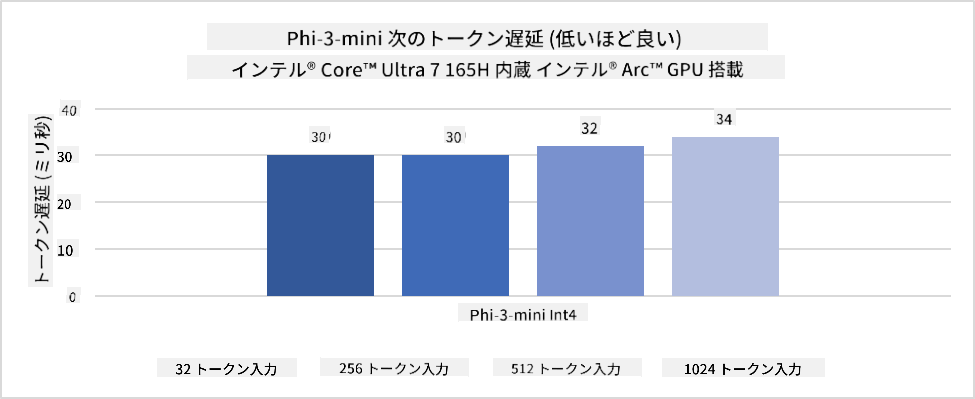
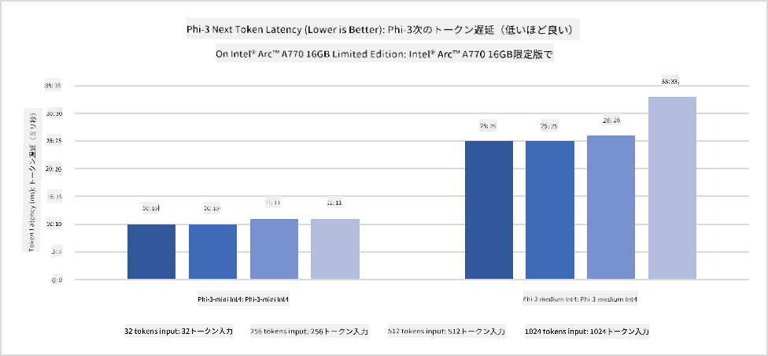
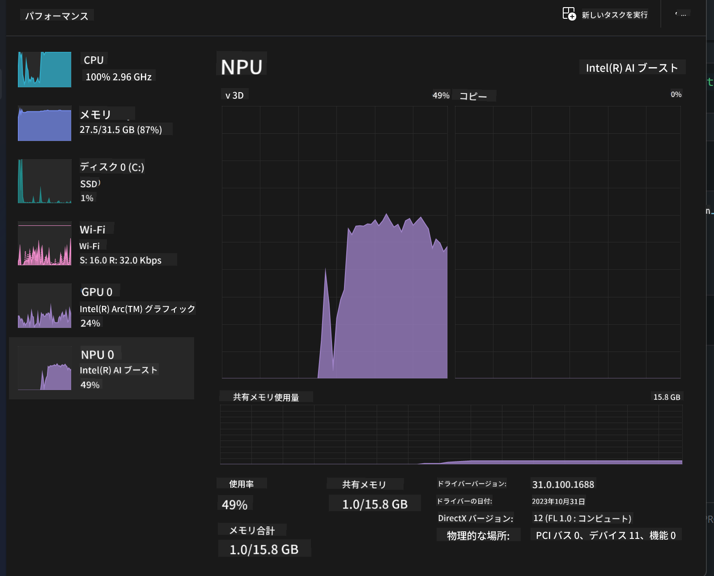
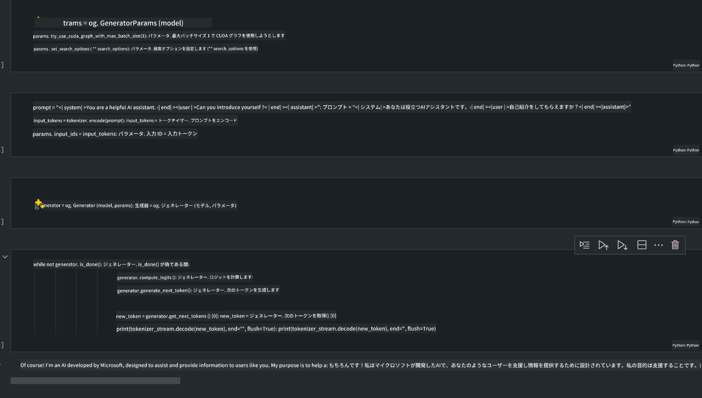
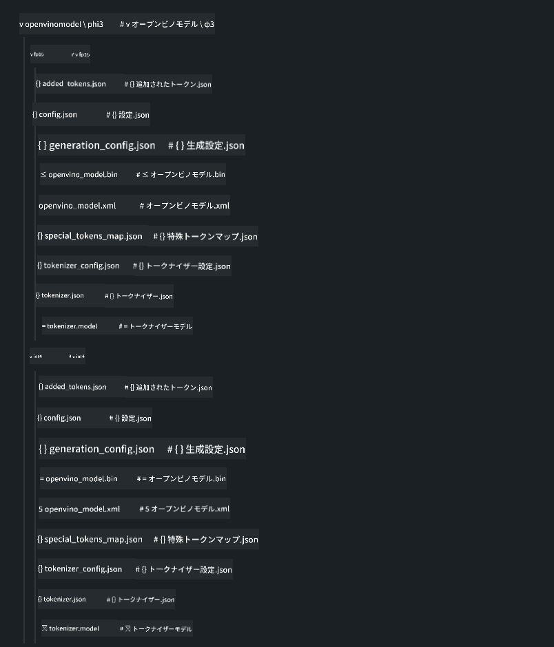
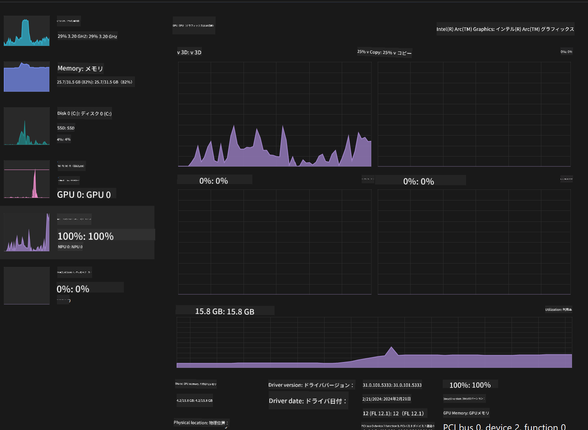

<!--
CO_OP_TRANSLATOR_METADATA:
{
  "original_hash": "5ca6ea8da7aa1335ef287124462b2833",
  "translation_date": "2025-04-04T11:58:50+00:00",
  "source_file": "md\\01.Introduction\\03\\AIPC_Inference.md",
  "language_code": "ja"
}
-->
# **AI PCでのPhi-3推論**

生成AIの進化とエッジデバイスのハードウェア性能向上により、ますます多くの生成AIモデルがユーザーのBYOD（Bring Your Own Device）デバイスに統合可能になっています。AI PCもその一例です。2024年から、Intel、AMD、QualcommはPCメーカーと協力し、ハードウェア改良を通じてローカライズされた生成AIモデルを展開できるAI PCを導入しています。この議論では、Intel AI PCに焦点を当て、Intel AI PCでPhi-3を展開する方法を探ります。

### NPUとは

NPU（Neural Processing Unit）は、ニューラルネットワークの操作やAIタスクを加速するために特化して設計されたプロセッサまたはSoC上の処理ユニットです。汎用的なCPUやGPUとは異なり、NPUはデータ駆動型の並列計算に最適化されており、動画や画像のような大量のマルチメディアデータを処理する際に非常に効率的です。また、ニューラルネットワークのデータ処理にも優れており、音声認識、ビデオ通話での背景ぼかし、オブジェクト検出のような写真や動画編集プロセスなど、AI関連のタスクに特化しています。

## NPUとGPUの違い

多くのAIや機械学習のワークロードはGPU上で実行されますが、GPUとNPUには重要な違いがあります。
GPUは並列計算能力で知られていますが、すべてのGPUがグラフィック処理以外の作業において効率的とは限りません。一方、NPUはニューラルネットワーク操作に関連する複雑な計算を目的に設計されており、AIタスクに非常に効果的です。

要約すると、NPUはAI計算を加速する数学の達人であり、AI PCの新しい時代で重要な役割を果たしています！

***この例はIntelの最新Intel Core Ultra Processorを基にしています***

## **1. NPUを使用してPhi-3モデルを実行する**

Intel® NPUデバイスは、Intel® Core™ Ultra世代のCPU（以前はMeteor Lakeと呼ばれていた）から統合されたIntelクライアントCPUに搭載されたAI推論アクセラレータです。これにより、人工ニューラルネットワークタスクをエネルギー効率良く実行できます。





**Intel NPU Acceleration Library**

Intel NPU Acceleration Library [https://github.com/intel/intel-npu-acceleration-library](https://github.com/intel/intel-npu-acceleration-library) は、Intel Neural Processing Unit (NPU) の力を活用して、対応するハードウェア上で高速計算を行うことでアプリケーションの効率を向上させるためのPythonライブラリです。

Intel® Core™ Ultraプロセッサで動作するAI PC上のPhi-3-miniの例。


Pythonライブラリをpipでインストール

```bash

   pip install intel-npu-acceleration-library

```

***Note*** プロジェクトはまだ開発中ですが、参照モデルはすでに非常に完成されています。

### **Intel NPU Acceleration Libraryを使ったPhi-3の実行**

Intel NPUアクセラレーションを使用することで、このライブラリは従来のエンコードプロセスに影響を与えません。このライブラリを使用して元のPhi-3モデルをFP16、INT8、INT4などに量子化するだけで十分です。

```python
from transformers import AutoTokenizer, pipeline,TextStreamer
from intel_npu_acceleration_library import NPUModelForCausalLM, int4
from intel_npu_acceleration_library.compiler import CompilerConfig
import warnings

model_id = "microsoft/Phi-3-mini-4k-instruct"

compiler_conf = CompilerConfig(dtype=int4)
model = NPUModelForCausalLM.from_pretrained(
    model_id, use_cache=True, config=compiler_conf, attn_implementation="sdpa"
).eval()

tokenizer = AutoTokenizer.from_pretrained(model_id)

text_streamer = TextStreamer(tokenizer, skip_prompt=True)
```

量子化が成功した後、NPUを呼び出してPhi-3モデルを実行します。

```python
generation_args = {
   "max_new_tokens": 1024,
   "return_full_text": False,
   "temperature": 0.3,
   "do_sample": False,
   "streamer": text_streamer,
}

pipe = pipeline(
   "text-generation",
   model=model,
   tokenizer=tokenizer,
)

query = "<|system|>You are a helpful AI assistant.<|end|><|user|>Can you introduce yourself?<|end|><|assistant|>"

with warnings.catch_warnings():
    warnings.simplefilter("ignore")
    pipe(query, **generation_args)
```

コードを実行する際、タスクマネージャーを通じてNPUの実行状況を確認できます。



***Samples*** : [AIPC_NPU_DEMO.ipynb](../../../../../code/03.Inference/AIPC/AIPC_NPU_DEMO.ipynb)

## **2. DirectML + ONNX Runtimeを使用してPhi-3モデルを実行する**

### **DirectMLとは**

[DirectML](https://github.com/microsoft/DirectML) は、機械学習のための高性能でハードウェア加速されたDirectX 12ライブラリです。DirectMLは、AMD、Intel、NVIDIA、QualcommなどのベンダーのすべてのDirectX 12対応GPUを含む幅広い対応ハードウェアとドライバーにわたり、一般的な機械学習タスクのGPUアクセラレーションを提供します。

単体で使用する場合、DirectML APIは低レベルのDirectX 12ライブラリであり、フレームワーク、ゲーム、その他のリアルタイムアプリケーションなどの高性能で低遅延のアプリケーションに適しています。DirectMLとDirect3D 12のシームレスな互換性、低オーバーヘッド、およびハードウェア間の一貫性により、DirectMLは高性能が求められる場合や、ハードウェア間で結果の信頼性と予測可能性が重要な場合に機械学習を加速するのに最適です。

***Note*** : 最新のDirectMLはすでにNPUをサポートしています(https://devblogs.microsoft.com/directx/introducing-neural-processor-unit-npu-support-in-directml-developer-preview/)

### DirectMLとCUDAの能力と性能比較

**DirectML** はMicrosoftが開発した機械学習ライブラリで、Windowsデバイス（デスクトップ、ラップトップ、エッジデバイスを含む）での機械学習ワークロードを加速するために設計されています。
- DX12ベース: DirectMLはDirectX 12 (DX12) 上に構築されており、AMDとNVIDIAの両方を含むGPUの幅広いハードウェアサポートを提供します。
- 幅広いサポート: DX12を活用することで、DirectMLはDX12をサポートする任意のGPU、さらには統合GPUでも動作可能です。
- 画像処理: DirectMLはニューラルネットワークを使用して画像やその他のデータを処理し、画像認識やオブジェクト検出などのタスクに適しています。
- セットアップの簡易性: DirectMLのセットアップは簡単で、特定のGPUメーカーのSDKやライブラリを必要としません。
- 性能: 場合によっては、DirectMLは優れた性能を発揮し、特定のワークロードではCUDAよりも高速になることがあります。
- 制限: ただし、大規模なfloat16バッチサイズの場合、DirectMLが遅くなる場合もあります。

**CUDA** はNVIDIAの並列計算プラットフォームとプログラミングモデルで、NVIDIA GPUの力を活用して機械学習や科学シミュレーションなどの汎用計算を可能にします。
- NVIDIA特化: CUDAはNVIDIA GPUに密接に統合されており、これらのGPU専用に設計されています。
- 高度に最適化: GPU加速タスクに優れた性能を提供し、特にNVIDIA GPUを使用する場合に効果的です。
- 広く使用されている: 多くの機械学習フレームワークやライブラリ（TensorFlowやPyTorchなど）がCUDAをサポートしています。
- カスタマイズ性: 特定のタスクに対してCUDA設定を細かく調整することで、最適な性能を引き出すことが可能です。
- 制限: ただし、CUDAはNVIDIAハードウェアに依存しているため、異なるGPU間での互換性が必要な場合には制約となることがあります。

### DirectMLとCUDAの選択

DirectMLとCUDAの選択は、具体的なユースケース、利用可能なハードウェア、および個人の好みによります。
より広い互換性とセットアップの簡易性を求める場合は、DirectMLが良い選択肢となる可能性があります。一方、NVIDIA GPUを所有しており、高度に最適化された性能が必要な場合は、CUDAが依然として強力な選択肢です。要約すると、DirectMLとCUDAにはそれぞれの長所と短所があるため、要件と利用可能なハードウェアを考慮して選択してください。

### **ONNX Runtimeによる生成AI**

AIの時代では、AIモデルのポータビリティが非常に重要です。ONNX Runtimeを使用すると、訓練済みモデルを簡単に異なるデバイスに展開できます。開発者は推論フレームワークを気にする必要がなく、統一されたAPIを使用してモデル推論を完了できます。生成AIの時代では、ONNX Runtimeはコード最適化も行っています (https://onnxruntime.ai/docs/genai/)。最適化されたONNX Runtimeを使用することで、量子化された生成AIモデルを異なる端末で推論することが可能です。ONNX Runtimeを使用した生成AIでは、Python、C#、C / C++を通じてAIモデルAPIを推論できます。もちろん、iPhoneでの展開にはC++のONNX Runtime APIを活用できます。

[サンプルコード](https://github.com/Azure-Samples/Phi-3MiniSamples/tree/main/onnx)

***ONNX Runtimeライブラリをコンパイルして生成AIを実行***

```bash

winget install --id=Kitware.CMake  -e

git clone https://github.com/microsoft/onnxruntime.git

cd .\onnxruntime\

./build.bat --build_shared_lib --skip_tests --parallel --use_dml --config Release

cd ../

git clone https://github.com/microsoft/onnxruntime-genai.git

cd .\onnxruntime-genai\

mkdir ort

cd ort

mkdir include

mkdir lib

copy ..\onnxruntime\include\onnxruntime\core\providers\dml\dml_provider_factory.h ort\include

copy ..\onnxruntime\include\onnxruntime\core\session\onnxruntime_c_api.h ort\include

copy ..\onnxruntime\build\Windows\Release\Release\*.dll ort\lib

copy ..\onnxruntime\build\Windows\Release\Release\onnxruntime.lib ort\lib

python build.py --use_dml


```

**ライブラリのインストール**

```bash

pip install .\onnxruntime_genai_directml-0.3.0.dev0-cp310-cp310-win_amd64.whl

```

これは実行結果です。



***Samples*** : [AIPC_DirectML_DEMO.ipynb](../../../../../code/03.Inference/AIPC/AIPC_DirectML_DEMO.ipynb)

## **3. Intel OpenVINOを使用してPhi-3モデルを実行する**

### **OpenVINOとは**

[OpenVINO](https://github.com/openvinotoolkit/openvino) は、深層学習モデルを最適化し展開するためのオープンソースツールキットです。TensorFlowやPyTorchなどの人気フレームワークからのビジョン、音声、言語モデルに対して深層学習性能を向上させます。OpenVINOを使用することで、CPUやGPUと組み合わせてPhi-3モデルを実行することも可能です。

***Note***: 現時点では、OpenVINOはNPUをサポートしていません。

### **OpenVINOライブラリのインストール**

```bash

 pip install git+https://github.com/huggingface/optimum-intel.git

 pip install git+https://github.com/openvinotoolkit/nncf.git

 pip install openvino-nightly

```

### **OpenVINOを使用してPhi-3を実行**

NPUと同様に、OpenVINOは量子化モデルを実行することで生成AIモデルを呼び出します。まずPhi-3モデルを量子化し、optimum-cliを使用してコマンドライン上でモデル量子化を完了する必要があります。

**INT4**

```bash

optimum-cli export openvino --model "microsoft/Phi-3-mini-4k-instruct" --task text-generation-with-past --weight-format int4 --group-size 128 --ratio 0.6  --sym  --trust-remote-code ./openvinomodel/phi3/int4

```

**FP16**

```bash

optimum-cli export openvino --model "microsoft/Phi-3-mini-4k-instruct" --task text-generation-with-past --weight-format fp16 --trust-remote-code ./openvinomodel/phi3/fp16

```

変換された形式は以下のようになります。



OVModelForCausalLMを使用してモデルパス(model_dir)、関連する設定(ov_config = {"PERFORMANCE_HINT": "LATENCY", "NUM_STREAMS": "1", "CACHE_DIR": ""})、およびハードウェア加速デバイス(GPU.0)をロードします。

```python

ov_model = OVModelForCausalLM.from_pretrained(
     model_dir,
     device='GPU.0',
     ov_config=ov_config,
     config=AutoConfig.from_pretrained(model_dir, trust_remote_code=True),
     trust_remote_code=True,
)

```

コードを実行する際、タスクマネージャーを通じてGPUの実行状況を確認できます。



***Samples*** : [AIPC_OpenVino_Demo.ipynb](../../../../../code/03.Inference/AIPC/AIPC_OpenVino_Demo.ipynb)

### ***Note*** : 上記の3つの方法にはそれぞれ利点がありますが、AI PC推論にはNPUアクセラレーションを使用することを推奨します。

**免責事項**:  
この文書はAI翻訳サービス [Co-op Translator](https://github.com/Azure/co-op-translator) を使用して翻訳されています。正確性を追求しておりますが、自動翻訳には誤りや不正確な点が含まれる場合があります。元の言語で記載された文書を公式な情報源としてご参照ください。重要な情報については、専門の人間による翻訳を推奨します。この翻訳の利用に起因する誤解や誤認について、当方は責任を負いません。