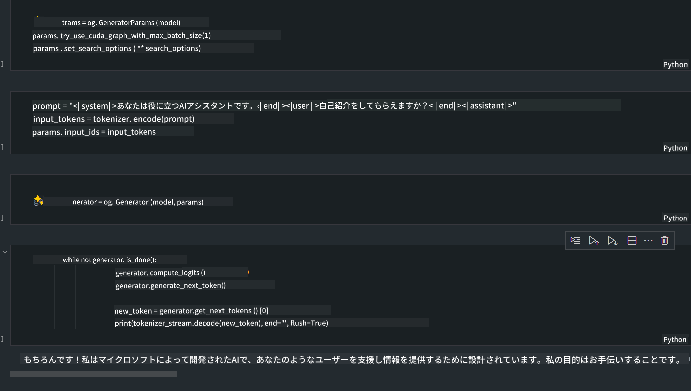
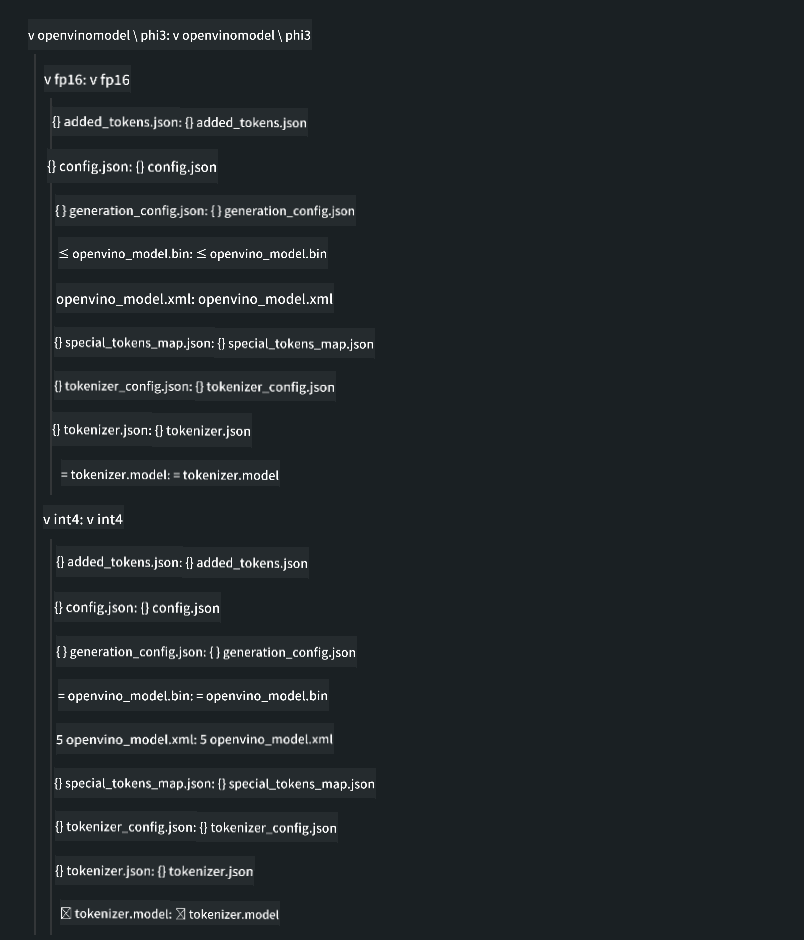

<!--
CO_OP_TRANSLATOR_METADATA:
{
  "original_hash": "e08ce816e23ad813244a09ca34ebb8ac",
  "translation_date": "2025-05-08T05:59:38+00:00",
  "source_file": "md/01.Introduction/03/AIPC_Inference.md",
  "language_code": "ja"
}
-->
# **AI PCにおけるPhi-3推論**

生成AIの進歩とエッジデバイスのハードウェア性能向上により、多くの生成AIモデルがユーザーのBYOD（Bring Your Own Device）デバイスに組み込まれるようになっています。AI PCもその一例です。2024年から、Intel、AMD、QualcommはPCメーカーと協力し、ハードウェアの改良を通じてローカルで生成AIモデルを展開できるAI PCを提供しています。本稿ではIntelのAI PCに焦点を当て、Intel AI PC上でのPhi-3の展開方法を解説します。

### NPUとは何か

NPU（Neural Processing Unit）は、より大きなSoC内に組み込まれた専用のプロセッサで、ニューラルネットワークの演算やAIタスクの高速化に特化しています。汎用CPUやGPUとは異なり、NPUはデータ駆動型の並列計算に最適化されており、動画や画像など大量のマルチメディアデータの処理やニューラルネットワークのデータ処理に非常に効率的です。音声認識、ビデオ通話の背景ぼかし、物体検出などの写真・動画編集処理など、AI関連のタスクに特に強みを持ちます。

## NPUとGPUの違い

多くのAI・機械学習の処理はGPU上で動作しますが、GPUとNPUには重要な違いがあります。  
GPUは並列計算に優れていますが、グラフィックス処理以外の用途での効率はGPUによって異なります。一方、NPUはニューラルネットワークの複雑な計算に特化して設計されており、AIタスクに非常に効果的です。

まとめると、NPUはAI計算を高速化する数学の達人のような存在であり、AI PCの新時代を支える重要な役割を果たしています。

***この例はIntelの最新Intel Core Ultraプロセッサに基づいています***

## **1. NPUを使ってPhi-3モデルを実行する**

Intel® NPUデバイスは、Intel® Core™ Ultra世代（旧称Meteor Lake）以降のIntelクライアントCPUに統合されたAI推論アクセラレータです。人工ニューラルネットワークのタスクをエネルギー効率よく実行可能にします。


**Intel NPU Acceleration Library**

Intel NPU Acceleration Library [https://github.com/intel/intel-npu-acceleration-library](https://github.com/intel/intel-npu-acceleration-library) は、Intel Neural Processing Unit (NPU) の力を活用して対応ハードウェア上で高速計算を実現し、アプリケーションの効率を向上させるPythonライブラリです。

Intel® Core™ Ultraプロセッサ搭載AI PC上でのPhi-3-miniの例。


pipでPythonライブラリをインストール

```bash

   pip install intel-npu-acceleration-library

```

***注意*** プロジェクトはまだ開発中ですが、参照モデルはかなり完成しています。

### **Intel NPU Acceleration LibraryでPhi-3を実行する**

Intel NPUアクセラレーションを利用すると、従来のエンコード処理には影響を与えません。元のPhi-3モデルをFP16、INT8、INT4などに量子化するためにこのライブラリを使うだけです。

```python
from transformers import AutoTokenizer, pipeline,TextStreamer
from intel_npu_acceleration_library import NPUModelForCausalLM, int4
from intel_npu_acceleration_library.compiler import CompilerConfig
import warnings

model_id = "microsoft/Phi-3-mini-4k-instruct"

compiler_conf = CompilerConfig(dtype=int4)
model = NPUModelForCausalLM.from_pretrained(
    model_id, use_cache=True, config=compiler_conf, attn_implementation="sdpa"
).eval()

tokenizer = AutoTokenizer.from_pretrained(model_id)

text_streamer = TextStreamer(tokenizer, skip_prompt=True)
```

量子化が成功したら、続けてNPUを呼び出してPhi-3モデルを実行します。

```python
generation_args = {
   "max_new_tokens": 1024,
   "return_full_text": False,
   "temperature": 0.3,
   "do_sample": False,
   "streamer": text_streamer,
}

pipe = pipeline(
   "text-generation",
   model=model,
   tokenizer=tokenizer,
)

query = "<|system|>You are a helpful AI assistant.<|end|><|user|>Can you introduce yourself?<|end|><|assistant|>"

with warnings.catch_warnings():
    warnings.simplefilter("ignore")
    pipe(query, **generation_args)
```

コード実行中はタスクマネージャーでNPUの動作状況を確認できます。


***サンプル*** : [AIPC_NPU_DEMO.ipynb](../../../../../code/03.Inference/AIPC/AIPC_NPU_DEMO.ipynb)

## **2. DirectML + ONNX RuntimeでPhi-3モデルを実行する**

### **DirectMLとは**

[DirectML](https://github.com/microsoft/DirectML) は高性能かつハードウェアアクセラレーション対応のDirectX 12ベースの機械学習ライブラリです。AMD、Intel、NVIDIA、QualcommなどのDirectX 12対応GPU上で一般的な機械学習タスクのGPUアクセラレーションを提供します。

単体で使う場合、DirectML APIは低レベルのDirectX 12ライブラリであり、フレームワークやゲーム、リアルタイムアプリなど高性能かつ低遅延を求める用途に適しています。Direct3D 12とのシームレスな連携や低オーバーヘッド、ハードウェア間の互換性の高さから、高性能かつ結果の信頼性が求められる機械学習の高速化に最適です。

***注意*** : 最新のDirectMLはすでにNPUをサポートしています(https://devblogs.microsoft.com/directx/introducing-neural-processor-unit-npu-support-in-directml-developer-preview/)

### DirectMLとCUDAの性能・機能比較

**DirectML** はMicrosoftが開発した機械学習ライブラリで、Windowsデバイス（デスクトップ、ノートPC、エッジデバイス）上の機械学習処理を高速化します。  
- DX12ベース：DirectX 12上に構築されており、NVIDIAやAMDを含む幅広いGPUをサポート。  
- 幅広い対応：DX12対応GPUなら統合GPUでも動作可能。  
- 画像処理：ニューラルネットワークを使って画像認識や物体検出などを処理。  
- 簡単セットアップ：GPUメーカーの特定SDKは不要でセットアップが容易。  
- パフォーマンス：特定の処理ではCUDAより高速な場合もある。  
- 制限：ただしfloat16の大規模バッチ処理では遅くなることもある。

**CUDA** はNVIDIAの並列コンピューティングプラットフォームで、NVIDIA GPUの性能を最大限に活用するためのプログラミングモデル。  
- NVIDIA専用：NVIDIA GPUに特化。  
- 高度最適化：GPUアクセラレーション処理で非常に高性能。  
- 幅広い利用：TensorFlowやPyTorchなど多くのMLフレームワークが対応。  
- カスタマイズ性：特定タスク向けに細かく調整可能。  
- 制限：NVIDIAハードウェアに依存し、他GPUとの互換性は低い。

### DirectMLとCUDAの選択

用途やハードウェア環境、好みによって選択が変わります。  
幅広い互換性やセットアップの容易さを重視するならDirectML、NVIDIA GPUを持ち高性能を求めるならCUDAが有力です。両者にはそれぞれ強みと弱みがあるため、要件と利用環境に応じて選択してください。

### **ONNX Runtimeでの生成AI**

AI時代において、AIモデルの移植性は非常に重要です。ONNX Runtimeは学習済みモデルをさまざまなデバイスに簡単に展開可能で、開発者は推論フレームワークを意識せずに統一APIで推論を行えます。生成AIの時代においても、ONNX Runtimeはコード最適化を行い(https://onnxruntime.ai/docs/genai/)、量子化された生成AIモデルを異なる端末で推論可能にしています。ONNX Runtimeを使った生成AIでは、Python、C#、C/C++でAIモデルAPIを利用できます。iPhoneへの展開ではC++の生成AI ONNX Runtime APIが活用できます。

[サンプルコード](https://github.com/Azure-Samples/Phi-3MiniSamples/tree/main/onnx)

***ONNX Runtimeライブラリのビルド***

```bash

winget install --id=Kitware.CMake  -e

git clone https://github.com/microsoft/onnxruntime.git

cd .\onnxruntime\

./build.bat --build_shared_lib --skip_tests --parallel --use_dml --config Release

cd ../

git clone https://github.com/microsoft/onnxruntime-genai.git

cd .\onnxruntime-genai\

mkdir ort

cd ort

mkdir include

mkdir lib

copy ..\onnxruntime\include\onnxruntime\core\providers\dml\dml_provider_factory.h ort\include

copy ..\onnxruntime\include\onnxruntime\core\session\onnxruntime_c_api.h ort\include

copy ..\onnxruntime\build\Windows\Release\Release\*.dll ort\lib

copy ..\onnxruntime\build\Windows\Release\Release\onnxruntime.lib ort\lib

python build.py --use_dml


```

**ライブラリのインストール**

```bash

pip install .\onnxruntime_genai_directml-0.3.0.dev0-cp310-cp310-win_amd64.whl

```

実行結果例



***サンプル*** : [AIPC_DirectML_DEMO.ipynb](../../../../../code/03.Inference/AIPC/AIPC_DirectML_DEMO.ipynb)

## **3. Intel OpenVinoでPhi-3モデルを実行する**

### **OpenVINOとは**

[OpenVINO](https://github.com/openvinotoolkit/openvino) は深層学習モデルの最適化と展開のためのオープンソースツールキットです。TensorFlowやPyTorchなどの人気フレームワークの視覚、音声、言語モデルの性能を向上させます。OpenVINOの使い始めはこちら。OpenVINOはCPUやGPUと組み合わせてPhi-3モデルを実行することも可能です。

***注意*** : 現時点でOpenVINOはNPUをサポートしていません。

### **OpenVINOライブラリのインストール**

```bash

 pip install git+https://github.com/huggingface/optimum-intel.git

 pip install git+https://github.com/openvinotoolkit/nncf.git

 pip install openvino-nightly

```

### **OpenVINOでPhi-3を実行する**

NPU同様、OpenVINOも量子化モデルを実行して生成AIモデルを呼び出します。まずPhi-3モデルを量子化し、optimum-cliを使ってコマンドラインで量子化を完了させます。

**INT4**

```bash

optimum-cli export openvino --model "microsoft/Phi-3-mini-4k-instruct" --task text-generation-with-past --weight-format int4 --group-size 128 --ratio 0.6  --sym  --trust-remote-code ./openvinomodel/phi3/int4

```

**FP16**

```bash

optimum-cli export openvino --model "microsoft/Phi-3-mini-4k-instruct" --task text-generation-with-past --weight-format fp16 --trust-remote-code ./openvinomodel/phi3/fp16

```

変換後の形式は以下のようになります。



モデルパス(model_dir)、関連設定(ov_config = {"PERFORMANCE_HINT": "LATENCY", "NUM_STREAMS": "1", "CACHE_DIR": ""})、ハードウェアアクセラレータ（GPU.0）をOVModelForCausalLMで読み込みます。

```python

ov_model = OVModelForCausalLM.from_pretrained(
     model_dir,
     device='GPU.0',
     ov_config=ov_config,
     config=AutoConfig.from_pretrained(model_dir, trust_remote_code=True),
     trust_remote_code=True,
)

```

コード実行中はタスクマネージャーでGPUの動作状況を確認できます。


***サンプル*** : [AIPC_OpenVino_Demo.ipynb](../../../../../code/03.Inference/AIPC/AIPC_OpenVino_Demo.ipynb)

### ***注意*** : 上記3つの方法はそれぞれ利点がありますが、AI PCでの推論にはNPUアクセラレーションの利用を推奨します。

**免責事項**：  
本書類はAI翻訳サービス「[Co-op Translator](https://github.com/Azure/co-op-translator)」を使用して翻訳されています。正確性の向上に努めておりますが、自動翻訳には誤りや不正確な部分が含まれる可能性があります。原文の言語で記載された文書が正式な情報源とみなされます。重要な情報については、専門の人間による翻訳を推奨します。本翻訳の利用により生じたいかなる誤解や誤訳についても責任を負いかねますのでご了承ください。