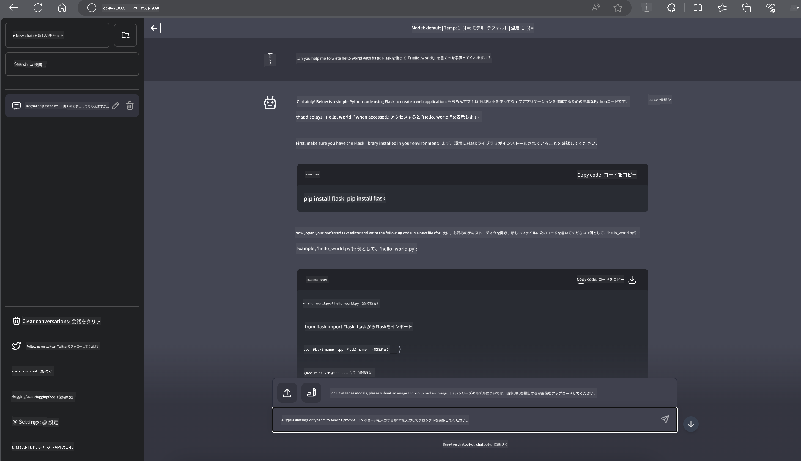

<!--
CO_OP_TRANSLATOR_METADATA:
{
  "original_hash": "5b3df6e1a9927e93cda92801eec65d33",
  "translation_date": "2025-04-04T12:03:56+00:00",
  "source_file": "md\\01.Introduction\\03\\Jetson_Inference.md",
  "language_code": "ja"
}
-->
# **Nvidia JetsonでのPhi-3推論**

Nvidia Jetsonは、Nvidiaによる組み込みコンピューティングボードのシリーズです。Jetson TK1、TX1、TX2モデルはすべて、ARMアーキテクチャの中央処理装置（CPU）を統合したNvidiaのTegraプロセッサ（またはSoC）を搭載しています。Jetsonは低消費電力システムであり、機械学習アプリケーションの高速化を目的に設計されています。Nvidia Jetsonは、あらゆる業界で革新的なAI製品を開発するプロの開発者や、AI学習を実践し素晴らしいプロジェクトを作り上げる学生や愛好家に利用されています。SLMはJetsonのようなエッジデバイスに展開され、産業向け生成AIアプリケーションシナリオのより良い実装を可能にします。

## NVIDIA Jetsonでのデプロイ:
自律型ロボティクスや組み込みデバイスに取り組む開発者はPhi-3 Miniを活用できます。Phi-3の比較的小型なサイズはエッジデプロイメントに理想的です。トレーニング中にパラメータが慎重に調整されており、応答の高精度が保証されています。

### TensorRT-LLM最適化:
NVIDIAの[TensorRT-LLMライブラリ](https://github.com/NVIDIA/TensorRT-LLM?WT.mc_id=aiml-138114-kinfeylo)は、大規模言語モデルの推論を最適化します。このライブラリはPhi-3 Miniの長いコンテキストウィンドウをサポートし、スループットとレイテンシの両方を向上させます。最適化には、LongRoPE、FP8、インフライトバッチングなどの技術が含まれています。

### 利用可能性とデプロイ:
開発者は[NVIDIAのAI](https://www.nvidia.com/en-us/ai-data-science/generative-ai/)でPhi-3 Miniの128Kコンテキストウィンドウを探索できます。これは標準APIを備えたNVIDIA NIMとしてパッケージ化され、どこにでもデプロイ可能です。さらに、[GitHub上のTensorRT-LLM実装](https://github.com/NVIDIA/TensorRT-LLM)も利用可能です。

## **1. 準備**

a. Jetson Orin NX / Jetson NX

b. JetPack 5.1.2+
   
c. Cuda 11.8
   
d. Python 3.8+

## **2. JetsonでPhi-3を実行**

[Ollama](https://ollama.com)または[LlamaEdge](https://llamaedge.com)を選択できます。

クラウドとエッジデバイスで同時にggufを使用したい場合、LlamaEdgeはWasmEdgeと理解できます（WasmEdgeは、クラウドネイティブ、エッジ、分散型アプリケーションに適した軽量、高性能、スケーラブルなWebAssemblyランタイムです。サーバーレスアプリケーション、組み込み関数、マイクロサービス、スマートコントラクト、IoTデバイスをサポートします）。LlamaEdgeを通じて、ggufの量子化モデルをエッジデバイスやクラウドにデプロイできます。


以下は使用手順です:

1. 関連ライブラリとファイルをインストールおよびダウンロード

```bash

curl -sSf https://raw.githubusercontent.com/WasmEdge/WasmEdge/master/utils/install.sh | bash -s -- --plugin wasi_nn-ggml

curl -LO https://github.com/LlamaEdge/LlamaEdge/releases/latest/download/llama-api-server.wasm

curl -LO https://github.com/LlamaEdge/chatbot-ui/releases/latest/download/chatbot-ui.tar.gz

tar xzf chatbot-ui.tar.gz

```

**注**: llama-api-server.wasmとchatbot-uiは同じディレクトリ内にある必要があります

2. ターミナルでスクリプトを実行

```bash

wasmedge --dir .:. --nn-preload default:GGML:AUTO:{Your gguf path} llama-api-server.wasm -p phi-3-chat

```

以下は実行結果です:



***サンプルコード*** [Phi-3 mini WASM Notebook Sample](https://github.com/Azure-Samples/Phi-3MiniSamples/tree/main/wasm)

まとめると、Phi-3 Miniは効率性、コンテキスト認識、NVIDIAの最適化技術を融合させた言語モデルの進化を象徴しています。ロボットやエッジアプリケーションを構築する際に、Phi-3 Miniは注目すべき強力なツールです。

**免責事項**:  
この文書は、AI翻訳サービス [Co-op Translator](https://github.com/Azure/co-op-translator) を使用して翻訳されています。正確性を追求しておりますが、自動翻訳には誤りや不正確な箇所が含まれる可能性があります。原文の内容が権威ある情報源とみなされるべきです。重要な情報については、専門の人間による翻訳を推奨します。この翻訳の使用に起因する誤解や誤解釈について、当方は責任を負いません。